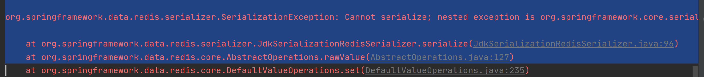
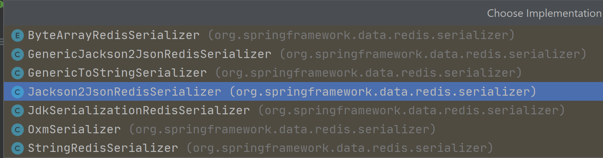

Redis (Remote Dictionary Server)

## Install Redis in Linux

1. 下载redis. https://redis.io/

2. 解压安装包.程序放到opt目录下.  tar -zxvf <filename>

3. 进入redis的解压目录

4. 基本的环境安装

   ```shell
   yum install gcc-c++
   gcc -v  # 查看gcc 版本
   make  	# 编译
   make install # 安装(可选)
   
   
   # 编译
   [root@venhjuhost redis-6.2.6]# make
   cd src && make all
   make[1]: Entering directory '/opt/redis-6.2.6/src'
       CC Makefile.dep
   
   Hint: It's a good idea to run 'make test' ;)
   
   make[1]: Leaving directory '/opt/redis-6.2.6/src'
   
   # 安装
   [root@venhjuhost redis-6.2.6]# make install
   cd src && make install
   make[1]: Entering directory '/opt/redis-6.2.6/src'
   
   Hint: It's a good idea to run 'make test' ;)
   
       INSTALL redis-server
       INSTALL redis-benchmark
       INSTALL redis-cli
   make[1]: Leaving directory '/opt/redis-6.2.6/src'
   ```
   
   
   
5. redis的默认安装路径

   ```shell
   # redis 默认安装路径 /usr/local/bin
   [root@venhjuhost bin]# ls -l|grep redis
   -rwxr-xr-x 1 root root  6549120 Oct 29 09:24 redis-benchmark
   lrwxrwxrwx 1 root root       12 Oct 29 09:24 redis-check-aof -> redis-server
   lrwxrwxrwx 1 root root       12 Oct 29 09:24 redis-check-rdb -> redis-server
   -rwxr-xr-x 1 root root  6765632 Oct 29 09:24 redis-cli
   lrwxrwxrwx 1 root root       12 Oct 29 09:24 redis-sentinel -> redis-server
   -rwxr-xr-x 1 root root 12148696 Oct 29 09:24 redis-server
   ```

   

6. 将redis配置文件.复制到我们当前目录.

   ```shell
   [root@venhjuhost bin]# mkdir myconfig
   [root@venhjuhost bin]# cp /opt/redis-6.2.6/redis.conf ./myconfig/
   [root@venhjuhost bin]# ls myconfig/
   redis.conf
   ```

   

7. redis默认不是后台启动的.修改配置文件.将redis改为后台运行.(/usr/local/bin/myconfig)

   

8. 启动redis服务

   ```shell
   # 通过配置文件启动redis-server
   [root@venhjuhost bin]# pwd
   /usr/local/bin
   [root@venhjuhost bin]# redis-server myconfig/redis.conf
   
   # 启动client
   [root@venhjuhost bin]# redis-cli -p 6379    # -p 端口 -h host(默认本机)
   127.0.0.1:6379>
   127.0.0.1:6379> ping
   PONG                                        # 链接成功
   
   127.0.0.1:6379> set name peter              # 存入
   OK
   127.0.0.1:6379> get name
   "peter"
   
   127.0.0.1:6379> keys *                      # 查询所有key
   1) "name"
   ```

   

9. 查看redis的进程是否开启

   ```shell
   [root@venhjuhost ~]# ps -ef|grep redis
   root       36907       1  0 11:12 ?        00:00:00 redis-server 127.0.0.1:6379
   root       36948   36598  0 11:21 pts/0    00:00:00 redis-cli -p 6379
   root       37008   36958  0 11:24 pts/1    00:00:00 grep --color=auto redis
   
   ```
   
   
   
10. 关闭redis服务. shutdown

    ```shell
    # 关闭 redis服务
    127.0.0.1:6379> shutdown
    not connected> exit
    [root@venhjuhost bin]#
    
    # redis服务已关闭
    [root@venhjuhost ~]# ps -ef|grep redis
    root       37021   36958  0 11:28 pts/1    00:00:00 grep --color=auto redis
    ```

    

## 性能测试 redis-benchmark

```shell
Usage: redis-benchmark [-h <host>] [-p <port>] [-c <clients>] [-n <requests]> [-k <boolean>]

 -h <hostname>      Server hostname (default 127.0.0.1)
 -p <port>          Server port (default 6379)
 -s <socket>        Server socket (overrides host and port)
 -a <password>      Password for Redis Auth
 -c <clients>       Number of parallel connections (default 50)
 -n <requests>      Total number of requests (default 100000)
 -d <size>          Data size of SET/GET value in bytes (default 2)
 --dbnum <db>       SELECT the specified db number (default 0)
 -k <boolean>       1=keep alive 0=reconnect (default 1)
 -r <keyspacelen>   Use random keys for SET/GET/INCR, random values for SADD
  Using this option the benchmark will expand the string __rand_int__
  inside an argument with a 12 digits number in the specified range
  from 0 to keyspacelen-1. The substitution changes every time a command
  is executed. Default tests use this to hit random keys in the
  specified range.
 -P <numreq>        Pipeline <numreq> requests. Default 1 (no pipeline).
 -q                 Quiet. Just show query/sec values
 --csv              Output in CSV format
 -l                 Loop. Run the tests forever
 -t <tests>         Only run the comma separated list of tests. The test
                    names are the same as the ones produced as output.
 -I                 Idle mode. Just open N idle connections and wait.
 

```

测试:

```shell
# 测试100个并发, 100000个请求
redis-benchmark -h 127.0.0.1 -p 6379 -c 100 -n 100000

====== SET ======
  100000 requests completed in 2.64 seconds             # 100000 个请求
  100 parallel clients								 # 100 个并发
  3 bytes payload                                       # 每个请求3个byte
  keep alive: 1                                         # 只有一个链接(单机)
  host configuration "save": 3600 1 300 100 60 10000
  host configuration "appendonly": no
  multi-thread: no

Latency by percentile distribution:
0.000% <= 0.823 milliseconds (cumulative count 3)
50.000% <= 1.671 milliseconds (cumulative count 50424)
75.000% <= 1.999 milliseconds (cumulative count 75042)
87.500% <= 2.207 milliseconds (cumulative count 87638)

Summary:
  throughput summary: 37921.88 requests per second      # 每秒处理 37921.88个请求
  latency summary (msec):
          avg       min       p50       p95       p99       max
        2.000     0.816     1.671     2.591     3.607   272.127

```

## 基础知识

redis默认有16个数据库 (/usr/local/bin/myconfig/redis.conf). 默认使用的是第0个,可以使用select进行数据库切换.

```shell
# /usr/local/bin/myconfig/redis.conf
# Set the number of databases. The default database is DB 0, you can select
# a different one on a per-connection basis using SELECT <dbid> where
# dbid is a number between 0 and 'databases'-1
databases 16

```

### 一些基本命令

#### select  <db idx>

```shell
127.0.0.1:6379> select 3     # 切换数据库
OK
127.0.0.1:6379[3]> dbsize    # database size
(integer) 0
127.0.0.1:6379[3]>

```

#### keys

```shell
127.0.0.1:6379> keys *    # 查看keys
1) "name"
2) "myhash"
3) "counter:__rand_int__"
4) "mylist"
5) "key:__rand_int__"

```

#### flushdb/flushall

```shell
127.0.0.1:6379> flushdb   # 清空当前库 / flushall 清空全部数据库
OK
127.0.0.1:6379> keys *
(empty array)

```

### Redis是单线程

redis是很快的,官方表示,redis是基于内存操作的.CPU不是redis的性能瓶颈.redis的瓶颈是根据机器的内存和网络带宽.既然可以使用单线程来实现,就使用了单线程.

Redis使用C语言来写的,官方提供的数据是100000+的QPS,这个不比memecahce差! 

**Redis为什么单线程还那么快?**

误区1: 高性能的服务器一定是多线程的.

误区2:多线程一定比单线程效率高.

**核心:**Redis是将所有的数据放在内存中的,所以使用单线程操作效率最高.(多线程,CPU上下文切换,耗时的操作).对于内存系统来说,如果没有上下文切换,效率就是最高的.


## 五大数据类型

> Redis is an open source (BSD licensed), in-memory data structure store, used as a database, cache, and message broker. Redis provides data structures such as strings, hashes, lists, sets, sorted sets with range queries, bitmaps, hyperloglogs, geospatial indexes, and streams. Redis has built-in replication, Lua scripting, LRU eviction, transactions, and different levels of on-disk persistence, and provides high availability via Redis Sentinel and automatic partitioning with Redis Cluster.

###  Redis-Key 

- keys *   										查看所有key
- set key                                         设置key值
- exists <key>                                判断key是否存在
- move <key> <db idx>              移动key到目标数据库
- expire <key> <prieod sec>    设置key过期时间(sec)
- ttl <key>                                      查看key剩余时间
- type <key>                                  查看key数据类型

```shell
127.0.0.1:6379> keys *           # 查看所有的key
(empty array)
127.0.0.1:6379> set age 30       # set key
OK
127.0.0.1:6379> set name peter
OK
127.0.0.1:6379> keys *           # 查看所有的key
1) "name"
2) "age"
127.0.0.1:6379> exists name      # 判断key是否存在
(integer) 1
127.0.0.1:6379> exists name1
(integer) 0

127.0.0.1:6379> move name 1      # 移动key到指定数据库
(integer) 1
127.0.0.1:6379> select 1
OK
127.0.0.1:6379[1]> keys *        # name移动到数据库1
1) "name"

127.0.0.1:6379> expire age 10    # 设置key过期时间(in sec)
(integer) 1
127.0.0.1:6379> ttl age          # 查看key的剩余时间
(integer) 3
127.0.0.1:6379> ttl age
(integer) -2
127.0.0.1:6379> get age          # 得到key的值
(nil)
127.0.0.1:6379>
127.0.0.1:6379> type name        # 查看key数据类型
string
127.0.0.1:6379> type age
string

```

### String类型

#### 使用场景

1. 计数器
2. 统计数量
3. 对象缓存存储

#### 常用命令

- EXISTS <key>                                判断key是否存在

- APPEND <key> <str>                  追加字符串,如果key不存在,相当与set key

  

- STRLEN <key>                              返回字符串长度

- INCR/DECR <key>                        自增/自减

- INCRBY/DECRBY <key> <increment decrement>   增/减步长

  

- GETRANGE <key> <start> <end>  范围获取string   [0,-1]获取整个字符串

- SETRANGE <key> <offset> <repl>  替换从offset开始的字符

  

- SETEX <key> <seconds> <value>     设置key value并且设置expire 时间(sec)

- SETNX  <key> <value>                        当key不存在时,设置key value值.(防止覆盖已经存在的key值)

  

- MSET     <key> <value> [<key> <value> ...]  设置多个key value

- MGET <key> [<key> ...]                                      得到多个key

- MSETNX <key> <value> [<key> <value> ...]  设置多个key value(key不存在时成功) 原子操作,必须全部成功.否则全部失败

  

- GETSET <key> <value>                                    先get,后set. 不存在,返回nil. 存在,返回值, 设置新的值.

```shell
# STRLEN,APPEN
127.0.0.1:6379> get name
"Han"
127.0.0.1:6379> STRLEN name    				# 返回字符串长度
(integer) 3
127.0.0.1:6379> APPEND name 'name,nihao'  	 # 追加字符串
(integer) 13
127.0.0.1:6379> get name
"Hanname,nihao"
127.0.0.1:6379> STRLEN name
(integer) 13
##################################################################################
# INCR/DECR,INCRBY/DECRBY
127.0.0.1:6379> INCR views				    # 自增
(integer) 1
127.0.0.1:6379> INCR views
(integer) 2
127.0.0.1:6379> DECR views				    # 自减
(integer) 1
127.0.0.1:6379> INCRBY views 10              # 增加10
(integer) 11
127.0.0.1:6379> DECRBY views 5               # 减少10
(integer) 6
##################################################################################
# GETRANGE,SETRANGE
127.0.0.1:6379> get name
"Hanname,nihao"
127.0.0.1:6379> GETRANGE name 0 -1			# 获取整个字符串
"Hanname,nihao"
127.0.0.1:6379> GETRANGE name 1 4			# 获取位置 [1,4]
"anna"

127.0.0.1:6379> get name
"Hanname,nihao"
127.0.0.1:6379> SETRANGE name 3 " Jun"      # 替换位置3后的字符串
(integer) 13
127.0.0.1:6379> get name
"Han Jun,nihao"
##################################################################################
# SETEX,SETNX
127.0.0.1:6379> SETEX age 30 30         # 设置 age, 并且30秒后失效
OK
127.0.0.1:6379> get age
"30"
127.0.0.1:6379> ttl age                 # 查看失效时间
(integer) 25
127.0.0.1:6379> SETNX color red         # 设置 color, 当color不存在,设置成功.返回 1
(integer) 1
127.0.0.1:6379> get color
"red"
127.0.0.1:6379> SETNX color black		# 设置 color, 当color存在,设置失败.返回 0
(integer) 0
127.0.0.1:6379> get color			   # color没有被替换
"red"
127.0.0.1:6379> get age                 # age 已经失效
(nil)
127.0.0.1:6379> ttl age                 # 查看age剩余时间,-2表示已经失效
(integer) -2
##################################################################################
# MSET,MGET,MSETNX
127.0.0.1:6379> MSET k1 v1 k2 v2 k3 v3   # 设置多个key
OK
127.0.0.1:6379> keys *
1) "k2"
2) "k1"
3) "k3"
127.0.0.1:6379> mget k1 k2 k3            # 得到多个key
1) "v1"
2) "v2"
3) "v3"
127.0.0.1:6379> MSETNX k1 vv1 k4 vv4 k5 vv5    # k1已经存在,设置失败
(integer) 0
127.0.0.1:6379> keys *
1) "k2"
2) "k1"
3) "k3"
127.0.0.1:6379> MSET k4 vv4 k5 vv5             # k4,k5不存在,设置成功
OK
127.0.0.1:6379> keys *
1) "k1"
2) "k5"
3) "k2"
4) "k3"
5) "k4"
# 存一个对象

127.0.0.1:6379> mset user:1 {name:peter,age:18}
OK
127.0.0.1:6379> get user:1
"{name:peter,age:18}"
127.0.0.1:6379> mset user:1:name peter user:1:age 18
OK
127.0.0.1:6379> mget user:1:name user:1:age
1) "peter"
2) "18"
##################################################################################
# GETSET
127.0.0.1:6379> GETSET sex male            # 不存在,返回nil.设置male
(nil)
127.0.0.1:6379> GETSET sex female          # 存在,返回值.设置female
"male"
127.0.0.1:6379> get sex
"female"

```


### List类型

#### 使用场景

List实际上是一个链表 <before> node <after>

1. 栈  LPUSH,LPOP
2. 队列  LPUSH,RPOP
3. 阻塞队列

#### 常用命令

- LPUSH <key> <element> [<element>...]   添加list元素到列表头部（左边插入）

- LRANGE <key> <start> <stop>                获取list元素

- RPUSH <key> <element> [<element>...]  添加list元素到列表尾部（右边插入）

  

- LPOP key [count]                                            左边弹出

- RPOP key [count]                                           右边弹出

  

- LINDEX <key> <index>                               按index取值

- LLEN <key>                                                   获得列表长度

  

- LREM <key> <count> <element>            移除count个指定element

- LTRIM <key> <start> <stop>                  截取list

  

-  RPOPLPUSH <source> <dest>               从source RPOP 并 LPUSH到 dest

  

- LSET <key> <index> <element>            将列表中存在的元素更新。不存在将报错。

- LINSERT <key> <before|after> <pivot> <element>   往某个元素的前面或后面添加元素

  

```shell
# LPUSH,LRANGE,RPUSH
127.0.0.1:6379> LPUSH mylist L1 L2 L3  # 添加list元素到列表头部   L3,L2,L1 (列表左边为头部)
(integer) 3
127.0.0.1:6379> LRANGE mylist 0 -1     # 获取全部元素
1) "L3"
2) "L2"
3) "L1"
127.0.0.1:6379> LRANGE mylist 0 0      # 获取第0个元素
1) "L3"
127.0.0.1:6379> LRANGE mylist 0 1      # 获取[0,1]元素
1) "L3"
2) "L2"
127.0.0.1:6379> RPUSH mylist L4 L5     # 添加list元素到列表尾部 L3,L2,L1,L4,L5 (列表右边为尾部)
(integer) 5
127.0.0.1:6379> LRANGE mylist 0 -1
1) "L3"
2) "L2"
3) "L1"
4) "L4"
5) "L5"
127.0.0.1:6379> LRANGE mylist 3 4
1) "L4"
2) "L5"
##################################################################################
# LPOP,RPOP
127.0.0.1:6379> LRANGE mylist 0 -1
1) "L3"
2) "L2"
3) "L1"
4) "L4"
5) "L5"
127.0.0.1:6379> LPOP mylist   # 左弹出
"L3"
127.0.0.1:6379> RPOP mylist   # 右弹出
"L5"
127.0.0.1:6379> LRANGE mylist 0 -1
1) "L2"
2) "L1"
3) "L4"
##################################################################################
# LINDEX,LLEN
127.0.0.1:6379> LINDEX mylist 0   # 通过下标获得值
"L2"
127.0.0.1:6379> LINDEX mylist 1
"L1"
127.0.0.1:6379> LINDEX mylist 10  # 越界返回nil
(nil)

127.0.0.1:6379> LLEN mylist       # 获得列表长度
(integer) 3
##################################################################################
# LREM,LTRIM
127.0.0.1:6379> LRANGE mylist 0 -1
1) "L2"
2) "L1"
3) "L4"
127.0.0.1:6379> LPUSH mylist L1 L2
(integer) 5
127.0.0.1:6379> LRANGE mylist 0 -1
1) "L2"
2) "L1"
3) "L2"
4) "L1"
5) "L4"
127.0.0.1:6379> LREM mylist 2 L1            # 移除2个L1
(integer) 2
127.0.0.1:6379> LRANGE mylist 0 -1
1) "L2"
2) "L2"
3) "L4"
127.0.0.1:6379> LREM mylist 1 L2           # 移除1个L2
(integer) 1
127.0.0.1:6379> LRANGE mylist 0 -1
1) "L2"
2) "L4"

127.0.0.1:6379> LRANGE mylist 0 -1
1) "L2"
2) "L4"
3) "L5"
4) "L6"
5) "L7"
127.0.0.1:6379> LTRIM mylist 1 3          # 截取 mylist中的[1,3], index 从0开始
OK
127.0.0.1:6379> LRANGE mylist 0 -1
1) "L4"
2) "L5"
3) "L6"
##################################################################################
# RPOPLPUSH 
127.0.0.1:6379> LRANGE l1 0 -1
1) "v1"
2) "v2"
3) "v3"
127.0.0.1:6379> RPOPLPUSH l1 l2          # 从l1中 RPOP 并 LPUSH到 L2
"v3"
127.0.0.1:6379> LRANGE l2 0 -1
1) "v3"
##################################################################################
# LSET
127.0.0.1:6379> LRANGE l1 0 -1
1) "v1"
2) "v2"
127.0.0.1:6379> LSET l1 0 vv1            # 将 l1中 idx=0的元素更新为vv1
OK
127.0.0.1:6379> LSET l1 3 vv3            # l1中不存在 idx=3的元素，更新失败
(error) ERR index out of range
127.0.0.1:6379> LRANGE l1 0 -1
1) "vv1"
2) "v2"
##################################################################################
# LINSERT
127.0.0.1:6379> lrange l1 0 -1
1) "v3"
2) "v2"
3) "v1"
127.0.0.1:6379> LINSERT l1 before v2 ------   # 在 v2 前插入 ------
(integer) 4
127.0.0.1:6379> LINSERT l1 after v2 -------   # 在 v2 后插入 ------
(integer) 5
127.0.0.1:6379> lrange l1 0 -1
1) "v3"
2) "------"
3) "v2"
4) "-------"
5) "v1"

```

### Set类型

Set中的值是不能重复的。

#### 常用命令

- SADD <key> <member> [<member>...]            往set中添加元素

- SREM <key> <member> [<member>...]           移除set集合中的指定元素

- SMEMBERS <key>                                           查看set中所有member

- SISMEMBER <key> <member>                        查看member是否存在于set中

- SCARD <key>                                                   获取set中元素个数

  

- SRANDMEMBER <key> <count>                   从set中随机获取count个元素

- SPOP <key> <count>                                     从set中随机移除count个元素

  

- SMOVE <source> <dest> <member>           将元素从source移动到dest

  

- SDIFF <key> [<key>...]                                   差集

- SINTER <key> [<key>...]                                交集

- SUNION <key> [<key>...]                               并集

  

  

```shell
# SADD,SREM,SMEMBER,SISMEMBER,SCARD
127.0.0.1:6379> SADD set S1 S2 S3       # 添加set元素
(integer) 3
127.0.0.1:6379> SMEMBERS set            # 查看set元素
1) "S2"
2) "S1"
3) "S3"
127.0.0.1:6379> SISMEMBER set S1       # S1 存在于set
(integer) 1
127.0.0.1:6379> SISMEMBER set S5       # S5 不存在于set
(integer) 0
127.0.0.1:6379> SCARD set              # 获取set中元素的个数
(integer) 3
127.0.0.1:6379> sadd set S4
(integer) 1
127.0.0.1:6379> SCARD set
(integer) 4
127.0.0.1:6379> SREM set S4            # 移除 S4
(integer) 1
127.0.0.1:6379> SCARD set
(integer) 3
127.0.0.1:6379> SMEMBERS set
1) "S2"
2) "S1"
3) "S3"
##################################################################################
# SRANDMEMBER,SPOP
127.0.0.1:6379> SRANDMEMBER set 1   # 从 set中随机获取一个
1) "S3"
127.0.0.1:6379> SRANDMEMBER set 1
1) "S1"
127.0.0.1:6379> SRANDMEMBER set 2   # 从 set中随机获取2个
1) "S4"
2) "S6"
127.0.0.1:6379> spop set 1          # 从 set中随机移除一个元素
1) "S4"
127.0.0.1:6379> spop set 1          # 从 set中随机移除一个元素
1) "S1"
##################################################################################
# SMOVE
127.0.0.1:6379> sadd s1 s1 s2 s3   
(integer) 3
127.0.0.1:6379> smove s1 s2 s1     # 将s1 从 集合s1移动到集合s2
(integer) 1
127.0.0.1:6379> SMEMBERS s1
1) "s3"
2) "s2"
127.0.0.1:6379> SMEMBERS s2
1) "s1"
##################################################################################
# SDIFF,SINTER,SUNION
127.0.0.1:6379> SADD set1 L1 L2 L3 L4 L5
(integer) 5
127.0.0.1:6379> SADD set2 L4 L5 L6 L7 L8
(integer) 5
127.0.0.1:6379> SADD set3 L1 L4 L5 L9 L10
(integer) 5
127.0.0.1:6379> sdiff set1 set2 set3             # 差集，set1中，不存在于set2,set3的元素
1) "L2"
2) "L3"
127.0.0.1:6379> sinter set1 set2 set3            # 交集
1) "L4"
2) "L5"
127.0.0.1:6379> sunion set1 set2 set3            # 并集
 1) "L3"
 2) "L6"
 3) "L10"
 4) "L8"
 5) "L1"
 6) "L7"
 7) "L5"
 8) "L9"
 9) "L2"
10) "L4"

```

### Hash类型

Map集合 key - map.值是map集合. Hash更适合对象的存储。

#### 常用命令

- HSET <key> <field><value>[<field><value>...]     设置hash map

- HDEL <key> <field><value>[<field><value>...]     删除field

- HGET <key> <field>                                                       得到field 的value值

- HGETALL <key>                                                                 得到所有的field - value值

  

- HLEN <key>                                                                        得到hash中键值对的个数

- HMSET <key> <field><value>[<field><value>...]  设置hash map

- HMGET <key> <field><value>[<field><value>...]  得到多个key的值

- HEXISTS <key> <field>                                                  判断hash中是否存在field

  

- HKEYS <key>                                                                     得到所有field

- HVALS <key>                                                                      得到所有value

  

- HINCRBY <key> <field> <increment>                       增加field by increment

- HSETNX  <key> <field> <value>                                 当field不存在时，设置field

```shell
# HSET,HGET,HGETALL
127.0.0.1:6379> HSET mymap name1 peter name2 "han jun" name3 "gao shuai"   # 设置hash值
(integer) 3
127.0.0.1:6379> HGET mymap name2    # 得到 name2的值
"han jun"
127.0.0.1:6379> HGET mymap name3
"gao shuai"
127.0.0.1:6379> HGETALL mymap       # 得到所有hash值
1) "name1"
2) "peter"
3) "name2"
4) "han jun"
5) "name3"
6) "gao shuai"
127.0.0.1:6379> HDEL mymap name2    # 删除 name2
(integer) 1
127.0.0.1:6379> HGETALL mymap
1) "name1"
2) "peter"
3) "name3"
4) "gao shuai"
##################################################################################
# HLEN,HMSET,HMGET,HEXISTS
127.0.0.1:6379> HMSET mm K1 V1 K2 V2 K3 V3 K4 V4   # 设置 hash
OK
127.0.0.1:6379> HMGET mm K1 K2 K3 K4               # 得到多个k的值
1) "V1"
2) "V2"
3) "V3"
4) "V4"
127.0.0.1:6379> HLEN mm                            # 得到hash中键值对的个数
(integer) 4
127.0.0.1:6379> HEXISTS mm K1                      # 判断map中是否存在 K1
(integer) 1
127.0.0.1:6379> HEXISTS mm K6
(integer) 0
##################################################################################
# HKEYS,HVALS
127.0.0.1:6379> HKEYS mm
1) "K1"
2) "K2"
3) "K3"
4) "K4"
127.0.0.1:6379> HVALS mm
1) "V1"
2) "V2"
3) "V3"
4) "V4"
##################################################################################
# HINCRBY,HSETNX
127.0.0.1:6379> HSET mm k1 1 k2 2
(integer) 2
127.0.0.1:6379> HINCRBY mm k1 3      # k1 增加 3
(integer) 4
127.0.0.1:6379> HSETNX mm k3 3       # k3不存在，set k3
(integer) 1
127.0.0.1:6379> HKEYS mm
1) "k1"
2) "k2"
3) "k3"
127.0.0.1:6379> HSETNX mm k3 4      # k3存在，set k3失败
(integer) 0

```

### Zset类型（有序结合）

在set的基础上，增加了一个值，用来排序

#### 常用命令

- ZADD <key> [NX|XX] [GT|LT] [CH] [INCR] <score> <member> [<score><member>...]  增加

- ZRANGE <ley><min><max> [BYSCORE|BYLEX] [REV] [LIMITOFFSET COUNT]           显示

- ZREVRANGE / ZRANGEBYSCORE / ZRANGEBYLEX

  

- ZREM <key><member>[<member>...]                 移除元素

- ZCARD  <key>                                                      获取元素个数

- ZCOUNT <key> <min> <max>                             统计区间个数      (min   开区间      

```shell
# ZADD,ZRANGE
127.0.0.1:6379> ZADD myz 1 one 2 two 3 three 4 four  # 添加多个值
(integer) 4
127.0.0.1:6379> ZRANGE myz 0 4   # 显示全部值
1) "one"
2) "two"
3) "three" 
4) "four"

##################################################################################
# 默认排序
127.0.0.1:6379> ZADD salary 1000 p1 3000 p3 4000 p4 5000 p5 2000 p2  # 添加 Zset 元素
(integer) 5
127.0.0.1:6379> ZRANGE salary 0 -1   # 显示全部元素 (默认排序by score升序)
1) "p1"
2) "p2"
3) "p3"
4) "p4"
5) "p5"
127.0.0.1:6379> ZRANGE salary 0 -1 REV # 显示全部元素（by score降序）
1) "p5"
2) "p4"
3) "p3"
4) "p2"
5) "p1"
127.0.0.1:6379> ZRANGE salary 2000 3000 BYSCORE # 显示 [2000,3000]的元素
1) "p2"
2) "p3"
127.0.0.1:6379> ZRANGE salary (2000 3000 BYSCORE # 显示 (2000,3000]的元素
1) "p3"


127.0.0.1:6379> zadd scores 100 peter 98 gao 90 shuai 60 mao 59 hans  
(integer) 5
127.0.0.1:6379> zrange scores -inf +inf byscore  # -inf 负无穷 +inf 正无穷
1) "hans"
2) "mao"
3) "shuai"
4) "gao"
5) "peter"
127.0.0.1:6379> zrange scores -inf +inf byscore LIMIT 0 2  # 显示 offset=0,count=2 前2个
1) "hans"
2) "mao"
##################################################################################
# ZREM,ZCARD,ZCOUNT
127.0.0.1:6379> zrange salary 0 -1
1) "peter"
2) "han"
3) "mao"
4) "shuai"
5) "gao"
6) "chen"
127.0.0.1:6379> zrem salary chen    # 删除 chen 元素
(integer) 1
127.0.0.1:6379> zrange salary 0 -1  
1) "peter"
2) "han"
3) "mao"
4) "shuai"
5) "gao"
127.0.0.1:6379> zcard salary      # 显示元素个数
(integer) 5
127.0.0.1:6379> zcount salary 1000 3000   # 统计[1000,3000]的元素个数
(integer) 3
127.0.0.1:6379> zcount salary (1000 3000  # 统计(1000,3000]的元素个数
(integer) 2
127.0.0.1:6379> zcount salary (1000 (3000 # 统计(1000,3000)的元素个数
(integer) 1
```

## 三种特殊数据类型

### geospatial类型

#### 使用场景

底层原理： 是Zset,可以使用Zset命令来操作。

地理位置，朋友定位，附近的人，打车距离计算。

Redis的Geo在Redis3.2的版本推出了，这个功能可以推算地理位置的信息，两地之间的距离，方圆几里的人。

查询城市经纬度： http://www.jsons.cn/lngcode/

#### 常用命令

- GEOADD  key [NX|XX] [CH] longitude latitude member [longitude latitude member ...] 添加地理位置

- GEOPOS key member [member ...]                     查询地理位置

- GEODIST key member1 member2 [m|km|ft|mi]   查询两个地点的距离

- GEOHASH key member [member ...]                   返回元素坐标经纬度的11位的hash字符串，原长度为52位。这里会损失一些经度。

  ​                                                                              但仍然指向同一地区。

- GEORADIUS key longitude latitude radius m|km|ft|mi [WITHCOORD] [WITHDIST] [WITHHASH] [COUNT count [ANY]] [ASC|DESC] [STORE key] [STOREDIST key]                           返回给定坐标半径内的地理位置

- GEORADIUSBYMEMBER key member radius m|km|ft|mi [WITHCOORD] [WITHDIST] [WITHHASH] [COUNT count [ANY]] [ASC|DESC] [STORE key] [STOREDIST key]     返回给定元素半径内的地理位置

- GEOSEARCH                                                       替换GEORADIUS,GEORADIUSBYMEMBER

  ​																			  https://redis.io/commands/geosearch                               

- GEOSEARCHSTORE                                           替换GEORADIUS,GEORADIUSBYMEMBER 

  ​                                                                              https://redis.io/commands/geosearchstore

```shell
# GEOADD
# 地球两极无法直接添加
127.0.0.1:6379> geoadd china:city 121.47 31.23 shanghai    # 添加地理位置
(integer) 1
127.0.0.1:6379> geoadd china:city 116.40 39.90 beijing
(integer) 1
127.0.0.1:6379> geoadd china:city 113.28 23.12 guangzhou
(integer) 1
127.0.0.1:6379> geoadd china:city 114.08 22.54 shenzhen
(integer) 1
127.0.0.1:6379> geoadd china:city 120.61 31.29 suzhou
(integer) 1
127.0.0.1:6379> geoadd china:city 114.49 36.61 handan
(integer) 1
##################################################################################
# GEOPOS
127.0.0.1:6379> GEOPOS china:city beijing shanghai    # 获取指定的地理位置 经度，纬度
1) 1) "116.39999896287918091"
   2) "39.90000009167092543"
2) 1) "121.47000163793563843"
   2) "31.22999903975783553"
##################################################################################
127.0.0.1:6379> GEODIST china:city shanghai suzhou km   # 上海，苏州的距离(km)
"82.0395"
127.0.0.1:6379> GEODIST china:city shanghai beijing km
"1067.3788"
##################################################################################
# GEORADIUS
127.0.0.1:6379> GEORADIUS china:city 120 30 300 km    # 以120,30为中心，300km内的城市
1) "suzhou"
2) "shanghai"
127.0.0.1:6379> GEORADIUS china:city 120 30 2000 km WITHCOORD WITHDIST COUNT 3   # 以120，30为中心，2000km以内
1) 1) "suzhou"                                                                   # WITHCOORD 显示坐标
   2) "154.9004"                                                                 # WITHDIST 显示距离
   3) 1) "120.60999959707260132"                                                 # COUNT 3 从近到远（升序）前3
      2) "31.29000095904170564"
2) 1) "shanghai"
   2) "196.2512"
   3) 1) "121.47000163793563843"
      2) "31.22999903975783553"
3) 1) "handan"
   2) "895.6274"
   3) 1) "114.48999792337417603"
      2) "36.61000046432025812"
##################################################################################
# GEORADIUSBYMEMBER
127.0.0.1:6379> GEORADIUSBYMEMBER china:city shanghai 500 km WITHDIST    # 上海半径500km内的城市
1) 1) "suzhou"
   2) "82.0395"
2) 1) "shanghai"
   2) "0.0000"
##################################################################################
# GEOHASH
127.0.0.1:6379> GEOHASH china:city beijing shanghai    # 返回经纬度，11长度的hash字符串
1) "wx4fbxxfke0"                                       # 将二维经纬度，转换为一维字符串
2) "wtw3sj5zbj0"
##################################################################################
# 使用Zset命令来操作
127.0.0.1:6379> ZRANGE china:city 0 -1
1) "nanjing"
2) "shenzhen"
3) "guangzhou"
4) "suzhou"
5) "shanghai"
6) "handan"
7) "beijing"
127.0.0.1:6379> ZREM china:city nanjing    # 移除nanjing
(integer) 1
127.0.0.1:6379> ZRANGE china:city 0 -1
1) "shenzhen"
2) "guangzhou"
3) "suzhou"
4) "shanghai"
5) "handan"
6) "beijing"

```

###  Hyperloglog类型

#### 基数统计

基数统计通常用来统计一个集合中不重复的元素个数。例如统计某个网站的访问人数，或者用户搜索网站的关键词数量。数据分析、网络监控及数据库优化等领域都会涉及到基数计数的需求。

传统的方式是通过set来保存用户id,然后计算set中用户个数来作为判断。但是保留了大量用户id,浪费内存。

基数统计用于解决这个问题。目前大多使用hyperloglog方法来实现：

> 关于hyperloglog， wiki的[hyperloglog](https://link.zhihu.com/?target=https%3A//en.wikipedia.org/wiki/HyperLogLog)词条给出了以下解释：
>
> HyperLogLog算法的基础是观察到可以通过计算集合中每个数字的二进制表示中的前导零的最大数目来估计均匀分布的随机数的多重集的基数。如果观察到的前导零的最大数目是n，则集合中不同元素的数量的估计是2^n
> 在HyperLogLog算法中，将哈希函数应用于原始多集中的每个元素，以获得具有与原始多集相同基数的均匀分布的随机数的多集。然后可以使用上述算法来估计该随机分布集合的基数。
> 使用上述算法获得的基数的简单估计具有很大差异的缺点。在HyperLogLog算法中，通过将多集合分成多个子集，计算这些子集中每个子集中的数字中的前导零的最大数量，并使用调和平均数 Harmonic mean将每个子集的这些估计值合并为全集的基数。

hyperloglog算法带来的好处是：

1，利用尽可能少的内存空间来实现大数据集的基数统计实现。2^64元素的基数统计，只需要12KB的内存。

2，使用随机设定的bias来提高整体的计算精度。 0.81%的错误率。

其劣势也很显然：

1，由于使用随机的bias使得在小数据集的情况下导致的计算错误率太大

2，针对超大数据集因为使用了连续空间分配策略导致内存分配和回收不合理而效率低下。（超大数据集为>=1billion多重集的基数）。

#### 常用命令

- PFADD key [element [element ...]]                        添加元素
- PFCOUNT key [key ...]                                          基数统计
- PFMERGE destkey sourcekey [sourcekey ...]      合并集合

```shell
# PFADD,PFCOUNT,PFMERGE
127.0.0.1:6379> PFADD views p1 p2 p3 p3 p4 p4 p5 p6 p6 p7 p7 p7       # 添加元素
(integer) 1
127.0.0.1:6379> PFCOUNT views                                         # 基数统计
(integer) 7
127.0.0.1:6379> PFADD views2 p7 p7 p8 p8 p9 p10 p10 p11 p12 p13 p14 p14 p15  # 添加元素
(integer) 1
127.0.0.1:6379> PFCOUNT views2                                        # 基数统计
(integer) 9
127.0.0.1:6379> PFMERGE view3 views views2                            # 合并集合                  
OK
127.0.0.1:6379> PFCOUNT view3                                         # 查看并集基数统计
(integer) 15

```

### Bitmap类型

bitmap 存储的是连续的二进制数字（0 和 1），通过 bitmap, 只需要一个 bit 位来表示某个元素对应的值或者状态，key 就是对应元素本身 。我们知道 8 个 bit 可以组成一个 byte，所以 bitmap 本身会极大的节省储存空间。

#### 使用场景

适合需要保存状态信息（比如是否签到、是否登录...）并需要进一步对这些信息进行分析的场景。比如用户签到情况、活跃用户情况、用户行为统计（比如是否点赞过某个视频）。

#### 常用命令

- SETBIT key offset value         设置bitmap

- GETBIT key offset                  查看bitmap

  

- BITCOUNT key [start end]     Count the number of set bits (population counting) in a string. 

  ​                                               这里start end是指的byte.[1,3]表示下标从1-3的byte

```shell
# SETBIT,GETBIT
127.0.0.1:6379> SETBIT sign 0 1    # 设置一周签到状态
(integer) 0
127.0.0.1:6379> SETBIT sign 1 0
(integer) 0
127.0.0.1:6379> SETBIT sign 2 1
(integer) 0
127.0.0.1:6379> SETBIT sign 3 1
(integer) 0
127.0.0.1:6379> SETBIT sign 4 0
(integer) 0
127.0.0.1:6379> SETBIT sign 5 1
(integer) 0
127.0.0.1:6379> SETBIT sign 6 1
(integer) 0

127.0.0.1:6379> GETBIT sign 4       # 查看bitmap
(integer) 0
127.0.0.1:6379> GETBIT sign 5
(integer) 1
##################################################################################
# BITCOUNT
127.0.0.1:6379> BITCOUNT sign       # 统计sign中1的位数
(integer) 5

```

## Redis事务

### 基本概念

**Redis单条命令是保证原子性的. Redis事务不保证原子性。**

**Redis事务没有隔离级别的概念。**

所有命令在事务中没有被直接执行，是有发起执行命令时才会执行。

Reids事务本质,一组命令的集合.一个事务中的所有命令都会被序列化,在事务执行过程中,会按照顺序执行。

- 一次性
- 顺序性
- 排他性

```shel
---队列 set set set ---
```

### Redis事务过程

- 开启事务	MULTI
- 命令入队
- 执行事务   EXEC
- 放弃事务   DISCARD

```shell
# 开启执行事务
127.0.0.1:6379> multi                              # 开启事务
OK
127.0.0.1:6379(TX)> set k1 v1                      # 添加命令
QUEUED
127.0.0.1:6379(TX)> set k2 v2
QUEUED
127.0.0.1:6379(TX)> append k1 "hello"
QUEUED
127.0.0.1:6379(TX)> get k1
QUEUED
127.0.0.1:6379(TX)> EXEC                           # 执行事务
1) OK
2) OK
3) (integer) 7
4) "v1hello"
##################################################################################
# 放弃事务
127.0.0.1:6379> MULTI                             # 开启事务
OK
127.0.0.1:6379(TX)> set k1 v1                     # 添加命令
QUEUED
127.0.0.1:6379(TX)> set k2 v2
QUEUED
127.0.0.1:6379(TX)> DISCARD                      # 放弃事务
OK
127.0.0.1:6379> get k1                           # set k1 v1 没有被执行
(nil)

```

### Redis事务异常处理

- 编译错误（命令错误）：整个事务都不会被执行
- 运行时错误：错误的命令将报错，其他命令正常执行

```shell
# 命令错误
127.0.0.1:6379> MULTI
OK
127.0.0.1:6379(TX)> ab2 123
(error) ERR unknown command `ab2`, with args beginning with: `123`,
127.0.0.1:6379(TX)> set 123
(error) ERR wrong number of arguments for 'set' command
127.0.0.1:6379(TX)> set abc 123
QUEUED
127.0.0.1:6379(TX)> exec
(error) EXECABORT Transaction discarded because of previous errors.      # 整个事务都不会被执行
##################################################################################
# 运行时错误
127.0.0.1:6379> set k1 "hello"
OK
127.0.0.1:6379> MULTI
OK
127.0.0.1:6379(TX)> INCR k1           # 运行时错误。k1字符串无法自增
QUEUED
127.0.0.1:6379(TX)> set k2 v2
QUEUED
127.0.0.1:6379(TX)> get k2
QUEUED
127.0.0.1:6379(TX)> exec                                     # 错误的命令将报错，其他命令继续执行
1) (error) ERR value is not an integer or out of range       # 运行时错误
2) OK                                                        # 其他命令继续执行
3) "v2"
127.0.0.1:6379> get k2
"v2"

```

> ## Why Redis does not support roll backs?
>
> If you have a relational databases background, the fact that Redis commands can fail during a transaction, but still Redis will execute the rest of the transaction instead of rolling back, may look odd to you.
>
> However there are good opinions for this behavior:
>
> - Redis commands can fail only if called with a wrong syntax (and the problem is not detectable during the command queueing), or against keys holding the wrong data type: this means that in practical terms a failing command is the result of a programming errors, and a kind of error that is very likely to be detected during development, and not in production.
> - Redis is internally simplified and faster because it does not need the ability to roll back.
>
> An argument against Redis point of view is that bugs happen, however it should be noted that in general the roll back does not save you from programming errors. For instance if a query increments a key by 2 instead of 1, or increments the wrong key, there is no way for a rollback mechanism to help. Given that no one can save the programmer from his or her errors, and that the kind of errors required for a Redis command to fail are unlikely to enter in production, we selected the simpler and faster approach of not supporting roll backs on errors.

### 乐观锁(Optimistic locking )

#### 基本概念

Redis中的乐观锁是用check-and-set实现。

> [WATCH](https://redis.io/commands/watch) is used to provide a check-and-set (CAS) behavior to Redis transactions.
>
> `WATCH`ed keys are monitored in order to detect changes against them. If at least one watched key is modified before the [EXEC](https://redis.io/commands/exec) command, the whole transaction aborts, and [EXEC](https://redis.io/commands/exec) returns a [Null reply](https://redis.io/topics/protocol#nil-reply) to notify that the transaction failed.

#### 常用命令

- WATCH key [key ...]    Marks the given keys to be watched for conditional execution of a transaction.

- UNWATCH                  Flushes all the previously watched keys for a transaction.

  ​                                    If you call EXEC or DISCARD, there's no need to manually call UNWATCH.

> **WATCH explained**
>
> So what is WATCH really about? It is a command that will make the EXEC conditional: we are asking Redis to perform the transaction only if none of the WATCHed keys were modified. This includes modifications made by the client, like write commands, and by Redis itself, like expiration or eviction. If keys were modified between when they were WATCHed and when the EXEC was received, the entire transaction will be aborted instead.
>
> **NOTE * In Redis versions before 6.0.9, an expired key would not cause a transaction to be aborted. More on this * Commands within a transaction wont trigger the WATCH condition since they are only queued until the EXEC is sent.**
>
> WATCH can be called multiple times. Simply all the WATCH calls will have the effects to watch for changes starting from the call, up to the moment EXEC is called. You can also send any number of keys to a single WATCH call.
>
> When EXEC is called, all keys are UNWATCHed, regardless of whether the transaction was aborted or not. Also when a client connection is closed, everything gets UNWATCHed.
>
> **It is also possible to use the UNWATCH command (without arguments) in order to flush all the watched keys.** Sometimes this is useful as we optimistically lock a few keys, since possibly we need to perform a transaction to alter those keys, but after reading the current content of the keys we don't want to proceed. When this happens we just call UNWATCH so that the connection can already be used freely for new transactions.

```shell
# WATCH 乐观锁
127.0.0.1:6379> set bal 100              # 设置 bal = 100
OK
127.0.0.1:6379> set out 0                # 设置 out = 0
OK
127.0.0.1:6379> watch bal                # WATCH bal
OK
127.0.0.1:6379> MULTI                    # 开启事务
OK
127.0.0.1:6379(TX)> DECRBY bal 10        # FROM WATCH TO EXEC, other client change the bal
QUEUED
127.0.0.1:6379(TX)> INCRBY out 10
QUEUED
127.0.0.1:6379(TX)> EXEC                 # 执行失败,return nil
(nil)
127.0.0.1:6379> WATCH bal                # 重新获取乐观锁
OK
127.0.0.1:6379> MULTI
OK
127.0.0.1:6379(TX)> DECRBY bal 10
QUEUED
127.0.0.1:6379(TX)> INCRBY out 10
QUEUED
127.0.0.1:6379(TX)> EXEC                 # 执行成功
1) (integer) 100
2) (integer) 10

```

> ### Using <u>WATCH</u> to implement ZPOP
>
> A good example to illustrate how WATCH can be used to create new atomic operations otherwise not supported by Redis is to implement ZPOP ([ZPOPMIN](https://redis.io/commands/zpopmin), [ZPOPMAX](https://redis.io/commands/zpopmax) and their blocking variants have only been added in **version 5.0**), that is a command that pops the element with the lower score from a sorted set in an atomic way. This is the simplest implementation:
>
> ```
> WATCH zset
> element = ZRANGE zset 0 0
> MULTI
> ZREM zset element
> EXEC
> ```

## Jedis

Jeddis是官方推荐的java 连接开发工具。

### 导入依赖

> ```xml
> <dependency>
>     <groupId>redis.clients</groupId>
>     <artifactId>jedis</artifactId>
>     <version>3.7.0</version>
> </dependency>
> ```

### 开启公网访问阿里云redis

- 阿里云安全策略组打开6379端口

- 阿里云服务器防火墙添加6379端口

  ```shell
  firewall-cmd --list-all   # 查看防火墙设置
  firewall-cmd --zone=public --add-port=6379/tcp --permanent # 添加6379端口
  systemctl restart firewalld.service  # 重启防火墙
  ```

  

- 修改redis config

  1. 注释掉 bind
  2. 开启密码认证。client 连接时用命令 auth <password> 登录

  ```shell
  # 修改/usr/local/bin/myconfig/redis.conf
  #--------------------------------------------------------------------------
  # When protected mode is on and if:
  #
  # 1) The server is not binding explicitly to a set of addresses using the
  #    "bind" directive.
  # 2) No password is configured.
  #
  # The server only accepts connections from clients connecting from the
  # IPv4 and IPv6 loopback addresses 127.0.0.1 and ::1, and from Unix domain
  # sockets.
  #
  # By default protected mode is enabled. You should disable it only if
  # you are sure you want clients from other hosts to connect to Redis
  # even if no authentication is configured, nor a specific set of interfaces
  # are explicitly listed using the "bind" directive.
  #--------------------------------------------------------------------------
  
  # 所以需要开始密码认证并且注释掉bind
  
  #bind 127.0.0.1 -::1     # 注释掉 bind
  requirepass Peter008@    # 开启密码认证
  
  ```

- 重启redis server

### 测试代码

```java
// Test ping
public class TestPing {
    public static void main(String[] args) {
        Jedis jedis = new Jedis("47.241.70.169",6379);
        //Enter password to access redis
        jedis.auth("Peter008@");
        System.out.println(jedis.ping());
        jedis.close();
    }
}

// Test transaction
public class TestTransaction {
    public static void main(String[] args) {
        Jedis jedis = new Jedis(REDIS_SERVER,REDIS_PORT);
        jedis.auth(REDIS_PASSWD);
        jedis.flushDB();
        Transaction multi = jedis.multi();
        try{
            multi.set("balance","100");
            multi.set("name","peter");
            multi.type("balance");
            multi.incrBy("balance",10);
            multi.incrBy("name", 10);         // 这里会失败，但是不会返回任何exception.transaction并不会完全rollback
            int i = 1/0;
            multi.exec();
        }catch(Exception e){                  // runtime exception
            multi.discard();                  // discard the transaction
            e.printStackTrace();
        }finally {
            System.out.println(jedis.get("balance"));
            System.out.println(jedis.get("name"));
            jedis.close();
        }
    }
}
```

## SpringBoot整合

SpringBoot操作数据： Spring-data jpa mongodb redis

> https://spring.io/projects/spring-data-redis

### 整合测试

在SpringBoot2.x之后，Jedis被替换为 lettuce

- Jedis: 采用的直连，多个线程操作的话，是不安全的。如果要避免不安全，就要使用Jedis Pool连接池。BIO
- Lettuce:采用netty,实例可以在多个线程中共享，不存在线程不安全的问题。可以减少线程数量。NIO

### 配置Redis

Redis配置类： org.springframework.boot.autoconfigure.data.redis.RedisAutoConfiguration

Redis配置文件：org.springframework.boot.autoconfigure.data.redis.RedisProperties

```java
public class RedisAutoConfiguration {

	@Bean
	@ConditionalOnMissingBean(name = "redisTemplate")
	@ConditionalOnSingleCandidate(RedisConnectionFactory.class)
	public RedisTemplate<Object, Object> redisTemplate(RedisConnectionFactory redisConnectionFactory) {
		//默认的redis template,没有过多的设置，redis对象都需要序列化
         //两个泛型都是Object,后面都需要强转类型
         //我们可以自己定义 redis template
         RedisTemplate<Object, Object> template = new RedisTemplate<>();
         template.setConnectionFactory(redisConnectionFactory);
         return template;
	}

	@Bean
	@ConditionalOnMissingBean
	@ConditionalOnSingleCandidate(RedisConnectionFactory.class)
	public StringRedisTemplate stringRedisTemplate(RedisConnectionFactory redisConnectionFactory) {
		//由于String是redis中最常用的类型
         StringRedisTemplate template = new StringRedisTemplate();
         template.setConnectionFactory(redisConnectionFactory);
         return template;
	}

}
```

### 连接测试

```pro
spring.redis.host=47.241.70.169
spring.redis.port=6379
spring.redis.password=Peter008@
```

```java
package org.peter.coffeebucks.redis;

import org.junit.jupiter.api.Test;
import org.springframework.beans.factory.annotation.Autowired;
import org.springframework.boot.test.context.SpringBootTest;
import org.springframework.data.redis.core.RedisTemplate;

@SpringBootTest
public class TestRedisClient {

    @Autowired
    private RedisTemplate redisTemplate;

    @Test
    void contextLoads(){
        redisTemplate.opsForValue().set("name","Hello,Redis");
        System.out.println(redisTemplate.opsForValue().get("name"));
    }
}

```

### 自定义RedisTemplate

#### 存储对象序列化

RedisTemplate在存储对象时，需要将对象序列化(Serializable)。

> RedisTemplate在存储对象时，需要将对象序列化。否则会报错。
>
> ```Java
> @Test
> public void testRedisObject(){
>  //Student对象需要序列化 implements Serializable 
>  Student stu = new Student(123456,"Peter",18);
>  redisTemplate.opsForValue().set("student1",stu);
>  System.out.println(redisTemplate.opsForValue().get("student1"));
> 
> }
> 
> ```
>
> 

#### 自定义RedisTemplate

将对象序列化之后(Serializable),由于RedisTemplate默认的是JdkSerializationRedisSerializer，在序列化之后，redis key-value存在额外的字符。所以最好使用自定义RedisTemplate来设置Serializer.

```java
//org.springframework.data.redis.core.RedisTemplate

public void afterPropertiesSet(){
    if (defaultSerializer == null) {
			//默认使用 JdkSerializationRedisSerializer
			defaultSerializer = new JdkSerializationRedisSerializer(
					classLoader != null ? classLoader : this.getClass().getClassLoader());
	}
    // 以下四个如果未设置，都使用默认
    //keySerializer，valueSerializer，hashKeySerializer，hashValueSerializer
}
```

JDK默认的Serializer序列化之后会有额外的字符。

```shell
127.0.0.1:6379> keys *
1) "\xac\xed\x00\x05t\x00\bstudent1"
127.0.0.1:6379> get "\xac\xed\x00\x05t\x00\bstudent1"
"\xac\xed\x00\x05sr\x00\"org.peter.coffeebucks.pojo.StudentI\x90\x8ey\x1b\xe3\x02\xb3\x02\x00\x03I\x00\x03ageJ\x00\x02idL\x00\x04namet\x00\x12Ljava/lang/String;xp\x00\x00\x00\x12\x00\x00\x00\x00\x00\x01\xe2@t\x00\x05Peter"
127.0.0.1:6379> 

```

自定义RedisTemplate来设置Serializer.

这里使用Jackson2JsonRedsSerializer作为value的Serializer,StringRedisSerializerz作为key的Serializer.



```java
package org.peter.coffeebucks.configuration;

import com.fasterxml.jackson.annotation.JsonAutoDetect;
import com.fasterxml.jackson.annotation.JsonTypeInfo;
import com.fasterxml.jackson.annotation.PropertyAccessor;
import com.fasterxml.jackson.databind.ObjectMapper;
import com.fasterxml.jackson.databind.jsontype.impl.LaissezFaireSubTypeValidator;
import org.springframework.context.annotation.Bean;
import org.springframework.context.annotation.Configuration;
import org.springframework.data.redis.connection.RedisConnectionFactory;
import org.springframework.data.redis.core.RedisTemplate;
import org.springframework.data.redis.serializer.Jackson2JsonRedisSerializer;
import org.springframework.data.redis.serializer.StringRedisSerializer;

@Configuration
public class RedisConfig {
    @Bean
    public RedisTemplate<String, Object> redisTemplate(RedisConnectionFactory redisConnectionFactory) {
        RedisTemplate<String, Object> template = new RedisTemplate<>();
        template.setConnectionFactory(redisConnectionFactory);

        //Jackson Serializer
        Jackson2JsonRedisSerializer jackson2JsonRedisSerializer = new Jackson2JsonRedisSerializer(Object.class);
        ObjectMapper om = new ObjectMapper();
        om.setVisibility(PropertyAccessor.ALL, JsonAutoDetect.Visibility.ANY);

        om.activateDefaultTyping(LaissezFaireSubTypeValidator.instance,
                                ObjectMapper.DefaultTyping.NON_FINAL,
                                JsonTypeInfo.As.WRAPPER_ARRAY);
        jackson2JsonRedisSerializer.setObjectMapper(om);

        //String Serializer
        StringRedisSerializer stringSerializer = new StringRedisSerializer();

        template.setKeySerializer(stringSerializer);
        template.setHashKeySerializer(stringSerializer);
        template.setValueSerializer(jackson2JsonRedisSerializer);
        template.setHashValueSerializer(jackson2JsonRedisSerializer);

        template.afterPropertiesSet();

        return template;
    }
}

```

#### 测试代码

```java
package org.peter.coffeebucks.redis;

import org.junit.Test;
import org.junit.runner.RunWith;
import org.peter.coffeebucks.pojo.Student;
import org.springframework.beans.factory.annotation.Autowired;
import org.springframework.beans.factory.annotation.Qualifier;
import org.springframework.boot.test.context.SpringBootTest;
import org.springframework.data.redis.core.RedisTemplate;
import org.springframework.test.context.junit4.SpringRunner;


@RunWith(SpringRunner.class)
@SpringBootTest
public class TestRedisClient {

    @Autowired
    @Qualifier("redisTemplate")
    private RedisTemplate redisTemplate;

    @Test
    public void contextLoads(){
        redisTemplate.opsForValue().set("name","Hello,Redis");
        redisTemplate.opsForValue().set("hero","你好，超人");
        System.out.println(redisTemplate.opsForValue().get("name"));
        System.out.println(redisTemplate.opsForValue().get("hero"));
    }

    @Test
    public void testRedisObject(){
        //Student对象需要序列化 implements Serializable
        Student stu = new Student(123456,"Peter",18);
        redisTemplate.opsForValue().set("student1",stu);
	    //直接可以为目标对象
        Student student1 = (Student)redisTemplate.opsForValue().get("student1");

        System.out.println("name: " + student1.getName());
        System.out.println("id: " + student1.getId());
        System.out.println("age: " + student1.getAge());

    }
}

```

查看对象在Redis中的存储格式

```shell
127.0.0.1:6379> keys *
1) "student1"
127.0.0.1:6379> get "student1"
"[\"org.peter.coffeebucks.pojo.Student\",{\"id\":123456,\"name\":\"Peter\",\"age\":18}]"

```

#### 相关阅读

> [SpringBoot整合 redisTemplate工具类 （含完整的单元测试+简单集成）](https://blog.csdn.net/sdrfengmi/article/details/103693212?utm_medium=distribute.pc_relevant.none-task-blog-2~default~baidujs_title~default-0.no_search_link&spm=1001.2101.3001.4242.1)
>
> [反序列化漏洞Jackson](https://0range228.github.io/%E3%80%90%E5%8F%8D%E5%BA%8F%E5%88%97%E5%8C%96%E6%BC%8F%E6%B4%9E%E3%80%91Jackson/)

