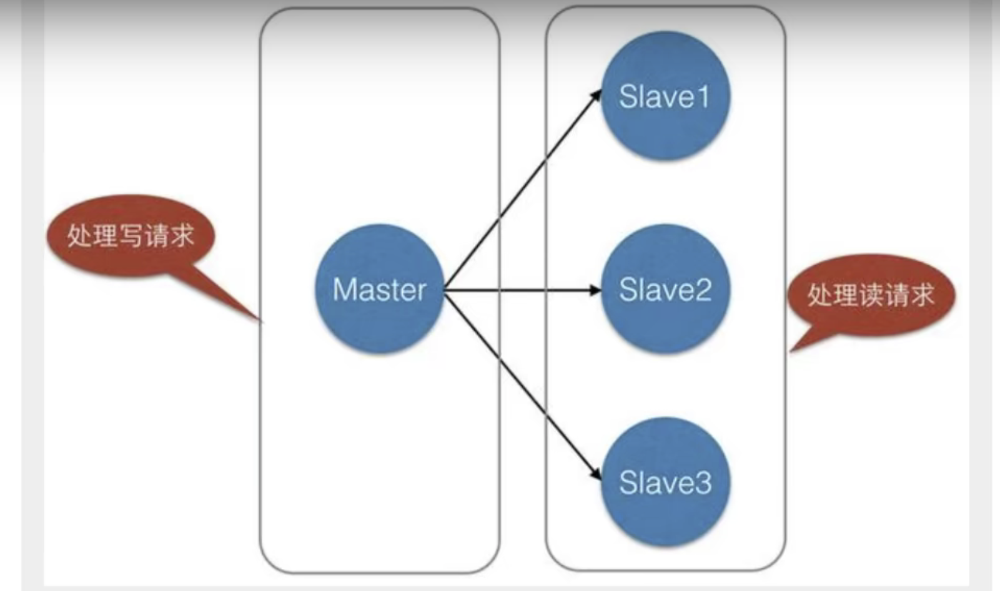

Redis (Remote Dictionary Server)

## Install Redis in Linux

1. 下载redis. https://redis.io/

2. 解压安装包.程序放到opt目录下.  tar -zxvf <filename>

3. 进入redis的解压目录

4. 基本的环境安装

   ```shell
   yum install gcc-c++
   gcc -v  # 查看gcc 版本
   make  	# 编译
   make install # 安装(可选)
   
   
   # 编译
   [root@venhjuhost redis-6.2.6]# make
   cd src && make all
   make[1]: Entering directory '/opt/redis-6.2.6/src'
       CC Makefile.dep
   
   Hint: It's a good idea to run 'make test' ;)
   
   make[1]: Leaving directory '/opt/redis-6.2.6/src'
   
   # 安装
   [root@venhjuhost redis-6.2.6]# make install
   cd src && make install
   make[1]: Entering directory '/opt/redis-6.2.6/src'
   
   Hint: It's a good idea to run 'make test' ;)
   
       INSTALL redis-server
       INSTALL redis-benchmark
       INSTALL redis-cli
   make[1]: Leaving directory '/opt/redis-6.2.6/src'
   ```
   
   
   
5. redis的默认安装路径

   ```shell
   # redis 默认安装路径 /usr/local/bin
   [root@venhjuhost bin]# ls -l|grep redis
   -rwxr-xr-x 1 root root  6549120 Oct 29 09:24 redis-benchmark
   lrwxrwxrwx 1 root root       12 Oct 29 09:24 redis-check-aof -> redis-server
   lrwxrwxrwx 1 root root       12 Oct 29 09:24 redis-check-rdb -> redis-server
   -rwxr-xr-x 1 root root  6765632 Oct 29 09:24 redis-cli
   lrwxrwxrwx 1 root root       12 Oct 29 09:24 redis-sentinel -> redis-server
   -rwxr-xr-x 1 root root 12148696 Oct 29 09:24 redis-server
   ```

   

6. 将redis配置文件.复制到我们当前目录.

   ```shell
   [root@venhjuhost bin]# mkdir myconfig
   [root@venhjuhost bin]# cp /opt/redis-6.2.6/redis.conf ./myconfig/
   [root@venhjuhost bin]# ls myconfig/
   redis.conf
   ```

   

7. redis默认不是后台启动的.修改配置文件.将redis改为后台运行.(/usr/local/bin/myconfig)

   

8. 启动redis服务

   ```shell
   # 通过配置文件启动redis-server
   [root@venhjuhost bin]# pwd
   /usr/local/bin
   [root@venhjuhost bin]# redis-server myconfig/redis.conf
   
   # 启动client
   [root@venhjuhost bin]# redis-cli -p 6379    # -p 端口 -h host(默认本机)
   127.0.0.1:6379>
   127.0.0.1:6379> ping
   PONG                                        # 链接成功
   
   127.0.0.1:6379> set name peter              # 存入
   OK
   127.0.0.1:6379> get name
   "peter"
   
   127.0.0.1:6379> keys *                      # 查询所有key
   1) "name"
   ```

   

9. 查看redis的进程是否开启

   ```shell
   [root@venhjuhost ~]# ps -ef|grep redis
   root       36907       1  0 11:12 ?        00:00:00 redis-server 127.0.0.1:6379
   root       36948   36598  0 11:21 pts/0    00:00:00 redis-cli -p 6379
   root       37008   36958  0 11:24 pts/1    00:00:00 grep --color=auto redis
   
   ```
   
   
   
10. 关闭redis服务. shutdown

    ```shell
    # 关闭 redis服务
    127.0.0.1:6379> shutdown
    not connected> exit
    [root@venhjuhost bin]#
    
    # redis服务已关闭
    [root@venhjuhost ~]# ps -ef|grep redis
    root       37021   36958  0 11:28 pts/1    00:00:00 grep --color=auto redis
    ```

    

## 性能测试 redis-benchmark

```shell
Usage: redis-benchmark [-h <host>] [-p <port>] [-c <clients>] [-n <requests]> [-k <boolean>]

 -h <hostname>      Server hostname (default 127.0.0.1)
 -p <port>          Server port (default 6379)
 -s <socket>        Server socket (overrides host and port)
 -a <password>      Password for Redis Auth
 -c <clients>       Number of parallel connections (default 50)
 -n <requests>      Total number of requests (default 100000)
 -d <size>          Data size of SET/GET value in bytes (default 2)
 --dbnum <db>       SELECT the specified db number (default 0)
 -k <boolean>       1=keep alive 0=reconnect (default 1)
 -r <keyspacelen>   Use random keys for SET/GET/INCR, random values for SADD
  Using this option the benchmark will expand the string __rand_int__
  inside an argument with a 12 digits number in the specified range
  from 0 to keyspacelen-1. The substitution changes every time a command
  is executed. Default tests use this to hit random keys in the
  specified range.
 -P <numreq>        Pipeline <numreq> requests. Default 1 (no pipeline).
 -q                 Quiet. Just show query/sec values
 --csv              Output in CSV format
 -l                 Loop. Run the tests forever
 -t <tests>         Only run the comma separated list of tests. The test
                    names are the same as the ones produced as output.
 -I                 Idle mode. Just open N idle connections and wait.
 

```

测试:

```shell
# 测试100个并发, 100000个请求
redis-benchmark -h 127.0.0.1 -p 6379 -c 100 -n 100000

====== SET ======
  100000 requests completed in 2.64 seconds             # 100000 个请求
  100 parallel clients								 # 100 个并发
  3 bytes payload                                       # 每个请求3个byte
  keep alive: 1                                         # 只有一个链接(单机)
  host configuration "save": 3600 1 300 100 60 10000
  host configuration "appendonly": no
  multi-thread: no

Latency by percentile distribution:
0.000% <= 0.823 milliseconds (cumulative count 3)
50.000% <= 1.671 milliseconds (cumulative count 50424)
75.000% <= 1.999 milliseconds (cumulative count 75042)
87.500% <= 2.207 milliseconds (cumulative count 87638)

Summary:
  throughput summary: 37921.88 requests per second      # 每秒处理 37921.88个请求
  latency summary (msec):
          avg       min       p50       p95       p99       max
        2.000     0.816     1.671     2.591     3.607   272.127

```

## 基础知识

redis默认有16个数据库 (/usr/local/bin/myconfig/redis.conf). 默认使用的是第0个,可以使用select进行数据库切换.

```shell
# /usr/local/bin/myconfig/redis.conf
# Set the number of databases. The default database is DB 0, you can select
# a different one on a per-connection basis using SELECT <dbid> where
# dbid is a number between 0 and 'databases'-1
databases 16

```

### 一些基本命令

#### select  <db idx>

```shell
127.0.0.1:6379> select 3     # 切换数据库
OK
127.0.0.1:6379[3]> dbsize    # database size
(integer) 0
127.0.0.1:6379[3]>

```

#### keys

```shell
127.0.0.1:6379> keys *    # 查看keys
1) "name"
2) "myhash"
3) "counter:__rand_int__"
4) "mylist"
5) "key:__rand_int__"

```

#### flushdb/flushall

```shell
127.0.0.1:6379> flushdb   # 清空当前库 / flushall 清空全部数据库
OK
127.0.0.1:6379> keys *
(empty array)

```

### Redis是单线程

redis是很快的,官方表示,redis是基于内存操作的.CPU不是redis的性能瓶颈.redis的瓶颈是根据机器的内存和网络带宽.既然可以使用单线程来实现,就使用了单线程.

Redis使用C语言来写的,官方提供的数据是100000+的QPS,这个不比memecahce差! 

**Redis为什么单线程还那么快?**

误区1: 高性能的服务器一定是多线程的.

误区2:多线程一定比单线程效率高.

**核心:**Redis是将所有的数据放在内存中的,所以使用单线程操作效率最高.(多线程,CPU上下文切换,耗时的操作).对于内存系统来说,如果没有上下文切换,效率就是最高的.


## 五大数据类型

> Redis is an open source (BSD licensed), in-memory data structure store, used as a database, cache, and message broker. Redis provides data structures such as strings, hashes, lists, sets, sorted sets with range queries, bitmaps, hyperloglogs, geospatial indexes, and streams. Redis has built-in replication, Lua scripting, LRU eviction, transactions, and different levels of on-disk persistence, and provides high availability via Redis Sentinel and automatic partitioning with Redis Cluster.

###  Redis-Key 

- keys *   										查看所有key
- set key                                         设置key值
- exists <key>                                判断key是否存在
- move <key> <db idx>              移动key到目标数据库
- expire <key> <prieod sec>    设置key过期时间(sec)
- ttl <key>                                      查看key剩余时间
- type <key>                                  查看key数据类型

```shell
127.0.0.1:6379> keys *           # 查看所有的key
(empty array)
127.0.0.1:6379> set age 30       # set key
OK
127.0.0.1:6379> set name peter
OK
127.0.0.1:6379> keys *           # 查看所有的key
1) "name"
2) "age"
127.0.0.1:6379> exists name      # 判断key是否存在
(integer) 1
127.0.0.1:6379> exists name1
(integer) 0

127.0.0.1:6379> move name 1      # 移动key到指定数据库
(integer) 1
127.0.0.1:6379> select 1
OK
127.0.0.1:6379[1]> keys *        # name移动到数据库1
1) "name"

127.0.0.1:6379> expire age 10    # 设置key过期时间(in sec)
(integer) 1
127.0.0.1:6379> ttl age          # 查看key的剩余时间
(integer) 3
127.0.0.1:6379> ttl age
(integer) -2
127.0.0.1:6379> get age          # 得到key的值
(nil)
127.0.0.1:6379>
127.0.0.1:6379> type name        # 查看key数据类型
string
127.0.0.1:6379> type age
string

```

### String类型

#### 使用场景

1. 计数器
2. 统计数量
3. 对象缓存存储

#### 常用命令

- EXISTS <key>                                判断key是否存在

- APPEND <key> <str>                  追加字符串,如果key不存在,相当与set key

  

- STRLEN <key>                              返回字符串长度

- INCR/DECR <key>                        自增/自减

- INCRBY/DECRBY <key> <increment decrement>   增/减步长

  

- GETRANGE <key> <start> <end>  范围获取string   [0,-1]获取整个字符串

- SETRANGE <key> <offset> <repl>  替换从offset开始的字符

  

- SETEX <key> <seconds> <value>     设置key value并且设置expire 时间(sec)

- SETNX  <key> <value>                        当key不存在时,设置key value值.(防止覆盖已经存在的key值)

  

- MSET     <key> <value> [<key> <value> ...]  设置多个key value

- MGET <key> [<key> ...]                                      得到多个key

- MSETNX <key> <value> [<key> <value> ...]  设置多个key value(key不存在时成功) 原子操作,必须全部成功.否则全部失败

  

- GETSET <key> <value>                                    先get,后set. 不存在,返回nil. 存在,返回值, 设置新的值.

```shell
# STRLEN,APPEN
127.0.0.1:6379> get name
"Han"
127.0.0.1:6379> STRLEN name    				# 返回字符串长度
(integer) 3
127.0.0.1:6379> APPEND name 'name,nihao'  	 # 追加字符串
(integer) 13
127.0.0.1:6379> get name
"Hanname,nihao"
127.0.0.1:6379> STRLEN name
(integer) 13
##################################################################################
# INCR/DECR,INCRBY/DECRBY
127.0.0.1:6379> INCR views				    # 自增
(integer) 1
127.0.0.1:6379> INCR views
(integer) 2
127.0.0.1:6379> DECR views				    # 自减
(integer) 1
127.0.0.1:6379> INCRBY views 10              # 增加10
(integer) 11
127.0.0.1:6379> DECRBY views 5               # 减少10
(integer) 6
##################################################################################
# GETRANGE,SETRANGE
127.0.0.1:6379> get name
"Hanname,nihao"
127.0.0.1:6379> GETRANGE name 0 -1			# 获取整个字符串
"Hanname,nihao"
127.0.0.1:6379> GETRANGE name 1 4			# 获取位置 [1,4]
"anna"

127.0.0.1:6379> get name
"Hanname,nihao"
127.0.0.1:6379> SETRANGE name 3 " Jun"      # 替换位置3后的字符串
(integer) 13
127.0.0.1:6379> get name
"Han Jun,nihao"
##################################################################################
# SETEX,SETNX
127.0.0.1:6379> SETEX age 30 30         # 设置 age, 并且30秒后失效
OK
127.0.0.1:6379> get age
"30"
127.0.0.1:6379> ttl age                 # 查看失效时间
(integer) 25
127.0.0.1:6379> SETNX color red         # 设置 color, 当color不存在,设置成功.返回 1
(integer) 1
127.0.0.1:6379> get color
"red"
127.0.0.1:6379> SETNX color black		# 设置 color, 当color存在,设置失败.返回 0
(integer) 0
127.0.0.1:6379> get color			   # color没有被替换
"red"
127.0.0.1:6379> get age                 # age 已经失效
(nil)
127.0.0.1:6379> ttl age                 # 查看age剩余时间,-2表示已经失效
(integer) -2
##################################################################################
# MSET,MGET,MSETNX
127.0.0.1:6379> MSET k1 v1 k2 v2 k3 v3   # 设置多个key
OK
127.0.0.1:6379> keys *
1) "k2"
2) "k1"
3) "k3"
127.0.0.1:6379> mget k1 k2 k3            # 得到多个key
1) "v1"
2) "v2"
3) "v3"
127.0.0.1:6379> MSETNX k1 vv1 k4 vv4 k5 vv5    # k1已经存在,设置失败
(integer) 0
127.0.0.1:6379> keys *
1) "k2"
2) "k1"
3) "k3"
127.0.0.1:6379> MSET k4 vv4 k5 vv5             # k4,k5不存在,设置成功
OK
127.0.0.1:6379> keys *
1) "k1"
2) "k5"
3) "k2"
4) "k3"
5) "k4"
# 存一个对象

127.0.0.1:6379> mset user:1 {name:peter,age:18}
OK
127.0.0.1:6379> get user:1
"{name:peter,age:18}"
127.0.0.1:6379> mset user:1:name peter user:1:age 18
OK
127.0.0.1:6379> mget user:1:name user:1:age
1) "peter"
2) "18"
##################################################################################
# GETSET
127.0.0.1:6379> GETSET sex male            # 不存在,返回nil.设置male
(nil)
127.0.0.1:6379> GETSET sex female          # 存在,返回值.设置female
"male"
127.0.0.1:6379> get sex
"female"

```


### List类型

#### 使用场景

List实际上是一个链表 <before> node <after>

1. 栈  LPUSH,LPOP
2. 队列  LPUSH,RPOP
3. 阻塞队列

#### 常用命令

- LPUSH <key> <element> [<element>...]   添加list元素到列表头部（左边插入）

- LRANGE <key> <start> <stop>                获取list元素

- RPUSH <key> <element> [<element>...]  添加list元素到列表尾部（右边插入）

  

- LPOP key [count]                                            左边弹出

- RPOP key [count]                                           右边弹出

  

- LINDEX <key> <index>                               按index取值

- LLEN <key>                                                   获得列表长度

  

- LREM <key> <count> <element>            移除count个指定element

- LTRIM <key> <start> <stop>                  截取list

  

-  RPOPLPUSH <source> <dest>               从source RPOP 并 LPUSH到 dest

  

- LSET <key> <index> <element>            将列表中存在的元素更新。不存在将报错。

- LINSERT <key> <before|after> <pivot> <element>   往某个元素的前面或后面添加元素

  

```shell
# LPUSH,LRANGE,RPUSH
127.0.0.1:6379> LPUSH mylist L1 L2 L3  # 添加list元素到列表头部   L3,L2,L1 (列表左边为头部)
(integer) 3
127.0.0.1:6379> LRANGE mylist 0 -1     # 获取全部元素
1) "L3"
2) "L2"
3) "L1"
127.0.0.1:6379> LRANGE mylist 0 0      # 获取第0个元素
1) "L3"
127.0.0.1:6379> LRANGE mylist 0 1      # 获取[0,1]元素
1) "L3"
2) "L2"
127.0.0.1:6379> RPUSH mylist L4 L5     # 添加list元素到列表尾部 L3,L2,L1,L4,L5 (列表右边为尾部)
(integer) 5
127.0.0.1:6379> LRANGE mylist 0 -1
1) "L3"
2) "L2"
3) "L1"
4) "L4"
5) "L5"
127.0.0.1:6379> LRANGE mylist 3 4
1) "L4"
2) "L5"
##################################################################################
# LPOP,RPOP
127.0.0.1:6379> LRANGE mylist 0 -1
1) "L3"
2) "L2"
3) "L1"
4) "L4"
5) "L5"
127.0.0.1:6379> LPOP mylist   # 左弹出
"L3"
127.0.0.1:6379> RPOP mylist   # 右弹出
"L5"
127.0.0.1:6379> LRANGE mylist 0 -1
1) "L2"
2) "L1"
3) "L4"
##################################################################################
# LINDEX,LLEN
127.0.0.1:6379> LINDEX mylist 0   # 通过下标获得值
"L2"
127.0.0.1:6379> LINDEX mylist 1
"L1"
127.0.0.1:6379> LINDEX mylist 10  # 越界返回nil
(nil)

127.0.0.1:6379> LLEN mylist       # 获得列表长度
(integer) 3
##################################################################################
# LREM,LTRIM
127.0.0.1:6379> LRANGE mylist 0 -1
1) "L2"
2) "L1"
3) "L4"
127.0.0.1:6379> LPUSH mylist L1 L2
(integer) 5
127.0.0.1:6379> LRANGE mylist 0 -1
1) "L2"
2) "L1"
3) "L2"
4) "L1"
5) "L4"
127.0.0.1:6379> LREM mylist 2 L1            # 移除2个L1
(integer) 2
127.0.0.1:6379> LRANGE mylist 0 -1
1) "L2"
2) "L2"
3) "L4"
127.0.0.1:6379> LREM mylist 1 L2           # 移除1个L2
(integer) 1
127.0.0.1:6379> LRANGE mylist 0 -1
1) "L2"
2) "L4"

127.0.0.1:6379> LRANGE mylist 0 -1
1) "L2"
2) "L4"
3) "L5"
4) "L6"
5) "L7"
127.0.0.1:6379> LTRIM mylist 1 3          # 截取 mylist中的[1,3], index 从0开始
OK
127.0.0.1:6379> LRANGE mylist 0 -1
1) "L4"
2) "L5"
3) "L6"
##################################################################################
# RPOPLPUSH 
127.0.0.1:6379> LRANGE l1 0 -1
1) "v1"
2) "v2"
3) "v3"
127.0.0.1:6379> RPOPLPUSH l1 l2          # 从l1中 RPOP 并 LPUSH到 L2
"v3"
127.0.0.1:6379> LRANGE l2 0 -1
1) "v3"
##################################################################################
# LSET
127.0.0.1:6379> LRANGE l1 0 -1
1) "v1"
2) "v2"
127.0.0.1:6379> LSET l1 0 vv1            # 将 l1中 idx=0的元素更新为vv1
OK
127.0.0.1:6379> LSET l1 3 vv3            # l1中不存在 idx=3的元素，更新失败
(error) ERR index out of range
127.0.0.1:6379> LRANGE l1 0 -1
1) "vv1"
2) "v2"
##################################################################################
# LINSERT
127.0.0.1:6379> lrange l1 0 -1
1) "v3"
2) "v2"
3) "v1"
127.0.0.1:6379> LINSERT l1 before v2 ------   # 在 v2 前插入 ------
(integer) 4
127.0.0.1:6379> LINSERT l1 after v2 -------   # 在 v2 后插入 ------
(integer) 5
127.0.0.1:6379> lrange l1 0 -1
1) "v3"
2) "------"
3) "v2"
4) "-------"
5) "v1"

```

### Set类型

Set中的值是不能重复的。

#### 常用命令

- SADD <key> <member> [<member>...]            往set中添加元素

- SREM <key> <member> [<member>...]           移除set集合中的指定元素

- SMEMBERS <key>                                           查看set中所有member

- SISMEMBER <key> <member>                        查看member是否存在于set中

- SCARD <key>                                                   获取set中元素个数

  

- SRANDMEMBER <key> <count>                   从set中随机获取count个元素

- SPOP <key> <count>                                     从set中随机移除count个元素

  

- SMOVE <source> <dest> <member>           将元素从source移动到dest

  

- SDIFF <key> [<key>...]                                   差集

- SINTER <key> [<key>...]                                交集

- SUNION <key> [<key>...]                               并集

  

  

```shell
# SADD,SREM,SMEMBER,SISMEMBER,SCARD
127.0.0.1:6379> SADD set S1 S2 S3       # 添加set元素
(integer) 3
127.0.0.1:6379> SMEMBERS set            # 查看set元素
1) "S2"
2) "S1"
3) "S3"
127.0.0.1:6379> SISMEMBER set S1       # S1 存在于set
(integer) 1
127.0.0.1:6379> SISMEMBER set S5       # S5 不存在于set
(integer) 0
127.0.0.1:6379> SCARD set              # 获取set中元素的个数
(integer) 3
127.0.0.1:6379> sadd set S4
(integer) 1
127.0.0.1:6379> SCARD set
(integer) 4
127.0.0.1:6379> SREM set S4            # 移除 S4
(integer) 1
127.0.0.1:6379> SCARD set
(integer) 3
127.0.0.1:6379> SMEMBERS set
1) "S2"
2) "S1"
3) "S3"
##################################################################################
# SRANDMEMBER,SPOP
127.0.0.1:6379> SRANDMEMBER set 1   # 从 set中随机获取一个
1) "S3"
127.0.0.1:6379> SRANDMEMBER set 1
1) "S1"
127.0.0.1:6379> SRANDMEMBER set 2   # 从 set中随机获取2个
1) "S4"
2) "S6"
127.0.0.1:6379> spop set 1          # 从 set中随机移除一个元素
1) "S4"
127.0.0.1:6379> spop set 1          # 从 set中随机移除一个元素
1) "S1"
##################################################################################
# SMOVE
127.0.0.1:6379> sadd s1 s1 s2 s3   
(integer) 3
127.0.0.1:6379> smove s1 s2 s1     # 将s1 从 集合s1移动到集合s2
(integer) 1
127.0.0.1:6379> SMEMBERS s1
1) "s3"
2) "s2"
127.0.0.1:6379> SMEMBERS s2
1) "s1"
##################################################################################
# SDIFF,SINTER,SUNION
127.0.0.1:6379> SADD set1 L1 L2 L3 L4 L5
(integer) 5
127.0.0.1:6379> SADD set2 L4 L5 L6 L7 L8
(integer) 5
127.0.0.1:6379> SADD set3 L1 L4 L5 L9 L10
(integer) 5
127.0.0.1:6379> sdiff set1 set2 set3             # 差集，set1中，不存在于set2,set3的元素
1) "L2"
2) "L3"
127.0.0.1:6379> sinter set1 set2 set3            # 交集
1) "L4"
2) "L5"
127.0.0.1:6379> sunion set1 set2 set3            # 并集
 1) "L3"
 2) "L6"
 3) "L10"
 4) "L8"
 5) "L1"
 6) "L7"
 7) "L5"
 8) "L9"
 9) "L2"
10) "L4"

```

### Hash类型

Map集合 key - map.值是map集合. Hash更适合对象的存储。

#### 常用命令

- HSET <key> <field><value>[<field><value>...]     设置hash map

- HDEL <key> <field><value>[<field><value>...]     删除field

- HGET <key> <field>                                                       得到field 的value值

- HGETALL <key>                                                                 得到所有的field - value值

  

- HLEN <key>                                                                        得到hash中键值对的个数

- HMSET <key> <field><value>[<field><value>...]  设置hash map

- HMGET <key> <field><value>[<field><value>...]  得到多个key的值

- HEXISTS <key> <field>                                                  判断hash中是否存在field

  

- HKEYS <key>                                                                     得到所有field

- HVALS <key>                                                                      得到所有value

  

- HINCRBY <key> <field> <increment>                       增加field by increment

- HSETNX  <key> <field> <value>                                 当field不存在时，设置field

```shell
# HSET,HGET,HGETALL
127.0.0.1:6379> HSET mymap name1 peter name2 "han jun" name3 "gao shuai"   # 设置hash值
(integer) 3
127.0.0.1:6379> HGET mymap name2    # 得到 name2的值
"han jun"
127.0.0.1:6379> HGET mymap name3
"gao shuai"
127.0.0.1:6379> HGETALL mymap       # 得到所有hash值
1) "name1"
2) "peter"
3) "name2"
4) "han jun"
5) "name3"
6) "gao shuai"
127.0.0.1:6379> HDEL mymap name2    # 删除 name2
(integer) 1
127.0.0.1:6379> HGETALL mymap
1) "name1"
2) "peter"
3) "name3"
4) "gao shuai"
##################################################################################
# HLEN,HMSET,HMGET,HEXISTS
127.0.0.1:6379> HMSET mm K1 V1 K2 V2 K3 V3 K4 V4   # 设置 hash
OK
127.0.0.1:6379> HMGET mm K1 K2 K3 K4               # 得到多个k的值
1) "V1"
2) "V2"
3) "V3"
4) "V4"
127.0.0.1:6379> HLEN mm                            # 得到hash中键值对的个数
(integer) 4
127.0.0.1:6379> HEXISTS mm K1                      # 判断map中是否存在 K1
(integer) 1
127.0.0.1:6379> HEXISTS mm K6
(integer) 0
##################################################################################
# HKEYS,HVALS
127.0.0.1:6379> HKEYS mm
1) "K1"
2) "K2"
3) "K3"
4) "K4"
127.0.0.1:6379> HVALS mm
1) "V1"
2) "V2"
3) "V3"
4) "V4"
##################################################################################
# HINCRBY,HSETNX
127.0.0.1:6379> HSET mm k1 1 k2 2
(integer) 2
127.0.0.1:6379> HINCRBY mm k1 3      # k1 增加 3
(integer) 4
127.0.0.1:6379> HSETNX mm k3 3       # k3不存在，set k3
(integer) 1
127.0.0.1:6379> HKEYS mm
1) "k1"
2) "k2"
3) "k3"
127.0.0.1:6379> HSETNX mm k3 4      # k3存在，set k3失败
(integer) 0

```

### Zset类型（有序结合）

在set的基础上，增加了一个值，用来排序

#### 常用命令

- ZADD <key> [NX|XX] [GT|LT] [CH] [INCR] <score> <member> [<score><member>...]  增加

- ZRANGE <ley><min><max> [BYSCORE|BYLEX] [REV] [LIMITOFFSET COUNT]           显示

- ZREVRANGE / ZRANGEBYSCORE / ZRANGEBYLEX

  

- ZREM <key><member>[<member>...]                 移除元素

- ZCARD  <key>                                                      获取元素个数

- ZCOUNT <key> <min> <max>                             统计区间个数      (min   开区间      

```shell
# ZADD,ZRANGE
127.0.0.1:6379> ZADD myz 1 one 2 two 3 three 4 four  # 添加多个值
(integer) 4
127.0.0.1:6379> ZRANGE myz 0 4   # 显示全部值
1) "one"
2) "two"
3) "three" 
4) "four"

##################################################################################
# 默认排序
127.0.0.1:6379> ZADD salary 1000 p1 3000 p3 4000 p4 5000 p5 2000 p2  # 添加 Zset 元素
(integer) 5
127.0.0.1:6379> ZRANGE salary 0 -1   # 显示全部元素 (默认排序by score升序)
1) "p1"
2) "p2"
3) "p3"
4) "p4"
5) "p5"
127.0.0.1:6379> ZRANGE salary 0 -1 REV # 显示全部元素（by score降序）
1) "p5"
2) "p4"
3) "p3"
4) "p2"
5) "p1"
127.0.0.1:6379> ZRANGE salary 2000 3000 BYSCORE # 显示 [2000,3000]的元素
1) "p2"
2) "p3"
127.0.0.1:6379> ZRANGE salary (2000 3000 BYSCORE # 显示 (2000,3000]的元素
1) "p3"


127.0.0.1:6379> zadd scores 100 peter 98 gao 90 shuai 60 mao 59 hans  
(integer) 5
127.0.0.1:6379> zrange scores -inf +inf byscore  # -inf 负无穷 +inf 正无穷
1) "hans"
2) "mao"
3) "shuai"
4) "gao"
5) "peter"
127.0.0.1:6379> zrange scores -inf +inf byscore LIMIT 0 2  # 显示 offset=0,count=2 前2个
1) "hans"
2) "mao"
##################################################################################
# ZREM,ZCARD,ZCOUNT
127.0.0.1:6379> zrange salary 0 -1
1) "peter"
2) "han"
3) "mao"
4) "shuai"
5) "gao"
6) "chen"
127.0.0.1:6379> zrem salary chen    # 删除 chen 元素
(integer) 1
127.0.0.1:6379> zrange salary 0 -1  
1) "peter"
2) "han"
3) "mao"
4) "shuai"
5) "gao"
127.0.0.1:6379> zcard salary      # 显示元素个数
(integer) 5
127.0.0.1:6379> zcount salary 1000 3000   # 统计[1000,3000]的元素个数
(integer) 3
127.0.0.1:6379> zcount salary (1000 3000  # 统计(1000,3000]的元素个数
(integer) 2
127.0.0.1:6379> zcount salary (1000 (3000 # 统计(1000,3000)的元素个数
(integer) 1
```

## 三种特殊数据类型

### geospatial类型

#### 使用场景

底层原理： 是Zset,可以使用Zset命令来操作。

地理位置，朋友定位，附近的人，打车距离计算。

Redis的Geo在Redis3.2的版本推出了，这个功能可以推算地理位置的信息，两地之间的距离，方圆几里的人。

查询城市经纬度： http://www.jsons.cn/lngcode/

#### 常用命令

- GEOADD  key [NX|XX] [CH] longitude latitude member [longitude latitude member ...] 添加地理位置

- GEOPOS key member [member ...]                     查询地理位置

- GEODIST key member1 member2 [m|km|ft|mi]   查询两个地点的距离

- GEOHASH key member [member ...]                   返回元素坐标经纬度的11位的hash字符串，原长度为52位。这里会损失一些经度。

  ​                                                                              但仍然指向同一地区。

- GEORADIUS key longitude latitude radius m|km|ft|mi [WITHCOORD] [WITHDIST] [WITHHASH] [COUNT count [ANY]] [ASC|DESC] [STORE key] [STOREDIST key]                           返回给定坐标半径内的地理位置

- GEORADIUSBYMEMBER key member radius m|km|ft|mi [WITHCOORD] [WITHDIST] [WITHHASH] [COUNT count [ANY]] [ASC|DESC] [STORE key] [STOREDIST key]     返回给定元素半径内的地理位置

- GEOSEARCH                                                       替换GEORADIUS,GEORADIUSBYMEMBER

  ​																			  https://redis.io/commands/geosearch                               

- GEOSEARCHSTORE                                           替换GEORADIUS,GEORADIUSBYMEMBER 

  ​                                                                              https://redis.io/commands/geosearchstore

```shell
# GEOADD
# 地球两极无法直接添加
127.0.0.1:6379> geoadd china:city 121.47 31.23 shanghai    # 添加地理位置
(integer) 1
127.0.0.1:6379> geoadd china:city 116.40 39.90 beijing
(integer) 1
127.0.0.1:6379> geoadd china:city 113.28 23.12 guangzhou
(integer) 1
127.0.0.1:6379> geoadd china:city 114.08 22.54 shenzhen
(integer) 1
127.0.0.1:6379> geoadd china:city 120.61 31.29 suzhou
(integer) 1
127.0.0.1:6379> geoadd china:city 114.49 36.61 handan
(integer) 1
##################################################################################
# GEOPOS
127.0.0.1:6379> GEOPOS china:city beijing shanghai    # 获取指定的地理位置 经度，纬度
1) 1) "116.39999896287918091"
   2) "39.90000009167092543"
2) 1) "121.47000163793563843"
   2) "31.22999903975783553"
##################################################################################
127.0.0.1:6379> GEODIST china:city shanghai suzhou km   # 上海，苏州的距离(km)
"82.0395"
127.0.0.1:6379> GEODIST china:city shanghai beijing km
"1067.3788"
##################################################################################
# GEORADIUS
127.0.0.1:6379> GEORADIUS china:city 120 30 300 km    # 以120,30为中心，300km内的城市
1) "suzhou"
2) "shanghai"
127.0.0.1:6379> GEORADIUS china:city 120 30 2000 km WITHCOORD WITHDIST COUNT 3   # 以120，30为中心，2000km以内
1) 1) "suzhou"                                                                   # WITHCOORD 显示坐标
   2) "154.9004"                                                                 # WITHDIST 显示距离
   3) 1) "120.60999959707260132"                                                 # COUNT 3 从近到远（升序）前3
      2) "31.29000095904170564"
2) 1) "shanghai"
   2) "196.2512"
   3) 1) "121.47000163793563843"
      2) "31.22999903975783553"
3) 1) "handan"
   2) "895.6274"
   3) 1) "114.48999792337417603"
      2) "36.61000046432025812"
##################################################################################
# GEORADIUSBYMEMBER
127.0.0.1:6379> GEORADIUSBYMEMBER china:city shanghai 500 km WITHDIST    # 上海半径500km内的城市
1) 1) "suzhou"
   2) "82.0395"
2) 1) "shanghai"
   2) "0.0000"
##################################################################################
# GEOHASH
127.0.0.1:6379> GEOHASH china:city beijing shanghai    # 返回经纬度，11长度的hash字符串
1) "wx4fbxxfke0"                                       # 将二维经纬度，转换为一维字符串
2) "wtw3sj5zbj0"
##################################################################################
# 使用Zset命令来操作
127.0.0.1:6379> ZRANGE china:city 0 -1
1) "nanjing"
2) "shenzhen"
3) "guangzhou"
4) "suzhou"
5) "shanghai"
6) "handan"
7) "beijing"
127.0.0.1:6379> ZREM china:city nanjing    # 移除nanjing
(integer) 1
127.0.0.1:6379> ZRANGE china:city 0 -1
1) "shenzhen"
2) "guangzhou"
3) "suzhou"
4) "shanghai"
5) "handan"
6) "beijing"

```

###  Hyperloglog类型

#### 基数统计

基数统计通常用来统计一个集合中不重复的元素个数。例如统计某个网站的访问人数，或者用户搜索网站的关键词数量。数据分析、网络监控及数据库优化等领域都会涉及到基数计数的需求。

传统的方式是通过set来保存用户id,然后计算set中用户个数来作为判断。但是保留了大量用户id,浪费内存。

基数统计用于解决这个问题。目前大多使用hyperloglog方法来实现：

> 关于hyperloglog， wiki的[hyperloglog](https://link.zhihu.com/?target=https%3A//en.wikipedia.org/wiki/HyperLogLog)词条给出了以下解释：
>
> HyperLogLog算法的基础是观察到可以通过计算集合中每个数字的二进制表示中的前导零的最大数目来估计均匀分布的随机数的多重集的基数。如果观察到的前导零的最大数目是n，则集合中不同元素的数量的估计是2^n
> 在HyperLogLog算法中，将哈希函数应用于原始多集中的每个元素，以获得具有与原始多集相同基数的均匀分布的随机数的多集。然后可以使用上述算法来估计该随机分布集合的基数。
> 使用上述算法获得的基数的简单估计具有很大差异的缺点。在HyperLogLog算法中，通过将多集合分成多个子集，计算这些子集中每个子集中的数字中的前导零的最大数量，并使用调和平均数 Harmonic mean将每个子集的这些估计值合并为全集的基数。

hyperloglog算法带来的好处是：

1，利用尽可能少的内存空间来实现大数据集的基数统计实现。2^64元素的基数统计，只需要12KB的内存。

2，使用随机设定的bias来提高整体的计算精度。 0.81%的错误率。

其劣势也很显然：

1，由于使用随机的bias使得在小数据集的情况下导致的计算错误率太大

2，针对超大数据集因为使用了连续空间分配策略导致内存分配和回收不合理而效率低下。（超大数据集为>=1billion多重集的基数）。

#### 常用命令

- PFADD key [element [element ...]]                        添加元素
- PFCOUNT key [key ...]                                          基数统计
- PFMERGE destkey sourcekey [sourcekey ...]      合并集合

```shell
# PFADD,PFCOUNT,PFMERGE
127.0.0.1:6379> PFADD views p1 p2 p3 p3 p4 p4 p5 p6 p6 p7 p7 p7       # 添加元素
(integer) 1
127.0.0.1:6379> PFCOUNT views                                         # 基数统计
(integer) 7
127.0.0.1:6379> PFADD views2 p7 p7 p8 p8 p9 p10 p10 p11 p12 p13 p14 p14 p15  # 添加元素
(integer) 1
127.0.0.1:6379> PFCOUNT views2                                        # 基数统计
(integer) 9
127.0.0.1:6379> PFMERGE view3 views views2                            # 合并集合                  
OK
127.0.0.1:6379> PFCOUNT view3                                         # 查看并集基数统计
(integer) 15

```

### Bitmap类型

bitmap 存储的是连续的二进制数字（0 和 1），通过 bitmap, 只需要一个 bit 位来表示某个元素对应的值或者状态，key 就是对应元素本身 。我们知道 8 个 bit 可以组成一个 byte，所以 bitmap 本身会极大的节省储存空间。

#### 使用场景

适合需要保存状态信息（比如是否签到、是否登录...）并需要进一步对这些信息进行分析的场景。比如用户签到情况、活跃用户情况、用户行为统计（比如是否点赞过某个视频）。

#### 常用命令

- SETBIT key offset value         设置bitmap

- GETBIT key offset                  查看bitmap

  

- BITCOUNT key [start end]     Count the number of set bits (population counting) in a string. 

  ​                                               这里start end是指的byte.[1,3]表示下标从1-3的byte

```shell
# SETBIT,GETBIT
127.0.0.1:6379> SETBIT sign 0 1    # 设置一周签到状态
(integer) 0
127.0.0.1:6379> SETBIT sign 1 0
(integer) 0
127.0.0.1:6379> SETBIT sign 2 1
(integer) 0
127.0.0.1:6379> SETBIT sign 3 1
(integer) 0
127.0.0.1:6379> SETBIT sign 4 0
(integer) 0
127.0.0.1:6379> SETBIT sign 5 1
(integer) 0
127.0.0.1:6379> SETBIT sign 6 1
(integer) 0

127.0.0.1:6379> GETBIT sign 4       # 查看bitmap
(integer) 0
127.0.0.1:6379> GETBIT sign 5
(integer) 1
##################################################################################
# BITCOUNT
127.0.0.1:6379> BITCOUNT sign       # 统计sign中1的位数
(integer) 5

```

## Redis事务

### 基本概念

**Redis单条命令是保证原子性的. Redis事务不保证原子性。**

**Redis事务没有隔离级别的概念。**

所有命令在事务中没有被直接执行，是有发起执行命令时才会执行。

Reids事务本质,一组命令的集合.一个事务中的所有命令都会被序列化,在事务执行过程中,会按照顺序执行。

- 一次性
- 顺序性
- 排他性

```shel
---队列 set set set ---
```

### Redis事务过程

- 开启事务	MULTI
- 命令入队
- 执行事务   EXEC
- 放弃事务   DISCARD

```shell
# 开启执行事务
127.0.0.1:6379> multi                              # 开启事务
OK
127.0.0.1:6379(TX)> set k1 v1                      # 添加命令
QUEUED
127.0.0.1:6379(TX)> set k2 v2
QUEUED
127.0.0.1:6379(TX)> append k1 "hello"
QUEUED
127.0.0.1:6379(TX)> get k1
QUEUED
127.0.0.1:6379(TX)> EXEC                           # 执行事务
1) OK
2) OK
3) (integer) 7
4) "v1hello"
##################################################################################
# 放弃事务
127.0.0.1:6379> MULTI                             # 开启事务
OK
127.0.0.1:6379(TX)> set k1 v1                     # 添加命令
QUEUED
127.0.0.1:6379(TX)> set k2 v2
QUEUED
127.0.0.1:6379(TX)> DISCARD                      # 放弃事务
OK
127.0.0.1:6379> get k1                           # set k1 v1 没有被执行
(nil)

```

### Redis事务异常处理

- 编译错误（命令错误）：整个事务都不会被执行
- 运行时错误：错误的命令将报错，其他命令正常执行

```shell
# 命令错误
127.0.0.1:6379> MULTI
OK
127.0.0.1:6379(TX)> ab2 123
(error) ERR unknown command `ab2`, with args beginning with: `123`,
127.0.0.1:6379(TX)> set 123
(error) ERR wrong number of arguments for 'set' command
127.0.0.1:6379(TX)> set abc 123
QUEUED
127.0.0.1:6379(TX)> exec
(error) EXECABORT Transaction discarded because of previous errors.      # 整个事务都不会被执行
##################################################################################
# 运行时错误
127.0.0.1:6379> set k1 "hello"
OK
127.0.0.1:6379> MULTI
OK
127.0.0.1:6379(TX)> INCR k1           # 运行时错误。k1字符串无法自增
QUEUED
127.0.0.1:6379(TX)> set k2 v2
QUEUED
127.0.0.1:6379(TX)> get k2
QUEUED
127.0.0.1:6379(TX)> exec                                     # 错误的命令将报错，其他命令继续执行
1) (error) ERR value is not an integer or out of range       # 运行时错误
2) OK                                                        # 其他命令继续执行
3) "v2"
127.0.0.1:6379> get k2
"v2"

```

> ## Why Redis does not support roll backs?
>
> If you have a relational databases background, the fact that Redis commands can fail during a transaction, but still Redis will execute the rest of the transaction instead of rolling back, may look odd to you.
>
> However there are good opinions for this behavior:
>
> - Redis commands can fail only if called with a wrong syntax (and the problem is not detectable during the command queueing), or against keys holding the wrong data type: this means that in practical terms a failing command is the result of a programming errors, and a kind of error that is very likely to be detected during development, and not in production.
> - Redis is internally simplified and faster because it does not need the ability to roll back.
>
> An argument against Redis point of view is that bugs happen, however it should be noted that in general the roll back does not save you from programming errors. For instance if a query increments a key by 2 instead of 1, or increments the wrong key, there is no way for a rollback mechanism to help. Given that no one can save the programmer from his or her errors, and that the kind of errors required for a Redis command to fail are unlikely to enter in production, we selected the simpler and faster approach of not supporting roll backs on errors.

### 乐观锁(Optimistic locking )

#### 基本概念

Redis中的乐观锁是用check-and-set实现。

> [WATCH](https://redis.io/commands/watch) is used to provide a check-and-set (CAS) behavior to Redis transactions.
>
> `WATCH`ed keys are monitored in order to detect changes against them. If at least one watched key is modified before the [EXEC](https://redis.io/commands/exec) command, the whole transaction aborts, and [EXEC](https://redis.io/commands/exec) returns a [Null reply](https://redis.io/topics/protocol#nil-reply) to notify that the transaction failed.

#### 常用命令

- WATCH key [key ...]    Marks the given keys to be watched for conditional execution of a transaction.

- UNWATCH                  Flushes all the previously watched keys for a transaction.

  ​                                    If you call EXEC or DISCARD, there's no need to manually call UNWATCH.

> **WATCH explained**
>
> So what is WATCH really about? It is a command that will make the EXEC conditional: we are asking Redis to perform the transaction only if none of the WATCHed keys were modified. This includes modifications made by the client, like write commands, and by Redis itself, like expiration or eviction. If keys were modified between when they were WATCHed and when the EXEC was received, the entire transaction will be aborted instead.
>
> **NOTE * In Redis versions before 6.0.9, an expired key would not cause a transaction to be aborted. More on this * Commands within a transaction wont trigger the WATCH condition since they are only queued until the EXEC is sent.**
>
> WATCH can be called multiple times. Simply all the WATCH calls will have the effects to watch for changes starting from the call, up to the moment EXEC is called. You can also send any number of keys to a single WATCH call.
>
> When EXEC is called, all keys are UNWATCHed, regardless of whether the transaction was aborted or not. Also when a client connection is closed, everything gets UNWATCHed.
>
> **It is also possible to use the UNWATCH command (without arguments) in order to flush all the watched keys.** Sometimes this is useful as we optimistically lock a few keys, since possibly we need to perform a transaction to alter those keys, but after reading the current content of the keys we don't want to proceed. When this happens we just call UNWATCH so that the connection can already be used freely for new transactions.

```shell
# WATCH 乐观锁
127.0.0.1:6379> set bal 100              # 设置 bal = 100
OK
127.0.0.1:6379> set out 0                # 设置 out = 0
OK
127.0.0.1:6379> watch bal                # WATCH bal
OK
127.0.0.1:6379> MULTI                    # 开启事务
OK
127.0.0.1:6379(TX)> DECRBY bal 10        # FROM WATCH TO EXEC, other client change the bal
QUEUED
127.0.0.1:6379(TX)> INCRBY out 10
QUEUED
127.0.0.1:6379(TX)> EXEC                 # 执行失败,return nil
(nil)
127.0.0.1:6379> WATCH bal                # 重新获取乐观锁
OK
127.0.0.1:6379> MULTI
OK
127.0.0.1:6379(TX)> DECRBY bal 10
QUEUED
127.0.0.1:6379(TX)> INCRBY out 10
QUEUED
127.0.0.1:6379(TX)> EXEC                 # 执行成功
1) (integer) 100
2) (integer) 10

```

> ### Using <u>WATCH</u> to implement ZPOP
>
> A good example to illustrate how WATCH can be used to create new atomic operations otherwise not supported by Redis is to implement ZPOP ([ZPOPMIN](https://redis.io/commands/zpopmin), [ZPOPMAX](https://redis.io/commands/zpopmax) and their blocking variants have only been added in **version 5.0**), that is a command that pops the element with the lower score from a sorted set in an atomic way. This is the simplest implementation:
>
> ```
> WATCH zset
> element = ZRANGE zset 0 0
> MULTI
> ZREM zset element
> EXEC
> ```

## Jedis

Jeddis是官方推荐的java 连接开发工具。

### 导入依赖

> ```xml
> <dependency>
>     <groupId>redis.clients</groupId>
>     <artifactId>jedis</artifactId>
>     <version>3.7.0</version>
> </dependency>
> ```

### 开启公网访问阿里云redis

- 阿里云安全策略组打开6379端口

- 阿里云服务器防火墙添加6379端口

  ```shell
  firewall-cmd --list-all   # 查看防火墙设置
  firewall-cmd --zone=public --add-port=6379/tcp --permanent # 添加6379端口
  systemctl restart firewalld.service  # 重启防火墙
  ```

  

- 修改redis config

  1. 注释掉 bind
  2. 开启密码认证。client 连接时用命令 auth <password> 登录

  ```shell
  # 修改/usr/local/bin/myconfig/redis.conf
  #--------------------------------------------------------------------------
  # When protected mode is on and if:
  #
  # 1) The server is not binding explicitly to a set of addresses using the
  #    "bind" directive.
  # 2) No password is configured.
  #
  # The server only accepts connections from clients connecting from the
  # IPv4 and IPv6 loopback addresses 127.0.0.1 and ::1, and from Unix domain
  # sockets.
  #
  # By default protected mode is enabled. You should disable it only if
  # you are sure you want clients from other hosts to connect to Redis
  # even if no authentication is configured, nor a specific set of interfaces
  # are explicitly listed using the "bind" directive.
  #--------------------------------------------------------------------------
  
  # 所以需要开始密码认证并且注释掉bind
  
  #bind 127.0.0.1 -::1     # 注释掉 bind
  requirepass Peter008@    # 开启密码认证
  
  ```

- 重启redis server

### 测试代码

```java
// Test ping
public class TestPing {
    public static void main(String[] args) {
        Jedis jedis = new Jedis("47.241.70.169",6379);
        //Enter password to access redis
        jedis.auth("Peter008@");
        System.out.println(jedis.ping());
        jedis.close();
    }
}

// Test transaction
public class TestTransaction {
    public static void main(String[] args) {
        Jedis jedis = new Jedis(REDIS_SERVER,REDIS_PORT);
        jedis.auth(REDIS_PASSWD);
        jedis.flushDB();
        Transaction multi = jedis.multi();
        try{
            multi.set("balance","100");
            multi.set("name","peter");
            multi.type("balance");
            multi.incrBy("balance",10);
            multi.incrBy("name", 10);         // 这里会失败，但是不会返回任何exception.transaction并不会完全rollback
            int i = 1/0;
            multi.exec();
        }catch(Exception e){                  // runtime exception
            multi.discard();                  // discard the transaction
            e.printStackTrace();
        }finally {
            System.out.println(jedis.get("balance"));
            System.out.println(jedis.get("name"));
            jedis.close();
        }
    }
}
```

## SpringBoot整合

SpringBoot操作数据： Spring-data jpa mongodb redis

> https://spring.io/projects/spring-data-redis

### 整合测试

在SpringBoot2.x之后，Jedis被替换为 lettuce

- Jedis: 采用的直连，多个线程操作的话，是不安全的。如果要避免不安全，就要使用Jedis Pool连接池。BIO
- Lettuce:采用netty,实例可以在多个线程中共享，不存在线程不安全的问题。可以减少线程数量。NIO

### 配置Redis

Redis配置类： org.springframework.boot.autoconfigure.data.redis.RedisAutoConfiguration

Redis配置文件：org.springframework.boot.autoconfigure.data.redis.RedisProperties

```java
public class RedisAutoConfiguration {

	@Bean
	@ConditionalOnMissingBean(name = "redisTemplate")
	@ConditionalOnSingleCandidate(RedisConnectionFactory.class)
	public RedisTemplate<Object, Object> redisTemplate(RedisConnectionFactory redisConnectionFactory) {
		//默认的redis template,没有过多的设置，redis对象都需要序列化
         //两个泛型都是Object,后面都需要强转类型
         //我们可以自己定义 redis template
         RedisTemplate<Object, Object> template = new RedisTemplate<>();
         template.setConnectionFactory(redisConnectionFactory);
         return template;
	}

	@Bean
	@ConditionalOnMissingBean
	@ConditionalOnSingleCandidate(RedisConnectionFactory.class)
	public StringRedisTemplate stringRedisTemplate(RedisConnectionFactory redisConnectionFactory) {
		//由于String是redis中最常用的类型
         StringRedisTemplate template = new StringRedisTemplate();
         template.setConnectionFactory(redisConnectionFactory);
         return template;
	}

}
```

### 连接测试

```pro
spring.redis.host=47.241.70.169
spring.redis.port=6379
spring.redis.password=Peter008@
```

```java
package org.peter.coffeebucks.redis;

import org.junit.jupiter.api.Test;
import org.springframework.beans.factory.annotation.Autowired;
import org.springframework.boot.test.context.SpringBootTest;
import org.springframework.data.redis.core.RedisTemplate;

@SpringBootTest
public class TestRedisClient {

    @Autowired
    private RedisTemplate redisTemplate;

    @Test
    void contextLoads(){
        redisTemplate.opsForValue().set("name","Hello,Redis");
        System.out.println(redisTemplate.opsForValue().get("name"));
    }
}

```

### 自定义RedisTemplate

#### 存储对象序列化

RedisTemplate在存储对象时，需要将对象序列化(Serializable)。

> RedisTemplate在存储对象时，需要将对象序列化。否则会报错。
>
> ```Java
> @Test
> public void testRedisObject(){
>  //Student对象需要序列化 implements Serializable 
>  Student stu = new Student(123456,"Peter",18);
>  redisTemplate.opsForValue().set("student1",stu);
>  System.out.println(redisTemplate.opsForValue().get("student1"));
> 
> }
> 
> ```
>
> 

#### 自定义RedisTemplate

将对象序列化之后(Serializable),由于RedisTemplate默认的是JdkSerializationRedisSerializer，在序列化之后，redis key-value存在额外的字符。所以最好使用自定义RedisTemplate来设置Serializer.

```java
//org.springframework.data.redis.core.RedisTemplate

public void afterPropertiesSet(){
    if (defaultSerializer == null) {
			//默认使用 JdkSerializationRedisSerializer
			defaultSerializer = new JdkSerializationRedisSerializer(
					classLoader != null ? classLoader : this.getClass().getClassLoader());
	}
    // 以下四个如果未设置，都使用默认
    //keySerializer，valueSerializer，hashKeySerializer，hashValueSerializer
}
```

JDK默认的Serializer序列化之后会有额外的字符。

```shell
127.0.0.1:6379> keys *
1) "\xac\xed\x00\x05t\x00\bstudent1"
127.0.0.1:6379> get "\xac\xed\x00\x05t\x00\bstudent1"
"\xac\xed\x00\x05sr\x00\"org.peter.coffeebucks.pojo.StudentI\x90\x8ey\x1b\xe3\x02\xb3\x02\x00\x03I\x00\x03ageJ\x00\x02idL\x00\x04namet\x00\x12Ljava/lang/String;xp\x00\x00\x00\x12\x00\x00\x00\x00\x00\x01\xe2@t\x00\x05Peter"
127.0.0.1:6379> 

```

自定义RedisTemplate来设置Serializer.

这里使用Jackson2JsonRedsSerializer作为value的Serializer,StringRedisSerializerz作为key的Serializer.


```java
package org.peter.coffeebucks.configuration;

import com.fasterxml.jackson.annotation.JsonAutoDetect;
import com.fasterxml.jackson.annotation.JsonTypeInfo;
import com.fasterxml.jackson.annotation.PropertyAccessor;
import com.fasterxml.jackson.databind.ObjectMapper;
import com.fasterxml.jackson.databind.jsontype.impl.LaissezFaireSubTypeValidator;
import org.springframework.context.annotation.Bean;
import org.springframework.context.annotation.Configuration;
import org.springframework.data.redis.connection.RedisConnectionFactory;
import org.springframework.data.redis.core.RedisTemplate;
import org.springframework.data.redis.serializer.Jackson2JsonRedisSerializer;
import org.springframework.data.redis.serializer.StringRedisSerializer;

@Configuration
public class RedisConfig {
    @Bean
    public RedisTemplate<String, Object> redisTemplate(RedisConnectionFactory redisConnectionFactory) {
        RedisTemplate<String, Object> template = new RedisTemplate<>();
        template.setConnectionFactory(redisConnectionFactory);

        //Jackson Serializer
        Jackson2JsonRedisSerializer jackson2JsonRedisSerializer = new Jackson2JsonRedisSerializer(Object.class);
        ObjectMapper om = new ObjectMapper();
        om.setVisibility(PropertyAccessor.ALL, JsonAutoDetect.Visibility.ANY);

        om.activateDefaultTyping(LaissezFaireSubTypeValidator.instance,
                                ObjectMapper.DefaultTyping.NON_FINAL,
                                JsonTypeInfo.As.WRAPPER_ARRAY);
        jackson2JsonRedisSerializer.setObjectMapper(om);

        //String Serializer
        StringRedisSerializer stringSerializer = new StringRedisSerializer();

        template.setKeySerializer(stringSerializer);
        template.setHashKeySerializer(stringSerializer);
        template.setValueSerializer(jackson2JsonRedisSerializer);
        template.setHashValueSerializer(jackson2JsonRedisSerializer);

        template.afterPropertiesSet();

        return template;
    }
}

```

#### 测试代码

```java
package org.peter.coffeebucks.redis;

import org.junit.Test;
import org.junit.runner.RunWith;
import org.peter.coffeebucks.pojo.Student;
import org.springframework.beans.factory.annotation.Autowired;
import org.springframework.beans.factory.annotation.Qualifier;
import org.springframework.boot.test.context.SpringBootTest;
import org.springframework.data.redis.core.RedisTemplate;
import org.springframework.test.context.junit4.SpringRunner;


@RunWith(SpringRunner.class)
@SpringBootTest
public class TestRedisClient {

    @Autowired
    @Qualifier("redisTemplate")
    private RedisTemplate redisTemplate;

    @Test
    public void contextLoads(){
        redisTemplate.opsForValue().set("name","Hello,Redis");
        redisTemplate.opsForValue().set("hero","你好，超人");
        System.out.println(redisTemplate.opsForValue().get("name"));
        System.out.println(redisTemplate.opsForValue().get("hero"));
    }

    @Test
    public void testRedisObject(){
        //Student对象需要序列化 implements Serializable
        Student stu = new Student(123456,"Peter",18);
        redisTemplate.opsForValue().set("student1",stu);
	    //直接可以为目标对象
        Student student1 = (Student)redisTemplate.opsForValue().get("student1");

        System.out.println("name: " + student1.getName());
        System.out.println("id: " + student1.getId());
        System.out.println("age: " + student1.getAge());

    }
}

```

查看对象在Redis中的存储格式

```shell
127.0.0.1:6379> keys *
1) "student1"
127.0.0.1:6379> get "student1"
"[\"org.peter.coffeebucks.pojo.Student\",{\"id\":123456,\"name\":\"Peter\",\"age\":18}]"

```

#### 相关阅读

> [SpringBoot整合 redisTemplate工具类 （含完整的单元测试+简单集成）](https://blog.csdn.net/sdrfengmi/article/details/103693212?utm_medium=distribute.pc_relevant.none-task-blog-2~default~baidujs_title~default-0.no_search_link&spm=1001.2101.3001.4242.1)
>
> [反序列化漏洞Jackson](https://0range228.github.io/%E3%80%90%E5%8F%8D%E5%BA%8F%E5%88%97%E5%8C%96%E6%BC%8F%E6%B4%9E%E3%80%91Jackson/)


## Redis.config详解

启动的时候，就通过配置文件来启动。

#### 配置文件unit

对大小写不敏感

```shell
# Note on units: when memory size is needed, it is possible to specify
# it in the usual form of 1k 5GB 4M and so forth:
#
# 1k => 1000 bytes
# 1kb => 1024 bytes
# 1m => 1000000 bytes
# 1mb => 1024*1024 bytes
# 1g => 1000000000 bytes
# 1gb => 1024*1024*1024 bytes
#
# units are case insensitive so 1GB 1Gb 1gB are all the same.
```

#### include其他配置文件

```shell
################################## INCLUDES ###################################

# Include one or more other config files here.  This is useful if you
# have a standard template that goes to all Redis servers but also need
# to customize a few per-server settings.  Include files can include
# other files, so use this wisely.
#
# Note that option "include" won't be rewritten by command "CONFIG REWRITE"
# from admin or Redis Sentinel. Since Redis always uses the last processed
# line as value of a configuration directive, you'd better put includes
# at the beginning of this file to avoid overwriting config change at runtime.
#
# If instead you are interested in using includes to override configuration
# options, it is better to use include as the last line.
#
# include /path/to/local.conf
# include /path/to/other.conf

```

#### 网络配置

```shell
################################## NETWORK #####################################

# By default, if no "bind" configuration directive is specified, Redis listens
# for connections from all available network interfaces on the host machine.
# It is possible to listen to just one or multiple selected interfaces using
# the "bind" configuration directive, followed by one or more IP addresses.
# Each address can be prefixed by "-", which means that redis will not fail to
# start if the address is not available. Being not available only refers to
# addresses that does not correspond to any network interfece. Addresses that
# are already in use will always fail, and unsupported protocols will always BE
# silently skipped.
#
# Examples:
#
# bind 192.168.1.100 10.0.0.1     # listens on two specific IPv4 addresses
# bind 127.0.0.1 ::1              # listens on loopback IPv4 and IPv6
# bind * -::*                     # like the default, all available interfaces
#
# ~~~ WARNING ~~~ If the computer running Redis is directly exposed to the
# internet, binding to all the interfaces is dangerous and will expose the
# instance to everybody on the internet. So by default we uncomment the
# following bind directive, that will force Redis to listen only on the
# IPv4 and IPv6 (if available) loopback interface addresses (this means Redis
# will only be able to accept client connections from the same host that it is
# running on).
#
# IF YOU ARE SURE YOU WANT YOUR INSTANCE TO LISTEN TO ALL THE INTERFACES
# JUST COMMENT OUT THE FOLLOWING LINE.
# ~~~~~~~~~~~~~~~~~~~~~~~~~~~~~~~~~~~~~~~~~~~~~~~~~~~~~~~~~~~~~~~~~~~~~~~~
#bind 127.0.0.1 -::1

```

#### 保护模式

```shell
# Protected mode is a layer of security protection, in order to avoid that
# Redis instances left open on the internet are accessed and exploited.
#
# When protected mode is on and if:
#
# 1) The server is not binding explicitly to a set of addresses using the
#    "bind" directive.
# 2) No password is configured.
#
# The server only accepts connections from clients connecting from the
# IPv4 and IPv6 loopback addresses 127.0.0.1 and ::1, and from Unix domain
# sockets.
#
# By default protected mode is enabled. You should disable it only if
# you are sure you want clients from other hosts to connect to Redis
# even if no authentication is configured, nor a specific set of interfaces
# are explicitly listed using the "bind" directive.
protected-mode yes

```

#### 设置端口

```shell
# Accept connections on the specified port, default is 6379 (IANA #815344).
# If port 0 is specified Redis will not listen on a TCP socket.
port 6379
```

#### TCP Listen() backlog

> [聊聊TCP backlog](https://juejin.cn/post/6844904071367753736)

```shell
# TCP listen() backlog.
#
# In high requests-per-second environments you need a high backlog in order
# to avoid slow clients connection issues. Note that the Linux kernel
# will silently truncate it to the value of /proc/sys/net/core/somaxconn so
# make sure to raise both the value of somaxconn and tcp_max_syn_backlog
# in order to get the desired effect.
tcp-backlog 511
```

#### 通用设置

```shell
# By default Redis does not run as a daemon. Use 'yes' if you need it.
# Note that Redis will write a pid file in /var/run/redis.pid when daemonized.
# When Redis is supervised by upstart or systemd, this parameter has no impact.
daemonize yes   # Default no

# If a pid file is specified, Redis writes it where specified at startup
# and removes it at exit.
#
# When the server runs non daemonized, no pid file is created if none is
# specified in the configuration. When the server is daemonized, the pid file
# is used even if not specified, defaulting to "/var/run/redis.pid".
#
# Creating a pid file is best effort: if Redis is not able to create it
# nothing bad happens, the server will start and run normally.
#
# Note that on modern Linux systems "/run/redis.pid" is more conforming
# and should be used instead.
pidfile /var/run/redis_6379.pid

# Specify the server verbosity level.
# This can be one of:
# debug (a lot of information, useful for development/testing)
# verbose (many rarely useful info, but not a mess like the debug level)
# notice (moderately verbose, what you want in production probably)
# warning (only very important / critical messages are logged)
loglevel notice

# Specify the log file name. Also the empty string can be used to force
# Redis to log on the standard output. Note that if you use standard
# output for logging but daemonize, logs will be sent to /dev/null
logfile ""

# Set the number of databases. The default database is DB 0, you can select
# a different one on a per-connection basis using SELECT <dbid> where
# dbid is a number between 0 and 'databases'-1
databases 16

# By default Redis shows an ASCII art logo only when started to log to the
# standard output and if the standard output is a TTY and syslog logging is
# disabled. Basically this means that normally a logo is displayed only in
# interactive sessions.
#
# However it is possible to force the pre-4.0 behavior and always show a
# ASCII art logo in startup logs by setting the following option to yes.
always-show-logo no
```

#### 快照

在规定的时间内，执行了多少次操作，则会持久化到文件 .rdb .aof

```shell
################################ SNAPSHOTTING  ################################

# Save the DB to disk.
#
# save <seconds> <changes>
#
# Redis will save the DB if both the given number of seconds and the given
# number of write operations against the DB occurred.
#
# Snapshotting can be completely disabled with a single empty string argument
# as in following example:
#
# save ""
#
# Unless specified otherwise, by default Redis will save the DB:
#   * After 3600 seconds (an hour) if at least 1 key changed
#   * After 300 seconds (5 minutes) if at least 100 keys changed
#   * After 60 seconds if at least 10000 keys changed
#
# You can set these explicitly by uncommenting the three following lines.
#
# save 3600 1
# save 300 100
# save 60 10000

# By default Redis will stop accepting writes if RDB snapshots are enabled
# (at least one save point) and the latest background save failed.
# This will make the user aware (in a hard way) that data is not persisting
# on disk properly, otherwise chances are that no one will notice and some
# disaster will happen.
#
# If the background saving process will start working again Redis will
# automatically allow writes again.
#
# However if you have setup your proper monitoring of the Redis server
# and persistence, you may want to disable this feature so that Redis will
# continue to work as usual even if there are problems with disk,
# permissions, and so forth.
stop-writes-on-bgsave-error yes

# Compress string objects using LZF when dump .rdb databases?
# By default compression is enabled as it's almost always a win.
# If you want to save some CPU in the saving child set it to 'no' but
# the dataset will likely be bigger if you have compressible values or keys.
rdbcompression yes

# Since version 5 of RDB a CRC64 checksum is placed at the end of the file.
# This makes the format more resistant to corruption but there is a performance
# hit to pay (around 10%) when saving and loading RDB files, so you can disable it
# for maximum performances.
#
# RDB files created with checksum disabled have a checksum of zero that will
# tell the loading code to skip the check.
rdbchecksum yes

# Enables or disables full sanitation checks for ziplist and listpack etc when
# loading an RDB or RESTORE payload. This reduces the chances of a assertion or
# crash later on while processing commands.
# Options:
#   no         - Never perform full sanitation
#   yes        - Always perform full sanitation
#   clients    - Perform full sanitation only for user connections.
#                Excludes: RDB files, RESTORE commands received from the master
#                connection, and client connections which have the
#                skip-sanitize-payload ACL flag.
# The default should be 'clients' but since it currently affects cluster
# resharding via MIGRATE, it is temporarily set to 'no' by default.
#
# sanitize-dump-payload no

# The filename where to dump the DB
dbfilename dump.rdb

# Remove RDB files used by replication in instances without persistence
# enabled. By default this option is disabled, however there are environments
# where for regulations or other security concerns, RDB files persisted on
# disk by masters in order to feed replicas, or stored on disk by replicas
# in order to load them for the initial synchronization, should be deleted
# ASAP. Note that this option ONLY WORKS in instances that have both AOF
# and RDB persistence disabled, otherwise is completely ignored.
#
# An alternative (and sometimes better) way to obtain the same effect is
# to use diskless replication on both master and replicas instances. However
# in the case of replicas, diskless is not always an option.
rdb-del-sync-files no

# The working directory.
#
# The DB will be written inside this directory, with the filename specified
# above using the 'dbfilename' configuration directive.
#
# The Append Only File will also be created inside this directory.
#
# Note that you must specify a directory here, not a file name.
dir ./

```

主从复制

```shell
################################# REPLICATION #################################

# Master-Replica replication. Use replicaof to make a Redis instance a copy of
# another Redis server. A few things to understand ASAP about Redis replication.
#
#   +------------------+      +---------------+
#   |      Master      | ---> |    Replica    |
#   | (receive writes) |      |  (exact copy) |
#   +------------------+      +---------------+
#
# 1) Redis replication is asynchronous, but you can configure a master to
#    stop accepting writes if it appears to be not connected with at least
#    a given number of replicas.
# 2) Redis replicas are able to perform a partial resynchronization with the
#    master if the replication link is lost for a relatively small amount of
#    time. You may want to configure the replication backlog size (see the next
#    sections of this file) with a sensible value depending on your needs.
# 3) Replication is automatic and does not need user intervention. After a
#    network partition replicas automatically try to reconnect to masters
#    and resynchronize with them.
#
# replicaof <masterip> <masterport>

```

#### 安全

```shell
# IMPORTANT NOTE: starting with Redis 6 "requirepass" is just a compatibility
# layer on top of the new ACL system. The option effect will be just setting
# the password for the default user. Clients will still authenticate using
# AUTH <password> as usually, or more explicitly with AUTH default <password>
# if they follow the new protocol: both will work.
#
# The requirepass is not compatable with aclfile option and the ACL LOAD
# command, these will cause requirepass to be ignored.
#
requirepass Peter008@   # 设置密码

```

#### 客户端限制

```shell
################################### CLIENTS ####################################

# Set the max number of connected clients at the same time. By default
# this limit is set to 10000 clients, however if the Redis server is not
# able to configure the process file limit to allow for the specified limit
# the max number of allowed clients is set to the current file limit
# minus 32 (as Redis reserves a few file descriptors for internal uses).
#
# Once the limit is reached Redis will close all the new connections sending
# an error 'max number of clients reached'.
#
# IMPORTANT: When Redis Cluster is used, the max number of connections is also
# shared with the cluster bus: every node in the cluster will use two
# connections, one incoming and another outgoing. It is important to size the
# limit accordingly in case of very large clusters.
#
# maxclients 10000
```

#### 内存管理

```shell
############################## MEMORY MANAGEMENT ################################

# Set a memory usage limit to the specified amount of bytes.
# When the memory limit is reached Redis will try to remove keys
# according to the eviction policy selected (see maxmemory-policy).
#
# If Redis can't remove keys according to the policy, or if the policy is
# set to 'noeviction', Redis will start to reply with errors to commands
# that would use more memory, like SET, LPUSH, and so on, and will continue
# to reply to read-only commands like GET.
#
# This option is usually useful when using Redis as an LRU or LFU cache, or to
# set a hard memory limit for an instance (using the 'noeviction' policy).
#
# WARNING: If you have replicas attached to an instance with maxmemory on,
# the size of the output buffers needed to feed the replicas are subtracted
# from the used memory count, so that network problems / resyncs will
# not trigger a loop where keys are evicted, and in turn the output
# buffer of replicas is full with DELs of keys evicted triggering the deletion
# of more keys, and so forth until the database is completely emptied.
#
# In short... if you have replicas attached it is suggested that you set a lower
# limit for maxmemory so that there is some free RAM on the system for replica
# output buffers (but this is not needed if the policy is 'noeviction').
#
# maxmemory <bytes>

# MAXMEMORY POLICY: how Redis will select what to remove when maxmemory
# is reached. You can select one from the following behaviors:
#
# volatile-lru -> Evict using approximated LRU, only keys with an expire set.
# allkeys-lru -> Evict any key using approximated LRU.
# volatile-lfu -> Evict using approximated LFU, only keys with an expire set.
# allkeys-lfu -> Evict any key using approximated LFU.
# volatile-random -> Remove a random key having an expire set.
# allkeys-random -> Remove a random key, any key.
# volatile-ttl -> Remove the key with the nearest expire time (minor TTL)
# noeviction -> Don't evict anything, just return an error on write operations.
#
# LRU means Least Recently Used
# LFU means Least Frequently Used
#
# Both LRU, LFU and volatile-ttl are implemented using approximated
# randomized algorithms.
#
# Note: with any of the above policies, when there are no suitable keys for
# eviction, Redis will return an error on write operations that require
# more memory. These are usually commands that create new keys, add data or
# modify existing keys. A few examples are: SET, INCR, HSET, LPUSH, SUNIONSTORE,
# SORT (due to the STORE argument), and EXEC (if the transaction includes any
# command that requires memory).
#
# The default is:
#
# maxmemory-policy noeviction

# LRU, LFU and minimal TTL algorithms are not precise algorithms but approximated
# algorithms (in order to save memory), so you can tune it for speed or
# accuracy. By default Redis will check five keys and pick the one that was
# used least recently, you can change the sample size using the following
# configuration directive.
#
# The default of 5 produces good enough results. 10 Approximates very closely
# true LRU but costs more CPU. 3 is faster but not very accurate.
#
# maxmemory-samples 5

# Eviction processing is designed to function well with the default setting.
# If there is an unusually large amount of write traffic, this value may need to
# be increased.  Decreasing this value may reduce latency at the risk of 
# eviction processing effectiveness
#   0 = minimum latency, 10 = default, 100 = process without regard to latency
#
# maxmemory-eviction-tenacity 10

# Starting from Redis 5, by default a replica will ignore its maxmemory setting
# (unless it is promoted to master after a failover or manually). It means
# that the eviction of keys will be just handled by the master, sending the
# DEL commands to the replica as keys evict in the master side.
#
# This behavior ensures that masters and replicas stay consistent, and is usually
# what you want, however if your replica is writable, or you want the replica
# to have a different memory setting, and you are sure all the writes performed
# to the replica are idempotent, then you may change this default (but be sure
# to understand what you are doing).
#
# Note that since the replica by default does not evict, it may end using more
# memory than the one set via maxmemory (there are certain buffers that may
# be larger on the replica, or data structures may sometimes take more memory
# and so forth). So make sure you monitor your replicas and make sure they
# have enough memory to never hit a real out-of-memory condition before the
# master hits the configured maxmemory setting.
#
# replica-ignore-maxmemory yes

# Redis reclaims expired keys in two ways: upon access when those keys are
# found to be expired, and also in background, in what is called the
# "active expire key". The key space is slowly and interactively scanned
# looking for expired keys to reclaim, so that it is possible to free memory
# of keys that are expired and will never be accessed again in a short time.
#
# The default effort of the expire cycle will try to avoid having more than
# ten percent of expired keys still in memory, and will try to avoid consuming
# more than 25% of total memory and to add latency to the system. However
# it is possible to increase the expire "effort" that is normally set to
# "1", to a greater value, up to the value "10". At its maximum value the
# system will use more CPU, longer cycles (and technically may introduce
# more latency), and will tolerate less already expired keys still present
# in the system. It's a tradeoff between memory, CPU and latency.
#
# active-expire-effort 1

```

#### APPEND ONLY(AOF)模式

```shell
############################## APPEND ONLY MODE ###############################

# By default Redis asynchronously dumps the dataset on disk. This mode is
# good enough in many applications, but an issue with the Redis process or
# a power outage may result into a few minutes of writes lost (depending on
# the configured save points).
#
# The Append Only File is an alternative persistence mode that provides
# much better durability. For instance using the default data fsync policy
# (see later in the config file) Redis can lose just one second of writes in a
# dramatic event like a server power outage, or a single write if something
# wrong with the Redis process itself happens, but the operating system is
# still running correctly.
#
# AOF and RDB persistence can be enabled at the same time without problems.
# If the AOF is enabled on startup Redis will load the AOF, that is the file
# with the better durability guarantees.
#
# Please check https://redis.io/topics/persistence for more information.

appendonly no    # 默认不开启，默认使用 rdb

# The name of the append only file (default: "appendonly.aof")

appendfilename "appendonly.aof"

# The fsync() call tells the Operating System to actually write data on disk
# instead of waiting for more data in the output buffer. Some OS will really flush
# data on disk, some other OS will just try to do it ASAP.
#
# Redis supports three different modes:
#
# no: don't fsync, just let the OS flush the data when it wants. Faster.
# always: fsync after every write to the append only log. Slow, Safest.
# everysec: fsync only one time every second. Compromise.
#
# The default is "everysec", as that's usually the right compromise between
# speed and data safety. It's up to you to understand if you can relax this to
# "no" that will let the operating system flush the output buffer when
# it wants, for better performances (but if you can live with the idea of
# some data loss consider the default persistence mode that's snapshotting),
# or on the contrary, use "always" that's very slow but a bit safer than
# everysec.
#
# More details please check the following article:
# http://antirez.com/post/redis-persistence-demystified.html
#
# If unsure, use "everysec".

# appendfsync always
appendfsync everysec
# appendfsync no

# When the AOF fsync policy is set to always or everysec, and a background
# saving process (a background save or AOF log background rewriting) is
# performing a lot of I/O against the disk, in some Linux configurations
# Redis may block too long on the fsync() call. Note that there is no fix for
# this currently, as even performing fsync in a different thread will block
# our synchronous write(2) call.
#
# In order to mitigate this problem it's possible to use the following option
# that will prevent fsync() from being called in the main process while a
# BGSAVE or BGREWRITEAOF is in progress.
#
# This means that while another child is saving, the durability of Redis is
# the same as "appendfsync none". In practical terms, this means that it is
# possible to lose up to 30 seconds of log in the worst scenario (with the
# default Linux settings).
#
# If you have latency problems turn this to "yes". Otherwise leave it as
# "no" that is the safest pick from the point of view of durability.

no-appendfsync-on-rewrite no

# Automatic rewrite of the append only file.
# Redis is able to automatically rewrite the log file implicitly calling
# BGREWRITEAOF when the AOF log size grows by the specified percentage.
#
# This is how it works: Redis remembers the size of the AOF file after the
# latest rewrite (if no rewrite has happened since the restart, the size of
# the AOF at startup is used).
#
# This base size is compared to the current size. If the current size is
# bigger than the specified percentage, the rewrite is triggered. Also
# you need to specify a minimal size for the AOF file to be rewritten, this
# is useful to avoid rewriting the AOF file even if the percentage increase
# is reached but it is still pretty small.
#
# Specify a percentage of zero in order to disable the automatic AOF
# rewrite feature.

auto-aof-rewrite-percentage 100
auto-aof-rewrite-min-size 64mb

# An AOF file may be found to be truncated at the end during the Redis
# startup process, when the AOF data gets loaded back into memory.
# This may happen when the system where Redis is running
# crashes, especially when an ext4 filesystem is mounted without the
# data=ordered option (however this can't happen when Redis itself
# crashes or aborts but the operating system still works correctly).
#
# Redis can either exit with an error when this happens, or load as much
# data as possible (the default now) and start if the AOF file is found
# to be truncated at the end. The following option controls this behavior.
#
# If aof-load-truncated is set to yes, a truncated AOF file is loaded and
# the Redis server starts emitting a log to inform the user of the event.
# Otherwise if the option is set to no, the server aborts with an error
# and refuses to start. When the option is set to no, the user requires
# to fix the AOF file using the "redis-check-aof" utility before to restart
# the server.
#
# Note that if the AOF file will be found to be corrupted in the middle
# the server will still exit with an error. This option only applies when
# Redis will try to read more data from the AOF file but not enough bytes
# will be found.
aof-load-truncated yes

# When rewriting the AOF file, Redis is able to use an RDB preamble in the
# AOF file for faster rewrites and recoveries. When this option is turned
# on the rewritten AOF file is composed of two different stanzas:
#
#   [RDB file][AOF tail]
#
# When loading, Redis recognizes that the AOF file starts with the "REDIS"
# string and loads the prefixed RDB file, then continues loading the AOF
# tail.
aof-use-rdb-preamble yes

```

## Redis Persistence

> [Reids Persistence](https://redis.io/topics/persistence)

### RDB and AOF

Redis provides a different range of persistence options:

- **RDB** (Redis Database): The RDB persistence performs point-in-time snapshots of your dataset at specified intervals.
- **AOF** (Append Only File): The AOF persistence logs every write operation received by the server, that will be played again at server startup, reconstructing the original dataset. Commands are logged using the same format as the Redis protocol itself, in an append-only fashion. Redis is able to rewrite the log in the background when it gets too big.
- **No persistence**: If you wish, you can disable persistence completely, if you want your data to just exist as long as the server is running.
- **RDB + AOF**: It is possible to combine both AOF and RDB in the same instance. Notice that, in this case, when Redis restarts the AOF file will be used to reconstruct the original dataset since it is guaranteed to be the most complete.

### RDB advantages

- RDB is a very compact single-file point-in-time representation of your Redis data. **RDB files are perfect for backups**. For instance you may want to archive your RDB files every hour for the latest 24 hours, and to save an RDB snapshot every day for 30 days. This allows you to easily restore different versions of the data set in case of disasters.
- **RDB is very good for disaster recovery**, being a single compact file that can be transferred to far data centers, or onto Amazon S3 (possibly encrypted).
- **RDB maximizes Redis performances** since the only work the Redis parent process needs to do in order to persist is forking a child that will do all the rest. The parent instance will never perform disk I/O or alike.
- **RDB allows faster restarts with big datasets compared to AOF**.
- On replicas, **RDB supports [partial resynchronizations after restarts and failovers](https://redis.io/topics/replication#partial-resynchronizations-after-restarts-and-failovers).**

### RDB disadvantages

- **RDB is NOT good if you need to minimize the chance of data loss** in case Redis stops working (for example after a power outage). You can configure different *save points* where an RDB is produced (for instance after at least five minutes and 100 writes against the data set, but you can have multiple save points). However you'll usually create an RDB snapshot every five minutes or more, so in case of Redis stopping working without a correct shutdown for any reason you should be prepared to lose the latest minutes of data.
- **RDB needs to fork() often in order to persist on disk using a child process.** Fork() can be time consuming if the dataset is big, and may result in Redis to stop serving clients for some millisecond or even for one second if the dataset is very big and the CPU performance not great. AOF also needs to fork() but you can tune how often you want to rewrite your logs without any trade-off on durability.

### AOF advantages

- **Using AOF Redis is much more durable**: you can have different fsync policies: **no fsync at all, fsync every second, fsync at every query**. With the default policy of fsync every second write performances are still great (fsync is performed using a background thread and the main thread will try hard to perform writes when no fsync is in progress.) but you can only lose one second worth of writes.
- **The AOF log is an append only log, so there are no seeks, nor corruption problems if there is a power outage.** Even if the log ends with an half-written command for some reason (disk full or other reasons) the redis-check-aof tool is able to fix it easily.
- **Redis is able to automatically rewrite the AOF in background when it gets too big.** The rewrite is completely safe as while Redis continues appending to the old file, a completely new one is produced with the minimal set of operations needed to create the current data set, and once this second file is ready Redis switches the two and starts appending to the new one.
- **AOF contains a log of all the operations one after the other in an easy to understand and parse format.** You can even easily export an AOF file. For instance even if you've accidentally flushed everything using the [FLUSHALL](https://redis.io/commands/flushall) command, as long as no rewrite of the log was performed in the meantime, you can still save your data set just by stopping the server, removing the latest command, and restarting Redis again.

### AOF disadvantages

- **AOF files are usually bigger than the equivalent RDB files** for the same dataset.
- **AOF can be slower than RDB depending on the exact fsync policy.** In general with fsync set to *every second* performance is still very high, and with fsync disabled it should be exactly as fast as RDB even under high load. Still RDB is able to provide more guarantees about the maximum latency even in the case of an huge write load.
- **In the past we experienced rare bugs in specific commands** (for instance there was one involving blocking commands like [BRPOPLPUSH](https://redis.io/commands/brpoplpush)) **causing the AOF produced to not reproduce exactly the same dataset on reloading.** These bugs are rare and we have tests in the test suite creating random complex datasets automatically and reloading them to check everything is fine. However, these kind of bugs are almost impossible with RDB persistence. To make this point more clear: the Redis AOF works by incrementally updating an existing state, like MySQL or MongoDB does, while the RDB snapshotting creates everything from scratch again and again, that is conceptually more robust. However - 1) It should be noted that every time the AOF is rewritten by Redis it is recreated from scratch starting from the actual data contained in the data set, making resistance to bugs stronger compared to an always appending AOF file (or one rewritten reading the old AOF instead of reading the data in memory). 2) We have never had a single report from users about an AOF corruption that was detected in the real world.

### Snapshotting

By default Redis saves snapshots of the dataset on disk, in a binary file called `dump.rdb`. You can configure Redis to have it save the dataset every N seconds if there are at least M changes in the dataset, or you can manually call the [SAVE](https://redis.io/commands/save) or [BGSAVE](https://redis.io/commands/bgsave) commands.

For example, this configuration will make Redis automatically dump the dataset to disk every 60 seconds if at least 1000 keys changed:

```
save 60 1000
```

This strategy is known as *snapshotting*.

Whenever Redis needs to dump the dataset to disk, this is what happens:

- Redis [forks](http://linux.die.net/man/2/fork). We now have a child and a parent process.
- The child starts to write the dataset to a temporary RDB file.
- When the child is done writing the new RDB file, it replaces the old one.

This method allows Redis to benefit from copy-on-write semantics.

### Append-only file

Snapshotting is not very durable. If your computer running Redis stops, your power line fails, or you accidentally `kill -9` your instance, the latest data written on Redis will get lost. While this may not be a big deal for some applications, there are use cases for full durability, and in these cases Redis was not a viable option.

The *append-only file* is an alternative, fully-durable strategy for Redis. It became available in version 1.1.

You can turn on the AOF in your configuration file:

```
appendonly yes
```

From now on, every time Redis receives a command that changes the dataset (e.g. [SET](https://redis.io/commands/set)) it will append it to the AOF. When you restart Redis it will re-play the AOF to rebuild the state.

Configure how many times Redis will [`fsync`](http://linux.die.net/man/2/fsync) data on disk. There are three options:

- `appendfsync always`: `fsync` every time new commands are appended to the AOF. Very very slow, very safe. Note that the commands are apended to the AOF after a batch of commands from multiple clients or a pipeline are executed, so it means a single write and a single fsync (before sending the replies).
- `appendfsync everysec`: `fsync` every second. Fast enough (in 2.4 likely to be as fast as snapshotting), and you can lose 1 second of data if there is a disaster.
- `appendfsync no`: Never `fsync`, just put your data in the hands of the Operating System. The faster and less safe method. Normally Linux will flush data every 30 seconds with this configuration, but it's up to the kernel exact tuning.

**The suggested (and default) policy is to `fsync` every second.** It is both very fast and pretty safe. The `always` policy is very slow in practice, but it supports group commit, so if there are multiple parallel writes Redis will try to perform a single `fsync` operation.

It is possible that the server crashed while writing the AOF file, or that the volume where the AOF file is stored was full at the time of writing. When this happens the AOF still contains consistent data representing a given point-in-time version of the dataset (that may be old up to one second with the default AOF fsync policy), but **the last command in the AOF could be truncated.** The latest major versions of Redis will be able to load the AOF anyway, just discarding the last non well formed command in the file. In this case the server will emit a log like the following:

```
* Reading RDB preamble from AOF file...
* Reading the remaining AOF tail...
# !!! Warning: short read while loading the AOF file !!!
# !!! Truncating the AOF at offset 439 !!!
# AOF loaded anyway because aof-load-truncated is enabled
```

You can change the default configuration to force Redis to stop in such cases if you want, but the default configuration is to continue regardless the fact the last command in the file is not well-formed, in order to guarantee availability after a restart.

If the AOF file is not just truncated, but corrupted with invalid byte sequences in the middle, things are more complex. Redis will complain at startup and will abort:

```
* Reading the remaining AOF tail...
# Bad file format reading the append only file: make a backup of your AOF file, then use ./redis-check-aof --fix <filename>
```

**The best thing to do is to run the `redis-check-aof` utility, initially without the `--fix` option**, then understand the problem, jump at the given offset in the file, and see if it is possible to manually repair the file: the AOF uses the same format of the Redis protocol and is quite simple to fix manually. Otherwise it is possible to let the utility fix the file for us, but in that case all the AOF portion from the invalid part to the end of the file may be discarded, leading to a massive amount of data loss if the corruption happened to be in the initial part of the file.


### Log rewriting

As you can guess, the AOF gets bigger and bigger as write operations are performed. For example, if you are incrementing a counter 100 times, you'll end up with a single key in your dataset containing the final value, but 100 entries in your AOF. 99 of those entries are not needed to rebuild the current state.

So Redis supports an interesting feature: it is able to rebuild the AOF in the background without interrupting service to clients. Whenever you issue a [BGREWRITEAOF](https://redis.io/commands/bgrewriteaof) Redis will write the shortest sequence of commands needed to rebuild the current dataset in memory. If you're using the AOF with Redis 2.2 you'll need to run [BGREWRITEAOF](https://redis.io/commands/bgrewriteaof) from time to time. Redis 2.4 is able to trigger log rewriting automatically (see the 2.4 example configuration file for more information).

Log rewriting uses the same **copy-on-write trick** already in use for snapshotting. This is how it works:

- Redis [forks](http://linux.die.net/man/2/fork), so now we have a child and a parent process.
- The child starts writing the new AOF in a temporary file.
- The parent accumulates all the new changes in an in-memory buffer (but at the same time it writes the new changes in the old append-only file, so if the rewriting fails, we are safe).
- When the child is done rewriting the file, the parent gets a signal, and appends the in-memory buffer at the end of the file generated by the child.
- Profit! Now Redis atomically renames the old file into the new one, and starts appending new data into the new file.


## Redis发布订阅

### 基本概念

Redis发布订阅（pub/sub)是一种消息通信模式：发送者(pub)发送消息，订阅者(sub)接收消息。


下面是频道channel1,以及订阅这个频道的三个客户端。


当有新消息通过publish命令发送给频道channel1时，这个消息就会被发送给订阅他的三个客户端。


### 常用命令

- PUBLISH channel message                     Posts a message to the given channel.

- SUBSCRIBE channel [channel ...]            Subscribes the client to the specified channels.

- UNSUBSCRIBE [channel [channel ...]]     Unsubscribes the client from the given channels, or from all of them if none is given.

  

- PUBSUB CHANNELS [pattern]                 Lists the currently *active channels*.

- PUNSUBSCRIBE [pattern [pattern ...]]      Unsubscribes the client from the given patterns, or from all of them if none is given.

- PSUBSCRIBE pattern [pattern ...]			 Subscribes the client to the given patterns.

```shell
# subscriber - subscribe mychannel
127.0.0.1:6379> SUBSCRIBE mychannel
Reading messages... (press Ctrl-C to quit)
1) "subscribe"
2) "mychannel"
3) (integer) 1

# publisher - check currently active channel
127.0.0.1:6379> pubsub channels
1) "mychannel"

# publisher - publish message
127.0.0.1:6379> PUBLISH mychannel "hello,peter"
(integer) 2

# subscriber - receive message
127.0.0.1:6379> SUBSCRIBE mychannel
Reading messages... (press Ctrl-C to quit)
1) "subscribe"
2) "mychannel"
3) (integer) 1
1) "message"
2) "mychannel"
3) "hello,peter"

```

### 基本原理

Redis是使用C实现的，通过分析Redis源码pubsub.c文件，Redis通过PUBLISH，SUBSCRIBE,PSUBSCRIBE等命令实现订阅和发布功能。

通过SUBSCRIBE命令订阅某个CHANNEL后，redis-server里维护一个字典。字典的key就是一个个channel.而字典的value就是一个订阅者的链表。通过PUBLISH命令发送消息给订阅者，就是在字典中查找channel，得到订阅者的链表，遍历这个链表，将消息发送给所有订阅者。

使用场景：

1. 实时消息系统
2. 实时聊天
3. 订阅，关注系统

复杂场景会使用消息中间件来做（MQ)

## 主从复制

### 基本概念

是指将一台Redis服务器的数据，复制到其他Redis服务器。前者称为主节点（master/leader),后者称为从节点（slave/follower).**数据的复制都是单向的**,只能由主节点到从节点。Master以写为主，Slave以读为主。

默认情况下，每台Redis服务器都是主节点，且一个主节点可以有多个从节点（或没有）。但是一个从节点只能有一个主节点。

主要作用：

- 数据备份
- 故障恢复
- 负载均衡
- 高可用基础：主从复制是哨兵和集群能够实施的基础。



### 环境配置

只配置从库，不配置主库

```shell
# Replication Info
127.0.0.1:6379> INFO replication
role:master                               # 角色
connected_slaves:0                        # slave数量
master_failover_state:no-failover
master_replid:711b81413cf25cc2725a86190efc6b9f617b8a0c
master_replid2:0000000000000000000000000000000000000000
master_repl_offset:0
second_repl_offset:-1
repl_backlog_active:0
repl_backlog_size:1048576
repl_backlog_first_byte_offset:0
repl_backlog_histlen:0
```

配置slave config file

```shell
# 6379 作为master, 6380，6381作为slave
[root@venhjuhost bin]# ls myconfig
redis_6379.conf  redis_6380.conf  redis_6381.conf  redis.conf

```

- 端口
- pid file
- dump file
- log file

```shell
# 启动三个redis server
[root@venhjuhost bin]# ps -ef|grep redis
root     1119524       1  0 14:16 ?        00:00:00 redis-server *:6379
root     1120082       1  0 14:17 ?        00:00:00 redis-server *:6380
root     1120355       1  0 14:17 ?        00:00:00 redis-server *:6381

```

### 命令方式

通过命令来为从机添加主机。暂时的。

- SLAVEOF <host> <port>			给slave添加master
- CONFIG set masterauth <passwd>  设置master密码

```shell
# 为 6380 添加 master(6379)
127.0.0.1:6380> slaveof 127.0.0.1 6379
# 输入master密码，修改config
127.0.0.1:6380> config set masterauth Peter008@
OK
127.0.0.1:6380> config get masterauth
1) "masterauth"
2) "Peter008@"
# 查看slave replication info
127.0.0.1:6380> info replication
# Replication
role:slave                      # 角色
master_host:127.0.0.1           # master
master_port:6379                # master port
master_link_status:up
master_last_io_seconds_ago:6
master_sync_in_progress:0
slave_read_repl_offset:616


#-------------------------------------------------------------------------
# 查看master replcation info
127.0.0.1:6379> info replication
# Replication
role:master
connected_slaves:2                    # slave 连接数量
slave0:ip=127.0.0.1,port=6381,state=online,offset=630,lag=1   # slave 1
slave1:ip=127.0.0.1,port=6380,state=online,offset=630,lag=1   # slave 2
master_failover_state:no-failover
master_replid:3a92919b44c84d0e26e92261a8591f79970bd17e
master_replid2:0000000000000000000000000000000000000000
master_repl_offset:630
second_repl_offset:-1
repl_backlog_active:1
repl_backlog_size:1048576
repl_backlog_first_byte_offset:1
repl_backlog_histlen:630


```

### 配置方式

通过配置文件为从机添加主机。永久的。

```shell
# 主机 ip port
replicaof 127.0.0.1 6379
# 主机密码
masterauth Peter008@

```


### 复制原理

Slave启动连接master成功后，会发送一个sync同步命令。

master接到命令后，启动后台的存盘进程，同时收集所有接收到的用于修改数据的命令。在后台执行完毕后，master将传送整个数据文件到slave.并完成一次完全同步。

**全量复制**：slave服务在接收到数据库文件后，将其存盘并加载到内存。

**增量复制**：master继续将新的所有收集到的修改命令一次传送给slave,完成同步。

只要slave重新连接master,一次完全同步（全量复制）将被自动执行。


## 哨兵模式

> [Redis哨兵官方文档](https://redis.io/topics/sentinel)

### 基本原理

主从切换：Redis从2.8开始，正式提供了sentinel（哨兵）架构来解决这个问题。

哨兵模式是一种特殊的模式，哨兵是一个独立的进程。哨兵通过发送命令，等待服务器响应，从而监控多个redis服务实例。

**哨兵的作用**：

- 通过发送命令，让redis服务器返回其监控状态，包括master和salve
- 当哨兵检测到master宕机，会自动将salve切换到master，然后通过**发布订阅模式**通知其他slave，修改配置文件切换master。

然而一个哨兵对服务器进项监控也会出现问题，可以使用多个哨兵进行监控。哨兵之间还会进行相互监控，形成多哨兵模式。

假设master宕机，哨兵1先检测到服务器异常，系统并不会马上进行failover过程，仅仅是哨兵1主观的认为master不可用。这个现象称为**主观下线**。当后面的哨兵也发现master不可用，并达到一定数量时，那么哨兵之间会进行一次投票。投票的结果由一个哨兵发起，进行failover操作。切换成功后，就会通过订阅发布模式，让各个哨兵把自己监控的服务器切换master，这个过程叫**客观下线**。

### 哨兵配置

```shell
# 通过redis-sentinel启动哨兵
redis-sentinel /path/to/sentinel.conf
# 通过redis-server启动哨兵模式
redis-server /path/to/sentinel.conf --sentinel

# 哨兵模式配置文件
sentinel monitor <master-group-name> <ip> <port> <quorum> # 主机名 ip 端口 投票数
```

- The **quorum** is the number of Sentinels that need to agree about the fact the master is not reachable, in order to really mark the master as failing, and eventually start a failover procedure if possible.

- However **the quorum is only used to detect the failure**. In order to actually perform a failover, one of the Sentinels need to be elected leader for the failover and be authorized to proceed. This only happens with the vote of the **majority of the Sentinel processes**.

  So for example if you have 5 Sentinel processes, and the quorum for a given master set to the value of 2, this is what happens:

  - If two Sentinels agree at the same time about the master being unreachable, one of the two will try to start a failover.
  - If there are at least a total of three Sentinels reachable, the failover will be authorized and will actually start.

  In practical terms this means during failures **Sentinel never starts a failover if the majority of Sentinel processes are unable to talk** (aka no failover in the minority partition).

```shell
# 一个简单的测试
# 哨兵配置文件
# -----------------------------------------------------------------------------
sentinel monitor myredis 127.0.0.1 6379 1
sentinel auth-pass myredis Peter008@
# -----------------------------------------------------------------------------


# 启动哨兵
# -----------------------------------------------------------------------------
[root@venhjuhost bin]# redis-sentinel myconfig/sentinel.conf
2439715:X 12 Nov 2021 11:14:19.919 # oO0OoO0OoO0Oo Redis is starting oO0OoO0OoO0Oo
2439715:X 12 Nov 2021 11:14:19.919 # Redis version=6.2.6, bits=64, commit=00000000, modified=0, pid=2439715, just started
2439715:X 12 Nov 2021 11:14:19.919 # Configuration loaded
2439715:X 12 Nov 2021 11:14:19.920 * monotonic clock: POSIX clock_gettime
                _._                                                  
           _.-``__ ''-._                                             
      _.-``    `.  `_.  ''-._           Redis 6.2.6 (00000000/0) 64 bit
  .-`` .-```.  ```\/    _.,_ ''-._                                  
 (    '      ,       .-`  | `,    )     Running in sentinel mode
 |`-._`-...-` __...-.``-._|'` _.-'|     Port: 26379
 |    `-._   `._    /     _.-'    |     PID: 2439715
  `-._    `-._  `-./  _.-'    _.-'                                   
 |`-._`-._    `-.__.-'    _.-'_.-'|                                  
 |    `-._`-._        _.-'_.-'    |           https://redis.io       
  `-._    `-._`-.__.-'_.-'    _.-'                                   
 |`-._`-._    `-.__.-'    _.-'_.-'|                                  
 |    `-._`-._        _.-'_.-'    |                                  
  `-._    `-._`-.__.-'_.-'    _.-'                                   
      `-._    `-.__.-'    _.-'                                       
          `-._        _.-'                                           
              `-.__.-'                                               

2439715:X 12 Nov 2021 11:14:19.920 # WARNING: The TCP backlog setting of 511 cannot be enforced because /proc/sys/net/core/somaxconn is set to the lower value of 128.
2439715:X 12 Nov 2021 11:14:19.921 # Sentinel ID is 40b937a28634ea9e647db19fd0494463bf4ae2c5
2439715:X 12 Nov 2021 11:14:19.921 # +monitor master myredis 127.0.0.1 6379 quorum 1    # 配置的mater监听
2439715:X 12 Nov 2021 11:14:19.922 * +slave slave 127.0.0.1:6381 127.0.0.1 6381 @ myredis 127.0.0.1 6379 # slave1
2439715:X 12 Nov 2021 11:14:19.924 * +slave slave 127.0.0.1:6380 127.0.0.1 6380 @ myredis 127.0.0.1 6379 # slave2
# -----------------------------------------------------------------------------


# 断开 master(6379)
# -----------------------------------------------------------------------------
# 检测到 master断开
2439715:X 12 Nov 2021 11:19:45.788 # +sdown master myredis 127.0.0.1 6379   		
2439715:X 12 Nov 2021 11:19:45.788 # +odown master myredis 127.0.0.1 6379 #quorum 1/1
2439715:X 12 Nov 2021 11:19:45.788 # +new-epoch 2
# try failover
2439715:X 12 Nov 2021 11:19:45.788 # +try-failover master myredis 127.0.0.1 6379   	  
# vote for lear
2439715:X 12 Nov 2021 11:19:45.792 # +vote-for-leader 40b937a28634ea9e647db19fd0494463bf4ae2c5 2   
2439715:X 12 Nov 2021 11:19:45.792 # +elected-leader master myredis 127.0.0.1 6379
2439715:X 12 Nov 2021 11:19:45.792 # +failover-state-select-slave master myredis 127.0.0.1 6379    
2439715:X 12 Nov 2021 11:19:45.863 # +selected-slave slave 127.0.0.1:6381 127.0.0.1 6381 @ myredis 127.0.0.1 6379
2439715:X 12 Nov 2021 11:19:45.863 * +failover-state-send-slaveof-noone slave 127.0.0.1:6381 127.0.0.1 6381 @ myredis 127.0.0.1 6379
2439715:X 12 Nov 2021 11:19:45.954 * +failover-state-wait-promotion slave 127.0.0.1:6381 127.0.0.1 6381 @ myredis 127.0.0.1 6379
2439715:X 12 Nov 2021 11:19:46.175 # +promoted-slave slave 127.0.0.1:6381 127.0.0.1 6381 @ myredis 127.0.0.1 6379
2439715:X 12 Nov 2021 11:19:46.175 # +failover-state-reconf-slaves master myredis 127.0.0.1 6379
2439715:X 12 Nov 2021 11:19:46.211 * +slave-reconf-sent slave 127.0.0.1:6380 127.0.0.1 6380 @ myredis 127.0.0.1 6379
2439715:X 12 Nov 2021 11:19:47.215 * +slave-reconf-inprog slave 127.0.0.1:6380 127.0.0.1 6380 @ myredis 127.0.0.1 6379
2439715:X 12 Nov 2021 11:19:47.215 * +slave-reconf-done slave 127.0.0.1:6380 127.0.0.1 6380 @ myredis 127.0.0.1 6379
2439715:X 12 Nov 2021 11:19:47.298 # +failover-end master myredis 127.0.0.1 6379
# 6381成为master
2439715:X 12 Nov 2021 11:19:47.298 # +switch-master myredis 127.0.0.1 6379 127.0.0.1 6381   
2439715:X 12 Nov 2021 11:19:47.298 * +slave slave 127.0.0.1:6380 127.0.0.1 6380 @ myredis 127.0.0.1 6381
# 6379 成为slave
2439715:X 12 Nov 2021 11:19:47.298 * +slave slave 127.0.0.1:6379 127.0.0.1 6379 @ myredis 127.0.0.1 6381 
2439715:X 12 Nov 2021 11:20:17.346 # +sdown slave 127.0.0.1:6379 127.0.0.1 6379 @ myredis 127.0.0.1 6381
# -----------------------------------------------------------------------------


# 查看replication状态
# -----------------------------------------------------------------------------
127.0.0.1:6381> info replication
# Replication
role:master    # 6381 成为master
connected_slaves:1  # 当前slave 为1
slave0:ip=127.0.0.1,port=6380,state=online,offset=147952,lag=0  # 6380 成为6381的slave
master_failover_state:no-failover
master_replid:d1abc73c247270167fc901a68aabff2e1e9b61b3
master_replid2:ea395682033e27a0a5dca35e0fec9cc31526cdc8
master_repl_offset:148084
second_repl_offset:114494
repl_backlog_active:1
repl_backlog_size:1048576
repl_backlog_first_byte_offset:1019
repl_backlog_histlen:147066
# -----------------------------------------------------------------------------


# 重新启动6379，6379将成为6381的slave
# -----------------------------------------------------------------------------
# 6379 成为 salve
127.0.0.1:6379> info replication
# Replication
role:slave
master_host:127.0.0.1
master_port:6381

# 6381 有两个slave(6379,6380)
127.0.0.1:6381> info replication
# Replication
role:master
connected_slaves:2
slave0:ip=127.0.0.1,port=6380,state=online,offset=319191,lag=1
slave1:ip=127.0.0.1,port=6379,state=online,offset=319191,lag=1

# 哨兵的日志
# 检测到 6371 成为slave
2439715:X 12 Nov 2021 11:40:44.831 * +convert-to-slave slave 127.0.0.1:6379 127.0.0.1 6379 @ myredis 127.0.0.1 6381
# -----------------------------------------------------------------------------
```

## 雪崩 击穿  穿透 

### 缓存雪崩 Cache Avalanche

缓存雪崩往往是指在一段时间内，缓存大批量的失效（同一时间过期），没有缓存怎么办，当然就去数据库找数据了，如果请求量巨大，数据库很容易就崩了，由此就叫做缓存导致的雪崩。


缓存雪崩的英文原意是 stampeding herd（奔逃的野牛），指的是缓存层宕掉后，流量会像奔逃的野牛一样，奔向后端存储。

举个例子就比如双11期间，晚上 12 点有一批需要抢购的商品，我们把它们放在缓存里，抢购时间也就是过期时间 1 小时，结果在 1 点的时候这批商品的访问量还是很大，就可能产生缓存雪崩了。

防止雪崩的常用解决方案就是给失效时间设置一个随机数：

```java
setRedis(Key, value, time + Math.random() * 10000)；
```

其实单单一批缓存数据的同时过期可能还好，数据库也能顶一顶，因为算是周期性的。但是比较可怕的是大批量同时过期导致了缓存服务器崩溃，那就相当于彻底崩了，数据库就很难顶了。


### 缓存击穿 Hotspot Invalid

击穿跟雪崩类似，缓存雪崩是因为大面积的缓存失效，使数据层压力剧增，而缓存击穿不同的是指一个 Key 非常热点，在不停的扛着大并发，大并发集中对这一个点进行访问，当这个 Key 在失效的瞬间，持续的大并发就穿破缓存，直接请求数据库，就像在一个完好无损的桶上凿开了一个洞。


这个场景的例子，就比如一个做活动的爆款商品，聪明的同学应该已经猜到了，和雪崩发生了类似的是，活动结束时，缓存失效，来自各个端的访问量还是很大的时候，就可能发生击穿的情况。

击穿的解决方案有很多，例如给缓存**加分布式锁**，因为热点数据很可能被多个程序多个场景访问，所以加锁可以控制访问的频率，即一个时间点之后一个地方可以访问到。但是分布式锁的方式想要做好很复杂，相对而言**更推荐临时性的设置热点缓存不过期，后台异步的去更新数据或者删除这些缓存。****


### 缓存穿透 Cache Penetration

如果你看了前面的2个，缓存穿透也很好理解，都说穿透了，其实也就是缓存没数据，数据库也没数据，关键请求量还很大，你说气不气。

穿透的发生很可能是来自于故意攻击，指的是专门大批量的去请求不存在的数据，例如 id 是 -1 的数据。

**简单的解决方案就是判断id的值范围**，判断 id≤1 直接 return 了。当然 id 只是一个例子，其实针对客户端过来的参数，永远保持不信任的状态，给予合理的判断减少潜在的数据库压力是个好习惯。

**或者就是对查询为空的情况也做一个缓存**，相当于一个空缓存，当然你需要给这个缓存设置比较短的过期时间。

**另外一种方式是提前使用布隆过滤器**，布隆过滤器简单来说就是过滤缓存的 key，不存在的 key 就直接返回了，存在的话再去查询具体的 key 的数据。


