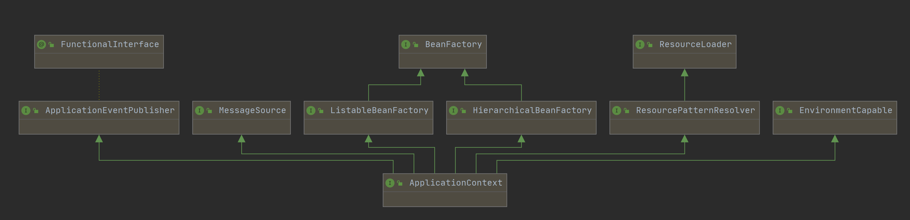

# Core Technologies

## The IoC Container

### Introduction to the Spring IoC Container and Beans

>  IoC is also known as **dependency injection** (DI). It is a process whereby objects define their dependencies (that is, the other objects they work with) only through constructor arguments, arguments to a factory method, or properties that are set on the object instance after it is constructed or returned from a factory method. 
>
> 3 types of DI:
>
> - constructor arguments
> - arguments to a factory method
> - properties that are set on the object instance after

The `org.springframework.beans` and `org.springframework.context` packages are the basis for Spring Framework’s IoC container.

- `BeanAactory` 

  The [`BeanFactory`](https://docs.spring.io/spring-framework/docs/5.2.9.RELEASE/javadoc-api/org/springframework/beans/factory/BeanFactory.html) interface provides an advanced configuration mechanism capable of managing any type of object.

- `ApplciationContext`

  [`ApplicationContext`](https://docs.spring.io/spring-framework/docs/5.2.9.RELEASE/javadoc-api/org/springframework/context/ApplicationContext.html) is a sub-interface of `BeanFactory`. It adds:

  - Easier integration with Spring’s AOP features
  - Message resource handling (for use in internationalization)
  - Event publication
  - Application-layer specific contexts such as the `WebApplicationContext` for use in web applications.

In Spring, the objects that form the backbone of your application and that are managed by the Spring IoC container are called **beans**. A bean is an object that is instantiated, assembled, and managed by a Spring IoC container. Otherwise, a bean is simply one of many objects in your application. Beans, and the dependencies among them, are reflected in the configuration metadata used by a container.

### Container Overview

The `org.springframework.context.ApplicationContext` interface represents the Spring IoC container and is responsible for instantiating, configuring, and assembling the beans. The container gets its instructions on what objects to instantiate, configure, and assemble by reading configuration metadata. The configuration metadata is represented in XML, Java annotations, or Java code. It lets you express the objects that compose your application and the rich interdependencies between those objects.



#### Configuration Metadata

For information about using other forms of metadata with the Spring container, see:

- [Annotation-based configuration](https://docs.spring.io/spring-framework/docs/5.2.9.RELEASE/spring-framework-reference/core.html#beans-annotation-config): Spring 2.5 introduced support for annotation-based configuration metadata.
- [Java-based configuration](https://docs.spring.io/spring-framework/docs/5.2.9.RELEASE/spring-framework-reference/core.html#beans-java): Starting with Spring 3.0, many features provided by the Spring JavaConfig project became part of the core Spring Framework. Thus, you can define beans external to your application classes by using Java rather than XML files. To use these new features, see the [`@Configuration`](https://docs.spring.io/spring-framework/docs/current/javadoc-api/org/springframework/context/annotation/Configuration.html), [`@Bean`](https://docs.spring.io/spring-framework/docs/current/javadoc-api/org/springframework/context/annotation/Bean.html), [`@Import`](https://docs.spring.io/spring-framework/docs/current/javadoc-api/org/springframework/context/annotation/Import.html), and [`@DependsOn`](https://docs.spring.io/spring-framework/docs/current/javadoc-api/org/springframework/context/annotation/DependsOn.html) annotations.

The following example shows the basic structure of XML-based configuration metadata:

```xml
<?xml version="1.0" encoding="UTF-8"?>
<beans xmlns="http://www.springframework.org/schema/beans"
    xmlns:xsi="http://www.w3.org/2001/XMLSchema-instance"
    xsi:schemaLocation="http://www.springframework.org/schema/beans
        https://www.springframework.org/schema/beans/spring-beans.xsd">

    <bean id="..." class="...">  
        <!-- collaborators and configuration for this bean go here -->
    </bean>

    <bean id="..." class="...">
        <!-- collaborators and configuration for this bean go here -->
    </bean>

    <!-- more bean definitions go here -->

</beans>
```

|      | The `id` attribute is a string that identifies the individual bean definition. |
| ---- | ------------------------------------------------------------ |
|      | The `class` attribute defines the type of the bean and uses the fully qualified classname. |


#### Instantiating a Container

```java
ApplicationContext context = new ClassPathXmlApplicationContext("services.xml", "daos.xml");
```

##### Composing XML-based Configuration Metadata

It can be useful to have bean definitions span multiple XML files. Often, each individual XML configuration file represents a logical layer or module in your architecture.

```xml
<beans>
    <import resource="services.xml"/>
    <import resource="resources/messageSource.xml"/>
    <import resource="/resources/themeSource.xml"/>   <!--不建议加 /-->

    <bean id="bean1" class="..."/>
    <bean id="bean2" class="..."/>
</beans>
```

In the preceding example, external bean definitions are loaded from three files: `services.xml`, `messageSource.xml`, and `themeSource.xml`. All location paths are relative to the definition file doing the importing, so `services.xml` must be in the same directory or classpath location as the file doing the importing, while `messageSource.xml` and `themeSource.xml` must be in a `resources` location below the location of the importing file. **As you can see, a leading slash is ignored. However, given that these paths are relative, it is better form not to use the slash at all.** 

#### Using the Container

The `ApplicationContext` is the interface for an advanced factory capable of maintaining a registry of different beans and their dependencies. By using the method `T getBean(String name, Class<T> requiredType)`, you can retrieve instances of your beans.

The `ApplicationContext` lets you read bean definitions and access them, as the following example shows:

```java
// create and configure beans
ApplicationContext context = new ClassPathXmlApplicationContext("services.xml", "daos.xml");

// retrieve configured instance
PetStoreService service = context.getBean("petStore", PetStoreService.class);

// use configured instance
List<String> userList = service.getUsernameList();
```

The most flexible variant is `GenericApplicationContext` in combination with reader delegates — for example, with `XmlBeanDefinitionReader` for XML files, as the following example shows:

```java
GenericApplicationContext context = new GenericApplicationContext();
new XmlBeanDefinitionReader(context).loadBeanDefinitions("services.xml", "daos.xml");
context.refresh();
```

### Bean Overview

A Spring IoC container manages one or more beans. These beans are created with the configuration metadata that you supply to the container (for example, in the form of XML `<bean/>` definitions).

Within the container itself, these bean definitions are represented as `BeanDefinition` objects, which contain (among other information) the following metadata:

- A package-qualified class name: typically, the actual implementation class of the bean being defined.
- Bean behavioral configuration elements, which state how the bean should behave in the container (scope, lifecycle callbacks, and so forth).
- References to other beans that are needed for the bean to do its work. These references are also called collaborators or dependencies.
- Other configuration settings to set in the newly created object — for example, the size limit of the pool or the number of connections to use in a bean that manages a connection pool.