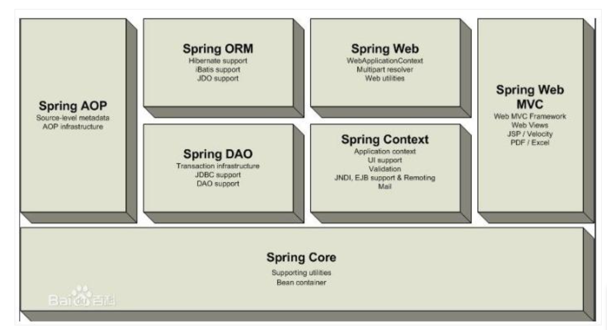
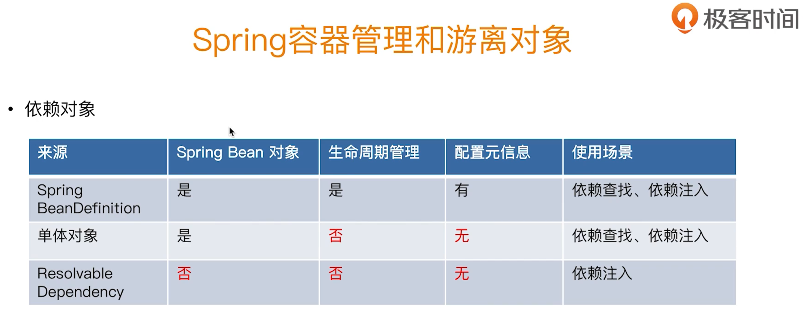
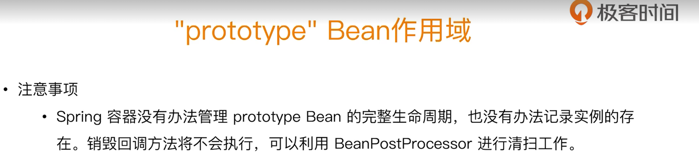
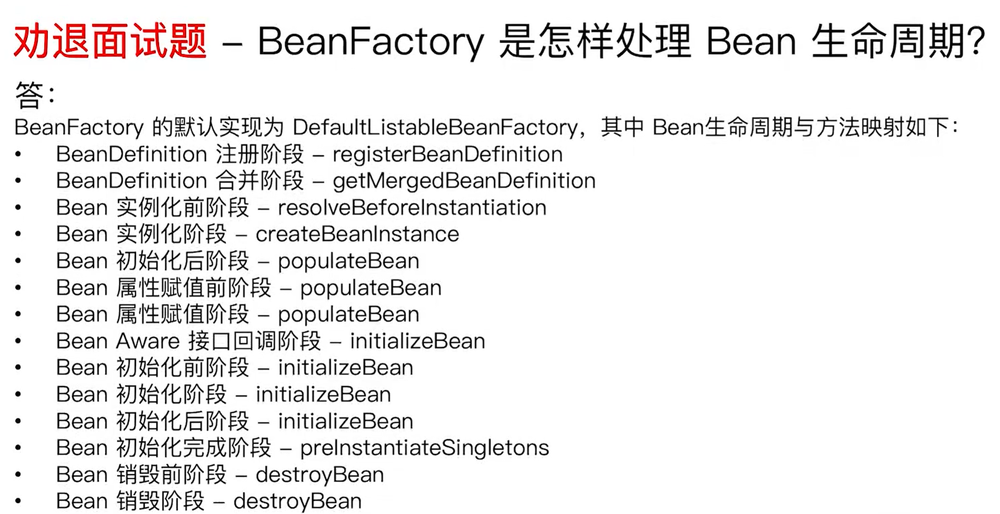

# Spring 5

## 简介

- 2002年 interface21
- 2004年3月24日 以interface21为框架，正式发布。
- Rod Johnson 悉尼大学音乐学博士
- Spring理念，使现有的技术更方便的使用，本身是一个大杂烩，整合了现有的技术框架。

## 官方手册

> https://docs.spring.io/spring-framework/docs/5.2.9.RELEASE/spring-framework-reference/

## 组成



## IOC理论推导

Using depency injection, developer no need to control the creation of objects. Devloper only need focus on the interface. And configure the implmention of interface. Spring container will create the objects. The control is from devloper to container it self. Decoupling.

### IOC创建对象的方式

1. 默认使用无参构造创建
2. 可以指定构造函数创建

在配置文件加载的时候，容器中管理的对象就已经初始化了。

## Spring配置

### 别名

```xml
<alias name="fromName" alias="toName"/>
```

### import

```xml
<beans>    
    <import resource="com/bank/service/${customer}-config.xml"/> 
</beans>
```

依赖注入

1. 构造器注入
2. set方式注入
3. 拓展方式


## Refresh 方法中做的事

```java
//refresh 主要在 AbstractApplicationContext中实现
1. prepareRefresh()   // 检查一下properties和env文件
    
2. abstract obtainFreshBeanFactory()     //这是一个抽象方法，由子类去实现
    
3. prepareBeanFactory(ConfigurableListableBeanFactory beanFactory) 
    
   //Modify the application context's internal bean factory after its standard
   //initialization.
4. postProcessBeanFactory(ConfigurableListableBeanFactory beanFactory)   
    
    // Invoke factory processors registered as beans in the context.
5.	invokeBeanFactoryPostProcessors(beanFactory);

	// Register bean processors that intercept bean creation.
6.	registerBeanPostProcessors(beanFactory);

	// Initialize message source for this context.
7.	initMessageSource();

	// Initialize event multicaster for this context.
8.	initApplicationEventMulticaster();

	// Initialize other special beans in specific context subclasses.
9.	onRefresh();

	// Check for listener beans and register them.
10.	registerListeners();

	// Instantiate all remaining (non-lazy-init) singletons.
11.	finishBeanFactoryInitialization(beanFactory);

	// Last step: publish corresponding event.
12.	finishRefresh();
```

## @Autowired依赖处理过程

```java
基础知识
	入口 DefaultListableBeanFactory#resolveDependency
    依赖描述 DependencyDescriptor
    自定义绑定候选处理器 AutowireCandidateResolver
    
    进入
    resolveDependency(DependencyDescriptor,RequestBeanName,Set<String> autowiredBeanNames,TypeConverter)
    1. 先判断descriptorType 
       Optional<T>  
       ObjectFactory<T> or ObjectProvider<T>
       javaxInjectProviderClass
       不是以上三种，走spring default的 doResolveDependency(descriptor, requestingBeanName, autowiredBeanNames, typeConverter)
    
    2.doResolveDependency
        是集合
        a.resolveMultipleBeans(descriptor, beanName, autowiredBeanNames, typeConverter);
           这里会去检查 descriptorType是不是Stream,String,Collection,Map
         	a.findAutowireCandidates(beanName, elementType,
					new MultiElementDescriptor(descriptor))       //找到所有类型匹配的bean,这里会new 
               												    //MultiElementDescriptor	
               在addCandidateEntry中，会去判断descriptor instanceof MultiElementDescriptor
               如果是MultiElementDescriptor,会去call 
               descriptor.resolveCandidate(candidateName, requiredType, this);来得到bean并放入result map中
        b.resolveMultipleBeans会返回multipleBeans，如果multipleBeans != null,则直接返回结果
               
       	
        不是集合
        a.findAutowireCandidates
           将所有找到的符合descriptorType的 type 放去result map中(matchingBeans <beanName,beanType>)
        b.如果找到的matchingBeans.size()>1
           determineAutowireCandidate //按下面的顺序找到candidate name -> autowiredBeanName
               determinePrimaryCandidate         //先找primary
               determineHighestPriorityCandidate //再根据priority
               matchesBeanName                   //最后根据名称
                                                 //如果找不到candidate name,return null
                                                 //doResolveDependency会throw NoUniqueBeanDefinitionException
        c.matchingBeans.get(autowiredBeanName);   //返回找到的Class Type，并加入到 autowiredBeanNames set中
        d.descriptor.resolveCandidate(autowiredBeanName, type, this)     //根据beanName,type已经当前的beanFactoy
                                                                         //调用beanFactory的getBean(beanName)来得到                                                                          //bean
    3.  resolveDependency 返回结果
```


## @Autowired依赖注入过程

- 元信息解析
- 依赖查找（依赖处理）
- 依赖注入

```java
AutowiredAnnotationBeanPostProcessor
    1. postProcessMergedBeanDefinition    //用于merge child和parent的beanDefinition
    		findAutowiringMetadata(beanName, beanType, null)  //先从缓存injectionMetadataCache找metadata
                                                               //如果没有，call buildAutowiringMetadata创建
    													  //并将beanName(或class)作为key
                                                               //将metadata放入injectionMetadataCache缓存
    
    			buildAutowiringMetadata(final Class<?> clazz) //查找所有@Autowired字段/方法，并忽略static字段
                                                               //方法必须有参方法
    
    2. postProcessProperties
             findAutowiringMetadata(beanName, bean.getClass(), pvs)  //同上，得到metadata,call inject方法
             	metadata.inject(bean, beanName, pvs);                //将迭代所有metadata中的elements
                                                                     //call element的inject方法

                     element.inject(target, beanName, pvs);          //这里call的是 				                                                                                    //AutowiredAnnotationBeanPostProcessor
                                                                     //中内部类AutowiredFieldElement.inject
                                                                     //inject中会新建这个element的dependency
                                                                     //description

                           beanFactory.resolveDependency             //同上依赖处理，返回bean
                           ReflectionUtils.makeAccessible(field);    //利用反射注入
				         field.set(bean, value);    

   
                  
```

## 依赖查找的依赖来源

### 查找来源

| 来源                       | 配置数据源                                                   |
| -------------------------- | ------------------------------------------------------------ |
| Spring BeanDefinition      | <bean id = '' class=""/>                                     |
|                            | @Bean public User user()                                     |
|                            | BeanDefinitionBuilder                                        |
| 单例对象                   | API实现                                                      |
| Spring 内建 BeanDefinition | ConfigrutaionClassPostProcessor 处理配置类<br />AutoWiredAnnotationPostProcessor 处理@Autowired @Value<br />CommonAnnotationPostProcessor处理JSR-250注解，如@PostConstructor<br />EnventListenerMethodPostProcessor处理@EventListener的spring监听<br /> |
| Spring内建单例对象         | environment<br />systemProperties<br />systemEnvironment<br />messageSource<br />lifecycleProcessor<br />applicationEventMulticaster |

### 注入来源

| 来源                  | 配置数据源                                                   |
| --------------------- | ------------------------------------------------------------ |
| Spring BeanDefinition | <bean id = '' class=""/>                                     |
|                       | @Bean public User user()                                     |
|                       | BeanDefinitionBuilder                                        |
| 单例对象              | API实现 <br />environment<br />systemProperties<br />systemEnvironment<br />messageSource<br />lifecycleProcessor<br />applicationEventMulticaster |
| 非Spring容器管理对象  | ResolvableDependency                                         |
| @Value外部化配置      |                                                              |

```java
 * 依赖注入的来源比依赖查找多一项非spring管理对象
 * 在DefaultListableBeanFactory.findAutowireCandidates方法中
 * 会去注入 resolvableDependencies中的对象
 *
 * 而 resolvableDependencies来自 AbstractApplicationContext#prepareBeanFactory
 * 中 调用 ConfigurableListableBeanFactory#registerResolvableDependency    
 * 		beanFactory.registerResolvableDependency(BeanFactory.class, beanFactory);
 * 		beanFactory.registerResolvableDependency(ResourceLoader.class, this);
 * 		beanFactory.registerResolvableDependency(ApplicationEventPublisher.class, this);
 * 		beanFactory.registerResolvableDependency(ApplicationContext.class, this);
```




单例bean的注入

```java
DefaultListableBeanFactory -> AbstractAutowireCapableBeanFactory -> AbstractBeanFactory -> FactoryBeanRegistrySupport -> DefaultSingletonBeanRegistry -> SingletonBeanRegistry

SingletonBeanRegistry#registerSingleton(String beanName, Object singletonObject);
```

## Bean的作用域



```java
无论是prototype还是singleton的bean,都会执行初始化方法回调（@PostContructor)
但是仅singleton会执行销毁方法回调(@Predestory)    
    
所以prototye bean不会有完整的生命周期。
而且通过getBean("prototypeBean") 和 @Autowired prototypeBean一旦创建新的对象，完成初始化，就不接受spring 托管
    
    // 结论一：
    // Singleton Bean 无论依赖查找还是依赖注入，均为同一个对象
    // Prototype Bean 无论依赖查找还是依赖注入，均为新生成的对象

    // 结论二：
    // 如果依赖注入集合类型的对象，Singleton Bean 和 Prototype Bean 均会存在一个
    // Prototype Bean 有别于其他地方的依赖注入 Prototype Bean

    // 结论三：
    // 无论是 Singleton 还是 Prototype Bean 均会执行初始化方法回调
    // 不过仅 Singleton Bean 会执行销毁方法回调
 
```

```java
@ReqeustScope         实现类RequestScope
    AutoWired注入的bean是同一个cglib提升过的bean,但是通过RequestScope request get之后每次返回不同的代理类
    
@SessionScope         实现类SessionScope
    AutoWired注入的bean是同一个cglib提升过的bean,但是通过SessionScope session get之后每次返回不同的代理类
    sessionScope get方法会在get之前加一把锁来保证线程安全，因为同一个浏览器的不同tag之间共享cookie（jsession),可能会影响线     程安全
    
@ApplicationScope     实现类ServletContextScope
    AutoWired注入的bean是同一个cglib提升过的bean,但是通过ApplcationScope get之后每次返回相同的代理类 scopedTarget.user
```

## Spring Bean初始化

- Bean实例化

- Bean属性赋值

- Bean Aware接口回调   

- InstantiationAwareBeanPostProcessor#postProcessBeforeInstantiation    前阶段

- invokeInitMethods

- InstantiationAwareBeanPostProcessor#postProcessAfterInstantiation       后阶段

  

  

  DefaultListableBeanFactory#preInstantiateSingletons()

  ```java
  总结:beanFactory处理bean的过程
  1.注册bean Definition registerBeanDefinition()
  2.bean Definition的合并阶段 getMergedLocalBeanDefinition(),比如user和superUser 最后都变为root bean Definition
  3.创建bean createBean()
  4.将bean类型从string变为class类型 resolveBeanClass()
  5.bean实例化前工作resolveBeforeInstantiation(),比如可以返回自定义的bean对象让spring不在实例化bean对象
  6.开始实例化bean doCreateBean()
  7.实例化bean createBeanInstance()
  8.bean实例化后 postProcessAfterInstantiation()返回false即bean不在对属性处理
  9.属性赋值前对属性处理postProcessProperties()
  10.属性赋值applyPropertyValues()
  11.bean初始化阶段initializeBean()
  12.初始化前aware接口回调(非ApplicationContextAware),比如beanFactoryAware
  13.初始化前回调applyBeanPostProcessorsBeforeInitialization(),比如@PostConstructor
  14.初始化invokeInitMethods(),比如实现InitializingBean接口的afterPropertiesSet()方法回调
  15.初始化后的回调applyBeanPostProcessorsAfterInitialization()
  16.bean重新的填充覆盖来更新bean preInstantiateSingletons()
  17.bean销毁前postProcessBeforeDestruction()
  18.bean销毁,比如@PreDestroy
  ```

  	
