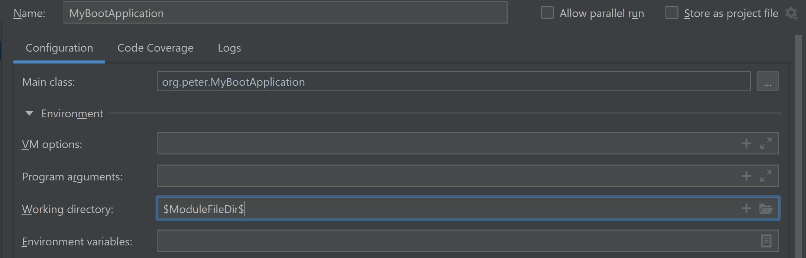

## SpringBoot项目约定


## 环境搭建

### 引入依赖

```xml
<!--引入父项目管理依赖-->
<parent>
    <groupId>org.springframework.boot</groupId>
    <artifactId>spring-boot-parent</artifactId>
    <version>2.5.0</version>
</parent>

<dependencies>
    <!--引入SpringBoot依赖-->
    <dependency>
        <groupId>org.springframework.boot</groupId>
        <artifactId>spring-boot-starter-web</artifactId>
    </dependency>
</dependencies>
```

### 创建SpringBoot配置文件

```yaml
# SpringBoot的配置文件 application.yml|application.properties必须放在classpath根目录下
# 一般放在 resources 目录下
server:
  port: 8989   # 更改默认端口号
  servlet:
    context-path: /myboot    # SpringBoot默认没有项目根路径。这里可以配置项目根目录访问路径,以 / 开头
```

```markdown
# 多个配置文件的设定 
  在 application.yml 中设定 spring.profiles.active
  e.g.
  	application-dev.yml  -- 开发环境
  	application-prod.yml -- 生产环境

  当在 application.yml中设定 
  spring:
  	profiles:
  		active: dev
  
  表示 application.yml + application-dev.yml中的配置生效
```


```markdown
# 指定外部的配置文件来运行
外部配置文件 在 D:\javalearning\learning-spring-boot\application-prod.yml
启动配置参数 
	--spring.config.location=D:\javalearning\learning-spring-boot\application-prod.yml
	
# Run with command args	
java -jar spring-boot-01-1.0-SNAPSHOT.jar --spring.config.location=D:\javalearning\learning-spring-boot\application-prod.yml
```


### 创建SpringBoot入口类

```java
/*
 * @SpringBootApplication只能出现一次,作用在class上
 * 入口方法必须在所有子包的上层目录 org.peter
 * 其他子包:
 * org.peter
 *          entity
 *          dao
 *          service
 *
 * @SpringBootApplication 注解：
 *      组合注解：就是由多个注解组合而成的注解
 *      元注解： 用来修饰注解的注解 @Target:指定注解作用范围 @Retention:指定注解什么时候生效
 *
 *      @SpringBootConfiguration : 用来自动配置Spring,Spring MVC(初始化，servlet)相关环境
 *      @EnableAutoConfiguration : 开启自动配置，自动配置核心注解
 *                                 自动配置Spring相关环境，引入第三方技术，自动配置其环境
 *                                 mybatis-springboot,es-springboot,redis-springboot
 *      @ComponentScan :           组件扫描，默认扫描当前包，及其子包
 *
 */
@SpringBootApplication
public class MyBootApplication {
    // 需要一个 main 方法
    public static void main(String[] args) {
        SpringApplication.run(MyBootApplication.class,args);
    }
}
```

### 创建一个HelloController

```java
@RestController
public class HelloController {

    @RequestMapping("/hello")
    public String hello(){
        return "Hello SpringBoot!";
    }
}
```


## JSP模板集成

### 引入JSP依赖

```xml
<!--JSTL标签-->
<dependency>
    <groupId>jstl</groupId>
    <artifactId>jstl</artifactId>
    <version>1.2</version>
</dependency>
<!--内嵌 tomecat 支持 jsp-->
<dependency>
    <groupId>org.apache.tomcat.embed</groupId>
    <artifactId>tomcat-embed-jasper</artifactId>
</dependency>
```

### 引入SpringBoot插件

在idea集成springboot的时候，jsp有时候无法正确显示。可以使用插件 spring-boot:run 来运行。

```xml
<!--可以正确打包 jsp 显示-->
<build>
    <plugins>
        <plugin>
            <groupId>org.springframework.boot</groupId>
            <artifactId>spring-boot-maven-plugin</artifactId>
            <executions>
                <execution>
                    <goals>
                        <goal>repackage</goal>
                    </goals>
                </execution>
            </executions>
        </plugin>
    </plugins>
</build>
```

或者指定main函数启动时的工作目录 



### 配置视图解析

在SpringBoot中，可以直接在config中配置视图解析. Jsp放在webapp下。

```yaml
# 视图解析配置
spring:
  mvc:
    view:
      prefix: /
      suffix: .jsp

```

修改jsp无需重启SpringBoot

server.servlet.jsp.init-parameters.development = true

```yaml
server:
  port: 8989   # 更改默认端口号
  servlet:
    context-path: /myboot    # SpringBoot默认没有项目根路径。这里可以配置项目根目录访问路径,以 / 开头
    jsp:
      init-parameters:
        development: true   # jsp保存后无需重启
```

## MyBatis整合

### 引入依赖

- spring-boot-web-starter

- mysql相关驱动，druid数据源

- mybatis相关（mybatis-spring-boot-starter) 依赖( mybatis,mybatis-spring)

  ```xml
  <!-- Druid Datasource-->
  <dependency>
      <groupId>com.alibaba</groupId>
      <artifactId>druid</artifactId>
      <version>1.2.8</version>
  </dependency>
  
  <!-- mysql driver-->
  <dependency>
      <groupId>mysql</groupId>
      <artifactId>mysql-connector-java</artifactId>
      <version>8.0.25</version>
  </dependency>
  
  <!-- mybatis-->
  <dependency>
      <groupId>org.mybatis.spring.boot</groupId>
      <artifactId>mybatis-spring-boot-starter</artifactId>
      <version>2.2.0</version>
  </dependency>
  ```

  

### 书写配置

- 开启注解扫描 @SpringBootApplication中已经包含 @ComponentScan.

- 创建数据源

  1. 指定数据源类型 

  2. 指定数据库驱动类型 

  3. 指定URL, username, password

     ```yaml
     spring:
       mvc:
         view:      # view resolver
           prefix: /
           suffix: .jsp
       datasource:  # datasource
         type: com.alibaba.druid.pool.DruidDataSource  # datasource type
         driver-class-name: com.mysql.cj.jdbc.Driver   # mysql 8 driver
         url: jdbc:mysql://localhost:3306/peters?useSSL=false
         username: root
         password: Peter006
     ```

     

- 创建SqlSessionFactory

  1. 指定mapper配置文件位置

  2. 指定实体包所在位置（Entity)

     ```yaml
     mybatis:  # mybatis config.  Dao base package user @MapperScan
       mapper-locations: classpath:org/peter/mapper/*Mapper.xml   # mapper location
       type-aliases-package: org.peter.entity                     # aliases package
       
     logging:  # enable jdbc transaction logging
       level:
         root: INFO
         org.peter.dao: debug
         org.springframework.jdbc.support: debug
         org.mybatis.spring: debug
     ```

     

- 创建DAO

  1. 指定DAO接口所在包

     ```java
     @SpringBootApplication
     @MapperScan("org.peter.dao")  // mybatis MapperScanConfigurer basePackage
                                   // or use @Mapper on Dao class
     public class MyBootApplication {    
         public static void main(String[] args) {
             SpringApplication.run(MyBootApplication.class,args);
         }
     }
     ```

     

- 创建事务管理器 指定注解式事务生效 （省略，Springboot约定）

## Springboot本地测试

### 引入测试依赖

```xml
<!-- springboot test-->
<dependency>
    <groupId>org.springframework.boot</groupId>
    <artifactId>spring-boot-starter-test</artifactId>
    <!--only for test-->
    <scope>test</scope>
</dependency>
```

### 编写测试类

```java
@SpringBootTest
public class TestUserDao {

    private UserDao userDao;

    @Autowired
    public TestUserDao(UserDao userDao) {
        this.userDao = userDao;
    }

    @Test
    public void testFindAll(){
        userDao.findAll().forEach(System.out::println);
    }
}
```

## Springboot热部署

### 引入依赖

```xml
<!-- dev tools-->
<dependency>
    <groupId>org.springframework.boot</groupId>
    <artifactId>spring-boot-devtools</artifactId>
    <!--optional = true, 不传递给子项目-->
    <optional>true</optional>
</dependency>
```

### 开启自动编译


### 开启允许在运行时修改文件

crtl + alt + shift + / --> 选择 registry -> 勾选 compiler.automake.allow.when.app.running 这个选项


### 测试

看到 restartedMain 表示热部署成功

```markdown
2022-01-21 10:02:51.709  INFO 68880 --- [  restartedMain] o.s.b.a.w.s.WelcomePageHandlerMapping    : Adding welcome page template: index
2022-01-21 10:02:51.768  INFO 68880 --- [  restartedMain] o.s.b.d.a.OptionalLiveReloadServer       : LiveReload server is running on port 35729
2022-01-21 10:02:51.781  INFO 68880 --- [  restartedMain] o.s.b.w.embedded.tomcat.TomcatWebServer  : Tomcat started on port(s): 8989 (http) with context path '/myboot'
2022-01-21 10:02:51.786  INFO 68880 --- [  restartedMain] org.peter.MyBootApplication              : Started MyBootApplication in 0.809 seconds (JVM running for 141.254)
2022-01-21 10:02:51.786  INFO 68880 --- [  restartedMain] o.s.b.a.ApplicationAvailabilityBean      : Application availability state LivenessState changed to CORRECT
2022-01-21 10:02:51.787  INFO 68880 --- [  restartedMain] .ConditionEvaluationDeltaLoggingListener : Condition evaluation unchanged
2022-01-21 10:02:51.787  INFO 68880 --- [  restartedMain] o.s.b.a.ApplicationAvailabilityBean      : Application availability state ReadinessState changed to ACCEPTING_TRAFFIC
```

## 日志处理

```yaml
logging:  # enable jdbc transaction logging
  level:
    root: INFO
    org.peter: debug
    org.springframework.jdbc.support: debug
    org.mybatis.spring: debug
```

```java
@Service
@Transactional
public class UserServiceImpl implements UserService {

    private static final Logger log = LoggerFactory.getLogger(UserService.class);

    private UserDao userDao;

    @Autowired
    public UserServiceImpl(UserDao userDao) {
        this.userDao = userDao;
    }

    public List<User> findAll() {
        log.debug("findAll user {}-->{}","aaa","bbb");  // 输出日志
        return userDao.findAll();
    }

    public void save(User user) {
        userDao.save(user);
    }
}

// 打印log
2022-01-21 11:10:04.856 DEBUG 76308 --- [           main] org.peter.service.UserService            : findAll user aaa-->bbb


```

## 面向切面编程

### 引入依赖

```xml
<!-- AOP -->
<dependency>
    <groupId>org.springframework.boot</groupId>
    <artifactId>spring-boot-starter-aop</artifactId>
</dependency>
```


### 配置config包中开发AOP配置类

- 基于切入点表达式	

  ```java
  /**
   * Springboot与 传统的 aop注解开发不同，不需要引入@EnableAspectJAutoProxy来开启Aop
   * 在  {@link org.springframework.boot.autoconfigure.aop.AopAutoConfiguration 中} 主要设置了两个参数
   *    - spring.aop.auto = true  默认开启 aop(引入@EnableAspectJAutoProxy), false - 关闭
   *    - spring.aop.proxy-target-class  默认为 true  
   */
  @Configuration
  @Aspect
  public class MyAspectConfig {
  
      @Before(value = "execution(* org.peter.dao.*.*(..))")
      public void before(JoinPoint jp){    // 这里用 JoinPoint
          System.out.println("====before====" + jp.getTarget() + "." + jp.getSignature().getName());
      }
  
      @After("execution(* org.peter.dao.*.*(..))")
      public void after(JoinPoint jp){     // 这里用 JoinPoint
          System.out.println("====after====" + jp.getTarget() + "." + jp.getSignature().getName());
      }
  
      @Around("execution(* org.peter.dao.*.*(..))")
      public Object around(ProceedingJoinPoint jp){   // 这里用 ProceedingJoinPoint，只适用于 @Around
          System.out.println("====around start====" +jp.getTarget() + "." + jp.getSignature().getName());
          Object ret = null;
          try {
              ret = jp.proceed();
          } catch (Throwable throwable) {
              System.out.println("====around exception====");
          }
          System.out.println("====around end====" +jp.getTarget() + "." + jp.getSignature().getName());
          return ret;
      }
  }
  
  Output:
  ====around start====org.apache.ibatis.binding.MapperProxy@1f43cab7.findAll
  ====before====org.apache.ibatis.binding.MapperProxy@1f43cab7.findAll
      
  ... method exectue log...
      
  ====after====org.apache.ibatis.binding.MapperProxy@1f43cab7.findAll
  ====around end====org.apache.ibatis.binding.MapperProxy@1f43cab7.findAll
  
  
  ```

- 基于自定义注解

  ```java
  // 自定义注解
  @Target({ElementType.METHOD})
  @Retention(RetentionPolicy.RUNTIME)
  public @interface MyAspect {
  }
  
  // 配置切面
  @Around("@annotation(org.peter.annotation.MyAspect)")
  public Object aroundAnnotation(ProceedingJoinPoint jp){
      System.out.println("====around annotation start====");
      Object ret = null;
      try {
          ret = jp.proceed();
      } catch (Throwable throwable) {
          System.out.println("====around annotation exception====");
      }
      System.out.println("====around annotation end====");
      return ret;
  }
  
  // 标注method
  public interface UserDao {
      @MyAspect
      List<User> findAll();
  
      void save(User user);
  }
  
  // output
  ====around start====org.apache.ibatis.binding.MapperProxy@4751e8b9.findAll
  ====around annotation start====
  ====before====org.apache.ibatis.binding.MapperProxy@4751e8b9.findAll
  
  ... method exectue log... 
      
  ====after====org.apache.ibatis.binding.MapperProxy@4751e8b9.findAll
  ====around annotation end====
  ====around end====org.apache.ibatis.binding.MapperProxy@4751e8b9.findAll
  
  
  ```

- 定义共用的切入点

  ```java
  @Pointcut("execution(* org.peter.dao.*.*(..))")   // 定义共用的切入点
  public void pointcut(){
  }
  
  @Before("pointcut()")    // 引入切入点
  public void before(JoinPoint jp){
      System.out.println("====before====" + jp.getTarget() + "." + jp.getSignature().getName());
  }
  
  @After("pointcut()")     // 引入切入点
  public void after(JoinPoint jp){
      System.out.println("====after====" + jp.getTarget() + "." + jp.getSignature().getName());
  }
  
  @Around("pointcut()")    // 引入切入点
  public Object around(ProceedingJoinPoint jp){
      System.out.println("====around start====" +jp.getTarget() + "." + jp.getSignature().getName());
      Object ret = null;
      try {
          ret = jp.proceed();
      } catch (Throwable throwable) {
          System.out.println("====around exception====");
      }
      System.out.println("====around end====" +jp.getTarget() + "." + jp.getSignature().getName());
      return ret;
  }
  ```

## 文件上传和下载

### 文件上传

#### 传统做法

- JSP的开发

  1. form表单的method必须是post
  2. form表单的ecntype必须是 `multipart/form-data`, (默认是 `application/x-www-form-urlencoded`)

  ```jsp
  <%@ taglib prefix="form" uri="http://www.springframework.org/tags/form" %>
  <%@ page contentType="text/html;charset=utf-8" language="java" %>
  <html>
  <body>
  <h2>Upload File</h2>
  
  <table>
      <form method="post" action="${pageContext.request.contextPath}/file/upload" enctype="multipart/form-data">
          <tr>
              <td valign="middle" align="right">
                  Upload File:
              </td>
              <td valign="middle" align="left">
                  <input type="file" name="ufile"/>
              </td>
              <td valign="middle" align="right">
                  <input type="submit" value="Upload"/>
              </td>
          </tr>
      </form>
  </table>
  </body>
  </html>
  
  ```

- Controller的开发

  1. 得到当前项目下`/uploads`目录的绝对路径。 将文件传送过去

     ```java
     @Controller
     @RequestMapping("file")
     public class FileController {
     
         @RequestMapping("upload")
         public String upload(MultipartFile ufile, HttpServletRequest request){
             // Get original file name
             String originalFilename = ufile.getOriginalFilename();
             // Get real path of '/uploads'
             String realPath = request.getSession().getServletContext().getRealPath("/uploads");
             // Transfer file to real path
             File newFile = new File(realPath,originalFilename);
             try {
                 ufile.transferTo(newFile);
             } catch (IOException e) {
                 e.printStackTrace();
             }
             return "redirect:/upload.jsp";
         }
     }
     ```

     

  2. 注意 ： 

     在springboot中，多数以jar的形式部署在deploy，是无法以绝对路径传送文件的(e.g. application.jar$$/uploads)

     所以现在普遍采用的方式是define一个在服务器上的绝对路径。然后将绝对路径设定在配置文件中，并注入到controller

  3. springboot上传文件是有大小处理上限的(10M)。需要进行设定。

     设置文件大小处理上限

     - `spring.servlet.multipart.max-request-size`
     - `spring.servlet.multipart.max-file-size`

     ```yaml
     org.apache.tomcat.util.http.fileupload.impl.FileSizeLimitExceededException: The field ufile exceeds its maximum permitted size of 1048576 bytes.
     	at org.apache.tomcat.util.http.fileupload.impl.FileItemStreamImpl$1.raiseError(FileItemStreamImpl.java:114) ~[tomcat-embed-core-9.0.46.jar:9.0.46]
     	
     # yaml 设置
     spring:
       servlet:
         multipart:
           max-request-size: 20MB
           max-file-size: 20MB
     	
     ```

#### springboot做法

- Controller的开发

  ```java
  // 上传路径通过配置文件注入
  @Value("${file.upload.dir}")
  private String UPLOAD_DIR;
  
  @RequestMapping("uploadnew")
  public String uploadnew(MultipartFile ufile){
      // Get original file name
      String originalFilename = ufile.getOriginalFilename();
      // File upload dir
      File newFile = new File(UPLOAD_DIR,originalFilename);
      try {
          ufile.transferTo(newFile);
      } catch (IOException e) {
          e.printStackTrace();
      }
      return "redirect:/upload.jsp";
  }
  
  ```

- yaml中配置上传路径

  ```yaml
  # application-dev.yaml 中配置上传路径
  file:
    upload:
      dir: D:\javalearning\temp
      
  # application.yaml 中设定 dev 配置文件
  spring:
    profiles:
      active: dev
  ```

### 文件下载

- JSP的开发

  ```jsp
  <tr>
      <td>
          <a href="${pageContext.request.contextPath}/file/download?filename=SpringBoot入门.md">SpringBoot入门.md</a>
      </td>
  </tr>
  <tr>
      <td>
          <a href="${pageContext.request.contextPath}/file/download?filename=SpringBoot源码.md">SpringBoot源码.md</a>
      </td>
  </tr>
  
  ```

- Controller的开发

  1. 配置download的绝对路径并注入

  2. Response header需要设置 `Content-Disposition = attachment; filename = <filename>`

     文件名如果可能包含中文，需要encode成utf-8

  3. 将 inputstream copy 去 outputstream

  ```java
  @Value("${file.download.dir}")
  private String DOWNLOAD_DIR;
  
  @RequestMapping("download")
  public void download(String filename, HttpServletResponse response) throws Exception{
      logger.debug("filename = " + filename);
      // get download file
      File download = new File(DOWNLOAD_DIR,filename);
      // get input stream
      FileInputStream is = new FileInputStream(download);
      // set response header "Content-Disposition" as attachment
      // file name need encode to utf-8
      response.setHeader("Content-Disposition","attachment; filename="+ URLEncoder.encode(filename,"UTF-8"));
      // get output stream
      ServletOutputStream os = response.getOutputStream();
      // copy is to os
      //        byte[] buffer = new byte[1024];
      //        while(true){
      //            int len = is.read(buffer);
      //            if(len == -1){
      //                break;
      //            }
      //            os.write(buffer);
      //        }
      //        os.close();
  
      // use spring util to copy is
      FileCopyUtils.copy(is,os);
  }
  ```

- yaml的配置

  ```yaml
  file:
    upload:
      dir: D:\javalearning\temp
    download:
      dir: D:\javalearning\temp
  ```

  
