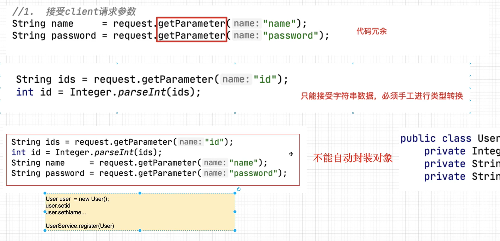
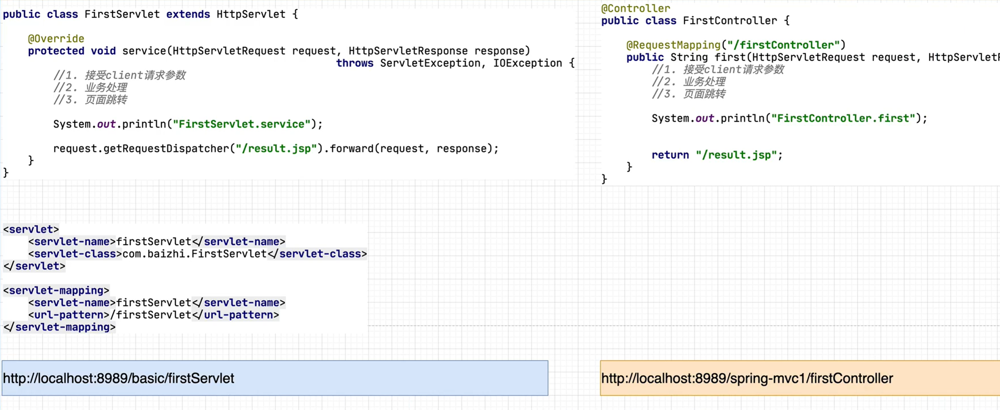
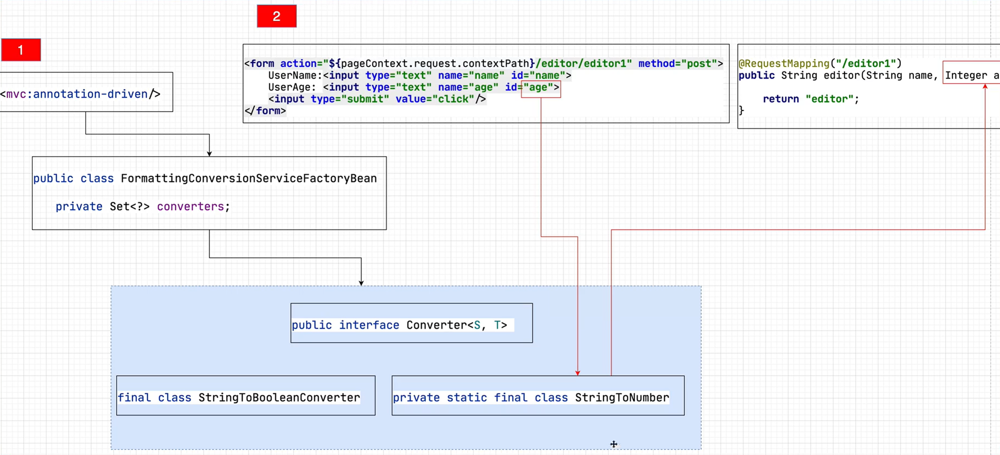

## 什么是Spring MVC

```markdown
概念： SpringMVC是基于Sprnig Framework衍生而来的一个框架。主要解决了原有MVC框架中，控制器Controller的问题。
```

### SpringMVC是一个MVC框架

```markdown
1. MVC是一个架构思想，在J2EE开发中多用于Web开发
2. 应用MVC架构开发应用，会把一个项目划分为三个层次,M(Model)模型层，V(View)视图层，C(Controller)控制层
	View          JSP
	Model         Service + Dao
	Controller    Servlet
3. MVC这种分层开发，体现了面向对象各思其职的思想，也更加有利于后续的项目维护。
```

### 为什么要基于Spring框架

- 通过工厂（容器）创建对象。解耦合（IOC DI)

- 通过AOP的方式，为目标类（原始类）增加额外功能。

- 方便与第三方框架集成。

  

### 原有MVC开发控制器存在的问题

- 原有控制器的实现技术

  - Servlet(基于Java Model2模式)
  - Struts中的Action

- Servlet实现控制器存在的问题

  - 控制器的核心作用

    ```markdown
    1. 接受用户的请求，调用业务功能（Service),并根据处理结果控制程序的运行流程。
    ```

    

  - 控制器的核心代码

    ```markdown
    1. 接收Client的请求参数
    2. 调用业务对象（Service)
    3. 跳转流程（页面跳转）
    ```

    

  - 控制器存在的问题

    - 接受client请求参数

      ```markdown
      1. 代码冗余
      2. 只能接受字符串类型的数据，需要手工进行类型转换
      3. 无法自动封装对象
      ```

      

    - 调用业务对象（service)

      ```markd
      UserService userService = new UserServiceImpl(); // 耦合
      boolean isLogin = userService.login(name,password);
      ```

    - 流程跳转（页面跳转）

      ```markdown
      1. 跳转路径的耦合
      2. 与视图层技术的耦合
      ```

      

      

## SpringMVC的学习要点

### SpringMVC的三种开发模式

- 传统视图开发

  ```markdown
  1. 通过作用域(request,session)进行数据的传递
  2. 通过视图技术进行数据的展示(JSL,FreeMaker,Thymeleaf)
  ```

- 前后端分离的开发

  ```markdown
  1. 多种新的请求发送方式
  2. Restful的访问
  3. 通过HttpMessageConverter进行数据响应
  ```

- Spring5 WebFlux开发

  ```markdown
  1. 替换传统JavaWeb开发的一种新的Web开发方式
  2. 通过NettyServer,进行web通信
  ```

### 控制器开发

```markdown
1. 接受Client请求参数
2. 调用业务对象
3. 流程跳转
```

## 第一个SpringMVC的开发

### 开发版本

```markdown
JDK 1.8 +
Maven 3.6+
IDEA2021+
SpringFramework 5.1.4
Tomcat 8.5.29
MySql 5.7.18
```

### 环境搭建

- 引入Spring Jar包

  ```xml
  <dependencies>
      <dependency>
          <groupId>org.springframework</groupId>
          <artifactId>spring-webmvc</artifactId>
          <version>5.1.14.RELEASE</version>
      </dependency>
  
      <dependency>
          <groupId>javax.servlet</groupId>
          <artifactId>javax.servlet-api</artifactId>
          <version>3.1.0</version>
      </dependency>
  
      <dependency>
          <groupId>javax.servlet</groupId>
          <artifactId>jstl</artifactId>
          <version>1.2</version>
      </dependency>
  
      <dependency>
          <groupId>javax.servlet.jsp</groupId>
          <artifactId>javax.servlet.jsp-api</artifactId>
          <version>2.3.1</version>
          <scope>provided</scope>
      </dependency>
  
      <dependency>
          <groupId>org.springframework</groupId>
          <artifactId>spring-web</artifactId>
          <version>5.1.14.RELEASE</version>
      </dependency>
  
      <dependency>
          <groupId>org.springframework</groupId>
          <artifactId>spring-core</artifactId>
          <version>5.1.14.RELEASE</version>
      </dependency>
  
      <dependency>
          <groupId>org.springframework</groupId>
          <artifactId>spring-beans</artifactId>
          <version>5.1.14.RELEASE</version>
      </dependency>
  
      <dependency>
          <groupId>org.springframework</groupId>
          <artifactId>spring-test</artifactId>
          <version>5.1.14.RELEASE</version>
      </dependency>
  
      <dependency>
          <groupId>org.springframework</groupId>
          <artifactId>spring-tx</artifactId>
          <version>5.1.14.RELEASE</version>
      </dependency>
  
      <dependency>
          <groupId>org.springframework</groupId>
          <artifactId>spring-jdbc</artifactId>
          <version>5.1.14.RELEASE</version>
      </dependency>
  
      <dependency>
          <groupId>org.mybatis</groupId>
          <artifactId>mybatis-spring</artifactId>
          <version>2.0.6</version>
      </dependency>
  
      <dependency>
          <groupId>com.alibaba</groupId>
          <artifactId>druid</artifactId>
          <version>1.2.8</version>
      </dependency>
  
      <dependency>
          <groupId>mysql</groupId>
          <artifactId>mysql-connector-java</artifactId>
          <version>8.0.25</version>
      </dependency>
  
      <dependency>
          <groupId>org.mybatis</groupId>
          <artifactId>mybatis</artifactId>
          <version>3.5.7</version>
      </dependency>
  
      <dependency>
          <groupId>junit</groupId>
          <artifactId>junit</artifactId>
          <version>4.13</version>
          <scope>test</scope>
      </dependency>
  
      <dependency>
          <groupId>org.springframework</groupId>
          <artifactId>spring-context</artifactId>
          <version>5.1.14.RELEASE</version>
      </dependency>
  
      <dependency>
          <groupId>org.springframework</groupId>
          <artifactId>spring-aop</artifactId>
          <version>5.1.14.RELEASE</version>
      </dependency>
  
      <dependency>
          <groupId>org.aspectj</groupId>
          <artifactId>aspectjrt</artifactId>
          <version>1.8.8</version>
      </dependency>
  
      <dependency>
          <groupId>org.aspectj</groupId>
          <artifactId>aspectjweaver</artifactId>
          <version>1.8.3</version>
      </dependency>
  
      <dependency>
          <groupId>org.slf4j</groupId>
          <artifactId>slf4j-api</artifactId>
          <version>1.7.25</version>
      </dependency>
  
      <dependency>
          <groupId>org.slf4j</groupId>
          <artifactId>jcl-over-slf4j</artifactId>
          <version>1.7.25</version>
      </dependency>
  
      <dependency>
          <groupId>ch.qos.logback</groupId>
          <artifactId>logback-classic</artifactId>
          <version>1.2.3</version>
      </dependency>
  
      <dependency>
          <groupId>ch.qos.logback</groupId>
          <artifactId>logback-core</artifactId>
          <version>1.2.3</version>
      </dependency>
  
      <dependency>
          <groupId>org.logback-extensions</groupId>
          <artifactId>logback-ext-spring</artifactId>
          <version>0.1.4</version>
      </dependency>
  
      <dependency>
          <groupId>org.yaml</groupId>
          <artifactId>snakeyaml</artifactId>
          <version>1.25</version>
      </dependency>
  
  </dependencies>
  ```

### 配置文件

```markdown
SpringMVC配置文件就是Spring配置文件

1. 名字可以随意命名。最好取名为dispatcher.xml
2. 放置路径可以根据需要随意放置，最好放在资源文件夹的根目录下
```

### 初始化配置

```xml
web.xml
-------------------------------------------------------------------------------------
<servlet>
    <!--Spring Dispatcher Servlet-->
    <servlet-name>dispatcherServlet</servlet-name>
    <servlet-class>org.springframework.web.servlet.DispatcherServlet</servlet-class>
    <!--Spring MVC Config File Location-->
    <init-param>
        <param-name>contextConfigLocation</param-name>
        <param-value>classpath:dispatcher.xml</param-value>
    </init-param>
    <!--Servlet will be created once tomcat start up-->
    <load-on-startup>1</load-on-startup>
</servlet>

<servlet-mapping>
    <servlet-name>dispatcherServlet</servlet-name>
    <url-pattern>/</url-pattern>
</servlet-mapping>

dispatcher.xml
-------------------------------------------------------------------------------------
<?xml version="1.0" encoding="UTF-8"?>
<beans xmlns="http://www.springframework.org/schema/beans"
       xmlns:xsi="http://www.w3.org/2001/XMLSchema-instance"
       xmlns:context="http://www.springframework.org/schema/context"
       xmlns:mvc="http://www.springframework.org/schema/mvc"
       xsi:schemaLocation="http://www.springframework.org/schema/beans http://www.springframework.org/schema/beans/spring-beans.xsd http://www.springframework.org/schema/context https://www.springframework.org/schema/context/spring-context.xsd http://www.springframework.org/schema/mvc https://www.springframework.org/schema/mvc/spring-mvc.xsd">

    <!-- component scan path-->
    <context:component-scan base-package="org.peter"/>
    
    <!-- spring mvc core function-->
    <!-- http://www.springframework.org/schema/mvc-->
    <mvc:annotation-driven/>
</beans>
```

**DispatcherServlet**

```markdown
1. DispatcherServlet被称为前端控制器（中央控制器）
2. DispatcherServlet核心作用: 
	1.用于创建Spring工厂（容器）  ApplicationContext ctx = new ClassPathXMLApplicationContext("dispatcher.xml")
	  因为DispatcherServelt封装的Spring工厂（容器）只能去取xml文件，所以无法迁移到纯注解编程。	
	2.控制SpringMVC内部的运行流程
```

**SpringMVC的配置文件dispatcher.xml**

```markdown
 <mvc:annotation-driven/> 引入SpringMVC的核心功能
 主要引入2个核心类型：
 1. RequestMappingHandlerMapping  实现了HandlerMapping接口
 	它会处理@RequestMapping注解，并将其注册到请求映射表中
 2. RequestMappingHandlerAdapter
 	它是处理请求的适配器，确定调用某个符合要求的控制器类中具体服务的方法
```

**SpringMVC对mvc:annotation-driven的封装**


**context:component-scan**

```markdown
1. 用于进行注解扫描
2. DispatcherServlet所创建的工厂需要读取XML文件，不能用纯注解开发。所以目前使用Spring配置文件+基础注解的形式，进行开发。
	基础注解：@Component,@Service,@Repository,@Controller,@Scope,@Transactional等
	高级注解：@Configuration,@Bean,@ComponentScan等	
	后续SpringMVC高级版课程中，会使用纯注解开发。与SpringBoot使用方式高度一致。
```

### 编码分析

#### 思路分析



```markdown
# 基本流程
1. 开发一个类在上面加上@Controller注解
2. 提供一个控制器方法，参数是HttpServletRequest,HttpServletResponse,返回值是String的，同时加入@RequestMapping注解定义请求路径。
3. 在控制方法中，完成核心开发功能，把对应的JSP页面路径，作为方法的返回值返回。
```

#### 编码

```java
@Controller
public class FirstController {
    @RequestMapping("/result")
    public String result(HttpServletRequest request, HttpServletResponse response){
        System.out.println("FirstController.result");
        return "/result.jsp";
    }
}

注意：要开启注解扫描 <context:component-scan base-package="org.peter"/>
```

#### 一个控制器中提供多个服务方法

- Servlet作为控制器，一个类中只能提供一个服务方法

  ```markdown
  1. 在Servlet开发中，明确控制器的方法必须实现接口规定的service接口。 service(HttpServletRequest request,HttpServletResponse response)。一个类中只能实现一次。
  ```

- SpringMVC的控制器，一个类中可以提供多个服务方法

  ```markdown
  1. SpringMVC控制器，对于方法名没有明确规定。
  ```

#### 注意

SpringMVC开发的控制器Controller,也称之为Handler(Spring内部叫法)

#### 细节分析

##### 一种类型的Controller被创建了几次

```markdown
回顾：Servlet控制器被创建的次数
1. 一种类型的Servlet,Tomcat只会创建一次，所以Servlet是单实例的。
2. Servlet是单实例，并不是单例模式
3. SpringMVC控制器被Spring创建的次数
	可以创建一次，也可以创建多次，默认只创建一次。
	控制器创建的次数，是由@Scope控制的
4. 默认情况下，SpringMVC控制器只会被创建一次。可能存在线程安全问题。	

```

##### @RequestMapping注解

```markdown
1. 核心作用： 为控制器方法提供外部访问URL路径

  @RequestMapping("/result")
  public String result(HttpServletRequest request, HttpServletResponse response)
```

- 路径分隔符，开头的 / 是可以省略的

  @RequestMapping("result")

- 在一个控制器方法上，指定多个访问路径

  ```java
  @Controller
  public class FirstController {
  
      @RequestMapping({"/result","first"})  // 指定多个路径
      public String result(HttpServletRequest request, HttpServletResponse response){
          System.out.println("FirstController.result");
          return "/result.jsp";
      }
  }
  
  ```

- Controller类上加上@RequestMapping注解

  ```java
  http://localhost:8989/basic/user/result
  
  @Controller
  @RequestMapping("user")    // 多加一层目录
  public class FirstController {
  
      @RequestMapping({"/result","first"})
      public String result(HttpServletRequest request, HttpServletResponse response){
          System.out.println("FirstController.result");
          return "/result.jsp";
      }
  }
  
  
  ```

- @RequestMapping限定请求方式

  - 请求方式

    Web开发中POST请求和GET请求的区别。

    1. 两种请求提交数据的区别

       ```markdown
       1. GET请求，通过请求行（地址栏）提交数据(QueryString),明文提交数据，不安全。提交数据量小（不超过2048字节)
       	http://localhost:8989/basic/user/queryUser?name=peter&password=12345
       2. POST请求，通过请求体提交数据，密文提交（不是加密，指一般用户不可见），相对安全，提交数据量大。（理论上没有限制）	
       
       ```

    2. 两种请求发起方式的不同

       

  - @RequestMapping限定请求方式

    

  - 限定其他请求方式

    

##### 控制器方法参数

SpringMVC在控制器方法参数设计中，非常灵活，可以支持多种参数的设置方式，非常强大。这种设计方式，也叫数据绑定。


##### 视图解析器（页面跳转）

- 目前页面跳转存在的问题

  ```markdown
  1. 控制器中的页面跳转路径，与实际视图路径存在耦合。
  ```

  思路分析

  

  开发步骤

  ```java
  定义视图解析器
  ------------------------------------------------------------------------------------------------------  
  <!-- view resolver-->
  <bean id="viewResolver" class="org.springframework.web.servlet.view.InternalResourceViewResolver">
     <property name="prefix" value="/jsp/"/>   
     <property name="suffix" value=".jsp"/>
  </bean>
  
  
  Controller中返回result
  视图解析器会解析为/jsp/result.jsp
  ------------------------------------------------------------------------------------------------------    
  @Controller
  @RequestMapping("user")
  public class FirstController {
  
      @RequestMapping({"/result","first"})
      public String result(HttpServletRequest request, HttpServletResponse response){
          System.out.println("FirstController.result");
          return "result";
      }
  }
  
  ```

  注解开发

  ```java
  @Configuration
  public class AppConfig {
  
      @Bean
      public InternalResourceViewResolver viewResolver(){
          InternalResourceViewResolver viewResolver = new InternalResourceViewResolver();
          viewResolver.setPrefix("/jsp/");
          viewResolver.setSuffix(".jsp");
          return viewResolver;
      }
  }
  
  注意： 
      1. AppConfig配置bean应该放置在<context:component-scan/>扫描的容器下
      2. 目前因为DispatcherServlet封装的Spring工厂只能读取xml,所以无法进行纯注解替换
      
  ```

SpringMVC配置文件的默认设置


## SpringMVC控制器开发详解

### 核心要点

```markdown
1. 接受客户端请求
2. 调用业务对象
3. 页面跳转
```

### 控制器接受Client请求参数详解

- 回顾：如何在Web开发中接受请求参数

  

#### 基于Servlet API 接受Client请求参数

```java
String name = request.getParameter("name");
String password = request.getParameter("password");

@Controller
@RequestMapping("/param")
public class ParamController{
    
    @RequestMapping("/param1")
    public String param1(HttpServletRequest request,HttpServletReponse response){
        String name = request.getParameter("name");
        String password = request.getParameter("password");
        return "param1";
    }
    
}

注意：这种方式虽然最为直观，简单。但是代码冗余且与Servlet API存在耦合。所以在Spring MVC开发中不建议使用。
```

#### 基于简单变量接受Client请求参数

简单变量：指的就是8中基本类型+String这些类型的变量

**思路分析**


**代码**

```java
// 访问url http://localhost:8989/basic/param/param1?name=peter&password=123456
// name 和 password 对应 param1方法中的 name 和 password 参数接受

@Controller
@RequestMapping("/param")
public class ParamController {

    @RequestMapping("/param1")
    public String param1(String name,String password){
        System.out.println("ParamController.param1");
        System.out.println("name = " + name);
        System.out.println("password = " + password);
        return "result";
    }
}
```

**细节分析**

- 常见类型自动转换 ： 8种基本类型及其包装器 + String. 

- Date日期等特殊类型，默认不支持。需要程序员自定义类型转换器。

- 基本类型尽量使用包装器

  ```java
  // 访问URL: http://localhost:8989/basic/param/param1?name=peter&age=12
  // HTTP协议传递的是 name="peter"  age="12"
  // SpringMVC底层对于age接收会自动调用 int age = Integer.parseInt("10")
  
  @Controller
  @RequestMapping("/param")
  public class ParamController {
  
      @RequestMapping("/param1")
      public String param1(String name,int age){ // 自动 转换类型
          System.out.println("ParamController.param1");
          System.out.println("name = " + name);
          System.out.println("age = " + age);
          return "result";
      }
  }
  
  
  // 此时，如果用户发起请求
  // http://localhost:8989/basic/param/param1?name=peter
  // 因为 age = null, 而controller 用 int 无法接收 null. 将报错
  Root Cause
  java.lang.IllegalStateException: Optional int parameter 'age' is present but cannot be translated into a null value due to being declared as a primitive type. Consider declaring it as object wrapper for the corresponding primitive type.
  
  // 解决方法，使用包装器Integer接收null.
  // 或者为age提供默认值，这需要配合@RequestMapping来使用
      
      @RequestMapping("/param1")
      public String param1(String name,Integer age){  // 用包装器类型接收null
          System.out.println("ParamController.param1");
          System.out.println("name = " + name);
          System.out.println("age = " + age);         // age = null
          return "result";
  	}
  ```


#### 基于POJO类型接收Client请求参数

- 什么是POJO

  ```markdown
  1. POJO: Plain Ordinary Java Object(简单Java对象)
  2. POJO特点:
  	1. 类型中存在成员变量，必须提供set get 方法
  	2. 提供默认的无参构造
  	3. 可以实现Serializable,也可以不实现
  	4. 不实现容器或者框架所规定的接口
  3. 用户根据业务封装的实体，DTO这些类型就是POJO	
  ```

- 使用场景

  

- 代码

  ```java
  // POJO
  public class User implements Serializable {
      private String username;
      private String password;
      private Integer age;
  }
  
  // Controller
  @RequestMapping("/user")
      public String user(User user){ // pojo
          System.out.println("user = " + user);
          return "result";
  }
  
  // form 提交表单
      <form method="post" action="${pageContext.request.contextPath}/param/user">
          username:<input type="text" name="username"/>
          password:<input type="password" name="password"/>
          age:<input type="text" name="age"/>
          <input type="submit" value="test">
      </form>
              
  // url直接传参
   http://localhost:8989/basic/param/user?username=hahah&password=123&age=100
  
  注意：POJO的成员变量名字要和请求参数的key或者表单name属性名严格对应
  ```

  **注意1：**

  ```java
  url请求： http://localhost:8989/basic/param/user?username=haha&password=123&age=100
  username形参和user对象中的属性username都会接收到对应的value = haha
  这个特点会在前后端分离中使用
  
  @RequestMapping("/user")
  public String user(String username,User user){
      System.out.println("username = " + username);
      System.out.println("user = " + user);
      return "result";
  }
  ```

  **注意2：**

  ```markdown
  1. 如果SpringMVC发现控制器形参类型，是8种基本类型+String，他会通过形参名与请求参数的key对应，接受数据
  2. 如果SpringMVC发现控制器形参类型，不是8种基本类型+String，他会查找对应形参类型的属性名与请求参数的key对应，接收数据
  3. 如果存在类型自定义转换器不适用于上述规律
  ```

#### 接收一组简单变量的请求参数

- 使用场景

  

- 代码

  ```java
  // 用于接收ids的一组value   
  @RequestMapping("/checkbox")
  public String user(int[] ids){  // 基础类型的数组 按基础类型查找 形参名与请求参数的key匹配
      for (int id : ids) {
          System.out.println("id = " + id);
      }
      return "result";
  }
  
  // 表单提交
  <form method="post" action="${pageContext.request.contextPath}/param/checkbox">
          <input type="checkbox" name="ids" value="1"/> 1 <br/>
          <input type="checkbox" name="ids" value="2"/> 2 <br/>
          <input type="checkbox" name="ids" value="3"/> 3 <br/>
          <input type="checkbox" name="ids" value="4"/> 4 <br/>
          <input type="checkbox" name="ids" value="5"/> 5 <br/>
          <input type="checkbox" name="ids" value="6"/> 6 <br/>
          <input type="submit" value="submit">
   </form>
      
  // url请求
  http://localhost:8989/basic/param/checkbox?ids=1&ids=7&ids=8    
  ```

- 细节分析

  ```java
  @RequestMapping("/checkbox")
  public String user(List<Integer> ids){
      for (Integer id : ids) {
          System.out.println("id = " + id);
      }
      return "result";
  }
  抛出异常：SpringMVC无法提供具体的实现类，实例化形参
      
  @RequestMapping("/checkbox")
  public String user(ArrayList<Integer> ids){
      for (Integer id : ids) {
          System.out.println("id = " + id);
      }
      return "result";
  }
  没有异常，但是接收不到数据。SpringMVC会按照POJO的匹配方式，进行成员变量查找
  ```

#### 接收一组POJO类型对象的请求参数

- 使用场景

  List,ArrayList都不行。道理同上。

  使用自定义的UsersDTO.

  

- 代码

  ```java
  // form 表单
  <form method="post" action="${pageContext.request.contextPath}/param/users">
          username1:<input type="text" name="users[0].username"/><br/>
          password1:<input type="password" name="users[0].password"/><br/>
          age1:<input type="text" name="users[0].age"/><br/>
          <hr/>
          username2:<input type="text" name="users[1].username"/><br/>
          password2:<input type="password" name="users[1].password"/><br/>
          age2:<input type="text" name="users[1].age"/><br/>
          <input type="submit" value="submit"/>
  </form>
              
  // controller
  @RequestMapping("/users")
  public String user(UsersDTO users){  // 这里用 Users[] 数组接收也不行。不是基本数据类型，会报错
                                       // No primary or default constructor found for class 	             										[Lorg.peter.pojo.User;
     List<User> userList = users.getUsers();
     for (User user : userList) {
         System.out.println("user.toString() = " + user.toString());
     }
     return "result";
  }
  
  // DTO
  public class UsersDTO {
      private List<User> users;
  
      public List<User> getUsers() {
          return users;
      }
  
      public void setUsers(List<User> users) {
          this.users = users;
      }
  }
  ```

#### 总结


### @RequestParam注解

```markdown
@RequestParam注解：用于修饰控制器方法的形参
	@RequestMapping("/param")
	public String param1(@RequestParam String name,@RequestParam String password){
	
	}
```

#### @RequestParam注解详解

##### 解决请求参数和方法形参名字不一致的问题

```java
// @RequestMapping用于匹配请求参数和方法形参名不一致的问题
// 请求参数 n -> 方法参数名 name    @RequestParam("n")
Request URL: http://localhost:8989/basic/param/requestParam?n=hanjun&p=21345
Form:
    <form method="post" action="${pageContext.request.contextPath}/param/requestParam">
        <input type="text" name="n"/><br/>
        <input type="password" name="p"><br/>
        <input type="submit" value="submit"/>
    </form>
</body>

        
Controller
-------------------------------------------------------------------------------------------------
@RequestMapping("/requestParam")
public String requestParam(@RequestParam("n") String name,@RequestParam("p") String password){
    System.out.println("name = " + name);
    System.out.println("password = " + password);
    return "result";
}        
        
```

**注意**


##### @RequestParam的required属性

```markdown
1. 在使用@RequestParam注解时，可以应用required属性
	required = true @RequestParam修饰的控制器方法参数，客户端必须提交数据，否则报错。默认值。
	required = false @RequestParam修饰的控制器方法参数，客户端可以提交数据，也可以不提交。
2. 解决使用@RequestParam时，客户端必须提交数据的问题
```

```java
@RequestMapping("/requestParam")
public String requestParam(@RequestParam("n") String name,@RequestParam(value = "p",required = false) String password){
    System.out.println("name = " + name);
    System.out.println("password = " + password);
    return "result";
}
```

##### @RequestParam的defaultValue属性

- 客户端没有提交数据时，给对应的形参提供默认值

  ```java
  // 请求 URL: http://localhost:8989/basic/param/requestParam?n=hanhan
  @RequestMapping("/requestParam")
  public String requestParam(@RequestParam("n") String name,@RequestParam(value = "p",defaultValue = "99999") String password){
      System.out.println("name = " + name);
      System.out.println("password = " + password);
      return "result";
  }
  
  注意: 如果设置了defaultValue属性，则required属性也默认被设置成false
  ```

- 解决控制器方法形参，使用包装器的问题

  ```java
      @RequestMapping("/param1")
      public String param1(String name,@RequestParam(defaultValue = "20") int age){
          System.out.println("ParamController.param1");
          System.out.println("name = " + name);
          System.out.println("age = " + age);
          return "result";
      }
  ```

- defaultValue的典型使用场景

  

## 中文请求参数的乱码问题

### 回顾JavaWeb开发中中文乱码的解决方案

- GET请求乱码的解决方案

  

- POST请求乱码的解决方案

  

### SpringMVC解决中文乱码

```markdown
1. GET请求的中文乱码
	UTF-8字符集，Tomcat8已经内部处理，无需处理。GBK字符集或者Tomcat8以前的版本，需要设置server.xml
2. POST请求的中文乱码，SpringMVC提供了过滤器解决。
	org.springframework.web.filter.CharacterEncodingFilter

	在web.xml中配置CharacterEncodingFilter
    <filter>
        <filter-name>encodingFilter</filter-name>
        <filter-class>org.springframework.web.filter.CharacterEncodingFilter</filter-class>
        <init-param>
        <param-name>encoding</param-name>
        <param-value>UTF-8</param-value>
        </init-param>
    </filter>
    <filter-mapping>
        <filter-name>encodingFilter</filter-name>
        <url-pattern>/*</url-pattern>
    </filter-mapping>
```

## SpringMVC的类型转换器

### SpringMVC中的内置类型转换器

- 分析

  

- 内置类型转换器的概念

  ```markdown
  1. SpringMVC提供了内置类型转换器，把客户端提交的字符串类型的请求参数，转换成控制器方法参数需要的数据类型。
  2. SpringMVC并不是对于所有类型，都提供了内置的类型转换器，只是提供了常见类型的转换器。
  	比如：8种基本类型+常见的集合类型
  ```

- 原理分析

  

  在SpringMVC启动时，<mvc:annotaion-driven/>把FormattingConversionServiceFactoryBean.引入到SpringMVC体系中。FormattingConversionServiceFactoryBean中存储了SpringMVC中所有的内置类型转换器。client发起请求时，如果对应的控制器方法形参不是String,那么FortmattingConversionServiceeFactoryBean就会调用对应的类型转换器，进行类型转换。最终完成控制器形参的赋值。

### SpringMVC中的自定义类型转换器

```markdown
1. SpringMVC在接收客户端提交请求时，如果对应控制器方法的形参是非常规数据类型，SpringMVC默认情况下无法进行转换，会抛出异常。可以通过类型自定义转换器解决。
	如 日期类型
```

- 思路分析

  

- 编码

  ```java
  // String --> java.util.Date
  // 1. 定义 converter
  public class DateConverter implements Converter<String, Date> {
      @Override
      public Date convert(String s) {
          Date date = null;
          SimpleDateFormat sdf = new SimpleDateFormat("yyyy-MM-dd");
          try {
              date = sdf.parse(s);
          } catch (ParseException e) {
              e.printStackTrace();
          }
          return date;
      }
  }
  
  // 2. 配置 FormattingConversionServiceFactoryBean
  // 这个bean工厂会创建一个 DefaultFormattingConversionService
  // 在 property 中设置 自定义Converter
  <!-- FormattingConversionServiceFactoryBean-->
  <bean id="conversionService" 		class="org.springframework.format.support.FormattingConversionServiceFactoryBean">
          <property name="converters">
              <set>
                  <bean id="dateConverter" class="org.peter.converter.DateConverter"/>
                  <bean id="stringToIntegerConverter" class="org.peter.converter.StringToIntegerConverter"/>
              </set>
          </property>
  </bean>
                      
  // 3. 应用 自定义conversion service
  <!-- apply customize conversion service-->
  <mvc:auto-driven conversion-service="conversionService"/>    
  //原理：
  // 1. 在spring-mvc.jar中找到META-INF/spring.handlers,定义了 mvc 标签的处理类  MvcNamespaceHandler
  http\://www.springframework.org/schema/mvc=org.springframework.web.servlet.config.MvcNamespaceHandler    
  
  // 2. 在 MvcNamespaceHandler 中由 AnnotationDrivenBeanDefinitionParser 来处理 annotation-driven 标签
  public class MvcNamespaceHandler extends NamespaceHandlerSupport {
      public MvcNamespaceHandler() {
      }
  
      public void init() {
          this.registerBeanDefinitionParser("annotation-driven", new AnnotationDrivenBeanDefinitionParser());
      }
  }
  
  // 3. 在 AnnotationDrivenBeanDefinitionParser中,
  // 会先查找 conversion-service 属性是否设置了自定义的conversion service
  class AnnotationDrivenBeanDefinitionParser implements BeanDefinitionParser {
      // getConversionService 会先查找是否设置了 conversion service
      private RuntimeBeanReference getConversionService(Element element, @Nullable Object source, ParserContext context) {
          RuntimeBeanReference conversionServiceRef;
          // 如果设置了 conversion-service 属性。则用自定义的conversion service
          if (element.hasAttribute("conversion-service")) {
              conversionServiceRef = new RuntimeBeanReference(element.getAttribute("conversion-service"));
          }
          else {
              RootBeanDefinition conversionDef = new RootBeanDefinition(FormattingConversionServiceFactoryBean.class);
              conversionDef.setSource(source);
              conversionDef.setRole(BeanDefinition.ROLE_INFRASTRUCTURE);
              String conversionName = context.getReaderContext().registerWithGeneratedName(conversionDef);
              context.registerComponent(new BeanComponentDefinition(conversionDef, conversionName));
              conversionServiceRef = new RuntimeBeanReference(conversionName);
          }
          return conversionServiceRef;
      }
  }
  ```

## 接收其他请求参数

### 动态参数收集

- 单值动态参数收集

  ```java
  // URL: http://localhost:8989/basic/param/map?username=peter&age=12&password=123456
  // Map<String,String> 接收为 key-value pairs
  
  @RequestMapping("map")
  public String requestMap(@RequestParam Map<String,String> params){ // 用map接收动态参数，必须加 @RequestParam
      for (String key : params.keySet()) {
          System.out.println("key = " + key + ",value = " + params.get(key));
      }
      return "result";
  }
  
  output:
  key = username,value = peter
  key = age,value = 12
  key = password,value = 123456
  ```

- 多值动态参数收集

  ```java
  // URL: http://localhost:8989/basic/param/multimap?name=peter&age=12&name=maomao&age=15
  // MulitiValuedMap<String,String>  接收为 key - value pairs   这里value为一个List<String>
  // key - List<String>
  
  @RequestMapping("multimap")
  public String requestMultiMap(@RequestParam MultiValueMap<String,String> map){  // @RequestParam
      for (String key : map.keySet()) {
          System.out.println("key = " + key);
          map.get(key).forEach(System.out::println); // key 对应的values是一个List<String>
      }
      return "result";
  }
  
  output:
  key = name
  peter
  maomao
  key = age
  12
  15
  ```

- 典型的应用场景

  

### 接收cookie数据

- Servlet中获取的方式

  ```java
  # Cookie创建的代码
  Cookie cookie = new Cookie("name","value");
  
  # 核心代码
  Cookie[] cookies = request.getCookies();
  for(Cookie cookie : cookies){
      if("cookieName".equals(cookie.getName())){
          Syetem.out.println("cookie.getValue() = " + cookie.getValue());
      }
  }
  ```

- SpringMVC中获取方式

  ```java
  // 第一种方式：基于servlet,不推荐
  @RequestMapping("/cookie1")
  public String requestCookie1(HttpServletRequest request){
      Cookie[] cookies = request.getCookies();
      for(Cookie cookie : cookies){
          if("name".equals(cookie.getName())){
              System.out.println("cookie.getName() = " + cookie.getName());
          }
      }
      return "result";
  }
  
  // 第二种方式：基于@CookieValue
  @RequestMapping("/cookie2")
  public String requestCookie2(@CookieValue("name") String value){
      System.out.println("value = " + value);
      return "result";
  }
  ```

### 接收请求头数据

- 什么是请求头

  ```markdown
  1. HTTP协议规定：客户端浏览器在发起请求时，除了提交数据外，还会通过请求头向服务器端提供一些额外信息。
  	比如语言信息，浏览器的版本，客户端操作系统类型，是否缓存数据等。
  2. 在后续开发中，特殊场景下，甚至会自定义请求头携带一些特殊数据。
  ```

- 获取请求头的方式

  - servlet中的获取方式

    ```java
    # 核心代码
    String value = request.getHeader("key");
    ```

  - SpringMVC中的获取方式

    ```java
    @RequestMapping("/head")
    public String requestHeader(@RequestHeader String host){
        System.out.println("host = " + host);
        return "result";
    }
    ```

  

## SpringMVC控制器开发详解二

### SpringMVC控制器调用业务对象（SSM整合）

#### 核心思路分析


#### 存在的问题


```markdown
1. 把MVC层的对象（Controller,<mvc:annotation-driven/>,视图解析器），与非MVC层的（连接池，DAO Service事务）都配置在dispatcher.xml中，最终交给DispatcherServlet创建工厂的实例化，存在耦合问题。后续一旦替换MVC的实现，代码会受到影响，不利于维护。
```

**解决思路**


```markdown
1. 把目前单一的工厂进行父子工厂的拆分
	1. 子工厂（容器）DispatcherServlet,读取dispatcher.xml
		完成SpringMVC相关对象的创建，视图解析，自定义类型转换器，静态资源排除，拦截器，视图控制等
	2. 父工厂（容器）ContextLoaderListener,读取applicationContext.xml
    	完成非SpringMVC相关对象的创建，连接池，DAO,Service,事务,MQ,ES,Redis等
2. 工厂在需要获取对象进行操作时，首先获取子工厂中所创建的对象，如果没有，继续获得父工厂所创建的对象
```

**父子容器的问题**

```markdown
按照现有的父子容器的开发，Service层没有添加事务	
```

**原因：子容器对包含有service的包也进行了扫描，创建了没有事务的service对象**


**解决方案**

```markdown
1. 子容器：只扫描控制器及与MVC相关的内容
	<context:component-scan base-package="org.peter.controller"/>
2. 父容器：不扫描控制器及与MVC相关的内容
	<context:component-scan base-package="com.peter">
		<context:exclude-filter type="aspectj" expression="org.peter.controller.*"/>
	</context:component-scan>
3. 注意：在Springboot中，不会出现父子容器的问题
```

#### 编码总结

- web.xml

  ```markdown
  <!--父容器-->
  <listener>
  	<listener-class>org.springframework.web.context.ContextLoaderListener</listener-class>
  </listener>
  
  <context-param>
      <param-name>contextConfigLocation</param-name>
      <param-value>classpath:/applicationContext.xml</param-value>
  </context-param>
    
  <!--子容器-->
  <servlet>
      <servlet-name>dispatcherServlet</servlet-name>
      <servlet-class>org.springframework.web.servlet.DispatcherServlet</servlet-class>
      <init-param>
        <param-name>contextConfigLocation</param-name>
        <param-value>classpath:/dispatcher.xml</param-value>
      </init-param>
  </servlet>
  
  <servlet-mapping>
      <servlet-name>dispatcherServlet</servlet-name>
      <url-pattern>/</url-pattern>
  </servlet-mapping>
  ```

- 父容器配置（与SpringMVC无关）- applicationContext.xml

  ```xml
  <?xml version="1.0" encoding="UTF-8"?>
  <beans xmlns="http://www.springframework.org/schema/beans"
         xmlns:xsi="http://www.w3.org/2001/XMLSchema-instance"
         xmlns:context="http://www.springframework.org/schema/context" xmlns:tx="http://www.springframework.org/schema/tx"
         xsi:schemaLocation="http://www.springframework.org/schema/beans http://www.springframework.org/schema/beans/spring-beans.xsd http://www.springframework.org/schema/context https://www.springframework.org/schema/context/spring-context.xsd http://www.springframework.org/schema/tx http://www.springframework.org/schema/tx/spring-tx.xsd">
  
      <!-- define component not related to Spring MVC-->
      <context:component-scan base-package="org.peter">
          <context:exclude-filter type="aspectj" expression="org.peter.controller.*"/>
      </context:component-scan>
  
      <!--data source-->
      <bean id="dataSource" class="com.alibaba.druid.pool.DruidDataSource">
          <property name="driverClassName" value="com.mysql.cj.jdbc.Driver"/>
          <property name="url" value="jdbc:mysql://localhost:3306/peters?useSSL=false"/>
          <property name="username" value="root"/>
          <property name="password" value="Peter006"/>
      </bean>
  
      <!--my batis-->
      <bean id="sessionFactory" class="org.mybatis.spring.SqlSessionFactoryBean">
          <property name="dataSource" ref="dataSource"/>
          <property name="typeAliasesPackage" value="org.peter.entity"/>
          <property name="mapperLocations">
              <list>
                  <value>classpath:org.peter.mapper/*Mapper.xml</value>
              </list>
          </property>
      </bean>
  
      <bean id="scanner" class="org.mybatis.spring.mapper.MapperScannerConfigurer">
          <property name="sqlSessionFactoryBeanName" value="sessionFactory"/>
          <property name="basePackage" value="org.peter.dao"/>
      </bean>
  
      <!-- enable transaction-->
      <bean id="transactionManager" class="org.springframework.jdbc.datasource.DataSourceTransactionManager">
          <property name="dataSource" ref="dataSource"/>
      </bean>
  
      <tx:annotation-driven transaction-manager="transactionManager"/>
  
  </beans>
  ```

- 子容器配置 - dispatcher.xml

  ```xml
  <?xml version="1.0" encoding="UTF-8"?>
  <beans xmlns="http://www.springframework.org/schema/beans"
         xmlns:xsi="http://www.w3.org/2001/XMLSchema-instance" xmlns:mvc="http://www.alibaba.com/schema/stat"
         xmlns:context="http://www.springframework.org/schema/context"
         xsi:schemaLocation="http://www.springframework.org/schema/beans http://www.springframework.org/schema/beans/spring-beans.xsd http://www.alibaba.com/schema/stat http://www.alibaba.com/schema/stat.xsd http://www.springframework.org/schema/context https://www.springframework.org/schema/context/spring-context.xsd">
  
      <!-- Spring MVC Related Config-->
      <context:component-scan base-package="org.peter.controller"/>
  
      <!-- enable spring mvc-->
      <mvc:annotation-driven/>
  
      <bean id="resolver" class="org.springframework.web.servlet.view.InternalResourceViewResolver">
          <property name="prefix" value="/jsp/"/>
          <property name="suffix" value=".jsp"/>
      </bean>
  
  </beans>
  ```

- Dao的开发

  ```java
  Entity:
  public class User implements Serializable {
      private int id;
      private String name;
      private String password;
  }
  
  Dao:
  public interface UserDao {
      public void save(User user);
  }
  
  UserMapper.xml:
  <?xml version="1.0" encoding="UTF-8" ?>
  <!DOCTYPE mapper
          PUBLIC "-//mybatis.org//DTD Mapper 3.0//EN"
          "http://mybatis.org/dtd/mybatis-3-mapper.dtd">
  
  <mapper namespace="org.peter.dao.UserDao">
      <insert id="save" useGeneratedKeys="true">
          insert into t_user (name,password) values (#{name},#{password})
      </insert>
  </mapper>
  ```

- Service开发

  ```java
  public interface UserService {
      public void register(User user);
  }
  
  @Service
  @Transactional
  public class UserServiceImpl implements UserService{
  
      @Autowired
      private UserDao userDao;
  
      @Override
      public void register(User user) {
          userDao.save(user);
      }
  }
  ```

- Controller开发

  ```java
  @Controller
  @RequestMapping("/user")
  public class UserController {
  
      @Autowired
      UserService userService;
  
      @RequestMapping("/register")
      public String register(User user){
          userService.register(user);
          return "regOK";
      }
  }
  ```

- JSP的开发

  ```jsp
  <%@ page contentType="text/html;charset=UTF-8" language="java" %>
  <html>
  <head>
      <title>Register</title>
  </head>
  <body>
      <form method="post" action="${pageContext.request.contextPath}/user/register">
          Name: <input type="text" name="name"/><br/>
          Password:<input type="text" name="password"/></br>
          <input type="submit" name="submit"/>
      </form>
  </body>
  </html>
  ```

  

