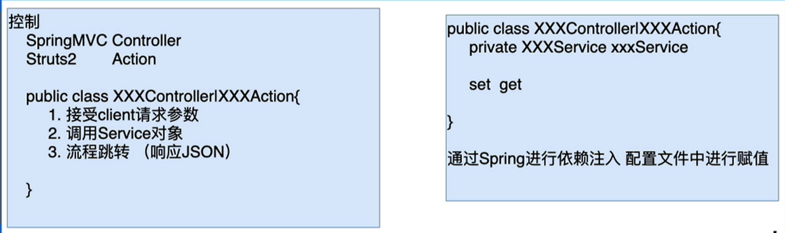
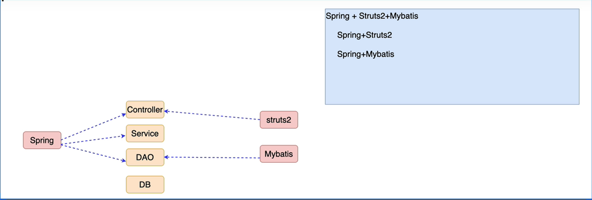

## 为什么要整合MVC框架

```markdown
1.MVC框架提供了控制器（Controller）调用Service
	DAO->Service->Controller
2.MVC框架提供了请求响应处理
3.MVC框架接收请求参数
4.MVC框架可以控制程序的运行流程
5.MVC框架可以完成视图解析(JSP,JSON,Freemarker,Thyemeleaf)
```

## Spring可以整合哪些MVC框架

```markdown
struts1
webwork
jsf
struts2
springMVC
```

## Spring整合MVC框架的核心思路

1. 准备工厂

   ```markdown
   1.Web开发中如何创建工厂
   ApplicationContext context = new ClassPathXmlApplicationContext("/applicationContext.xml")
                                new WebXmlApplicationContext()
   2.如何保证工厂唯一共用
   被共用： web request|session|ServletContext(application)
   		工厂存储在ServeletContext作用域中
   		ServletContext.setAttribute("xxx",ctx)
   唯一： ServletContext对象 创建的同时 -> new WebXmlApplicationContext()
   	ServletContextListener监听器中 -> ApplicationContext ctx = new WebXmlApplicationContext()
   	ServletContextListener 在ServeltContext对象创建的同时，被调用（只会被调用一次），把工厂创建的代码，写在		   ServletContextListener中，也就保证只调用一次。最终工厂就保证了唯一性。	
   
   3.总结
   	ServletContextListener(唯一)
   	ApplicationContext context = new WebXmlApplicationContext()
   	ServletContext.setAttribute("xxx",ctx) 共用
   
   4.Spring封装了一个ContextLoaderListener
   	1.创建工厂
   	2.把工厂保存在ServletContext中
   	
   ContextLoaderListener使用方式
   web.xml
   <listener>
   	<listener-class>org.springframework.web.context.ContextLoaderListener</listener-class>
   </listener>
   
   <context-param>
   	<param-name>contextConfigLocation</param-name>
   	<param-value>classpath:applicationContext.xml</param-value>
   </context-param>
   ```

   

2. 代码整合

   把service对象注入给控制器对象

   

   

## Spring多配置文件的处理

- 通配符方式

  ```markdown
  1.非web环境
  	ApplicatonContext ctx = new ClassPathXmlApplicationContext("/applicationContext-*.xml");
  2.web环境	
  	<context-param>
  		<param-name>contextConfigLocation</param-name>
  		<param-value>classpath:applicationContext-*.xml</param-value>
  	</context-param>
  ```

- <import>标签

  ```markdown
  applicationContext.xml 目的，整合其他配置内容
  	<import resource="applicationContext-dao.xml"/>
  	<import resource="applicationContext-service.xml"/>
  	<import resource="applicationContext-action.xml"/>
  ```

  

