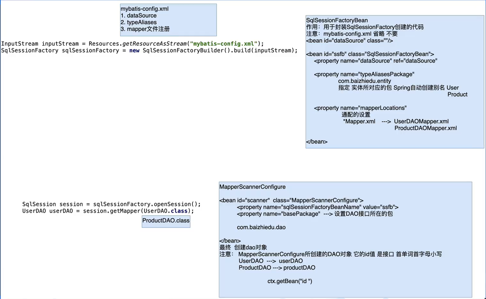
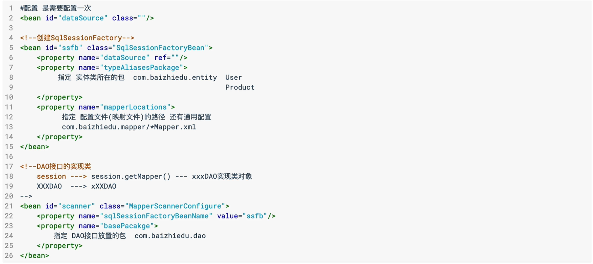
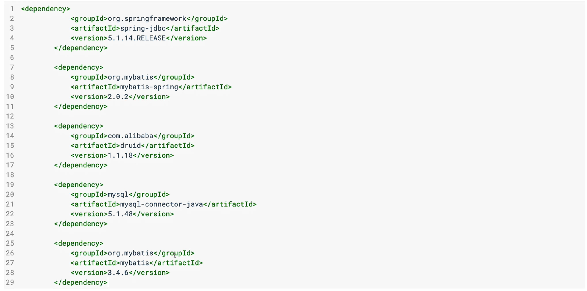
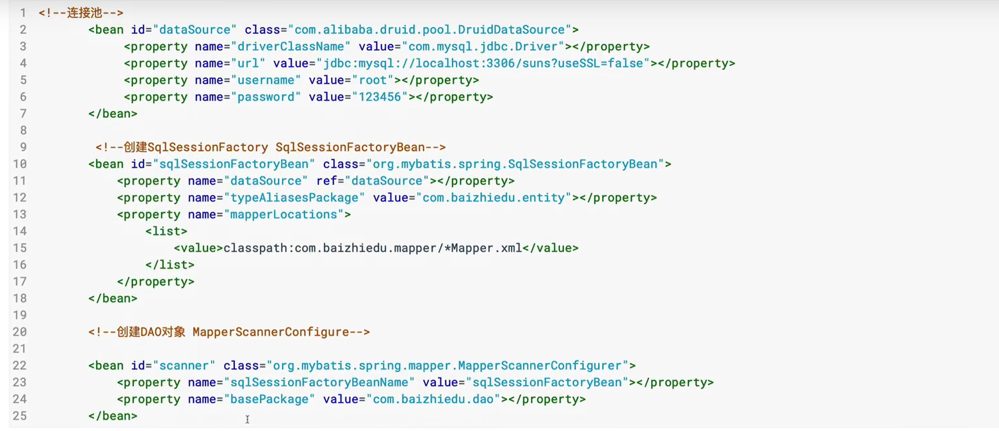
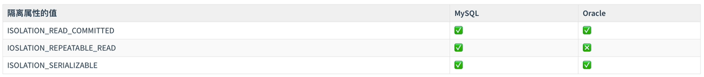
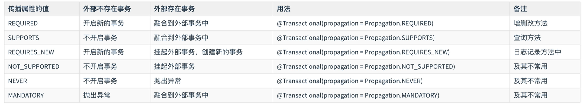
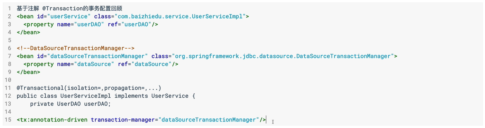
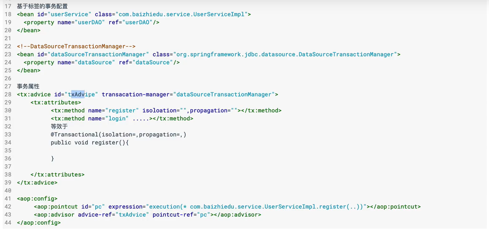
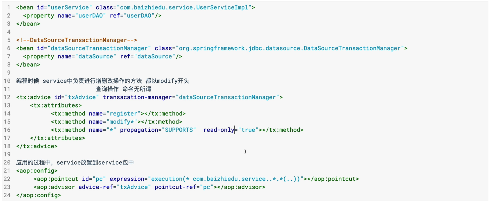

## Spring整合MyBatis的思路



## Spring与MyBatis的开发步骤

- 配置文件ApplicationContext.xml进行配置

  

- 编码

  ```markdown
  开发步骤:
  1.实体
  2.实体别名  		Spring整合
  3.表
  4.创建DAO接口  
  5.实现Mapper文件
  6.注册Mapper文件  	 Spring整合
  5.MyBatis API调用    Spring整合
  ```

## Spring与MyBatis的编码整合

- 搭建开发环境（jar)

  

- Spring配置文件的配置

  

- 编码

  ```java
  1. 编写 Entity -> User
      
  2. 编写 Dao -> UserDao  
      public interface UserDao {
      	public void save(User user);
  	}
  
  3. 配置 Mapper -> UserMapper.xml (放在Resource下的com.peter.mapper文件夹下)
      <mapper namespace="com.peter.dao.UserDao">
           <insert id="save" parameterType="User">
               insert into t_user (name,password) values (#{name},#{password})
           </insert>
  	</mapper>
      
   4. 测试类
      @Test
      public void testUserDao_Save(){
          ApplicationContext context = new ClassPathXmlApplicationContext("/applicationContext.xml");
          User user = new User();
          user.setName("Peter");
          user.setPassword("123456");
          UserDao userDao = context.getBean("userDao", UserDao.class);
          userDao.save(user);
      }
  ```

  

## Spring与MyBatis整合细节

- 问题：Spring与MyBatis整合后，为什么DAO不提交事务，但是数据能够插入数据库中

  ```java
  Connection --> tx
  本质上，控制连接对象（Connection) --> 连接池（Datasource)
      1. MyBatis提供的连接池对象 -> 创建 Connection
           Connnection.setAutoCommit(false)  手工控制事务，操作完成后，手工提交
      2. Druid作为连接池（C3P0,DBCP) -> 创建 Connection
      	 Connection.setAutoCommit(true)    true默认值，保持自动控制事务，一条sql自动提交
      
  答案： Spring与MyBatis整合时，引入外部连接池对象。保持自动提交事务机制，不需要进行手工操作，自动提交事务。
  注意： 在未来实战中，还是会手动控制事务。后续通过Spring事务控制解决这个问题。
  ```

  

## Spring事务

### 事务的特点

> **ACID**，是指[数据库管理系统](https://baike.baidu.com/item/数据库管理系统)（[DBMS](https://baike.baidu.com/item/DBMS)）在写入或更新资料的过程中，为保证[事务](https://baike.baidu.com/item/事务)（transaction）是正确可靠的，所必须具备的四个特性：
>
> [原子性](https://baike.baidu.com/item/原子性)（atomicity，或称不可分割性）
>
> [一致性](https://baike.baidu.com/item/一致性)（consistency）
>
> [隔离性](https://baike.baidu.com/item/隔离性)（isolation，又称独立性）
>
> [持久性](https://baike.baidu.com/item/持久性)（durability）

### 控制事务

```java
JDBC:
	Connection.setAutoCommit(false);
	Connection.commit();
	Connection.rollback();

MyBatis:
	MyBatis自动开启事务
    sqlsession.commit();
    sqlsession.rollback();
结论：控制事务的底层都是Connection对象完成
```

### Spring控制事务的开发

```markdown
Spring是通过AOP完成事务开发的
```

1. 原始对象

   ```java
   public class XXXServiceImpl{
       1. 原始对象 -> 原始方法 -> 核心功能
       2. DAO作为service的成员变量，依赖注入进行赋值    
   }
   ```

   

2. 额外功能

   ```java
   org.springframework.jdbc.datasource.DataSourceTransactionManager封装了额外功能
   注入 DataSource (获得连接)
       
   1.MethodInterceptor
   public Object invoke(MethodInvocation invocation){
       try{
           Connection.setAutoCommit(false);
           Object ret = invocation.proceed();
           Connection.commit(); 
       }catch(Execption e){
           Connection.rollback();
       }
       return ret;
   }  
   
   2.@Aspect
     @Around  
   ```

   

3. 切入点

   ```java
   @Tranactional
   事务的额外功能加入给哪些业务方法
       
       1.类上： 作用于类上的所有方法
       2.方法上：作用于该方法上
   ```

   

4. 组装切面

   ```java
   1.切入点
   2.额外功能
     
   <tx:annotation-driven transaction-manager=""/>
   ```

Spring控制事务的编码

1. 搭建环境

   ```xml
    <dependency>
        <groupId>org.springframework</groupId>
        <artifactId>spring-tx</artifactId>
        <version>5.2.15.RELEASE</version>
    </dependency>
   ```

2. 编码

   ```xml
   1.编写原始对象service
   @Transactional
   public class UserServiceImpl implements UserService{
       
       private UserDao userDao;
   
       public void register(User user) {
           userDao.save(user);
       }
   	// get set for user dao
   }
   
   2.配置xml
   <!--service class-->
   <bean id="userService" class="com.peter.service.UserServiceImpl">
       <property name="userDao" ref="userDao"/>
   </bean>
   
   <!--tx manager-->
   <bean id="txManager" class="org.springframework.jdbc.datasource.DataSourceTransactionManager">
       <property name="dataSource" ref="dataSource"/>
   </bean>
   
   <!--scan transactional class,method-->
   <tx:annotation-driven transaction-manager="txManager"/>
   
   3.测试
   @Test
   public void testUserService_register(){
           ApplicationContext context = new ClassPathXmlApplicationContext("/applicationContext.xml");
           UserService userService = context.getBean("userService", UserService.class);
           User user = new User();
           user.setName("HanMaoMao");
           user.setPassword("888888");
           userService.register(user);
   }
   ```

   - 细节

     ```markdown
      <tx:annotation-driven transaction-manager="txManager" proxy-target-class="true"/>
      	proxy-target-class 默认 false 使用 jdk 动态代理
      	                        true  使用 CGLib 代理
     ```

   ## 

### Spring中的事务属性(Transaction Attribute)

```markdown
事务的属性：
1.隔离属性
2.传播属性
3.只读属性
4.超时属性
5.异常属性
```

#### 如何添加事务属性

```markdown
@Transactional(isolation=,propagation=,readOnly=,timeout=,rollbackFor=,noRollbackFor=)
```

#### 属性详解

##### 隔离属性(ISOLATION)

```markdown
他描述了事务解决并发的问题的特征
	并发： 多个事务（用户）在同一时间，访问操作相同数据
	并发的问题： 
		脏读
		不可重复读
		幻读
	如何解决：通过隔离属性来解决。通过设置不同的隔离属性，来解决并发处理中的问题。
	
```

- 脏读：一个事务读取了另一个事务中未提交的数据。
  **解决方案** @Transactional(isolation=Isolation.READ_COMMITTED)

- 不可重复读：一个事务中，多次读取相同的数据。但是读取的结果不一样。会在本事务中，产生数据不一致问题。
  **注意**：  1. 不是脏读   2. 在一个数据中
  **解决方案** @Transactional(isolation=Isolation.REPEATABLE_READ) 

  本质： 一把行锁
        

- 幻读：一个事务中，多次对整表进行统计，但是结果不一样，会在本事务中产生数据不一致的问题。

  **解决方案** @Transactional(isolation=Isolation.SERIALIZABLE)

  本质：表锁

  

- 总结

  ```markdown
  并发安全： SERIALIZABLE > REPEATABLE_READ > READ_COMMITTED
  运行效率： READ_COMMITTED > REPEATABLE_READ > SERIALIZABLE
  ```

###### 数据库对隔离属性的支持



```markdown
Oracle如何解决不可重复读？
采用的是多版本比对的方式，解决不可重复读
```

###### 数据库默认的隔离属性

ISOLATION_DEFAULT：会调用不同数据库所设置的默认隔离属性

- MySQL : 	REPEATABLE_READ
- Oracle:       READ_COMMITTED

###### 查看数据库默认属性

```sql
-- mysql 8 --
select @@transaction_isolation;

-- mysql 5--
select @@tx_isolation;
```

###### 隔离属性在实战中的建议

```markdown
推荐使用数据库默认属性 ISOLATION_DEFAULT
1.MySQL repeatable_read
2.Oracle read_committed

未来的实战中，并发发生的情况很低
如果真的遇到困难，乐观锁
	Hibernate(JPA)  version
	MyBatis         通过拦截器自定义开发
```

##### 传播属性(PROPAGATION)

传播属性的概念

```markdown
概念：解决事务之间的嵌套问题
什么叫事务嵌套：指的是一个大事务中，包含了若干个小事务
问题：大事物中融入了很多小事务，彼此影响。最终导致外面的大事务，丧失了大事务的原子性。
```



默认的传播属性：PROPAGATION_REQUIRED

推荐使用：

- 增删改   默认值
- 查询      指定为PROPAGATION_SUPPORTS

##### 只读属性(READONLY)

```markdown
针对于只进行查询操作的业务方法，可以加入只读属性，提供运行效率
默认值：false
```

##### 超时属性(TIMEOUT)

```markdown
指定了事务的最长等待时间
1. 为什么事务要进行等待
   当事务访问数据时，有可能被访问的数据被别的事务进行加锁处理。需要等待。
2. 等待时间以秒为单位
3. 如何应用 @Transactional(timeout=2)
4. 超时属性的默认值 -1 （使用数据库默认值）
   最终由对应的数据库来指定
```

##### 异常属性

```markdown
Spring在事务异常处理中
默认 对应RuntimeException及其子类，采用的是回滚的策略
默认 对于Exception及其子类，采用的是提交的策略

rollbackFor = {java.lang.Exception.class,xxx}   回滚
noRollbackFor = {java.lang.RuntimeException.class,xxx} 不回滚

建议： 在实战中，使用默认值。应用RuntimeException及其子类进行回滚。
```

##### 事务属性常见配置总结

```markdown
1.隔离属性 默认值
2.传播属性 Required(默认值)  增删改   Support 查询操作
3.只读属性 readOnly false(默认值)    true 查询操作
4.超时属性 默认值 -1
5.异常属性 默认值

增删改操作 @Transactional
查询操作  @Transational(propagation=Propagation.SUPPORTS,readOnly=true)
```

## 基于标签的事务配置方式





- 基于标签的事务配置在实战中的应用方式

  
