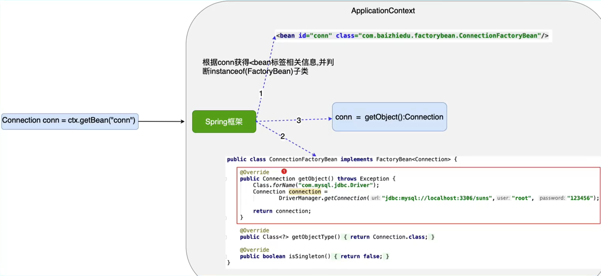

## 引言 

### EJB存在的问题

EJB(Enterprise Java Bean)

- 运行环境苛刻

- 代码移植性差

  总结：EJB是一个重量级的框架

  

### 什么是Spring

```markdown
Spring是一个轻量级的J2EE解决方案，整合众多优秀的设计模式
```

- 轻量级

```markdown
  1. 对于运行环境没有额外要求。
  2. 代码移植性高
```

- J2EE的解决方案


- 整合设计模式

```markdown
工厂
代理
模板
策略
```

## 第一个Spring程序

### Spring的核心API

- `ApplicationContext`

  ```markd
  作用：Spring提供的这个ApplcationContext这个工厂，用于创建对象
  好处：解耦
  ```

  - `ApplicationContext`是接口类型

    ```markdown
    接口：屏蔽实现的差异
    非web环境：  ClassPathXmlApplcationContext (main,junit)
    web环境：	 XmlWebApplcationContext
    ```

    

  - `ApplicationContext`的继承图

    

  - 继承接口的主要作用
  
    - `EnvironmentCapable ` :  Interface indicating a component that contains and exposes an Environment reference.
       	`Environment getEnvironment(); `

    - `ResourcePatternResolver` :  Strategy interface for resolving a location pattern into Resource objects.

       	`Resource[] getResources(String locationPattern) throws IOException;`

    - `ApplicationEventPublisher` :  Interface that encapsulates event publication functionality.

      ​	`void publishEvent(Object event);`

    - `MessageSource` : Strategy interface for resolving messages, with support for the parameterization and internationalization of such messages.

      ​	`String getMessage(String code, @Nullable Object[] args, @Nullable String defaultMessage, Locale locale);`

    - `ListableBeanFactory`: Extension of the BeanFactory interface to be implemented by bean factories that can enumerate all their bean instances, rather than attempting bean lookup by name one by one as requested by clients.

      ​	`boolean containsBeanDefinition(String beanName);`

      ​	`int getBeanDefinitionCount();`

      ​    `String[]  getBeanDefinitionNames();`

      ​	`<T> ObjectProvider<T> getBeanProvider(Class<T> requiredType, boolean allowEagerInit);`

      ​	`String[] getBeanNamesForType(ResolvableType type);`

      ​    `<T> Map<String, T> getBeansOfType(@Nullable Class<T> type) throws BeansException;`

      ​    `String[] getBeanNamesForAnnotation(Class<? extends Annotation> annotationType);`

      ​    `Map<String, Object> getBeansWithAnnotation(Class<? extends Annotation> annotationType) throws BeansException; `
  
         `<A extends Annotation> A findAnnotationOnBean(String beanName, Class<A> annotationType)
            throws NoSuchBeanDefinitionException;`
  
    - `HierarchicalBeanFactory`: Sub-interface implemented by bean factories that can be part of a hierarchy.
      
      ​	`BeanFactory getParentBeanFactory();`

      ​    `boolean containsLocalBean(String name);`
      
    


## Spring与日志框架的整合

- Spring如何整合日志

  Spring1,2,3早期都是整合	commons-logging.jar

  Spring5.x默认整合的是logback,log4j2

> Spring Boot 能够使用Logback, Log4J2 , java util logging 作为日志记录工具。Spring Boot 默认使用Logback作为日志记录工具。日志默认输出到控制台但也能输出到文件中。我们通过spring-boot-starter-logging 加入Logback依赖，其实只要我们加入任意的Spring Boot starter 都会默认引入spring-boot-starter-logging，因此 我们不需要分开加入他们。
>
> [Spring Boot Logging 配置 - 简书](https://www.jianshu.com/p/1fa12b92d5c4)
>
> 

## 注入（Injection)

- 什么是注入

  通过Spring工厂及配置文件，为所创建的成员变量赋值。

  通过编码的方式，为成员变量进行赋值，存在耦合。

- 如何进行注入	

  为类成员变量提供get,set方法

  配置Spring的配置文件

- 注入的好处：解耦合

- 注入的方式：

  ​	set 注入 

  ​	构造器注入

> **Constructor-based or setter-based DI?**
>
> Since you can mix constructor-based and setter-based DI, it is a good rule of thumb to use constructors for mandatory dependencies and setter methods or configuration methods for optional dependencies. Note that use of the [@Required](https://docs.spring.io/spring-framework/docs/5.2.9.RELEASE/spring-framework-reference/core.html#beans-required-annotation) annotation on a setter method can be used to make the property be a required dependency; however, constructor injection with programmatic validation of arguments is preferable.
>
> The Spring team generally advocates constructor injection, as it lets you implement application components as immutable objects and ensures that required dependencies are not `null`. Furthermore, constructor-injected components are always returned to the client (calling) code in a fully initialized state. As a side note, a large number of constructor arguments is a bad code smell, implying that the class likely has too many responsibilities and should be refactored to better address proper separation of concerns.
>
> Setter injection should primarily only be used for optional dependencies that can be assigned reasonable default values within the class. Otherwise, not-null checks must be performed everywhere the code uses the dependency. One benefit of setter injection is that setter methods make objects of that class amenable to reconfiguration or re-injection later. Management through [JMX MBeans](https://docs.spring.io/spring-framework/docs/5.2.9.RELEASE/spring-framework-reference/integration.html#jmx) is therefore a compelling use case for setter injection.
>
> Use the DI style that makes the most sense for a particular class. Sometimes, when dealing with third-party classes for which you do not have the source, the choice is made for you. For example, if a third-party class does not expose any setter methods, then constructor injection may be the only available form of DI.


## 反转控制与依赖注入

1. 反转控制(IOC Inverse Of Control)

   ```markdo
   控制： 对于成员变量赋值的控制
   反转控制： 把对于成员变量的赋值权，从代码中转移到Spring工厂和配置文件中完成
   	好处：解耦合
   底层实现：工厂设计模式
   ```

2. 依赖注入(Dependency Injection)

   ```markd
   注入： 通过Spring的工厂和配置文件，为对象（bean)的成员变量赋值。
   依赖注入： 当一个类需要另一个类时，就意味着依赖。一旦出现依赖，就可以把另一个类作为本类的一个成员变量，最终通过Spring配置文件进行注入（赋值）
   	好处： 解耦合
   ```

   

## Spring工厂创建复杂对象


创建复杂对象的三种方式：

### FactoryBean接口

1. 实现FactoryBean接口

   

2. Spring配置文件的配置

   

3. 细节

   - 如果想获得FactoryBean类型的对象 ctx.getBean("&conn")	获得的就是ConnectionFactoryBean对象

   - isSingleton()方法

     返回true,只会创建一个对象

     返回false,每次都创建新的对象

     

     **FactoryBean工作原理**

     1. 创建 FactoryBean对象
     2. Spring通过instanceOf判断是FactoryBean接口的实现类
     3. 调用FactoryBean.getObject()方法返回创建的bean 

     

### 实例工厂

```markdown
避免Spring框架的侵入
整合遗留系统
```

1. 配置文件

   

### 静态工厂

1. 配置文件

   getConnection()方法是一个静态方法，不需要StaticConnectionFactory实例

   
   
   ### 总结
   
   


## 控制Spring工厂创建对象的次数

### 控制简单对象的创建次数

```xml
<bean id = "account" scope="singleton|prototype" class="xxx.Account"/>
singleton: 只创建一个（默认）
prototype: 每次调用都创建一个
```

### 控制复杂对象的创建次数

```java
FactoryBean{
    isSingleton(){
        return true;//只创建一次
        return false;//每次调用创建一个
    }
}
如果没有isSingleton()方法（实例工厂，静态工厂），用scope来设定
```

### 为什么要控制对象创建次数

- 节省不必要的内存浪费

- 什么样的对象只创建一次？

  ```java
  能被共用的，无状态，线程安全的对象
  SqlSessionFactory
  Dao
  Service
  ```

- 什么样的对象每一次都要创建新的？

  ```java
  不能被共用，线程不安全的
  Connection
  SqlSession|Session
  Struts2 Action
  ```

## 对象的生命周期

指的的是一个对象的创建，存活，消亡的一个完整过程。


### 生命周期的三个阶段

#### 创建阶段

- scope = "singleton"  

  Spring工厂创建的同时，对象创建

  **注意：** lazy-init = "true" 只会在对象获取的时候创建 

- scope = 'prototype'

  获取对象的时候，创建对象

#### 初始化阶段

Spring工厂在创建对象完成之后，Spring调用对象的初始化方法，完成初始化操作。

1. 初始化方法提供：程序员根据需求，提供初始化方法，完成初始化工作
2. 初始化方法调用：Spring工厂调用

实现初始化方法：

- InitializingBean接口

  ```java
  //程序员根据需求，完成初始化操作
  @Override
  public void afterPropertiesSet()
  ```

- 对象中提供一个普通的方法

  ```java
  public void myInit(){
      
  }
  //在xml配置中定义init-method
  <bean id = "product" class="xxx.Product" init-method="myInit"/>
  ```

- 细节分析

  1. 如果一个对象既实现了InitializingBean接口，又提供了init-method方法。

     两个初始化都会被调用，**先调用InitializingBean接口，在调用init-method方法**

  2. 如果对象有属性注入。会先进行注入，再调用初始化方法。

     **注入一定发生在初始化之前**。

  3. 什么叫初始化操作

     ```markdown
     资源的初始化： 数据库 IO 网络。。。
     ```

#### 销毁阶段

Spring销毁对象前，会调用对象的销毁方法，完成销毁操作

1. Spring什么时候销毁对象?

   ctx.close();

2. 销毁方法：程序员根据自己的需求，定义销毁方法。

3. Spring工厂完成调用

实现销毁方法：

- DisposableBean接口

  ```java
  @Override
  public void destroy() throws Exception{
      // 释放资源
  }
  ```

- 对象中提供一个普通方法

  ```java
  public void myDestroy throws Exception(){
      // my destroy
  }
  <bean id="product" class="xxx.Product" destroy-method="myDestroy"/>
  ```

- 细节分析

  1. **销毁方法只适用于scope="singleton"**

     注意： prototype的对象将交给jvm来回收

  2. **接口的销毁操作先执行，自定义销毁方法后执行**

  3. 销毁操作主要指的是一些资源的释放

     ```java
     io.close()
     connection.close()    
     ```


## 配置文件参数化

开发步骤：

- 提供一个小的配置文件（.properties)

  

- Spring的配置文件与小配置文件进行整合

  

- 在Spring配置文件中，用过${key}获取小配置文件的值

  

## 自定义类型转换器

1. 类型转换器

   作用：Spring通过类型转换器把配置文件中的字符串类型的数据，转换成了对象中成员变量对应类型的数据，进而完成注入。

   

2. 自定义类型转换器

   产生的原因：当Spring没有提供特定的类型转换器，我们需要自己定义类型转换器。

   开发步骤：

   - 实现 Converter<S,T> 接口

     

   - 在Spring配置文件中进行配置 

     MyDateConverter对象创建出来

     ```xml
     <bean id="myDateConverter" class="xxx.MyDateConverter"/>
     ```

     类型转换器的注册

     

     **注意：**

     ConversionServiceFactoryBean的 id 必须是conversionService

     Spring框架内置的类型转换器的日期格式是 yyyy/MM/dd   不支持(yyyy-MM-dd)

## 后置处理Bean

BeanPostProcessor作用： 对Spring工厂创建的对象，进行再加工。

**注意：**BeanPostProcessor是一个接口


程序员实现接口方法

```java
Object postProcessBeforeInitialization(Object bean,String beanName)
作用：Spring创建完对象，并进行注入后，可以运行before方法进行加工
获得Spring创建好的对象：通过方法的参数
最终通过返回值交给Spring框架    
    
Object postProcessAfterInitialization(Object bean,String beanName)    
作用：Spring执行对象的初始化操作之后，可以运行after方法进行加工
获得Spring创建好的对象：通过方法的参数
最终通过返回值交给Spring框架  
    
实战中：
    很少处理Spring的初始化操作。没有必要区分before,after。只需要实现其中一个after方法即可。
```

开发步骤：

1. 实现BeanPostProcessor接口

   

2. Spring的配置文件中进行配置

   ```xml
   <bean id = "myBeanProcessor" class="xxx.MyBeanPostProcessor"/>
   ```

3. BeanPostProcessor细节

   - BeanPostProcessor会对Spring工厂**所有创建的对象**进行加工。

## AOP编程

### 静态代理设计模式

1. 为什么需要代理模式

   ```java
   在J2EE分层开发中，哪个层次对我们最重要
       DAO->Service->Controller
   service层处理业务逻辑，最重要。包括：
       核心功能 + 额外功能（日志，性能，事务）
       
   ```

2. 代理设计模式

   通过代理类为原始类（目标类）增加额外功能。利于原始类的维护。

3. 代理开发的核心要素

   - 目标类
   - 额外功能
   - 于目标类相同的接口

4. 编码

   

5. 静态代理存在的问题：

   - 静态类文件数量过多，不利于项目管理
   - 额外功能维护性差

### Spring动态代理开发

动态代理的概念：通过代理类为原始类增加额外功能。利于原始类的维护。

搭建开发环境：


Spring动态代理的开发步骤：

1. 创建原始对象

   

2. 提供额外功能

   MethodBeforeAdvice接口

   ```java
   额外功能写在接口实现中，在原始方法运行之前运行额外功能。
   ```

   

3. 定义切入点

   额外功能加入的位置

   目的：由程序员根据具体需要，定义额外功能加给哪些原始方法

   ```java
   简单的测试：所有的方法都加入额外功能
   在xml配置中配置切入点
   ```

   

4. 组装(2,3整合)

   所有的方法都加入before的额外功能

   

5. 调用

   

细节分析：

1. Spring创建的动态代理类在哪里？

   ```markdown
   Spring框架在运行时，通过动态字节码技术，在jvm创建的，运行在jvm内部，等程序结束后。会和jvm一起消失。
   什么叫动态字节码技术：通过第三方动态字节码框架，在jvm中创建对应类的动态字节码，进而创建对象。当虚拟机结束时，动态字节码跟着消失。
   ```

   


### Spring动态代理详解

#### 额外功能详解

##### MethodBeforeAdvice分析


##### MethodInterceptor(方法拦截器)

注意: MethodIntercepior额外功能可以执行在原始方法 前，后，前后


也可用来处理异常


MethodInterceptor可以影响原始方法的返回值


#### 切入点（pointcut)详解

```xml
切入点决定了额外功能加入的位置（方法）
<aop:pointcut id="pc" expression="execution(* *(..))"/>

execution(* *(..)) -> 匹配了所有方法
1. execution() 切入点函数
* *(..) 切入点表达式
```

##### 切入点表达式


1. 方法切入点表达式

   ```markdown
   * *(..) --> 所有方法
   * --> 修饰符 返回值
   * --> 方法名
   () --> 参数表
   .. --> 任意参数
   
   # 定义login方法作为切入点
   * login(..)
   
   # 定义login方法，并且方法有两个string类型的参数作为切入点
   * login(String,String)
   
   # 注意：不是java lang下的类型，参数类型需要写全限定名
   * login(xxx.User)
   
   # 第一个参数是String,后面的参数是什么为所谓
   * login(String,..)
   ```

   精准方法切入点限定

   ```markdown
   修饰符 返回值        包.类.方法(参数)
   	*				com.peter.UserServiceImpl.login(..)
   	*				com.peter.UserServiceImpl.login(String,String)
   ```

2. 类切入点表达式

   ```markdown
   修饰符 返回值        包.类.方法(参数)
   	*				com.peter.UserServiceImpl.*(..)    # com.peter.UserServiceImpl 中的所有方法
   	*				*..UserServiceImpl.*(..)           # 所有包中UserServiceImpl 中的所有方法
   	                                                      * 一层包， *.. 所有层包
   ```

3. 包切入点表达式

   ```markdown
   修饰符 返回值        包.类.方法(参数)
   	*				com.peter.*.*(..)    	# com.peter 包中的所有类的所有方法,不包括com.peter的子包
   	*				com.peter..*.*(..)      # com.peter 包中的所有类的所有方法,并且包括com.peter的所有子包
   ```

##### 切入点函数

1. execution

   ```markdown
   用于执行切入点函数，功能最全。
   执行 方法切入点表达式，类切入点表达式，包切入点表达式
   
   弊端： execution书写麻烦
   注意： 其他切入点函数只是对于exection的简化
   ```

2. args

   ```markdown
   作用：主要用于函数（方法）的参数匹配
   切入点：方法必须是两个字符串类型的参数
   execution(* *(String,String))
   args(String,String)
   ```

3. within

   ```markdown
   作用：主要作用于类，包切入表达式的匹配
   切入点： UserServiceImpl这个类
   execution(* *..UserServiceImpl.*(..))
   within(*..UserServiceImpl)
   
   切入点： com.peter 包及其子包
   execution(* com.peter..*.*(..))
   within(com.peter..*)
   ```

4. @annotation

   ```markdown
   作用： 为标注有特殊注解的方法进行匹配
   下面将会为标注为@Log的方法加入额外功能
   
   <bean id="round" class="com.peter.proxy.MyMethodInterceptor"/>
   <aop:config>
   	<aop:pointcut id="pc" expression="@annotation(com.peter.annotation.Log)"/>
   	<aop:advisor advice-ref="round" pointcut-ref="pc"/>
   </aop:config>
   ```

5. 切入点函数的逻辑运算

   ```markdown
   整合多个切入点函数一起配合工作，进而完成复杂工作
   and 操作
   # login 同时 参数是两个字符串
   1. execution(* login(String,String))
   2. execution(* login(..)) and args(String,String)
   
   # 注意：与操作不能用于同种类型的切入点函数
   execution and execution   # 不可以，逻辑上矛盾
   
   or 操作
   # login 和 register方法
   execution(* login(..)) or execution(* register(..))
   ```

   


