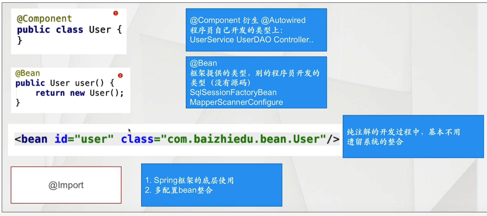
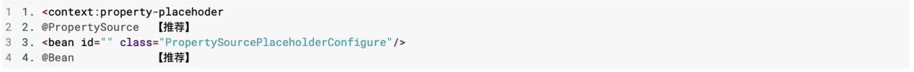

## 注解基础概念

指的是在特定类和方法上加上注解，完成特定功能的开发。

1. 注解开发非常方便 代码简洁

2. Spring开发的潮流

   ​	Spring 2.x 引入注解

   ​    Spring 3.x 完善注解

   ​    SpringBoot 推广普及

### 注解的作用

1.替换xml这种配置形式，简化配置


2.替换接口，实现调用双方的契约性

```markdown
通过注解的方式，在功能调用者和提供者之间达成约定，进而进行功能的调用。因为注解更为灵活方便，所以更推荐。
```


### 注解的发展历史

```markdown
Spring2.x 开始支持注解 @Component @service @Scope... 作为xml开发的补充
Spring3.x @Configuration @Bean  彻底替换xml
Spring4.x SpringBoot 提倡使用注解
```

### Spring注解开发的一个问题

```markdown
Spring使用注解配置后，是否还能解耦合？
在Spring框架应用注解时，如果对注解配置内容不满意，可以通过Spring配置文件覆盖
```

## Spring的基础注解(Spring2.x)

仅仅是简化了xml配置，并不能完全替代XML

### 对象创建相关注解

- 搭建开发环境

  ```markdown
  <context:component-scan base-package="com.peter"/>
  作用：让Spring框架在设置的包及其子包中扫描对应的注解，使其生效
  ```

- 对象创建相关的注解

  - @Component

    ```markdown
    @Component替换xml中的bean标签
    注意：
    	id属性：首单词首字母小写
    	class属性：通过反射获得
    细节：
    	1. 如何显示的指定工厂创建的对象的id值
    	@Component("userDao")
    	2. Spring配置文件覆盖注解配置内容
    	application.xml
    	<bean id="user" class="com.peter.User">  <!-- id要与注解一致,覆盖注解内容-->
    		<property name="id" value="10"/>
    	</bean>
    ```

  - @Component的衍生注解

    ```markdown
    @Repository --> Dao
    @Service    --> Service
    @Controller --> Controller
    
    注意：这些衍生注解就是@Component，本质上是一样的。
    目的：更加准确的表达的一个类的作用
    
    注意： Spring整合MyBatis过程中，不使用@Repository
    ```

  - @Scope注解

    ```markdown
    作用：控制简单对象的创建次数
    <bean id="" class="" scope="singleton|prototype"/>
    
    @Scope("singleton|prototype")  默认值：singleton
    ```

  - @Lazy注解

    ```markdown
    作用：用于延迟创建单实例对象
    <bean id="" class="" lazy-init="true"/>
    
    @Lazy 只有在获取的时候，才会创建
    ```

  - 生命周期相关注解

    ```markdown
    1. 初始化方法 @PostConstruct
        InitializingBean
    	<bean init-method="">
    2. 销毁方法 @PreDestroy
    	DisposableBean
    	<bean destory-method="">
    
    注意：
    1. 上述两个注解并不是Spring提供的，JSR(JavaEE规范)250
    2. 再一次验证，通过接口实现了接口的契约性
    ```

### 注入相关注解

- 用户自定义类型 @Autowired

  

  ```markdown
  @Autowired细节
  1. @Autowired是基于类型的注入 【推荐】
  	注入对象的类型，必须与目标成员变量的类型相同或者是其子类（实现类）
  
  2. @Autowired Qualifier 基于名字注入
  	注入对象的id值，必须与@Qualifier注解中设置的名字相同
  	
  	@Autowired
  	@Qualifier("userDaoImpl")
  	public void setUserDao(UserDao userDao){
  	   this.userDao = userDao;
      }
   
  3. @Autowired的放置位置
   	a.放在成员变量的set方法上，调用set方法进行注入
   	b.直接放在成员变量上，Spring通过反射直接对成员变量进行注入（赋值）
      	
  4. J2EE中规范中类似功能的注解
   	JSR250 @Resource(name = "userDaoImpl") 基于名字注入
   	  等同于
   	  @Autowired
   	  @Qualifier("userDaoImpl")
   	注意：@Resource如果没有指定名字,或者名字没有配对成功，则会继续按照类型进行注入
   	
   	JSR330 @Inject 作用完全和@Autowired完全一致 基于类型进行注入 ->主要应用于EJB3.0
   	但是需要引入相关jar包
   	<dependency>
   		<groupId>javax.inject</groupId>
   		<artifactId>javax.inject</artifactId>
   		<version>>1</version>
   	</dependency>
  ```

  

- JDK类型

  @Value

  ```markdown
  @Value
  1. 设置xxx.properties 文件 key = value
  2. Spring工厂读取这个文件
  	<context:property-placeholder location="classpath:xxx.properties"/>
  3. 代码
     		属性 @Value("${key}")
   
  细节：
    1. @Value不能用在静态变量上。静态变量会赋不上值（注入失败）
    2. @Value注解+Properties这种方式，不能注入集合类型
    		解决：Spring提供了一种新的配置形式 YAML YML(SpringBoot)
  ```

  @PropertySource

  ```markdown
  1. 作用：用于替换Spring配置文件中<context:property-placeholder location=""/>标签
  2. 开发步骤
  	1.设置xxx.properties文件
  	2.应用@PropertySource
  		@Component
  		@PropertySource("classpath:xxx.properties")
  		public class Category{
  			@Value("${id}")
  			private Integer id;
  			@Value("${name}")
  			private String name;
  		}
  	
  	3.代码
  		属性 @Value("${key}")
  ```

### 注解扫描详解

```markdown
<context:component-scan base-package="com.peter"/>
当前包及其子包
```

1. 排除方式

   ```markdown
   <context:component-scan base-package="com.peter">
      <context:exclude-filter type="" expression=""/>
      type:
      		assignable 排除特定的类型，不进行扫描
      			不对user进行扫描
      			<context:exclude-filter type="assignable" expression="com.peter.User"/>             
      		annotation 排除特定的注解，不进行扫描
      			不对@Service进行扫描
      			<context:exclude-filter type="annotation" expression="org.springframework.stereotype.Service"/> 
      		aspectj 切入点表达式 只能使用包或类的切入点表达式
      			不对com.peter.bean及其子包进行扫描。
      			<context:exclude-filter type="aspectj" expression="com.peter.bean..*"/>
      			不对任何包下的User进行扫描
      			<context:exclude-filter type="aspectj" expression="*..User"/>
      		regex 使用正则表达式
      		custom 自定义排除策略，框架底层开发
   </context:component-scan>
   
   细节：
   排除策略是可以叠加使用的
   <context:component-scan base-package="com.peter">
   	<context:exclude-filter type="assignable" expression="com.peter.User"/> 
   	<context:exclude-filter type="annotation" expression="org.springframework.stereotype.Service"/> 
   </context:component-scan>	
   ```

   

2. 包含方式

   ```markdown
   <context:component-scan base-package="com.peter" user-default-filters="false">
   	<context:include-filter type="" expression=""/>
   </context:component-scan>
   
   1. user-dafault-filters="false" 关闭默认策略
   2. <context:include-filter type="" expression=""/> 指定需要扫描哪些注解
   type 同 exclude-filter
   ```

### 对于注解开发的思考

- 配置互通

  ```markdown
  Spring注解配置 配置文件的配置 互通
  ```

- 什么情况下使用注解？什么情况下使用配置文件？

  ```markdown
  基础注解：（@Component,@Autowired,@Value) 只适合程序员自己开发的类
  1. 在程序员开发类型上，可以加入对应的注解，进行对象的创建
  2. 非程序员开发的类型，还需要用<bean 配置文件进行配置。
  	SqlSessionFactoryBean, MapperScannerConfigurer
  ```

## Spring的高级注解（Spring3.x及以上）

### @Configuration (配置Bean)

```markdown
Spring在3.x中提供的新的注解，用于替换xml配置文件。

@Configuration
public class AppConfig{

}
```

1. 配置Bean 替换了xml配置中的什么内容？

   

2. ​	AnnotationConfigApplicationContext

   ```markdown
   1. 创建工厂的代码发生变化
   	ApplicationContext context = new AnnotationConfigApplicationContext();
   2. 指定配置文件的时候
   	1. 指定配置bean的class
   		ApplicationContext context = new AnnotationConfigApplicationContext(AppConfig.class);
   	2. 指定配置bean的路径 (会去当前包及其子包中 扫描@Congiguration标注的配置类)
   		ApplicationContext context = new AnnotationConfigApplicationContext("com.peter.config")
   ```

配置Bean开发的细节：

- 基于注解开发使用日志

  ```markdown
  不能集成 Log4j
  集成logback	
  ```

  - 引入相关jar包

    

  - 引入配置文件(logback.xml)

    

- @Configuration注解的本质

  ```markdown
  本质： 也是@Componenet注解的衍生注解
  
  可以应用 <context:component-scan 进行扫描
  ```

### @Bean

```markdown
@Bean注解在配置bean中使用，等同于xml配置文件中的<bean标签
```

#### @Bean的基本使用

- 对象的创建

  

  ```markdown
  简单对象
      通过new的方式创建
      User Service Dao
  复杂对象
  	不能通过new的方式创建
  	SqlSessionFactoryBean MapperScannerConfigurer
  	
  ```

- @Bean创建复杂对象注意事项

  主要用于与遗留系统整合，用FactoryBean来创建对象

  

- 自定义对象id值

  ```markdown
  @Bean("user")  -- Bean id 自定义为 user
  ```

- 控制对象创建次数

  ```markdown
  @Bean("user")
  @Scope("singleton|prototype")  默认值：singleton
  public User user(){
  	return new User();
  }
  ```


#### @Bean注解的注入

- 用户自定义类型

  ```java
  @Bean
  public UserDao userDao(){
      return new UserDaoImpl();
  }
  
  @Bean
  public UserService(UserDao userDao){  // 通过方法入参注入
      UserService userService = new UserServiceImpl();
      userService.setUserDao(userDao);
      return userService;
  }
  
  // 简化写法
  @Bean
  public UserService(){
      UserService userService = new UserServiceImpl();
      userService.setUserDao(userDao()); // 通过调用 userDao() 方法注入
      return userService;
  }
  ```

- JDK类型的注入

  ```java
  @Bean
  public User user(){
  	User user = new User();
      user.setId("123");                // jdk 类型注入
      user.setName("Peter");            // jdk 类型注入
      return user;
  }
  ```

  JDK类型注入细节

  ```java
  //如果在代码中直接使用set方法调用，存在耦合。我们用properties来解决。
  
  @Configuration
  @PropertySource("classpath:/init.properties")   // 指定 property source file
  public class AppConfig{
      @Value("${userId}")                    // property 通过 @Value 注入
      private Integer USER_ID;
      @Value("${userName}")                  // property 通过 @Value 注入
      private String USER_NAME;
      
      @Bean
      public User user(){
          User user = new User();
          user.setId(USER_ID);          // 使用 property 
          user.setName(USER_NAME);      // 使用 property
          return user;
      }
  }
  ```

### @ComponentScan

```markdown
@ComponentScan在配置Bean中使用，等同于XML配置文件中<context:component-scan>标签

目的： 进行相关的扫描 （@Component,@Value,@Autowired)
```

1. 基本使用

   ```java
   @Configuration
   @ComponentScan(backPackages="com.peter.scan")  // 对包进行扫描
   public class MyAppConfig{
       
   }
   
   <context:component-scan base-package="com.peter.scan"/>
   ```

2. 排除与包含的使用

   - 排除

     ```java
     // xml 配置
     <context:component-scan base-package="com.peter">
         <context:exclude-filter type="annotation" expression="org.springframework.stereotype.Service"/>
         <context:exclude-filter type="aspectj" expression="*..UserDao"/>
     </context:component-scan>
     
     // 使用注解 @ComponentScan    
     @Configuration
     @ComponentScan(basePackages = "com.peter",
          excludeFilters = {@ComponentScan.Filter(type = FilterType.ANNOTATION,value = {Service.class}),
                            @ComponentScan.Filter(type = FilterType.ASPECTJ,pattern = "*..UserDao")})
     public class MyAppConfig {
     }
     
     type = FilterType.ANNOTATION		  value
         			.ASSIGNABLE_TYPE      value
     				.ASPECTJ			 pattern
         			.REGEX				 pattern 
         			.CUSTOM                value
     ```

   - 包含

     ```java
     // xml 配置方式  关闭默认设定 use-default-filters="false"
     <context:component-scan base-package="com.peter" use-default-filters="false">
         <context:include-filter type="annotation" expression="org.springframework.stereotype.Service"/>
     </context:component-scan>
     
     // 注解 
     @Configuration
     @ComponentScan(basePackages = "com.peter",
               useDefaultFilters = false,  // 关闭默认设定
               includeFilters = {@ComponentScan.Filter(type = FilterType.ANNOTATION,value = {Service.class})})
     public class MyAppConfig {
     }
     ```

   

### Spring工厂创建对象的多种配置方式

1.    多种配置方式的应用场景

   

2. 配置优先级

   ```markdown
   从低到高
   @Component及其衍生注解 < @Bean < 配置文件bean标签
   优先级高的配置可以覆盖优先级低的配置
   
   @Component
   public class User{
   
   }
   
   @Bean
   public User user(){
   	return new User();
   }
   
   <bean id="user" class="xxx.User"/>
   
   配置覆盖： id值必须一致
   
   <bean> 覆盖-> @Bean 覆盖-> @Component
   ```

   - 配置注解中的解耦合问题

     ```java
     @Configuration
     //@ImportResource("applicationContext.xml")  可以通过增加一个Config来解决修改原配置bean的问题
     public class MyAppConfig{
         @Bean
         public UserDao userDao(){
             return new UerDaoImpl();
         }
     }
     
     @Configuration
     @ImportResource("applicationContext.xml")
     public calss MyAppConfigNew{  // 新增一个Config来引入applicationContext.xml
         
     }
     
     // 通过xml 覆盖 userDao, 应用新的实现类来解耦
     // applicationContext.xml
     <bean id="userDao" class="com.peter.dao.UserImplNew"/>
         
     // 工厂调用
     ApplicaitonContext ctx = new AnnotationConfigApplicationContext(MyAppConfig.class,MyAppConfigNew.class);
     或者直接指定路径
     ApplicationContext ctx = new AnnotationConfigApplicationContext("com.peter.config");

### 整合多个配置信息

拆分多个配置Bean的开发，是一种模块化的思想。

- 多种配置方式的整合
  - 多个配置Bean的整合
  - 配置Bean与@Component相关注解的整合
  - 配置Bean与Spring XML配置文件的整合
- 整合多配置的要点
  - 如何使多配置信息汇总成一个整体
  - 如何进行跨配置的注入

#### 多个配置Bean的整合

- 多配置信息的汇总

  - 基于base package进行多配置bean整合

    

  - 基于@Import注解进行多配置bean整合

    1. 可以创建对象
    2. 多配置Bean整合

    

  - 工厂创建时，可以指定多个配置bean的class对象

    ```java
    ApplictionContext ctx = new AnnotationConfigApplicationContext(AppConfig1.class,AppConfig2.class);
    ```

    

- 跨配置进行注入

  ```java
  // 在应用配置bean的过程中，不管使用何种方式。其本质都是通过成员变量加入@Autowired注解完成的。
  @Configuration
  @Import(AppConfig2.class)
  public class AppConfig1{
      
      @Autowired
      private UserDao userDao;    // 跨配置注入 UserDao
      
      public UserService userService(){
          UserService userService = new UserServiceImpl();
          userService.setUserDao(userDao);
          return userService;
      }
  }
  
  @Configuration
  public class AppConfig2{
      public UserDao userDao(){
          return new UserDaoImpl();
      }
  }
  ```

  

#### 配置bean与@Component的整合

```java
// 通过 @Repository的类
package com.peter.injection;
import org.springframework.stereotype.Repository;
@Repository
public class CoffeeDaoImpl implements CoffeeDao{
    public void create() {
        System.out.println("CoffeeDaoImpl.create");
    }
}


// 方法1 通过类属性 和 @Autowired方式注入
@Configuration
@ComponentScan(basePackages = {"com.peter.injection"})    // 通过扫描来整合@Component
public class AppConfig {

    @Autowired
    public CoffeeDao coffeeDao;       // 通过属性注入

    @Bean
    public CoffeeService coffeeService(){
        CoffeeServiceImpl coffeeService = new CoffeeServiceImpl();
        coffeeService.setCoffeeDao(coffeeDao);         // 注入 ooffeeDao
        coffeeService.serve();
        return coffeeService;
    }
}


// 方法2 通过方法参数注入
@Configuration
@ComponentScan(basePackages = {"com.peter.injection"})    // 通过扫描来整合@Component
public class AppConfig {

    @Bean
    public CoffeeService coffeeService(CoffeeDao coffeeDao){  // 通过方法参数注入
        CoffeeServiceImpl coffeeService = new CoffeeServiceImpl();
        coffeeService.setCoffeeDao(coffeeDao);         // 注入 ooffeeDao
        coffeeService.serve();
        return coffeeService;
    }
}

/* 
通过方法参数注入 注意
1. 方法参数名就是 bean id，先通过id查找
2. 如果bean id不匹配，则通过type查找
3. 可以通过 @Qualifier 指定 bean id来进行查找。
*/

// 查找 bean id = coffeeDaoImpl2 的 bean进行注入
@Bean
public CoffeeService coffeeService(@Qualifier("coffeeDaoImpl2") CoffeeDao coffeeDao){ 
    CoffeeServiceImpl coffeeService = new CoffeeServiceImpl();
    coffeeService.setCoffeeDao(coffeeDao);
    coffeeService.serve();
    return coffeeService;
}
```


#### 配置bean与xml配置文件的整合

```java
1. 遗留系统的整合
2. 配置文件的覆盖

application.xml
<bean id="coffee" class="com.peter.injection.Coffee">
    <property name="coffeeId" value="888"/>
    <property name="coffeeName" value="Latte"/>
</bean>

@Configuration
@ImportResource("/applicationContext.xml")  // 整合xml 配置文件。覆盖配置bean中的设置
public class AppConfig {

    @Value("${coffee.id}")   		// coffee.id = 123
    private Integer COFFEE_ID;
    @Value("${coffee.name}")         // coffee.name = black coffee
    private String COFFEE_NAME;

    @Bean
    public Coffee coffee(){   		 // 会被 xml中的 bean id = "coffee" 覆盖，id=888,name=Latte
        Coffee coffee = new Coffee();
        coffee.setCoffeeId(COFFEE_ID);
        coffee.setCoffeeName(COFFEE_NAME);
        return coffee;
    }
}
```

### 配置Bean的底层实现原理

```markdown
Spring在配置Bean中加入@Configuration注解后，底层会通过CGLib的代理方式，来进行对象相关的配置，处理
```


## 四维一体的开发思想

### 什么是四维一体

```markdown
Spring开发一个功能的4种形式，虽然开发方式不同，但是最终效果是一样的。
1. 基于Schema
2. 基于特定功能注解
3. 基于原始<bean
4. 基于@Bean注解
```

### 四维一体的开发案例



## 纯注解AOP开发

### 1.搭建环境

```markdown
应用配置Bean
注解扫描
```

### 2.开发步骤

```java
1. 原始对象
	@Service
    public class UserServiceImpl implements UserService {
        public void register() {
            System.out.println("UserServiceImpl.register");
        }
        public void login() {
            System.out.println("UserServiceImpl.login");
        }
    }
	
2. 创建切面类 （额外功能 切人点 组装切面）
	@Aspect
    @Component
    public class AopAspect {                                // 定义切面
        @Pointcut("execution(* com.peter.aop..*.*(..))")    // 切入点
        public void pointCut(){
        }

        @Around("pointCut()")                               // 额外功能 + 切入点
        public Object around(ProceedingJoinPoint pjp) throws Throwable{
            String name = pjp.getSignature().getName();
            System.out.println(name + "-->AopAspect.around before");
            Object ret = pjp.proceed();
            System.out.println(name + "-->AopAspect.around after");
            return ret;
        }

    }
	
3. Spring配置文件中
	<aop:aspectj-autoproxy/>
	
    @Configuration
    @ComponentScan(basePackages = {"com.peter.aop"})
    @EnableAspectJAutoProxy         // 开启 Aop
    public class AopConfig {
    }

```

### 3.细节分析

```java
1. 代理创建方式的切换 JDK CgLib
    <aop:aspectj-autoproxy proxy-target-class="true|false"/>   // 默认 false JDK 动态代理   true CGLib增强代理

    @Configuration
    @ComponentScan(basePackages = {"com.peter.aop"})
    @EnableAspectJAutoProxy(proxyTargetClass = true|false)     // 默认 false JDK 动态代理   true CGLib增强代理
    public class AopConfig {
    }

2. SpringBoot AOP开发方式
    	@EnableAspectJAutoProxy 已经设置好了
    	Spring Aop 代理默认是JDK
    	SpringBoot Aop 代理默认是CGLib
```

## 纯注解版的Spring+MyBatis

### 1.基礎配置

```java
1. 连接池
2. SqlSessionFactoryBean
3. MapperScannerConfigurer   
    	注意：Spring提供了一个特定注解 MapperScan，需要指定basePackages. 而SqlSessionFactoryBean会根据type自动绑定

@Configuration
@ComponentScan(basePackages = "com.peter.mybatis")       // 扫描 component
@MapperScan(basePackages = "com.peter.mybatis.dao")      // 扫描mapper(dao)接口
@PropertySource("mybatis.properties")                    // property 文件
public class MyBatisAutoConfig {

    @Value("${mybatis.driver.name}")
    private String MYBATIS_DRIVER_NAME;
    @Value("${mybatis.jdbc.url}")
    private String MYBATIS_JDBC_URL;
    @Value("${mybatis.username}")
    private String MYBATIS_USERNAME;
    @Value("${mybatis.password}")
    private String MYBATIS_PASSWORD;

    @Bean
    public DruidDataSource dataSource(){       // datasource 
        DruidDataSource dataSource = new DruidDataSource();
        dataSource.setDriverClassName(MYBATIS_DRIVER_NAME);
        dataSource.setUrl(MYBATIS_JDBC_URL);
        dataSource.setUsername(MYBATIS_USERNAME);
        dataSource.setPassword(MYBATIS_PASSWORD);
        return dataSource;
    }

    @Bean
    public SqlSessionFactoryBean sqlSessionFactoryBean(DataSource dataSource){  // SqlSessionFactoryBean
        SqlSessionFactoryBean sqlSessionFactoryBean = new SqlSessionFactoryBean();   
        sqlSessionFactoryBean.setDataSource(dataSource);    // datasource
        sqlSessionFactoryBean.setTypeAliasesPackage("com.peter.mybatis.entity");  //实体别名扫描
        sqlSessionFactoryBean.setMapperLocations(new ClassPathResource("UserMapper.xml")); //mapper locations
        return sqlSessionFactoryBean;
    }
}
```

### 2.编码

```markdown
1. 实体
2. 表
3. DAO接口
4. Mapper文件
```

### 3.MapperLocations的通配写法

```java
// 设置 mapper location
sqlSessionFactoryBean.setMapperLocations(new ClassPathResource("UserMapper.xml")); //mapper locations

//可以通过 ResourcePatternResolver 来进行通配
try {
    ResourcePatternResolver resolver = new PathMatchingResourcePatternResolver();
    Resource[] mappers = resolver.getResources("com.peter.mybatis/*Mapper.xml");
    sqlSessionFactoryBean.setMapperLocations(mappers);
} catch (IOException e) {
    e.printStackTrace();
}
```

### 4.配置Bean数据耦合的问题

```java
// 可以通过引入一个 properties 的class
@Component
@PropertySource("mybatis.properties")
public class MyBatisProperties {
    @Value("${mybatis.driver.name}")
    private String MYBATIS_DRIVER_NAME;
    @Value("${mybatis.jdbc.url}")
    private String MYBATIS_JDBC_URL;
    @Value("${mybatis.username}")
    private String MYBATIS_USERNAME;
    @Value("${mybatis.password}")
    private String MYBATIS_PASSWORD;
    @Value("${mybatis.typeAliasesPackage}")
    private String MYBATIS_TYPE_ALIASES_PACKAGE;
    @Value("${mybatis.mapper.location}")
    private String MYBATIS_MAPPER_LOCATION;
}

// 然后在配置类中注入这个 properties class
@Configuration
@ComponentScan(basePackages = "com.peter.mybatis")
@MapperScan(basePackages = "com.peter.mybatis.dao")
public class MyBatisAutoConfig {

    private MyBatisProperties myBatisProperties;

    @Autowired			// 注入 MyBatisProperties
    public void setMyBatisProperties(MyBatisProperties myBatisProperties) {
        this.myBatisProperties = myBatisProperties;
    }

    @Bean
    public DruidDataSource dataSource(){
        DruidDataSource dataSource = new DruidDataSource();
        dataSource.setDriverClassName(myBatisProperties.getMYBATIS_DRIVER_NAME()); // 通过 propertes 设置datasource
        dataSource.setUrl(myBatisProperties.getMYBATIS_JDBC_URL());
        dataSource.setUsername(myBatisProperties.getMYBATIS_USERNAME());
        dataSource.setPassword(myBatisProperties.getMYBATIS_PASSWORD());
        return dataSource;
    }
    // ... 其他
}         
         
```

## 纯注解版事务编程

```markdown
1. 原始对象
	<bean id = "userServcie" class="com.peter.servcie.UserServiceImpl"/>
	
	使用注解开发
	@Service
	public class UserServiceImpl implements UserService{
		@Autowired
		priave UserDao userDao;
	}
	
2. 额外功能
	<!-- data source transaction manager-->
	<bean id="txManager" class="org.springframeword.jdbc.dataSource.DataSourceTransactionManager">
		<porperty name="dataSouce" ref="dataSource"/>
	</bean>
	
	使用注解开发，在配置bean中配置txManager
	@Bean
	public DataSourceTransactionManager txManager(DataSource dataSource){
		DataSourceTransactionManager txManager = new DataSourceTransactionManager();
		txManager.setDataSource(dataSource);
		return txManager;
	}
	
3. 事务属性
	@Transactional
	public class UserServiceImpl implements UserService{
		private UserDao userDao;
	}
	
	使用注解开发
	@Service
	@Transactional
	public class UserServiceImpl implements UserService{
		@Autowired
		private UserDao userDao;
	}

4. 基于schema的事务配置
	<tx:annotataion-driven transaction-manager="txManager"/>
	
	使用注解开发,在配置Bean上加入注解
	@EnableTransactionManagement  --> 不需要指定txManager,该注解会根据类型自动扫描
```

**注意细节**：

```markdown
1. 多个配置Bean整合，可以使用包扫描。
	ApplicationContext ctx = new AnnotaionConfigApplicationContext("com.peter.config");
	SpringBoot思想
2. 注解版MVC整合，在SpringMVC中进行详解
	Spring MaBatis -> Dao事务基于注解开发 -> Service
	Controller暂时无法基于注解开发
	org.springframework.web.context.ContextLoaderListener --> XML工厂，无法提供 AnnotationConfigApplicationContext
```

## Spring与YML整合

### 什么是YML

```markd
YML(YAML)是一种新的配置文件，比xml更简单，比propertes更强大。
```

### Properties配置的问题

```markdown
1. Properts表达过于复杂，无法表达数据的内在类型
2. Propertes无法表达对象类型
```

### YML语法介绍

```markdown
1. 定义YML文件
	xxx.yml xxx.yaml
2. 语法
	基本语法 value前有空格
		name: peter
		password: 123456
	对象概念
		account:
			id: 1
			password: 123456
	定义集合
		service: 
			- 1111
			- 2222
```

### Spring与YML整合思路

```markdown
1. 准备yml配置文件
	init.yml
		name: peter
		password: 123456
2. 读取yml,转换为Properties
		YamlPropertiesFactoryBean.setResources(yml配置文件路径) new ClassPathResource();
		YamlPropertiesFactoryBean.getObject(); --> Properties
3. 应用PropertiesSourcePlaceHolderConfigurer
		PropertySourcesPlaceholderConfigurer.setProperties();
4. 类中 @Value 注入
		
```

### Spring与YML集成编码

- 环境搭建

  ```xml
  snakyaml
  最低版本 1.18
  
  <!-- yaml support-->
  <dependency>
      <groupId>org.yaml</groupId>
      <artifactId>snakeyaml</artifactId>
      <version>1.29</version>
  </dependency>
  ```

- 编码

  ```java
  1. 准备yml配置
      account:
          name: Han Jun
          password: 123456
          address: address 1,address 2,address 3
              
  2. 配置Bean中操作，完成YAML的读取 与 PropertySourcesPlaceholderConfigurer的创建
  
  	@Configuration
      @ComponentScan("com.peter.yaml")
      public class YamlAutoConfiguration {
  
          @Bean
          public PropertySourcesPlaceholderConfigurer propertySourcesPlaceholderConfigurer(){
              // 获取 yaml配置文件并创建 Properties
              YamlPropertiesFactoryBean factoryBean = new YamlPropertiesFactoryBean();
              factoryBean.setResources(new ClassPathResource("init.yaml"));  // 不需要 classpath: 前缀
              Properties properties = factoryBean.getObject();
  
              // 创建 PropertySourcesPlaceholderConfigurer 并传入 Properties
              PropertySourcesPlaceholderConfigurer configurer = new PropertySourcesPlaceholderConfigurer();
              configurer.setProperties(properties);
              return configurer;
          }
      }
  
  3. 类中 @Value 注入
      @Component
     	public class Account {
          @Value("${account.name}")
          private String name;
          @Value("${account.password}")
          private String password;
          @Value("#{'${account.address}'.split(',')}")  // 这里使用EL表达式解决集合注入的问题
          private List<String> address;
      }
  ```
  

### Spring与YML集成的问题

```markdown
1. 集成处理的问题
	Spring EL表达式处理
	@Value("#{'${account.address}'.split(',')}")
2. 对象类型的YAML进行配置时，过于繁琐

SpringBoot 通过 @ConfigurationProperties解决

```

