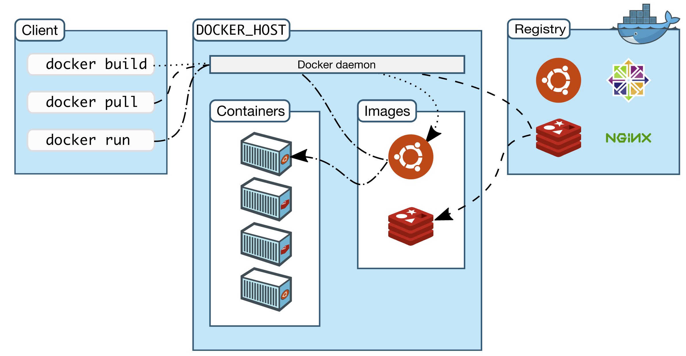
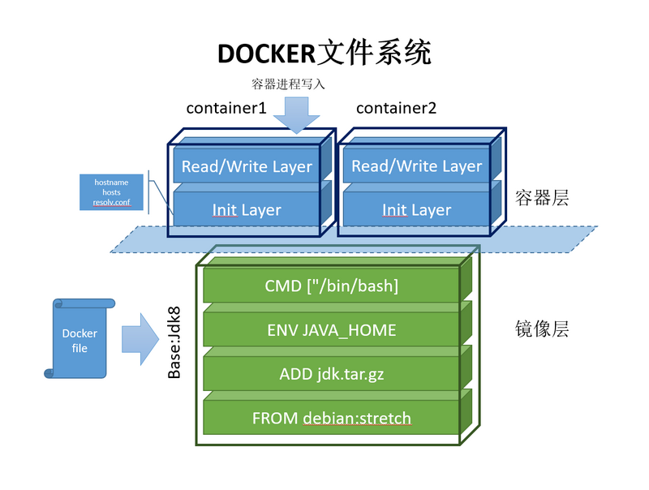

## Docker的概述

### What is Docker

Docker is an open platform for developing, shipping, and running applications. Docker enables you to separate your applications from your infrastructure so you can deliver software quickly. With Docker, you can manage your infrastructure in the same ways you manage your applications. By taking advantage of Docker’s methodologies for shipping, testing, and deploying code quickly, you can significantly reduce the delay between writing code and running it in production.

### Docker architecture

```shell
Docker uses a client-server architecture. The Docker client talks to the Docker daemon, which does the heavy lifting of building, running, and distributing your Docker containers. The Docker client and daemon can run on the same system, or you can connect a Docker client to a remote Docker daemon. The Docker client and daemon communicate using a REST API, over UNIX sockets or a network interface. Another Docker client is Docker Compose, that lets you work with applications consisting of a set of containers.
```



#### The Docker daemon

The Docker daemon (`dockerd`) listens for Docker API requests and manages Docker objects such as images, containers, networks, and volumes. A daemon can also communicate with other daemons to manage Docker services.

#### The Docker client

The Docker client (`docker`) is the primary way that many Docker users interact with Docker. When you use commands such as `docker run`, the client sends these commands to `dockerd`, which carries them out. The `docker` command uses the Docker API. The Docker client can communicate with more than one daemon.

#### Docker registries

A Docker *registry* stores Docker images. Docker Hub is a public registry that anyone can use, and Docker is configured to look for images on Docker Hub by default. You can even run your own private registry.

When you use the `docker pull` or `docker run` commands, the required images are pulled from your configured registry. When you use the `docker push` command, your image is pushed to your configured registry.

## Docker的安装,启动和停止

```shell
https://docs.docker.com/get-docker/
https://docs.docker.com/engine/install/centos/

# 启动 docker
sudo systemctl start docker

# 停止 dockr
 sudo systemctl stop docker.socket
 sudo systemctl stop docker
```


## Docker的常用命令

### **帮助命令**

```shell
docker version
docker info
docker <cmd> --help
```

 官方文档：

https://docs.docker.com/reference/


### 镜像命令

#### **docker images** 

**查看所有本地主机上的镜像**

```shell
venhju@LAPTOP-PETER:~$ docker images
REPOSITORY    TAG       IMAGE ID       CREATED        SIZE
alpine/git    latest    b8f176fa3f0d   7 weeks ago    25.1MB
hello-world   latest    d1165f221234   4 months ago   13.3kB


Options:
  -a, --all             Show all images (default hides intermediate images)
      --digests         Show digests
  -f, --filter filter   Filter output based on conditions provided
      --format string   Pretty-print images using a Go template
      --no-trunc        Don't truncate output
  -q, --quiet           Only show image IDs
```


#### **docker search**  

```shell
venhju@LAPTOP-PETER:~$ docker search mysql
NAME                              DESCRIPTION                                     STARS     OFFICIAL   AUTOMATED
mysql                             MySQL is a widely used, open-source relation…   11120     [OK]
mariadb                           MariaDB Server is a high performing open sou…   4216      [OK]
mysql/mysql-server                Optimized MySQL Server Docker images. Create…   825                  [OK]
phpmyadmin                        phpMyAdmin - A web interface for MySQL and M…   270       [OK]


Search the Docker Hub for images

Options:
  -f, --filter filter   Filter output based on conditions provided
      --format string   Pretty-print search using a Go template
      --limit int       Max number of search results (default 25)
      --no-trunc        Don't truncate output
      
      
venhju@LAPTOP-PETER:~$ docker search mysql --filter stars=3000
NAME      DESCRIPTION                                     STARS     OFFICIAL   AUTOMATED
mysql     MySQL is a widely used, open-source relation…   11120     [OK]
mariadb   MariaDB Server is a high performing open sou…   4216      [OK]
```


#### **docker pull**

```shell
#docker pull <name>[:tag]


docker pull mysql
Using default tag: latest   # default latest
latest: Pull from library/mysql	
b4d181a07f80: Pull complete      #分层下载，docker images的核心  联合文件系统                                                     a462b60610f5: Pull complete                                                                                             578fafb77ab8: Pull complete                                                                                             524046006037: Pull complete                                                                                             d0cbe54c8855: Pull complete                                                                                             aa18e05cc46d: Pull complete                                                                                             32ca814c833f: Pull complete                                                                                             9ecc8abdb7f5: Pull complete                                                                                             ad042b682e0f: Pull complete                                                                                             71d327c6bb78: Pull complete                                                                                             165d1d10a3fa: Pull complete                                                                                             2f40c47d0626: Pull complete                                                                                             Digest: sha256:52b8406e4c32b8cf0557f1b74517e14c5393aff5cf0384eff62d9e81f4985d4b  #签名
Status: Downloaded newer image for mysql:latest
docker.io/library/mysql:latest  #真实地址


venhju@LAPTOP-PETER:~$ docker pull mysql:5.7
5.7: Pulling from library/mysql
b4d181a07f80: Already exists                                                                                            a462b60610f5: Already exists                                                                                            578fafb77ab8: Already exists                                                                                            524046006037: Already exists                                                                                            d0cbe54c8855: Already exists                                                                                            aa18e05cc46d: Already exists                                                                                            32ca814c833f: Already exists                                                                                            52645b4af634: Pull complete                                                                                             bca6a5b14385: Downloading [==============>                                    ]   30.6MB/108.2MB                        309f36297c75: Download complete                                                                                         7d75cacde0f8: Download complete                                                                                         
```


#### **docker rmi**  

#Remove docker images

```shell
venhju@LAPTOP-PETER:~$ docker rmi --help

Usage:  docker rmi [OPTIONS] IMAGE [IMAGE...]

Remove one or more images

Options:
  -f, --force      Force removal of the image
      --no-prune   Do not delete untagged parents
      
          
venhju@LAPTOP-PETER:~$ docker rmi -f b8f176fa3f0d   # remove images by id
venhju@LAPTOP-PETER:~$ docker rmi -f $(docker images -aq)    # remove all by id
```


### 容器命令

说明：我们有了镜像才可以创建容器，linux,下载一个centos镜像来测试学习

```
docker pull centos
```

新建容器并启动

```shell
docker run [可选参数] image

参数说明
--name="Name"  # 容器名字 tomcat01,tomcat02 用来区分容器
-d             # 后台方式运行
-it            # 使用交互方式运行，进入容器查看内容
-p             # 指定容器端口 -p 8080:8080
   -P ip:主机端口:容器端口
   -P 主机端口：容器端口（常用）
   -P 容器端口
   
-P             # 随机指定端口

#测试，启动并进入容器
venhju@LAPTOP-PETER:~$ docker run -it centos /bin/bash
[root@172c8eb3c2c0 /]# ls #查看容器内的centos
bin  dev  etc  home  lib  lib64  lost+found  media  mnt  opt  proc  root  run  sbin  srv  sys  tmp  usr  var
[root@172c8eb3c2c0 /]# exit  #退出容器
exit
venhju@LAPTOP-PETER:~$    
```


#### **docker ps**   

```shell
docker ps
            # 列出当前正在运行的容器
-a          # 列出当前正在运行的容器+带出历史运行过的容器
-n=?        # 显示最近创建的容器
-q          # 只显示容器的编号

venhju@LAPTOP-PETER:~$ docker ps   # ps是 process status 显示当前进程的状态
CONTAINER ID   IMAGE     COMMAND   CREATED   STATUS    PORTS     NAMES

venhju@LAPTOP-PETER:~$ docker ps -a  #  显示全部运行过的命令
CONTAINER ID   IMAGE          COMMAND                  CREATED        STATUS                    PORTS     NAMES
172c8eb3c2c0   centos         "/bin/bash"              8 hours ago    Exited (0) 8 hours ago              gallant_lalande
c87fb05ebc65   d1165f221234   "/hello"                 9 hours ago    Exited (0) 9 hours ago              boring_curie
173cca29977a   b8f176fa3f0d   "git clone https://g…"   16 hours ago   Exited (0) 16 hours ago             repo

venhju@LAPTOP-PETER:~$ docker ps -n=2  #显示最近创建的容器
CONTAINER ID   IMAGE          COMMAND       CREATED       STATUS                   PORTS     NAMES
172c8eb3c2c0   centos         "/bin/bash"   8 hours ago   Exited (0) 8 hours ago             gallant_lalande
c87fb05ebc65   d1165f221234   "/hello"      9 hours ago   Exited (0) 9 hours ago             boring_curie

venhju@LAPTOP-PETER:~$ docker ps -aq   #显示所有容器的编号
172c8eb3c2c0
c87fb05ebc65
173cca29977a

```

#### **exit**

```shell
exit   # 直接退出容器
Ctrl + P + Q # 容器不停止退出

venhju@LAPTOP-PETER:~$ docker run -it centos /bin/bash          # 这里按Ctrl + P + Q 退出
[root@14695ff363c2 /]# venhju@LAPTOP-PETER:~$ docker ps
CONTAINER ID   IMAGE     COMMAND       CREATED          STATUS          PORTS     NAMES
14695ff363c2   centos    "/bin/bash"   29 seconds ago   Up 26 seconds             kind_kilby
venhju@LAPTOP-PETER:~$    
```

#### **docker rm**

```shell
删除容器
docker rm 容器id   #不能删除正在运行的容器
Options:
  -f, --force     Force the removal of a running container (uses SIGKILL)
  -l, --link      Remove the specified link
  -v, --volumes   Remove anonymous volumes associated with the container
  
docker rm -f $(docker ps -aq)    #删除所有容器
docker ps -a -q|xargs docker rm  #删除所有容器
```

#### **docker start**

```shell
启动容器
docker start 容器id    #启动容器
docker restart 容器id  #重启容器

```

#### **docker stop**

```shell
停止容器
docker stop 容器id   #停止当前正在运行的容器
docker kill 容器id   #强制停止当前容器		 
```


### **其他命令**

#### docker stats

```shell
查看docker 内存状态
```


#### docker run 

```shell
docker run -d 镜像名  # 后台运行
docker run -p 镜像名  # Publish all exposed ports to random ports

venhju@LAPTOP-PETER:~$ docker run -d centos

#问题， docker ps 发现，centos停止了
#常见的坑，docker容器使用后台运行，就必须要有一个前台进程，docker发现没有应用，就会自动停止
#nginx,容器启动后台，发现自己没有提供服务，就会立刻停止，就是没有程序了

```

#### docker logs

```shell
docker logs 容器id

Usage:  docker logs [OPTIONS] CONTAINER

Fetch the logs of a container

Options:
      --details        Show extra details provided to logs
  -f, --follow         Follow log output
      --since string   Show logs since timestamp (e.g. 2013-01-02T13:23:37Z) or relative (e.g. 42m for 42 minutes)
  -n, --tail string    Number of lines to show from the end of the logs (default "all")
  -t, --timestamps     Show timestamps
      --until string   Show logs before a timestamp (e.g. 2013-01-02T13:23:37Z) or relative (e.g. 42m for 42 minutes)
      
docker logs -ft --tail 10 容器    #没有日志      

#自己编写一段shell脚本
venhju@LAPTOP-PETER:~$ docker run -d centos /bin/sh -c "while true;do echo 'print peter';sleep 1;done"
c9b2af1865a119e7eacb6e51b96626ada677c2b74c1469ac5989d1fe63523ac4

#查看当前运行容器
venhju@LAPTOP-PETER:~$ docker ps
CONTAINER ID   IMAGE     COMMAND                  CREATED         STATUS         PORTS     NAMES
c9b2af1865a1   centos    "/bin/sh -c 'while t…"   7 seconds ago   Up 6 seconds             gracious_edison

#查看日志
venhju@LAPTOP-PETER:~$ docker logs -ft --tail 10 c9b2af1865a1
2021-07-15T01:18:11.990516000Z print peter
2021-07-15T01:18:12.992439400Z print peter
2021-07-15T01:18:13.994232400Z print peter
2021-07-15T01:18:14.996199700Z print peter
2021-07-15T01:18:15.999278000Z print peter
```

#### docker top

```shell
docker top 容器id

Usage:  docker top CONTAINER [ps OPTIONS]
Display the running processes of a container  #查看docker 内部进程信息

venhju@LAPTOP-PETER:~$ docker top ec7a6b35ee7c
UID                 PID                 PPID                C                   STIME               TTY                 TIME                CMD
root                2509                2489                0                   01:28               ?                   00:00:00            /bin/sh -c while true;do echo 'print peter';sleep 1;done
root                2563                2509                0                   01:28               ?                   00:00:00            /usr/bin/coreutils --coreutils-prog-shebang=sleep /usr/bin/sleep 1
```

#### docker inspect

```shell
#查看docker 容器信息
docker inspect 容器id

Usage:  docker inspect [OPTIONS] NAME|ID [NAME|ID...]
Return low-level information on Docker objects
Options:
  -f, --format string   Format the output using the given Go template
  -s, --size            Display total file sizes if the type is container
      --type string     Return JSON for specified type
      
venhju@LAPTOP-PETER:~$ docker inspect ec7a6b35ee7c
[
    {
        "Id": "ec7a6b35ee7c12bc65df0c1e1b6edd51b436926ec609499104ed3bf21cbc2c8d",
        "Created": "2021-07-15T01:28:15.0753486Z",
        "Path": "/bin/sh",
        "Args": [
            "-c",
            "while true;do echo 'print peter';sleep 1;done"
        ],      
```

#### docker exec

```shell
#进入运行的容器
docker exec
Usage:  docker exec [OPTIONS] CONTAINER COMMAND [ARG...]

Run a command in a running container

Options:
  -d, --detach               Detached mode: run command in the background
      --detach-keys string   Override the key sequence for detaching a container
  -e, --env list             Set environment variables
      --env-file list        Read in a file of environment variables
  -i, --interactive          Keep STDIN open even if not attached
      --privileged           Give extended privileges to the command
  -t, --tty                  Allocate a pseudo-TTY
  -u, --user string          Username or UID (format: <name|uid>[:<group|gid>])
  -w, --workdir string       Working directory inside the container
  
  
venhju@LAPTOP-PETER:~$ docker ps
CONTAINER ID   IMAGE     COMMAND                  CREATED          STATUS          PORTS     NAMES
ec7a6b35ee7c   centos    "/bin/sh -c 'while t…"   17 minutes ago   Up 17 minutes             determined_hermann
venhju@LAPTOP-PETER:~$ docker exec -it ec7a6b35ee7c /bin/bash
[root@ec7a6b35ee7c /]# ls
bin  dev  etc  home  lib  lib64  lost+found  media  mnt  opt  proc  root  run  sbin  srv  sys  tmp  usr  var
[root@ec7a6b35ee7c /]# ps -ef
UID        PID  PPID  C STIME TTY          TIME CMD
root         1     0  0 01:28 ?        00:00:01 /bin/sh -c while true;do echo 'print peter';sleep 1;done
root      1074     0  0 01:46 pts/0    00:00:00 /bin/bash
root      1102     1  0 01:46 ?        00:00:00 /usr/bin/coreutils --coreutils-prog-shebang=sleep /usr/bin/sleep 1
root      1103  1074  0 01:46 pts/0    00:00:00 ps -ef
```

#### docker attach

```shell
#进入容器正在执行的终端
Usage:  docker attach [OPTIONS] CONTAINER

Attach local standard input, output, and error streams to a running container

Options:
      --detach-keys string   Override the key sequence for detaching a container
      --no-stdin             Do not attach STDIN
      --sig-proxy            Proxy all received signals to the process (default true)
```

docker exec        进入容器后开启一个新的终端，可以在里面操作

docker attach     进入容器正在执行的终端，不会开启新的进程

#### docker cp

```shell
#从容器内拷贝文件到主机上
docker cp 容器id:容器内路径：目的主机路径
Usage:  docker cp [OPTIONS] CONTAINER:SRC_PATH DEST_PATH|-
        docker cp [OPTIONS] SRC_PATH|- CONTAINER:DEST_PATH

Copy files/folders between a container and the local filesystem

Use '-' as the source to read a tar archive from stdin
and extract it to a directory destination in a container.
Use '-' as the destination to stream a tar archive of a
container source to stdout.

Options:
  -a, --archive       Archive mode (copy all uid/gid information)
  -L, --follow-link   Always follow symbol link in SRC_PATH
  
  
  
venhju@LAPTOP-PETER:/$ docker run -it centos /bin/bash          #开启一个容器
[root@8b1189b6846f /]# cd home
[root@8b1189b6846f home]# touch peter.java                      #新建一个文件 
[root@8b1189b6846f home]# exit                                  #退出容器
venhju@LAPTOP-PETER:/$ docker ps -a
venhju@LAPTOP-PETER:/$ sudo docker cp 8b1189b6846f:/home/peter.java /home   #拷贝容器内的文件到本机
venhju@LAPTOP-PETER:/$ cd home
venhju@LAPTOP-PETER:/home$ ls
peter.java  venhju
  
```


### 练习

#### Docker安装Nginx

```shell
#search 
venhju@LAPTOP-PETER:~$ docker search nginx
#pull
venhju@LAPTOP-PETER:~$ docker pull nginx
#check images
venhju@LAPTOP-PETER:~$ docker images
REPOSITORY   TAG       IMAGE ID       CREATED        SIZE
nginx        latest    4cdc5dd7eaad   8 days ago     133MB
centos       latest    300e315adb2f   7 months ago   209MB

#run nginx
#-d 后台运行
#--name 容器名
#-p 宿主端口：容器内端口
venhju@LAPTOP-PETER:~$ docker run -d --name nginx01 -p 7080:80 nginx
venhju@LAPTOP-PETER:~$ docker ps
CONTAINER ID   IMAGE     COMMAND                  CREATED          STATUS          PORTS                                   NAMES
f6c5d5b642b5   nginx     "/docker-entrypoint.…"   39 seconds ago   Up 36 seconds   0.0.0.0:7080->80/tcp, :::7080->80/tcp   nginx01

#test connection
venhju@LAPTOP-PETER:~$ curl localhost:7080    #测试连接
<!DOCTYPE html>
<html>
<head>
<title>Welcome to nginx!</title>
```

#### Docker安装Tomcat

```shell
#-it 交互模式
#-rm 容器结束后自动删除
docker run -it --rm -p 8888:8080 tomcat:9.0

#运行结束后删除(测试用)
venhju@LAPTOP-PETER:~$ docker run -it --rm -p 8888:8080 tomcat:9.0-jdk8
venhju@LAPTOP-PETER:~$ docker ps -a
CONTAINER ID   IMAGE     COMMAND                  CREATED       STATUS                      PORTS     NAMES
f6c5d5b642b5   nginx     "/docker-entrypoint.…"   3 hours ago   Exited (0) 53 minutes ago             nginx01

#正常后台启动
venhju@LAPTOP-PETER:~$ docker run -d -p 8888:8080 tomcat:9.0-jdk8   #后台启动tomcat
venhju@LAPTOP-PETER:~$ docker exec -it bc0c5e179339 /bin/bash       #进入后台

#访问localhost:8888，发现tomcat中没有任何webapps. 需要从webapps.dist中copy到webapps下
root@bc0c5e179339:/usr/local/tomcat# cp -r webapps.dist/* webapps
root@bc0c5e179339:/usr/local/tomcat/webapps# ls
ROOT  docs  examples  host-manager  manager
```

## 可视化

### portainer

```shell
#docker的图形化界面工具
docker volume create portainer_data
docker run -d -p 8000:8000 -p 9000:9000 --name=portainer --restart=always -v /var/run/docker.sock:/var/run/docker.sock -v portainer_data:/data portainer/portainer-ce
```


### rancher(CI\CD)


## Docker镜像

### 什么是镜像

```shell
An image is a read-only template with instructions for creating a Docker container. Often, an image is based on another image, with some additional customization. For example, you may build an image which is based on the ubuntu image, but installs the Apache web server and your application, as well as the configuration details needed to make your application run.

You might create your own images or you might only use those created by others and published in a registry. To build your own image, you create a Dockerfile with a simple syntax for defining the steps needed to create the image and run it. Each instruction in a Dockerfile creates a layer in the image. When you change the Dockerfile and rebuild the image, only those layers which have changed are rebuilt. This is part of what makes images so lightweight, small, and fast, when compared to other virtualization technologies.
```

### 镜像加载原理

```html
UnionFS(联合文件系统)

Docker uses file systems inspired by Unionfs, such as Aufs, to layer Docker images. As actions are done to a base image, layers are created and documented, such that each layer fully describes how to recreate an action. This strategy enables Docker's lightweight images, as only layer updates need to be propagated (compared to full VMs, for example).
```

### 分层理解	



### commit镜像

```shell
docker commit 提交容器成为一个新的镜像
#命令和git原理类似
docker commit -m="commit message" -a="author" 容器id 目标镜像名:[TAG]
```

实战测试

```shell
venhju@LAPTOP-PETER:~$ docker commit -m="my webapp tomecat" -a="Peter" bc0c5e179339 tomcat01:1.0
sha256:dabd8effc10e32516afba962a5c9c5c81460a83e4b53914aba9c400a64314608
venhju@LAPTOP-PETER:~$ docker images
REPOSITORY               TAG        IMAGE ID       CREATED         SIZE
tomcat01                 1.0        dabd8effc10e   4 seconds ago   539MB
portainer/portainer-ce   latest     865cf8021627   5 days ago      210MB
nginx                    latest     4cdc5dd7eaad   8 days ago      133MB
tomcat                   9.0-jdk8   8ffa9facce42   12 days ago     534MB
centos                   latest     300e315adb2f   7 months ago    209MB

#比较两个tomcat镜像，第二个比第一个多了一层。里面加包括了自己修改的数据（容器层）
docker inspect tomcat:9.0-jdk8
"Layers": [
                "sha256:4e006334a6fdea37622f72b21eb75fe1484fc4f20ce8b8526187d6f7bd90a6fe",
                "sha256:e4d0e810d54a9c47e3dface412b0b88045d156b18809a2e0bbfb0fc8a45d8127",
                "sha256:fe6a4fdbedc0cbc560437fa700b3b034114e31a264f0818d0d32ed2ee6cbe7a3",
                "sha256:7095af798ace32173839a61cbf101048434e1065185c0f29cc888e67158d990b",
                "sha256:79c550eb7bd278d360284d86c39e05852c2026b64232267a43947300bcf54a2c",
                "sha256:c3d00b097cce7df7dff99107ed0005fc4ceb14abaeac24316c8b120b4cd4c03a",
                "sha256:aed5f5426b278d2800d114b061cc51b745d042ca1ef9294f8f9a77dfa5c19315",
                "sha256:9d48355da13b8a355aaf6c479d386dc4280cb1e491271490e9f85d88831adb9b",
                "sha256:af31d3a5d1c0e7955df17557e0afda9de32b145d5dfa19e15ce124ea86c68b54",
                "sha256:4f288976ed24874df0825124ea3768b5ed930a2fb96cfc334ffbe2d00e4aaa1b"
            ]
docker inspect tomcat01:1.0
 "Layers": [
                "sha256:4e006334a6fdea37622f72b21eb75fe1484fc4f20ce8b8526187d6f7bd90a6fe",
                "sha256:e4d0e810d54a9c47e3dface412b0b88045d156b18809a2e0bbfb0fc8a45d8127",
                "sha256:fe6a4fdbedc0cbc560437fa700b3b034114e31a264f0818d0d32ed2ee6cbe7a3",
                "sha256:7095af798ace32173839a61cbf101048434e1065185c0f29cc888e67158d990b",
                "sha256:79c550eb7bd278d360284d86c39e05852c2026b64232267a43947300bcf54a2c",
                "sha256:c3d00b097cce7df7dff99107ed0005fc4ceb14abaeac24316c8b120b4cd4c03a",
                "sha256:aed5f5426b278d2800d114b061cc51b745d042ca1ef9294f8f9a77dfa5c19315",
                "sha256:9d48355da13b8a355aaf6c479d386dc4280cb1e491271490e9f85d88831adb9b",
                "sha256:af31d3a5d1c0e7955df17557e0afda9de32b145d5dfa19e15ce124ea86c68b54",
                "sha256:4f288976ed24874df0825124ea3768b5ed930a2fb96cfc334ffbe2d00e4aaa1b",
                "sha256:c8b90cbd926c2beab13ce7f9d5db8fb6ba5d5a319744f01ecdc83ec545634f02"  #多了一个容器层
            ]

```

## 容器数据卷(Volumes)

### 什么是容器数据卷

```html
By default all files created inside a container are stored on a writable container layer. 
Docker has two options for containers to store files in the host machine, so that the files are persisted even after the container stops: volumes, and bind mounts. 
```


- **Volumes** are stored in a part of the host filesystem which is *managed by Docker* (`/var/lib/docker/volumes/` on Linux). Non-Docker processes should not modify this part of the filesystem. Volumes are the best way to persist data in Docker.

  Created and managed by Docker. You can create a volume explicitly using the `docker volume create` command, or Docker can create a volume during container or service creation.

  A given volume can be mounted into multiple containers simultaneously. When no running container is using a volume, the volume is still available to Docker and is not removed automatically. You can remove unused volumes using `docker volume prune`.

  Volumes also support the use of *volume drivers*, which allow you to store your data on remote hosts or cloud providers, among other possibilities.

  

- **Bind mounts** may be stored *anywhere* on the host system. They may even be important system files or directories. Non-Docker processes on the Docker host or a Docker container can modify them at any time.

```html
!Bind mounts allow access to sensitive files

One side effect of using bind mounts, for better or for worse, is that you can change the host filesystem via processes running in a container, including creating, modifying, or deleting important system files or directories. This is a powerful ability which can have security implications, including impacting non-Docker processes on the host system
```

- **[tmpfs mounts](https://docs.docker.com/storage/tmpfs/)**: A `tmpfs` mount is not persisted on disk, either on the Docker host or within a container. It can be used by a container during the lifetime of the container, to store non-persistent state or sensitive information. For instance, internally, swarm services use `tmpfs` mounts to mount [secrets](https://docs.docker.com/engine/swarm/secrets/) into a service’s containers.
- **[named pipes](https://docs.microsoft.com/en-us/windows/desktop/ipc/named-pipes)**: An `npipe` mount can be used for communication between the Docker host and a container. Common use case is to run a third-party tool inside of a container and connect to the Docker Engine API using a named pipe.

### 使用数据卷

#### Bind mounts

```shell
#Bind mounts
#-v host path:container path (create directory automatically)
venhju@LAPTOP-PETER:~$ docker run -it -v /home/peter:/home centos /bin/bash 
#check bind info
venhju@LAPTOP-PETER:/home/peter$ docker inspect b31e80aa141e

 "Mounts": [
            {
                "Type": "bind",
                "Source": "/home/peter",    #host path
                "Destination": "/home",     #container path  
                "Mode": "",
                "RW": true,
                "Propagation": "rprivate"
            }
        ],

# -v create directory automatically
# -mount not create#
If you use -v or --volume to bind-mount a file or directory that does not yet exist on the Docker host, -v creates the endpoint for you. It is always created as a directory.

If you use --mount to bind-mount a file or directory that does not yet exist on the Docker host, Docker does not automatically create it for you, but generates an error.        
```

#### Volumes

```shell
 docker volume create my-vol  # create volumes
 docker volume ls             # list volumes
 docker volume inspect my-vol # volume details
 [
    {
        "CreatedAt": "2021-07-16T03:21:34Z",
        "Driver": "local",
        "Labels": {},
        "Mountpoint": "/var/lib/docker/volumes/my-vol/_data",
        "Name": "my-vol",
        "Options": {},
        "Scope": "local"
    }
]

$ docker volume rm my-vol    # remove volume

# start a container with volume --mount (如果没有create volume,自动创建一个)
$ docker run -d \
  --name devtest \
  --mount source=myvol2,target=/app \
  nginx:latest
  
# start a container with volume -v (如果没有create volume,自动创建一个)
$ docker run -d \
  --name devtest \
  -v myvol2:/app \
  nginx:latest
```

测试

```shell
docker run -d --name mycentos --mount source=myvol2,target=/home/temp centos
  "Mounts": [
            {
                "Type": "volume",          # type is volume
                "Name": "myvol2",          # volume name
                "Source": "/var/lib/docker/volumes/myvol2/_data",    #volume dir
                "Destination": "/home/temp",                         #container dir 
                "Driver": "local",
                "Mode": "z",
                "RW": true,                                          #read and write
                "Propagation": ""
            }
   ],
```


### 安装mysql

```shell
# pull mysql
venhju@LAPTOP-PETER:/$ docker pull mysql:5.7

# run mysql
# -d 后台运行
# -p 映射主机端口
# -v bind mount
# -e env setting
venhju@LAPTOP-PETER:/$ docker run -d -p:3310:3306 -v /home/mysql/conf:/etc/mysql/conf/d -v /home/mysql/data:/var/lib/mysql -e MYSQL_ROOT_PASSWORD=123456 --name mysql01 mysql:5.7

# chect host diectory
venhju@LAPTOP-PETER:/home/mysql$ ls -l
total 8
drwxr-xr-x 2 root root 4096 Jul 16 10:25 conf
drwxr-xr-x 5  999 root 4096 Jul 16 10:26 data

# install mysql client
venhju@LAPTOP-PETER:/home/mysql$ sudo apt install mariadb-client-core-10.3

# connect to mysql
# -h host
# -P port
# -u user
# -p password
venhju@LAPTOP-PETER:/$ mysql -h127.0.0.1 -P3310 -uroot -p123456
MySQL [(none)]> show databases;
```

### 初识Dockerfile

Dockerfile	就是用来构建docker镜像的文件，命令脚本

```shell
#创建一个dockerfile
venhju@LAPTOP-PETER:~$ touch mydockerfile

FROM centos
VOLUME ["/volume01","/volume02"]   #匿名挂载
RUN echo "build end"
RUN /bin/bash

#build生成一个镜像

venhju@LAPTOP-PETER:~$ docker build -f mydockerfile -t mycentos:1.0.0 .

[+] Building 1.1s (7/7) FINISHED
 => [internal] load build definition from mydockerfile                                                             
 => CACHED [1/3] FROM docker.io/library/centos                                                                     
 => [2/3] RUN echo "build end"                                                                                      => [3/3] RUN /bin/bash                                                                                            => exporting to image                                                                                            
 => => exporting layers                                                                                          
 => => writing image sha256:03ffc4994f3e9c3ce5fac345df22e78d88fe5b4308282a24ebd6b66e114a2cc0                       
 => => naming to docker.io/library/mycentos:1.0.0
 
 # run container from the images and check the volume
 venhju@LAPTOP-PETER:~$ docker inspect a3f98e5c8ba3 
   "Mounts": [
            {
                "Type": "volume",
                "Name": "0cf0efd9c21ca46957cb0c6979099cbaef427286838339fccb10caf8c2940bce",
                "Source": "/var/lib/docker/volumes/0cf0efd9c21ca46957cb0c6979099cbaef427286838339fccb10caf8c2940bce/_data",
                "Destination": "/volume01",    # volume01
                "Driver": "local",
                "Mode": "",
                "RW": true,
                "Propagation": ""
            },
            {
                "Type": "volume",
                "Name": "9271f206799edccb2bbd4fc2c9f4497d0f21f0da59bb32f906db2c329cf17d03",
                "Source": "/var/lib/docker/volumes/9271f206799edccb2bbd4fc2c9f4497d0f21f0da59bb32f906db2c329cf17d03/_data",
                "Destination": "/volume02",   # volume02
                "Driver": "local",
                "Mode": "",
                "RW": true,
                "Propagation": ""
            }
        ],
```

### 数据卷容器

```shell
#--volumes-from 从parent继承volume

venhju@LAPTOP-PETER:~$ docker run -d --name mycentos01 mycentos:1.0
a15f194b26e2bd5cc49264efdd4d7c7a7ff75e7ff00a1d05edac0af9d5ffc412
venhju@LAPTOP-PETER:~$ docker run -d --name mycentos02 --volumes-from mycentos01 mycentos:1.0  #其实两个container都                                                                                                 指向同一个volume


# mycentos01 (parent)
 "Type": "volume",
                "Name": "0c6bcba709b10c73d4b801d858e4bcc9d97842eee6b681af4b8ec0c300bf498e",
                "Source": "/var/lib/docker/volumes/0c6bcba709b10c73d4b801d858e4bcc9d97842eee6b681af4b8ec0c300bf498e/_data",   #同一个
                "Destination": "/volume01",


# mycentos02

                "Type": "volume",
                "Name": "0c6bcba709b10c73d4b801d858e4bcc9d97842eee6b681af4b8ec0c300bf498e",
                "Source": "/var/lib/docker/volumes/0c6bcba709b10c73d4b801d858e4bcc9d97842eee6b681af4b8ec0c300bf498e/_data",  #同一个
                "Destination": "/volume01",

```
