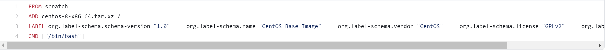

# DockerFile

## DockerFile介绍

dockerfile是用来构建镜像的。命令参数脚本。

```shell
构建步骤：
1.编写一个dockfile文件
2.docker build
3.docker run
```



很多官方镜像都是基础包，很多功能没有，我们通常会搭建自己的镜像。

## Dockerfile的构建过程

**基础知识：**
1. 每个保留关键字（指令）都必须是大写字母。
2. 执行从上到下顺序执行
3. #表示注释
4. 每一个指令都会创建提交一个新的镜像层

dockerfile是面向开发的，我们以后要发布项目，作镜像，就要编写dockerfile文件。这个文件十分简单。Docker镜像逐渐成为企业交付的标准。
步骤：
Dockerfile:构建文件，定义了一切的步骤，源代码
Dockimages: 通过dockerfile构建生成的镜像，最终发布和运行的产品
Docker容器：容器就是镜像运行起来的服务器

## Dockerfile的指令


```shell
# FROM               # 基础镜像，一切从这里构建
# MAINTAINER         # 维护者的信息，姓名+邮箱
# RUN                # 镜像构建的时候需要运行的命令
# Add                # 步骤 : tomcat镜像，这个tomcat压缩包，添加内容
# WORKDIR            # 镜像的工作目录
# VOLUME             # 挂载到主机目录
# EXPOSE             # 暴露端口配置 
# CMD                # 指定容器启动时，需要执行的命令, 只有一个会生效，可被替代
# ENTRYPOINT         # 指定容器启动时，需要执行的命令，可以追加命令
# ONBUILD            # 当构建一个被继承的dockfile,这个时候就会运行 ONBUILD 的指令。触发指令。
# COPY               # 类似ADD命令，将我们的文件拷贝到镜像中。
# ENV                # 构建的时候设置环境变量
```

## 实战测试

### 创建一个自己的centos

Dokcer Hub中99%的镜像都是FROM scratch

```shell
# 创建一个自己的centos

FROM centos                                             # FROM centos
MAINTAINER peter<peter_hanjun@hotmail.com>

ENV MYPATH /usr/local                                   # ENV setting
WORKDIR $MYPATH

RUN yum -y install vim                                  # install vim
RUN yum -y install net-tools                            # install net-tools

EXPOSE 80

CMD echo $MYPATH
CMD echo "---end----"
CMD /bin/bash

# build
venhju@LAPTOP-PETER:~/mydockerfile$ docker build -f mycentosfile -t mycentos:2.0 .

[+] Building 23.8s (8/8) FINISHED
 => [internal] load build definition from mycentosfile                                                             
 => [internal] load metadata for docker.io/library/centos:latest                                                   
 => CACHED [1/4] FROM docker.io/library/centos                                                                     
 => [2/4] WORKDIR /usr/local                                                                                       
 => [3/4] RUN yum -y install vim                                                                                  
 => [4/4] RUN yum -y install net-tools                                                                              => exporting to image                                                                                             
 => => exporting layers                                                                                            => => writing image sha256:ee61c5b7cde986a31d89fa92e34c1f5f00a2f6fb8338df341c4d3a2f43b41e7c                       
 => => naming to docker.io/library/mycentos:2.0

# check images
venhju@LAPTOP-PETER:~/mydockerfile$ docker images
REPOSITORY               TAG        IMAGE ID       CREATED         SIZE
mycentos                 2.0        ee61c5b7cde9   8 minutes ago   287MB

# run from images
venhju@LAPTOP-PETER:~/mydockerfile$ docker run -it --name=mycentos2 mycentos:2.0
[root@ef5ed0e87218 local]# pwd                          # 进入到 $MYPATH 设定的路径
/usr/local

# vim is here...
[root@ef5ed0e87218 local]# vim
[root@ef5ed0e87218 local]#   

# ifconfig is here...
[root@ef5ed0e87218 local]# ifconfig
eth0: flags=4163<UP,BROADCAST,RUNNING,MULTICAST>  mtu 1500

# docker history 查看构建过程
venhju@LAPTOP-PETER:~/mydockerfile$ docker history  ee61c5b7cde9
IMAGE          CREATED          CREATED BY                                      SIZE      COMMENT
ee61c5b7cde9   21 minutes ago   CMD ["/bin/sh" "-c" "/bin/bash"]                0B        buildkit.dockerfile.v0
<missing>      21 minutes ago   CMD ["/bin/sh" "-c" "echo \"---end----\""]      0B        buildkit.dockerfile.v0
<missing>      21 minutes ago   CMD ["/bin/sh" "-c" "echo $MYPATH"]             0B        buildkit.dockerfile.v0
<missing>      21 minutes ago   EXPOSE map[80/tcp:{}]                           0B        buildkit.dockerfile.v0
<missing>      21 minutes ago   RUN /bin/sh -c yum -y install net-tools # bu…   14.5MB    buildkit.dockerfile.v0
<missing>      21 minutes ago   RUN /bin/sh -c yum -y install vim # buildkit    63.5MB    buildkit.dockerfile.v0
<missing>      22 minutes ago   WORKDIR /usr/local                              0B        buildkit.dockerfile.v0
<missing>      22 minutes ago   ENV MYPATH=/usr/local                           0B        buildkit.dockerfile.v0
<missing>      22 minutes ago   MAINTAINER peter<peter_hanjun@hotmail.com>      0B        buildkit.dockerfile.v0
<missing>      7 months ago     /bin/sh -c #(nop)  CMD ["/bin/bash"]            0B
<missing>      7 months ago     /bin/sh -c #(nop)  LABEL org.label-schema.sc…   0B
<missing>      7 months ago     /bin/sh -c #(nop) ADD file:bd7a2aed6ede423b7…   209MB
```

### Docker build 路径问题

```shell
docker build [OPTIONS] PATH | URL | -

The docker build command builds Docker images from a Dockerfile and a “context”. A build’s context is the set of files located in the specified PATH or URL. The build process can refer to any of the files in the context. For example, your build can use a COPY instruction to reference a file in the context.

The URL parameter can refer to three kinds of resources: Git repositories, pre-packaged tarball contexts and plain text files.
```

### CMD 和 ENTRYPOINT 的区别

> 知乎上的一篇文章 https://zhuanlan.zhihu.com/p/30555962

```shell
CMD vs ENTRYPOINT
在写Dockerfile时, ENTRYPOINT或者CMD命令会自动覆盖之前的ENTRYPOINT或者CMD命令.
在docker镜像运行时, 用户也可以在命令指定具体命令, 覆盖在Dockerfile里的命令.

# dockerfile 
FROM ubuntu:trusty
CMD ping localhost 

# 当在后面加了 hostname 命令后，ping命令被覆盖
$ docker run demo hostname
6c1573c0d4c0

# ENTRYPOINT的命令不会被覆盖，添加的命令会加在ENTRYPOINT命令之后
# 如果你希望你的docker镜像只执行一个具体程序, 不希望用户在执行docker run的时候随意覆盖默认程序. 建议用ENTRYPOINT.
# 但是，和CMD类似, 默认的ENTRYPOINT也在docker run时, 也可以被覆盖. 在运行时, 用--entrypoint覆盖默认的ENTRYPOINT
$ docker run --entrypoint hostname demo
075a2fa95ab7 
```

```shell
Shell vs. Exec
ENTRYPOINT和CMD指令支持2种不同的写法: shell表示法和exec表示法.
# shell
CMD executable  param1 param2
CMD ping localhost 

$ docker ps -l
CONTAINER ID IMAGE COMMAND CREATED
15bfcddb4312 demo:latest "/bin/sh -c 'ping localhost'" 2 seconds ago    # 其实调用的是/bin/sh
$ docker exec 15bfcddb ps -f
UID PID PPID C STIME TTY TIME CMD
root 1 0 0 20:14 ? 00:00:00 /bin/sh -c ping localhost           
root 9 1 0 20:14 ? 00:00:00 ping localhost                              # ping command其实运行在另一个进程

#在上面的ping的例子中, 如果用了shell形式的CMD, 用户按ctrl-c也不能停止ping命令, 因为ctrl-c的信号没有被转发给ping命令

-------------------------------------------------------------------------------------------------------------
# exec
# 一个更好的选择exec表示法
CMD ["executable","param1","param2"] 

# dockerfile
FROM ubuntu:trusty
CMD ["/bin/ping","localhost"] 

$ docker ps -l
CONTAINER ID IMAGE COMMAND CREATED
90cd47288780 demo:latest "/bin/ping localhost" 4 seconds ago 

#现在没有启动/bin/sh命令, 而是直接运行/bin/ping命令, ping命令的PID是1. 无论你用的是ENTRYPOINT还是CMD命令, 都强烈建议采用exec表示法
```

### ENTRYPOINT 和 CMD组合使用

```shell
组合使用ENTRYPOINT和CMD, ENTRYPOINT指定默认的运行命令, CMD指定默认的运行参数. 例子如下:

# Dockerfile
# 永远使用Exec表示法，不然结果很难预期
FROM ubuntu:trusty
ENTRYPOINT ["/bin/ping","-c","3"]    # ENTRYPOINT + CMD
CMD ["localhost"]

# 构建一个 ping 的 image
$ docker build -t ping .

# ENTRYPOINT + CMD
$ docker run ping                                                          # run ping
$ docker ps -l
CONTAINER ID IMAGE COMMAND CREATED
82df66a2a9f1 ping:latest "/bin/ping -c 3 localhost" 6 seconds ago          # ENTRYPOINT+CMD

# 因为CMD可以被覆盖，"localhost"就可替换成任意值
$ docker run ping docker.io                                                # run ping + docker.io                   $ docker ps -l --no-trunc
CONTAINER ID IMAGE COMMAND CREATED
0d739d5ea4e5 ping:latest "/bin/ping -c 3 docker.io" 51 seconds ago         # CMD命令被替换     
```


