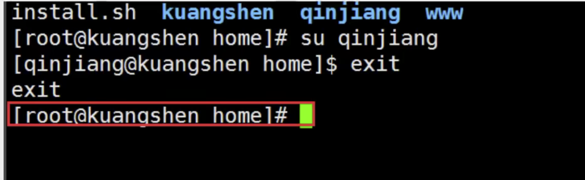

## 系统目录结构

1. 一切皆文件
2. 根目录 /


```shell
/bin : 	存放常用目录页
/boot : 存放linux启动的核心文件，包括一些链接文件和镜像
/dev : 	device的缩写。存放linux的外部设备，在linux中访问外部设备的方式和访问文件是一样的
#/etc :		用来存放所有的系统管理所需要的配置文件和子目录
#/home :	用户的主目录。在linux中，每个用户都有一个自己的目录。一般该目录是以用户的账号命名
/lib :	存放系统最基本的动态链接共享库，类似于windows的dll文件
/mnt : 	该目录是为了让用户临时挂载别的文件系统的。可以将光驱挂在/mnt/上。
/media:	linux会自动识别一些设备，例如u盘，光驱等。
#/opt:		主机额外安装软件所放的目录。比如你安装mysql数据库可放在这里。
#/root:		该目录为系统管理员，超级权限者的用户目录
#/usr:		用户的很多应用程序和文件都在这个目录下。类似于Windows的program files目录。
#/tmp:		临时文件
/usr/bin:	系统用户使用的应用程序
/usr/sbin:	超级用户使用的比较高级的管理程序和系统守护程序。
/usr/src:	内核源代码默认的放置目录。
#/var:		这个目录存放着不断扩充的内容。习惯将经常被修改的目录放在这个目录下。包括各自日志文件。
#/www:		存放服务器网站相关的资源。
```

## 常用的基本命令

### 目录管理

#### cd(切换目录)

```shell
# 绝对路径都是以/开头，相对路径
cd : 切换目录
./ : 当前目录
/ ： 根目录
cd ~ : 回到当前的用户目录
pwd : 查看当前目录
```

#### ls(列出目录)

```shell
# ls
-a 参数。查看全部文件，包括隐藏文件。
-l 列出所有文件，包含文件的属性和权限（没有隐藏文件）
```

#### pwd(显示当前用户所在目录)

#### mkdir(创建目录)

```shell
  # mkdir
  -m, --mode=MODE   set file mode (as in chmod), not a=rwx - umask
  -p, --parents     no error if existing, make parent directories as needed
  -v, --verbose     print a message for each created directory

```


#### rmdir(删除目录)

```shell
  # 仅能删除空的目录。如果下面存在文件，需要先删除文件。
  # 递归删除多个文件目录用 -p
  -p, --parents   remove DIRECTORY and its ancestors; e.g., 'rmdir -p a/b/c' is
                    similar to 'rmdir a/b/c a/b a'
  -v, --verbose   output a diagnostic for every directory processed

```


#### cp(复制文件或目录)

```shell
cp <file> <src> <des>
```


#### rm(移除文件或目录)

```shell
# rm
  -f, --force           ignore nonexistent files and arguments, never prompt  # 强制删除
  -i                    prompt before every removal                           # 询问是否删除
  -I                    prompt once before removing more than three files, or
                          when removing recursively; less intrusive than -i,
                          while still giving protection against most mistakes
      --interactive[=WHEN]  prompt according to WHEN: never, once (-I), or
                          always (-i); without WHEN, prompt always
      --one-file-system  when removing a hierarchy recursively, skip any
                          directory that is on a file system different from
                          that of the corresponding command line argument
      --no-preserve-root  do not treat '/' specially
      --preserve-root[=all]  do not remove '/' (default);
                              with 'all', reject any command line argument
                              on a separate device from its parent
  -r, -R, --recursive   remove directories and their contents recursively  # 递归删除
  -d, --dir             remove empty directories


rm -rf /   #系统中的所有文件都被删除了 （不要用）
```

​	

#### mv(移动文件或目录，重命名文件)

```shell
Usage: mv [OPTION]... [-T] SOURCE DEST
  or:  mv [OPTION]... SOURCE... DIRECTORY
  or:  mv [OPTION]... -t DIRECTORY SOURCE...
Rename SOURCE to DEST, or move SOURCE(s) to DIRECTORY.


-f, --force                  do not prompt before overwriting   #强制
-i, --interactive            prompt before overwrite
-t, --target-directory=DIRECTORY  move all SOURCE arguments into DIRECTORY
-T, --no-target-directory    treat DEST as a normal file
-u, --update                 move only when the SOURCE file is newer   #只替换已经更新过的文件
                                 than the destination file or when the
                                 destination file is missing

```


### 文件属性

```shell
看懂文件属性

#在Linux中第一个字符代表这个文件是一个目录，文件或链接文件
  * [d] 表示目录
  * [-] 表示文件
  * [l] 表示链接文档(link file)
  * [b] 表示为装置文件里面的可供储存的接口设备。（可随机存储装置）
  * [c] 表示为装置文件里的穿行端口设备，例如键盘，鼠标（一次性读取装置）
  
 #接下来的字符中，以三个为一组。均为[rwx]的三个参数组合。
  * [r] 可读
  * [w] 可写
  * [x] 可执行	
  * [-] 没有这个权限
 #第1-3位确定属主（该文件的所有者）拥有该文件的权限。第4-6位确定属组（所有者的同组用户）拥有该文件的权限，第7-9位确定其他用户   拥有该文件的权限。
 #对于文件来说，它都有一个特定的所有者，也就是对该文件具有所有权的用户。
 #同时，在Linux系统中，用户是按组分类的，一个用户属于一个或多个用户组。
 #文件所有者以外的用户又可以分为文件所有者的同组用户和其他用户。
 #因为，在Linux系统按文件所有者，文件所有者同组用户和其他用户来规定不同的文件访问权限。
```


#### chgrp(修改文件属组)

```shell
chgrp [-R] 属组名 文件名
  -R, --recursive        operate on files and directories recursively


[root@venhjuhost home]# ls -ll
total 0
drwxr-xr-x 3 root   root   59 Oct 21 11:30 spring
drwx------ 3 venhju venhju 96 Oct 21 11:30 venhju
[root@venhjuhost home]# chgrp -R root venhju   # change group
[root@venhjuhost home]# ls -ll
total 0
drwxr-xr-x 3 root   root 59 Oct 21 11:30 spring
drwx------ 3 venhju root 96 Oct 21 11:30 venhju

```

#### chown(修改文件属主)

```shell
chown [-R] 属主名 文件名
chown [-R] 属主名：属组名 文件名
  -R, --recursive        operate on files and directories recursively


[root@venhjuhost home]# chown -R root venhju  # change owner
[root@venhjuhost home]# ls -ll
total 0
drwxr-xr-x 3 root root 59 Oct 21 11:30 spring
drwx------ 3 root root 96 Oct 21 11:30 venhju

```

#### chmod(更改9个属性)

```shell
chmod [-R] xyz 文件目录

# Linux属性有两种设置方法，一种是数字，一种是符号
每种身份(owner/group/others)各自的三个权限(r/w/x)累加。例如[-rwxrwx---]分数是：
owner = rwx = 4+2+1 = 7
group = rwx = 4+2+1 = 7
others = --- = 0+0+0 = 0
chmod 770 <filename>


drwxr-xr-x 3 root   root   59 Oct 21 11:30 spring
drwx------ 3 venhju venhju 96 Oct 21 11:30 venhju
[root@venhjuhost home]# chmod 777 venhju
[root@venhjuhost home]# ls -l
total 0
drwxr-xr-x 3 root   root   59 Oct 21 11:30 spring
drwxrwxrwx 3 venhju venhju 96 Oct 21 11:30 venhju

```

### 文件内容查看

```shell
# 网络配置相关目录文件
/etc/sysconfig/network-scripts/ifcfg-eth0
ping
ifconfig 查看网络配置
```

#### cat(从第一行显示文件内容)

```shell
[root@venhjuhost network-scripts]# cat ifcfg-eth0

# Created by cloud-init on instance boot automatically, do not edit.
# If you don't want cloud-init genrated automatically,you can disable it in /etc/cloud/cloud.cfg
# For more information, please refer to: https://help.aliyun.com/document_detail/57803.html
#
BOOTPROTO=dhcp
DEVICE=eth0
ONBOOT=yes
STARTMODE=auto
TYPE=Ethernet
USERCTL=no
```

#### tac(从最后一行开始显示)

```shell
[root@venhjuhost network-scripts]# tac ifcfg-eth0

USERCTL=no
TYPE=Ethernet
STARTMODE=auto
ONBOOT=yes
DEVICE=eth0
BOOTPROTO=dhcp
#
# For more information, please refer to: https://help.aliyun.com/document_detail/57803.html
# If you don't want cloud-init genrated automatically,you can disable it in /etc/cloud/cloud.cfg
# Created by cloud-init on instance boot automatically, do not edit.
```

#### nl(显示行号)

```shell
[root@venhjuhost network-scripts]# nl ifcfg-eth0

     1  # Created by cloud-init on instance boot automatically, do not edit.
     2  # If you don't want cloud-init genrated automatically,you can disable it in /etc/cloud/cloud.cfg
     3  # For more information, please refer to: https://help.aliyun.com/document_detail/57803.html
     4  #
     5  BOOTPROTO=dhcp
     6  DEVICE=eth0
     7  ONBOOT=yes
     8  STARTMODE=auto
     9  TYPE=Ethernet
    10  USERCTL=no
```

#### more(分页显示内容)

```shell
[root@venhjuhost sysconfig]# more sysstat.ioconf
分页显示，按空格下一页
enter向下一行
:f 显示行号
```

#### less（分页显示内容）

```shell
#输入 / 之后，输入查找内容，向下查询
#输入 ？之后，输入查找内容，向上查询
#输入 n, 查询下一个。 N 查找上一个。
[root@venhjuhost sysconfig]# less sysstat.ioconf
enter 下一行
向上箭，上一行
空格，翻页
q 退出
```

#### head（显示头n行）

```shell
-n, --lines=[-]NUM       print the first NUM lines instead of the first 10;
                         with the leading '-', print all but the last
                         NUM lines of each file

[root@venhjuhost sysconfig]# head -n 5 sysstat.ioconf #显示前5行
#
# sysstat.ioconf
#
#  Copyright (C) 2004, Red Hat, Inc.
#

```

#### tail(显示尾n行)

```shell
[root@venhjuhost network-scripts]# tail -n 5 ifcfg-eth0   #显示末尾5行
DEVICE=eth0
ONBOOT=yes
STARTMODE=auto
TYPE=Etherne
```

### Linux链接

Linux链接分为两种：硬链接，软链接

> ## **硬链接和软链接的区别** (Hard Link & Symbolic Link)
>
> 原理上，硬链接和源文件的inode节点号相同，两者互为硬链接。软连接和源文件的inode节点号不同，进而指向的block也不同，软连接block中存放了源文件的路径名。
>
> 实际上，硬链接和源文件是同一份文件，而软连接是独立的文件，类似于快捷方式，存储着源文件的位置信息便于指向。
>
> 使用限制上，不能对目录创建硬链接，不能对不同文件系统创建硬链接，不能对不存在的文件创建硬链接；可以对目录创建软连接，可以跨文件系统创建软连接，可以对不存在的文件创建软连接。
>
> https://www.cnblogs.com/Peter2014/p/7594504.html


#### ln(创建链接)

```shell
 # ln
 Usage: ln [OPTION]... [-T] TARGET LINK_NAME
  or:  ln [OPTION]... TARGET
  or:  ln [OPTION]... TARGET... DIRECTORY
  or:  ln [OPTION]... -t DIRECTORY TARGET...
In the 1st form, create a link to TARGET with the name LINK_NAME.
In the 2nd form, create a link to TARGET in the current directory.
In the 3rd and 4th forms, create links to each TARGET in DIRECTORY.
Create hard links by default, symbolic links with --symbolic.
By default, each destination (name of new link) should not already exist.
When creating hard links, each TARGET must exist.  Symbolic links
can hold arbitrary text; if later resolved, a relative link is
interpreted in relation to its parent directory.

 
 -s, --symbolic              make symbolic links instead of hard links
 
[root@venhjuhost home]# ls
f1  spring  tmp  venhju
[root@venhjuhost home]# ln f1 f2    # 创建f1 的硬链接
[root@venhjuhost home]# ls
f1  f2  spring  tmp  venhju

 [root@venhjuhost home]# ln -s f1 f3   # 创建f1 的软链接
[root@venhjuhost home]# ls -l
total 8
-rw-r--r-- 3 root   root    8 Oct 22 09:57 f1
-rw-r--r-- 3 root   root    8 Oct 22 09:57 f2        #硬链接
lrwxrwxrwx 1 root   root    2 Oct 22 09:59 f3 -> f1  #软链接 Symbolic Link
drwxr-xr-x 3 root   root   59 Oct 21 11:30 spring
drwxr-xr-x 2 root   root   16 Oct 22 09:57 tmp
drwxrwxrwx 3 venhju venhju 96 Oct 21 11:30 venhju


[root@venhjuhost home]# rm -f f1                     #删除f1
[root@venhjuhost home]# ls -l
total 4
-rw-r--r-- 1 root   root    6 Oct 22 10:40 f2
lrwxrwxrwx 1 root   root    2 Oct 22 10:40 f3 -> f1  #f3链接失效
drwxr-xr-x 3 root   root   59 Oct 21 11:30 spring
drwxr-xr-x 2 root   root   16 Oct 22 09:57 tmp
drwxrwxrwx 3 venhju venhju 96 Oct 21 11:30 venhju
[root@venhjuhost home]# cat f2                       #f2仍然有效
peter
[root@venhjuhost home]#


```

## VIM编辑器

VIM通过一些插件可以实现和IDE一样的功能。

> VIM命令详解：
>
> https://mp.weixin.qq.com/s?__biz=Mzg2NTAzMTExNg==&mid=2247483895&idx=1&sn=b685934ee0d08b9d01cc0c35ed7fed71&scene=19#wechat_redirect

基本上vi/vim共分为三种模式，命令模式（Command Mode），输入模式（Insert Mode），底线命令模式（Last Line Mode）。

```shell
#命令模式：
用户刚进入vi/vim,进入命令模式
以下是常用的几个命令：
 * i 切换到输入模式，以输入字符
 * x 删除当前光标处的字符
 * : 切换到底线命令模式，以在最后一行输入命令。如果是输入模式，按ESC先退出输入模式。
 
 u			复原前一个动作(undo)。(常用) 
 [Ctrl]+r	 重做上一个动作。(常用)
 
 #输入模式
 字符按键以及shift组合		 输入字符
 ENTER					  回车键，换行。
 BACKSPACE				   退格键
 DEL					  删除键
 方向键		 		    在文本中移动光标
 HOME/END       		   一定光标到行首，行尾
 Page up/down               翻页
 Insert                     切换光标为输入/替换模式
 ESC                        退出输入模式，回到命令模式
 
 
 #底线命令模式
 在命令模式下，按 : 切换到底线命令模式
 /WORD  光标向下搜索WORD字符串
 ?WORD  光标向上搜索WORD字符串
 n 搜索下一个
 N 搜索上一个
 
 :wq 储存后离开，若为 :wq! 则为强制储存后离开 (常用)
 :set nu  显示行号 :set nonu 隐藏行号
```

| 指令行的储存、离开等指令                                     |                                                              |
| :----------------------------------------------------------- | ------------------------------------------------------------ |
| :w                                                           | 将编辑的数据写入硬盘档案中(常用)                             |
| :w!                                                          | 若文件属性为『只读』时，强制写入该档案。不过，到底能不能写入， 还是跟你对该档案的档案权限有关啊！ |
| :q                                                           | 离开 vi (常用)                                               |
| :q!                                                          | 若曾修改过档案，又不想储存，使用 ! 为强制离开不储存档案。    |
| 注意一下啊，那个惊叹号 (!) 在 vi 当中，常常具有『强制』的意思～ |                                                              |
| :wq                                                          | 储存后离开，若为 :wq! 则为强制储存后离开 (常用)              |
| ZZ                                                           | 这是大写的 Z 喔！若档案没有更动，则不储存离开，若档案已经被更动过，则储存后离开！ |
| :w [filename]                                                | 将编辑的数据储存成另一个档案（类似另存新档）                 |
| :r [filename]                                                | 在编辑的数据中，读入另一个档案的数据。亦即将 『filename』 这个档案内容加到游标所在行后面 |
| :n1,n2 w [filename]                                          | 将 n1 到 n2 的内容储存成 filename 这个档案。                 |
| :! command                                                   | 暂时离开 vi 到指令行模式下执行 command 的显示结果！例如 『:! ls /home』即可在 vi 当中看 /home 底下以 ls 输出的档案信息！ |
| :set nu                                                      | 显示行号，设定之后，会在每一行的前缀显示该行的行号           |
| :set nonu                                                    | 与 set nu 相反，为取消行号！                                 |


## 账号管理

实现用户账号的管理，要完成的工作主要有以下几个方面：

- 用户账号的添加，删除和修改
- 用户口令的管理
- 用户组的管理

### useradd命令

```shell
useradd -选项 用户名
-m 自动创建这个用户的主目录
-c comment 指定一段注释性描述。
-d 目录 指定用户主目录，如果此目录不存在，则同时使用-m选项，可以创建主目录。
-g 用户组 指定用户所属的用户组。
-G 用户组，用户组 指定用户所属的附加组。
-s Shell文件 指定用户的登录Shell。
-u 用户号 指定用户的用户号，如果同时有-o选项，则可以重复使用其他用户的标识号。
 
 
[root@venhjuhost home]# useradd -m peter   #创建一个用户
[root@venhjuhost home]# ls
f1  peter  spring  tmp  venhju

```

本质： 一切皆文件，添加用户就是往某个文件写入用户信息 

/etc/passwd

```shell
# /etc/passwd
peter:x:1001:1001::/home/peter:/bin/bash

```

### su用户切换命令

```shell
su username  # 切换用户命令
sudo su      # 从普通用户切换到root

# 在终端输入exit或logout或使用快捷方式ctrl+d，可以退回到原来用户，其实ctrl+d也是执行的exit命令
# 在切换用户时，如果想在切换用户之后使用新用户的工作环境，可以在su和username之间加-，例如：【su - root】

$ 表示普通用户
# 表示超级用户，也就是root用户

```





### userdel命令

```shell
userdel -选项 用户名
-r : 删除用户的时候将他的目录一起删掉

[root@venhjuhost home]# userdel -r peter   # 同时删除用户目录
[root@venhjuhost home]# ls
f1  spring  tmp  venhju
[root@venhjuhost home]#

```

### usermod命令

```shell
usermod 选项 用户名
常用的选项包括-c, -d, -m, -g, -G, -s, -u以及-o等，这些选项的意义与useradd命令中的选项一样，可以为用户指定新的资源值。

usermod -d /home/233 peter
修改配置之后查看配置文件，/etc/passwd  创建相应文件目录

```

### passwd密码设置

用户管理的一项重要内容是用户口令的管理。用户账号刚创建时没有口令，但是被系统锁定，无法使用，必须为其指定口令后才可以使用，即使是指定空口令。

指定和修改用户口令的Shell命令是passwd。超级用户可以为自己和其他用户指定口令，普通用户只能用它修改自己的口令。

```shell
passwd 选项 用户名
-l 锁定口令，即禁用账号。
-u 口令解锁。
-d 使账号无口令。
-f 强迫用户下次登录时修改口令。

[root@venhjuhost ~]# passwd venhju
Changing password for user venhju.
New password:
Retype new password:
passwd: all authentication tokens updated successfully.

# passwd -d kuangshen
此命令将用户 kuangshen的口令删除，这样用户 kuangshen下一次登录时，系统就不再允许该用户登录了。

passwd 命令还可以用 -l(lock) 选项锁定某一用户，使其不能登录，例如：
# passwd -l kuangshen

```

## 用户组管理

每个用户都有一个用户组，系统可以对一个用户组中的所有用户进行集中管理。不同Linux 系统对用户组的规定有所不同，如Linux下的用户属于与它同名的用户组，这个用户组在创建用户时同时创建。

用户组的管理涉及用户组的添加、删除和修改。组的增加、删除和修改实际上就是对**/etc/group**文件的更新。 

### groupadd命令

```shell
可以使用的选项有：
-g GID 指定新用户组的组标识号（GID）。
-o 一般与-g选项同时使用，表示新用户组的GID可以与系统已有用户组的GID相同。
实例1：
# groupadd group1
```

### groupdel命令

```shell
# groupdel group1
```

### groupmod命令

```shell
groupmod 选项 用户组
常用的选项有：

-g GID 为用户组指定新的组标识号。
-o 与-g选项同时使用，用户组的新GID可以与系统已有用户组的GID相同。
-n 新用户组 将用户组的名字改为新名字

# 此命令将组group2的组标识号修改为102。
groupmod -g 102 group2

# 将组group2的标识号改为10000，组名修改为group3。
groupmod –g 10000 -n group3 group2
```

### newgrp切换组

```shell
如果一个用户同时属于多个用户组，那么用户可以在用户组之间切换，以便具有其他用户组的权限。
用户可以在登录后，使用命令newgrp切换到其他用户组，这个命令的参数就是目的用户组。例如：
$ newgrp root
这条命令将当前用户切换到root用户组，前提条件是root用户组确实是该用户的主组或附加组。
```

## 重要文件

### /ect/passwd

**/etc/passwd文件是用户管理工作涉及的最重要的一个文件。**

Linux系统中的每个用户都在/etc/passwd文件中有一个对应的记录行，它记录了这个用户的一些基本属性。

这个文件对所有用户都是可读的。它的内容类似下面的例子：

```
＃ cat /etc/passwd

root:x:0:0:Superuser:/:
daemon:x:1:1:System daemons:/etc:
bin:x:2:2:Owner of system commands:/bin:
sys:x:3:3:Owner of system files:/usr/sys:
adm:x:4:4:System accounting:/usr/adm:
uucp:x:5:5:UUCP administrator:/usr/lib/uucp:
auth:x:7:21:Authentication administrator:/tcb/files/auth:
cron:x:9:16:Cron daemon:/usr/spool/cron:
listen:x:37:4:Network daemon:/usr/net/nls:
lp:x:71:18:Printer administrator:/usr/spool/lp:
```

从上面的例子我们可以看到，/etc/passwd中一行记录对应着一个用户，每行记录又被冒号(:)分隔为7个字段，其格式和具体含义如下：

```
用户名:口令:用户标识号:组标识号:注释性描述:主目录:登录Shell
```

1）"用户名"是代表用户账号的字符串。

通常长度不超过8个字符，并且由大小写字母和/或数字组成。登录名中不能有冒号(:)，因为冒号在这里是分隔符。

为了兼容起见，登录名中最好不要包含点字符(.)，并且不使用连字符(-)和加号(+)打头。

2）“口令”一些系统中，存放着加密后的用户口令字。

虽然这个字段存放的只是用户口令的加密串，不是明文，但是由于/etc/passwd文件对所有用户都可读，所以这仍是一个安全隐患。因此，现在许多Linux 系统（如SVR4）都使用了shadow技术，把真正的加密后的用户口令字存放到/etc/shadow文件中，而在/etc/passwd文件的口令字段中只存放一个特殊的字符，例如“x”或者“*”。

3）“用户标识号”是一个整数，系统内部用它来标识用户。

一般情况下它与用户名是一一对应的。如果几个用户名对应的用户标识号是一样的，系统内部将把它们视为同一个用户，但是它们可以有不同的口令、不同的主目录以及不同的登录Shell等。

通常用户标识号的取值范围是0～65 535。0是超级用户root的标识号，1～99由系统保留，作为管理账号，普通用户的标识号从100开始。在Linux系统中，这个界限是500。

4）“组标识号”字段记录的是用户所属的用户组。

它对应着**/etc/group**文件中的一条记录。

5)“注释性描述”字段记录着用户的一些个人情况。

例如用户的真实姓名、电话、地址等，这个字段并没有什么实际的用途。在不同的Linux 系统中，这个字段的格式并没有统一。在许多Linux系统中，这个字段存放的是一段任意的注释性描述文字，用作finger命令的输出。

6)“主目录”，也就是用户的起始工作目录。

它是用户在登录到系统之后所处的目录。在大多数系统中，各用户的主目录都被组织在同一个特定的目录下，而用户主目录的名称就是该用户的登录名。各用户对自己的主目录有读、写、执行（搜索）权限，其他用户对此目录的访问权限则根据具体情况设置。

7)用户登录后，要启动一个进程，负责将用户的操作传给内核，这个进程是用户登录到系统后运行的命令解释器或某个特定的程序，即Shell。

Shell是用户与Linux系统之间的接口。Linux的Shell有许多种，每种都有不同的特点。常用的有sh(Bourne Shell), csh(C Shell), ksh(Korn Shell), tcsh(TENEX/TOPS-20 type C Shell), bash(Bourne Again Shell)等。

系统管理员可以根据系统情况和用户习惯为用户指定某个Shell。如果不指定Shell，那么系统使用sh为默认的登录Shell，即这个字段的值为/bin/sh。

用户的登录Shell也可以指定为某个特定的程序（此程序不是一个命令解释器）。

利用这一特点，我们可以限制用户只能运行指定的应用程序，在该应用程序运行结束后，用户就自动退出了系统。有些Linux 系统要求只有那些在系统中登记了的程序才能出现在这个字段中。

8)系统中有一类用户称为伪用户（pseudo users）。

这些用户在/etc/passwd文件中也占有一条记录，但是不能登录，因为它们的登录Shell为空。它们的存在主要是方便系统管理，满足相应的系统进程对文件属主的要求。

常见的伪用户如下所示：

```
伪 用 户 含 义
bin 拥有可执行的用户命令文件
sys 拥有系统文件
adm 拥有帐户文件
uucp UUCP使用
lp lp或lpd子系统使用
nobody NFS使用
```

### /etc/shadow

**1、除了上面列出的伪用户外，还有许多标准的伪用户，例如：audit, cron, mail, usenet等，它们也都各自为相关的进程和文件所需要。**

由于/etc/passwd文件是所有用户都可读的，如果用户的密码太简单或规律比较明显的话，一台普通的计算机就能够很容易地将它破解，因此对安全性要求较高的Linux系统都把加密后的口令字分离出来，单独存放在一个文件中，这个文件是/etc/shadow文件。有超级用户才拥有该文件读权限，这就保证了用户密码的安全性。

**2、/etc/shadow中的记录行与/etc/passwd中的一一对应，它由pwconv命令根据/etc/passwd中的数据自动产生**

它的文件格式与/etc/passwd类似，由若干个字段组成，字段之间用":"隔开。这些字段是：

```
登录名:加密口令:最后一次修改时间:最小时间间隔:最大时间间隔:警告时间:不活动时间:失效时间:标志

venhju:$6$3guhl0fs3LqK9c5M$pWHPPZTjGGFggUN.eEooViMyMGA/22eJE9X.4JxxSFQJzdmfNEPu3hK2sPYbXydUVAvmKMdt5FM.BrSkj9h2v1:18928:0:99999:7:::

```

1. "登录名"是与/etc/passwd文件中的登录名相一致的用户账号
2. "口令"字段存放的是加密后的用户口令字，长度为13个字符。如果为空，则对应用户没有口令，登录时不需要口令；如果含有不属于集合 { ./0-9A-Za-z }中的字符，则对应的用户不能登录。
3. "最后一次修改时间"表示的是从某个时刻起，到用户最后一次修改口令时的天数。时间起点对不同的系统可能不一样。例如在SCO Linux 中，这个时间起点是1970年1月1日。
4. "最小时间间隔"指的是两次修改口令之间所需的最小天数。
5. "最大时间间隔"指的是口令保持有效的最大天数。
6. "警告时间"字段表示的是从系统开始警告用户到用户密码正式失效之间的天数。
7. "不活动时间"表示的是用户没有登录活动但账号仍能保持有效的最大天数。
8. "失效时间"字段给出的是一个绝对的天数，如果使用了这个字段，那么就给出相应账号的生存期。期满后，该账号就不再是一个合法的账号，也就不能再用来登录了。

### /etc/group

用户组的所有信息都存放在/etc/group文件中。

将用户分组是Linux 系统中对用户进行管理及控制访问权限的一种手段。

每个用户都属于某个用户组；一个组中可以有多个用户，一个用户也可以属于不同的组。

当一个用户同时是多个组中的成员时，在/etc/passwd文件中记录的是用户所属的主组，也就是登录时所属的默认组，而其他组称为附加组。

用户要访问属于附加组的文件时，必须首先使用newgrp命令使自己成为所要访问的组中的成员。

用户组的所有信息都存放在/etc/group文件中。此文件的格式也类似于/etc/passwd文件，由冒号(:)隔开若干个字段，这些字段有：

```
组名:口令:组标识号:组内用户列表
```

1. "组名"是用户组的名称，由字母或数字构成。与/etc/passwd中的登录名一样，组名不应重复。

2. "口令"字段存放的是用户组加密后的口令字。一般Linux 系统的用户组都没有口令，即这个字段一般为空，或者是*。

3. "组标识号"与用户标识号类似，也是一个整数，被系统内部用来标识组。

4. "组内用户列表"是属于这个组的所有用户的列表/b]，不同用户之间用逗号(,)分隔。这个用户组可能是用户的主组，也可能是附加组。

   

## 磁盘管理

Linux磁盘管理好坏直接关系到整个系统的性能问题。

Linux磁盘管理常用命令为 df、du。

- df ：列出文件系统的整体磁盘使用量
- du：检查磁盘空间使用量

### df命令

```shell
#df命令参数功能：检查文件系统的磁盘空间占用情况。可以利用该命令来获取硬盘被占用了多少空间，目前还剩下多少空间等信息。
语法：

df [-ahikHTm] [目录或文件名]
选项与参数：
-a ：列出所有的文件系统，包括系统特有的 /proc 等文件系统；
-k ：以 KBytes 的容量显示各文件系统；
-m ：以 MBytes 的容量显示各文件系统；
-h ：以人们较易阅读的 GBytes, MBytes, KBytes 等格式自行显示；
-H ：以 M=1000K 取代 M=1024K 的进位方式；
-T ：显示文件系统类型, 连同该 partition 的 filesystem 名称 (例如 ext3) 也列出；
-i ：不用硬盘容量，而以 inode 的数量来显示

# 将容量结果以易读的容量格式显示出来
[root@venhjuhost ~]# df -h
Filesystem      Size  Used Avail Use% Mounted on
devtmpfs        387M     0  387M   0% /dev
tmpfs           405M     0  405M   0% /dev/shm
tmpfs           405M  556K  405M   1% /run
tmpfs           405M     0  405M   0% /sys/fs/cgroup
/dev/vda1        40G  5.5G   35G  14% /
tmpfs            81M     0   81M   0% /run/user/0
overlay          40G  5.5G   35G  14% /var/lib/docker/overlay2/c29e7b85cd28eff11973f624f60c5d774d768db649f45bd608e86930e35d299d/merged


# 将系统内的所有特殊文件格式及名称都列出来
[root@venhjuhost ~]# df -ahT
Filesystem     Type         Size  Used Avail Use% Mounted on
sysfs          sysfs           0     0     0    - /sys
proc           proc            0     0     0    - /proc
devtmpfs       devtmpfs     387M     0  387M   0% /dev
securityfs     securityfs      0     0     0    - /sys/kernel/security
tmpfs          tmpfs        405M     0  405M   0% /dev/shm
devpts         devpts          0     0     0    - /dev/pts
tmpfs          tmpfs        405M  556K  405M   1% /run
tmpfs          tmpfs        405M     0  405M   0% /sys/fs/cgroup

# 将 /etc 底下的可用的磁盘容量以易读的容量格式显示
[root@venhjuhost ~]# df -h /etc
Filesystem      Size  Used Avail Use% Mounted on
/dev/vda1        40G  5.5G   35G  14% /

```

### du命令

```shell
#Linux du命令也是查看使用空间的，但是与df命令不同的是Linux du命令是对文件和目录磁盘使用的空间的查看，还是和df命令有一些区别的，这里介绍Linux du命令。

du [-ahskm] 文件或目录名称
选项与参数：

-a ：列出所有的文件与目录容量，因为默认仅统计目录底下的文件量而已。
-h ：以人们较易读的容量格式 (G/M) 显示；
-s ：列出总量而已，而不列出每个各别的目录占用容量；
-S ：不包括子目录下的总计，与 -s 有点差别。
-k ：以 KBytes 列出容量显示；
-m ：以 MBytes 列出容量显示；

# 只列出当前目录下的所有文件夹容量（包括隐藏文件夹）:
# 直接输入 du 没有加任何选项时，则 du 会分析当前所在目录的文件与目录所占用的硬盘空间。
[root@venhjuhost home]# du
16924   ./spring/springbootdemo
33844   ./spring
0       ./venhju/ftp_upload
8       ./venhju/.esmtp_queue/otlve0G4  # 隐藏文件夹
8       ./venhju/.esmtp_queue
16944   ./venhju
0       ./tmp
50804   .      # 这个目录(.)所占用的总量

# 将文件的容量也列出来
[root@venhjuhost home]# du -a
16920   ./spring/springbootdemo/demo-0.0.1-SNAPSHOT.jar
4       ./spring/springbootdemo/Dockerfile
16924   ./spring/springbootdemo
16920   ./spring/demo-0.0.1-SNAPSHOT.jar
33844   ./spring
4       ./venhju/.bash_logout
4       ./venhju/.bash_profile
4       ./venhju/.bashrc
0       ./venhju/ftp_upload
16920   ./venhju/demo.jar
4       ./venhju/.bash_history
4       ./venhju/.esmtp_queue/otlve0G4/cmd
4       ./venhju/.esmtp_queue/otlve0G4/mail
8       ./venhju/.esmtp_queue/otlve0G4
8       ./venhju/.esmtp_queue
16944   ./venhju
0       ./tmp/f1
0       ./tmp
4       ./f1        # 文件
12      ./.f1.swp
50804   .

# 检查根目录底下每个目录所占用的容量 
# 通配符 * 来代表每个目录。
# 与 df 不一样的是，du 这个命令其实会直接到文件系统内去搜寻所有的文件数据。
[root@venhjuhost home]# du -sm /*
0       /bin
184     /boot
0       /dev
23      /etc
50      /home
0       /lib
0       /lib64
0       /media
194     /mnt
0       /opt
2540    /usr
2403    /var

```

### 磁盘挂载与卸载

根文件系统之外的其他文件要想能够被访问，都必须通过“关联”至根文件系统上的某个目录来实现，此关联操作即为“挂载”，此目录即为“挂载点”,解除此关联关系的过程称之为“卸载”

Linux 的磁盘挂载使用mount命令，卸载使用umount命令。

```shell
# 磁盘挂载语法：
mount [-t 文件系统] [-L Label名] [-o 额外选项] [-n] 装置文件名 挂载点
# 将 /dev/hdc6 挂载到 /mnt/hdc6 上面！
[root@www ~]# mkdir /mnt/hdc6
[root@www ~]# mount /dev/hdc6 /mnt/hdc6
[root@www ~]# df
Filesystem           1K-blocks     Used Available Use% Mounted on
/dev/hdc6              1976312     42072   1833836   3% /mnt/hdc6

# 磁盘卸载命令 umount 语法：
umount [-fn] 装置文件名或挂载点
选项与参数：
-f ：强制卸除！可用在类似网络文件系统 (NFS) 无法读取到的情况下；
-n ：不升级 /etc/mtab 情况下卸除。
卸载/dev/hdc6
[root@www ~]# umount /dev/hdc6
```

## 进程管理

**什么是进程**

1. 在Linux中,每一个程序都有自己的一个进程,每一个进程都有一个id号
2. 每一个进程,都会有一个父进程
3. 进程有两种存在方式: 前台和后台
4. 一般的话,服务都是后台运行的,基本的程序都是前台运行的.

### ps命令

```shell
# 查看当前系统中正在执行的各种进程的信息
ps -option
-a 显示当前终端运行的所有进程信息
-u 以用户的信息显示进程
-x 显示后台运行进程的参数


ps -aux|grep redis
ps -aux|grep mysql
ps -aux|grep java
# 在Linux中 | 叫做管道符  e.g.   A|B  A命令的结果作为B的输入
# grep 查找文件中符合条件的字符串


ps -ef 查看父进程信息
ps -ef|grep mysql # 查看父进程,但一般可以用目录树结构来查看


```

### pstree命令

```shell
# 目录树结构
pstree 
  -p  显示父id
  -u  显示用户组
```

### kill结束进程

```shell
# 强制结束进程
kill -9 进程id
```

## 环境安装

安装软件一般有三种方式:

- rpm (jdk)
- 解压缩 (tomcat)
- yum (docker)

### JDK安装 

1. 下载JDK rpm. 去oralce官网下载.
2. 安装java环境

```shell
# 检测当前系统是否存在java环境 java -version.
# 如果存在java, 需卸载
# rpm -qa|grep jdk #检测jdk的版本信息
# rpm -e --nodeps jdk1.8  #强制卸载

# 卸载完毕后,安装java
# rpm -ivh rpm包
    -i install
    -v vsersion
    -h hash
    
[root@venhjuhost ftp_upload]# ls
jdk-8u311-linux-i586.rpm
[root@venhjuhost ftp_upload]# rpm -ivh jdk-8u311-linux-x64.rpm  # 安装jdk

warning: jdk-8u311-linux-x64.rpm: Header V3 RSA/SHA256 Signature, key ID ec551f03: NOKEY
Verifying...                          ################################# [100%]
Preparing...                          ################################# [100%]
Updating / installing...
   1:jdk1.8-2000:1.8.0_311-fcs        ################################# [100%]
Unpacking JAR files...
        tools.jar...
        plugin.jar...
        javaws.jar...
        deploy.jar...
        rt.jar...
        jsse.jar...
        charsets.jar...
        localedata.jar...


[root@venhjuhost java]# java -version
java version "1.8.0_311"
Java(TM) SE Runtime Environment (build 1.8.0_311-b11)
Java HotSpot(TM) 64-Bit Server VM (build 25.311-b11, mixed mode)


# 配置环境变量
/etc/profile	# 环境配置文件

export JAVA_HOME=/usr/java/jdk1.8.0_311-amd64
export PATH=$JAVA_HOME/bin:$PATH
export CLASSPATH=.:$JAVA_HOME/lib:$JAVA_HOME/jre/lib

# 保存退出

# 让新增的环境变量生效！
source /etc/profile
```

### Tomcat安装

1. 下载Tomcat 9. (tar.gz)

2. 解压文件

3. 启动tomcat.运行./xxx.sh脚本

   ```shell
   tar -zxvf 文件名
   
   -z	通过gzip支持的压缩或解压缩。还有其他的压缩或解压缩方式，比如j表示bzip2的方式
   -x	解压缩
   -v	在压缩或解压缩过程中显示正在处理的文件名
   -f	f后面必须跟上要处理的文件名。
   
   [root@venhjuhost ftp_upload]# tar -zxvf apache-tomcat-9.0.54.tar.gz
   [root@venhjuhost ftp_upload]# ls
   apache-tomcat-9.0.54  apache-tomcat-9.0.54.tar.gz  jdk-8u311-linux-x64.rpm
   
   # 查看firewall服务状态
   systemctl status firewalld
   
   # 开启、重启、关闭、firewalld.service服务
   # 开启
   service firewalld start
   # 重启
   service firewalld restart
   # 关闭
   service firewalld stop
   
   # 查看防火墙规则
   firewall-cmd --list-all    # 查看全部信息
   firewall-cmd --list-ports  # 只看端口信息
   
   # 开启端口
   开端口命令：firewall-cmd --zone=public --add-port=80/tcp --permanent
   重启防火墙：systemctl restart firewalld.service
   
   命令含义：
   --zone #作用域
   --add-port=80/tcp  #添加端口，格式为：端口/通讯协议
   --permanent   #永久生效，没有此参数重启后失效
   
   
   # 执行 ./startup.sh
   [root@venhjuhost bin]# ./startup.sh
   Using CATALINA_BASE:   /home/apache-tomcat-9.0.54
   Using CATALINA_HOME:   /home/apache-tomcat-9.0.54
   Using CATALINA_TMPDIR: /home/apache-tomcat-9.0.54/temp
   Using JRE_HOME:        /usr/java/jdk1.8.0_311-amd64
   Using CLASSPATH:       /home/apache-tomcat-9.0.54/bin/bootstrap.jar:/home/apache-tomcat-9.0.54/bin/tomcat-juli.jar
   Using CATALINA_OPTS:
   Tomcat started.
   [root@venhjuhost bin]#
   
   # 停止 ./shutdown.sh
   [root@venhjuhost bin]# ./shutdown.sh
   Using CATALINA_BASE:   /home/apache-tomcat-9.0.54
   Using CATALINA_HOME:   /home/apache-tomcat-9.0.54
   Using CATALINA_TMPDIR: /home/apache-tomcat-9.0.54/temp
   Using JRE_HOME:        /usr/java/jdk1.8.0_311-amd64
   Using CLASSPATH:       /home/apache-tomcat-9.0.54/bin/bootstrap.jar:/home/apache-tomcat-9.0.54/bin/tomcat-juli.jar
   Using CATALINA_OPTS:
   
   
   # 补充, JDK1.8 下,shutdown.sh的无法正常关闭的问题
   It maybe a bug with jdk-1.8.x.
   For example,my jdk path is "/usr/java/jdk1.8.0_144".
   cd /usr/java/jdk1.8.0_144/jre/lib/security/
   find the file which named "java.security",
   vi java.security
   find "securerandom.source=file:/dev/random".
   Modify "securerandom.source=file:/dev/./urandom ".
   Then,go to the Tomcat/bin directory, execute ./start.sh and ./shutdown.sh,find that everything is all right.
   ```
