## 什么是JUC

JUC主要的package

- [java.util.concurrent](https://docs.oracle.com/javase/8/docs/api/java/util/concurrent/package-frame.html)
- [java.util.concurrent.atomic](https://docs.oracle.com/javase/8/docs/api/java/util/concurrent/atomic/package-frame.html)
- [java.util.concurrent.locks](https://docs.oracle.com/javase/8/docs/api/java/util/concurrent/locks/package-frame.html)

### 线程和进程

**A *process***, in the simplest terms, is an executing program. One or more threads run in the context of the process. 

**A *thread*** is the basic unit to which the operating system allocates processor time. 

Java并不能直接开启线程。而是调用Native start0方法

```java
public synchronized void start() {
        /**
         * This method is not invoked for the main method thread or "system"
         * group threads created/set up by the VM. Any new functionality added
         * to this method in the future may have to also be added to the VM.
         *
         * A zero status value corresponds to state "NEW".
         */
        if (threadStatus != 0)
            throw new IllegalThreadStateException();

        /* Notify the group that this thread is about to be started
         * so that it can be added to the group's list of threads
         * and the group's unstarted count can be decremented. */
        group.add(this);

        boolean started = false;
        try {
            start0();
            started = true;
        } finally {
            try {
                if (!started) {
                    group.threadStartFailed(this);
                }
            } catch (Throwable ignore) {
                /* do nothing. If start0 threw a Throwable then
                  it will be passed up the call stack */
            }
        }
    }
	//native method
    private native void start0();
```

### 并发和并行

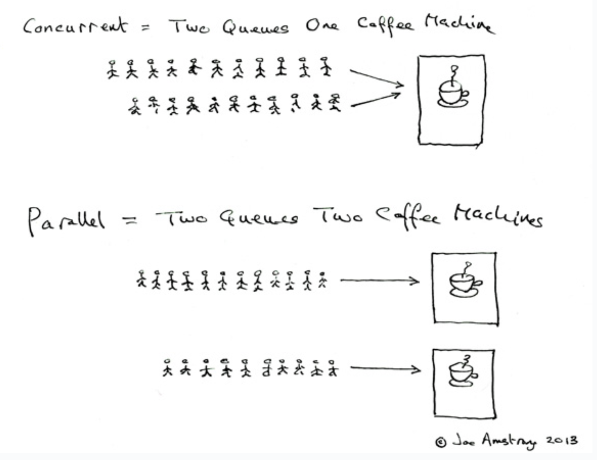

并发（concurrent): 多个线程同时操作一个资源。单核处理多个线程。

并行（parallel):多个线程同时执行。多核同时处理多个线程。

获取CPU核数

```java
public static void main(String[] args) {
        //获取CPU核数
        //CPU密集型，IO密集型
        System.out.println(Runtime.getRuntime().availableProcessors());
    }
```

**并发编程的本质**：充分利用CPU资源

### 线程的状态

- NEW
- RUNNABLE
- BLOCKED
- WAITING
- TIME_WAITING
- TERMINATED

```java
//Thread.State
public enum State {
        /**
         * Thread state for a thread which has not yet started.
         */
        NEW,

        /**
         * Thread state for a runnable thread.  A thread in the runnable
         * state is executing in the Java virtual machine but it may
         * be waiting for other resources from the operating system
         * such as processor.
         */
        RUNNABLE,

        /**
         * Thread state for a thread blocked waiting for a monitor lock.
         * A thread in the blocked state is waiting for a monitor lock
         * to enter a synchronized block/method or
         * reenter a synchronized block/method after calling
         * {@link Object#wait() Object.wait}.
         */
        BLOCKED,

        /**
         * Thread state for a waiting thread.
         * A thread is in the waiting state due to calling one of the
         * following methods:
         * <ul>
         *   <li>{@link Object#wait() Object.wait} with no timeout</li>
         *   <li>{@link #join() Thread.join} with no timeout</li>
         *   <li>{@link LockSupport#park() LockSupport.park}</li>
         * </ul>
         *
         * <p>A thread in the waiting state is waiting for another thread to
         * perform a particular action.
         *
         * For example, a thread that has called <tt>Object.wait()</tt>
         * on an object is waiting for another thread to call
         * <tt>Object.notify()</tt> or <tt>Object.notifyAll()</tt> on
         * that object. A thread that has called <tt>Thread.join()</tt>
         * is waiting for a specified thread to terminate.
         */
        WAITING,

        /**
         * Thread state for a waiting thread with a specified waiting time.
         * A thread is in the timed waiting state due to calling one of
         * the following methods with a specified positive waiting time:
         * <ul>
         *   <li>{@link #sleep Thread.sleep}</li>
         *   <li>{@link Object#wait(long) Object.wait} with timeout</li>
         *   <li>{@link #join(long) Thread.join} with timeout</li>
         *   <li>{@link LockSupport#parkNanos LockSupport.parkNanos}</li>
         *   <li>{@link LockSupport#parkUntil LockSupport.parkUntil}</li>
         * </ul>
         */
        TIMED_WAITING,

        /**
         * Thread state for a terminated thread.
         * The thread has completed execution.
         */
        TERMINATED;
    }
```

### wait和sleep的区别

1. 来自不同的类

   wait -> object

   sleep-> thread

2. 关于锁的释放

   wait->释放锁

   sleep->抱着锁睡

3. 使用范围不同

   wait->同步代码块中

   sleep->任何地方

   

## Lock锁

### Synchronized和lock的区别

1. Synchronized 是内置java关键字，Lock是一个java类
2. Synchronized 无法判断获取锁的状态，Lock可以判断是否获取到了锁
3. Synchronized 会自动释放锁，Lock需要手动释放锁
4. Synchronized 线程1（获得锁，阻塞），线程2（等待，傻等）;Lock锁可以通过tryLock判断能否获得锁，不会傻等
5. Synchronized 可重入锁，不可以中断的，非公平锁。Lock可重入锁，可判断锁，可自定义公平/非公平
6. Synchronized 适合少量的代码同步问题，Lock适合锁大量的同步代码

### Lock接口

```java
//java.util.concurrent.locks
 Lock l = ...;
 l.lock();   	//加锁
 try {
   // access the resource protected by this lock
 } finally {
   l.unlock();  //解锁
 }
```

实现类：

- [ReentrantLock](https://docs.oracle.com/javase/8/docs/api/java/util/concurrent/locks/ReentrantLock.html)

  > - #### ReentrantLock
  >
  >   ```java
  >   public ReentrantLock()
  >   ```
  >
  >   Creates an instance of `ReentrantLock`. This is equivalent to using `ReentrantLock(false)`.
  >
  > - #### ReentrantLock
  >
  >   ```java
  >   public ReentrantLock(boolean fair)
  >   ```
  >
  >   Creates an instance of `ReentrantLock` with the given fairness policy.
  >
  >   - **Parameters:**
  >
  >     `fair` - `true` if this lock should use a fair ordering policy
  >
  >      **公平：先来先到，不可插队**
  >
  >      **非公平：不一定先来先到，可插队**
  >
  >     

  

- [ReentrantReadWriteLock.ReadLock](https://docs.oracle.com/javase/8/docs/api/java/util/concurrent/locks/ReentrantReadWriteLock.ReadLock.html)

- [ReentrantReadWriteLock.WriteLock](https://docs.oracle.com/javase/8/docs/api/java/util/concurrent/locks/ReentrantReadWriteLock.WriteLock.html)

### 生产者和消费者问题

实现一个多线程+1,-1交替执行的程序。

注意以下代码，在多于两个线程的时候，如果使用if而不是while，会造成虚假唤醒。

1. wait()要在while循环里面
2. 完成后要使用notifyAll()唤醒其他全部线程

#### synchronized实现

```java
/**
 * 生产消费者模式
 * 实现一个多线程环境下的 +1 -1交替执行
 * <p>
 * 判断等待 -> 业务 -> 释放锁，唤醒
 * <p>
 * 注意虚假唤醒
 * 1. wait()要在while循环里面,因为wait()会释放锁。
 *    如果使用if,其他线程获取锁之后，判断成立wait。
 *    当被唤醒后，全部从wait的地方继续往下执行。造成错误。
 *    举例（wait使用if判断）：
 *         当前 i = 1;
 *            线程 A(increment), wait 并释放锁
 *            线程 C(increment), wait 并释放锁
 *            线程 B(decrement), i--,唤醒 A,C
 *         当前 i = 0;
 *            线程 A(increment), 从wait()开始直接往下执行，i++
 *            线程 C(increment), 从wait()开始直接往下执行，i++
              i = 2 错误
 * 2. 完成后要notifyAll唤醒其他所有线程
 */
public class ProducerConsumer {

    public static void main(String[] args) {
        DataSync ds = new DataSync();
        new Thread(() -> {
            for (int i = 0; i < 10; i++) {
                try {
                    ds.increment();
                } catch (InterruptedException e) {
                    e.printStackTrace();
                }
            }
        }, "A").start();

        //B decrement
        //C increment
        //D decrement
    }


}

/**
 * 用 synchronized实现
 */
class DataSync {
    private int i = 0;

    public synchronized void increment() throws InterruptedException {
        while (i != 0) {	//wait()要在while循环里面
            this.wait();
        }
        i++;
        System.out.println((Thread.currentThread().getName() + "-->" + i));
        notifyAll();        //notifyAll唤醒其他所有线程
    }

    public synchronized void decrement() throws InterruptedException {
        while (i == 0) {	//wait()要在while循环里面
            this.wait();
        }
        i--;
        System.out.println((Thread.currentThread().getName() + "-->" + i));
        notifyAll();        //notifyAll唤醒其他所有线程
    }
}


```

> #### wait
>
> ```
> public final void wait()
>                 throws InterruptedException
> ```
>
> Causes the current thread to wait until another thread invokes the [`notify()`](https://docs.oracle.com/javase/8/docs/api/java/lang/Object.html#notify--) method or the [`notifyAll()`](https://docs.oracle.com/javase/8/docs/api/java/lang/Object.html#notifyAll--) method for this object. In other words, this method behaves exactly as if it simply performs the call `wait(0)`.
>
> The current thread must own this object's monitor. The thread releases ownership of this monitor and waits until another thread notifies threads waiting on this object's monitor to wake up either through a call to the `notify` method or the `notifyAll` method. The thread then waits until it can re-obtain ownership of the monitor and resumes execution.
>
> As in the one argument version, **interrupts and spurious wakeups are possible, and this method should always be used in a loop**:
>
> ```java
>      synchronized (obj) {
>          while (<condition does not hold>)
>              obj.wait();
>          ... // Perform action appropriate to condition
>      }
> ```

#### Lock实现

> `Condition` factors out the `Object` monitor methods ([`wait`](https://docs.oracle.com/javase/8/docs/api/java/lang/Object.html#wait--), [`notify`](https://docs.oracle.com/javase/8/docs/api/java/lang/Object.html#notify--) and [`notifyAll`](https://docs.oracle.com/javase/8/docs/api/java/lang/Object.html#notifyAll--)) into distinct objects to give the effect of having multiple wait-sets per object, by combining them with the use of arbitrary [`Lock`](https://docs.oracle.com/javase/8/docs/api/java/util/concurrent/locks/Lock.html) implementations. Where a `Lock` replaces the use of `synchronized` methods and statements, a `Condition` replaces the use of the Object monitor methods.
>
> ```java
> //官方关于Lock和Conditon的例子
> class BoundedBuffer {
>    final Lock lock = new ReentrantLock();
>    final Condition notFull  = lock.newCondition(); 
>    final Condition notEmpty = lock.newCondition(); 
> 
>    final Object[] items = new Object[100];
>    int putptr, takeptr, count;
> 
>    public void put(Object x) throws InterruptedException {
>      lock.lock();
>      try {
>        while (count == items.length)
>          notFull.await();
>        items[putptr] = x;
>        if (++putptr == items.length) putptr = 0;
>        ++count;
>        notEmpty.signal();
>      } finally {
>        lock.unlock();
>      }
>    }
> 
>    public Object take() throws InterruptedException {
>      lock.lock();
>      try {
>        while (count == 0)
>          notEmpty.await();
>        Object x = items[takeptr];
>        if (++takeptr == items.length) takeptr = 0;
>        --count;
>        notFull.signal();
>        return x;
>      } finally {
>        lock.unlock();
>      }
>    }
>  }
> ```

```java
/**
 * 用 Lock实现
 */
class DataLock {
    private int i = 0;
    Lock lock = new ReentrantLock();     //lock
    Condition condition = lock.newCondition();

    public void increment() {
        lock.lock();
        try {           
            while (i != 0) {
                condition.await();   //await
            }
            i++;
            System.out.println((Thread.currentThread().getName() + "-->" + i));
            condition.signalAll();  //signal
        } catch (Exception e) {
            e.printStackTrace();
        } finally {
            lock.unlock();    		//unlock
        }

    }

    public void decrement(){
        lock.lock();
        try {           
            while (i == 0) {
                condition.await();
            }
            i--;
            System.out.println((Thread.currentThread().getName() + "-->" + i));
            condition.signalAll();
        } catch (Exception e) {
            e.printStackTrace();
        } finally {
            lock.unlock();
        }
    }
}
```

#### 利用Condition实现精准唤醒

多线程按顺序打印A,B,C

```java
class Printer{
    Lock lock = new ReentrantLock();
    Condition condition1 = lock.newCondition();    // 监视A
    Condition condition2 = lock.newCondition();    // 监视B
    Condition condition3 = lock.newCondition();    // 监视C
    int i = 1;
    public void printA(){
        lock.lock();
        try {
            while(i != 1){
                condition1.await();
            }
            System.out.println(Thread.currentThread().getName() + "-->A");
            i = 2;
            condition2.signal();    //唤醒B
        } catch (Exception e) {
            e.printStackTrace();
        } finally {
            lock.unlock();
        }
    }

    public void printB(){
        lock.lock();
        try {
            while(i != 2){
                condition2.await();
            }
            System.out.println(Thread.currentThread().getName() + "-->B");
            i = 3;
            condition3.signal();    //唤醒C
        } catch (Exception e) {
            e.printStackTrace();
        } finally {
            lock.unlock();
        }
    }

    public void printC(){
        lock.lock();
        try {
            while(i != 3){
                condition3.await();
            }
            System.out.println(Thread.currentThread().getName() + "-->C");
            i = 1;
            condition1.signal();	//唤醒A
        } catch (Exception e) {
            e.printStackTrace();
        } finally {
            lock.unlock();
        }
    }

}
```

### 8锁现象

方法锁对象(object)，静态方法锁类(class)

```java
//锁加在调用的object上
public synchronized void v1{
    
}

//锁加在class上
public static synchronized void v2{
    
}
```

## 集合类不安全

### List线程不安全

```java
//List的是线程不安全的。当同步读写（修改）的时候会抛出异常
//java.util.ConcurrentModificationException
List<String> list = new ArrayList<>();
for(int i = 1; i <=100; i++){
    new Thread(()->{
        list.add("a");
        System.out.println(list);
    },"T"+i).start();
}


```

#### 解决方法1 

使用Vector, 但是 Vector读写时都加锁，效率不高

```java 
//Vector读写时都加 synchronized,包括Iterator
for(int i = 1; i <=100; i++){
    new Thread(()->{
        vector.add("a");
        System.out.println(vector);
    },"T"+i).start();
}
```

#### 解决方法2

使用集合工具类 Collections.synchronizedList(new ArrayList<String>());

synchronizedList方法创建了一个 SynchronizedList对象，该对象对所有list方法加锁

toString()和forEach()都有加锁。但是 对于 Iterator 却没有加锁。所以Iterator仍然存在同步问题。

```java
//  SynchronizedList
static class SynchronizedList<E>
        extends SynchronizedCollection<E>
        implements List<E> {
        private static final long serialVersionUID = -7754090372962971524L;
     
    	//方法上都加了锁
	    public E get(int index) {
            synchronized (mutex) {return list.get(index);}
        }
        public E set(int index, E element) {
            synchronized (mutex) {return list.set(index, element);}
        }
        public void add(int index, E element) {
            synchronized (mutex) {list.add(index, element);}
        }
        public E remove(int index) {
            synchronized (mutex) {return list.remove(index);}
        }
 }  
 // SynchronizedCollection
 static class SynchronizedCollection<E> implements Collection<E>, Serializable {
        private static final long serialVersionUID = 3053995032091335093L;

        final Collection<E> c;  // Backing Collection
        final Object mutex;     // Object on which to synchronize
        
        // iterator 并没有加锁，需要手动加锁
     	public Iterator<E> iterator() {
            return c.iterator(); // Must be manually synched by user!
        }
        // toString()和forEach()都加了锁
     	public String toString() {
            synchronized (mutex) {return c.toString();}
        }
        // Override default methods in Collection
        @Override
        public void forEach(Consumer<? super E> consumer) {
            synchronized (mutex) {c.forEach(consumer);}
        }
 }     
```

代码举例

```java
// forEach因为加了锁，没有同步问题
List<String> list = Collections.synchronizedList(new ArrayList<String>());
for (int i = 1; i <= 100; i++) {
    new Thread(() -> {
        list.add("a");
        list.forEach(System.out::print);
	}, "T" + i).start();
}

// Iterator没有加锁，仍然有同步问题 java.util.ConcurrentModificationException
List<String> list = Collections.synchronizedList(new ArrayList<String>());
for (int i = 1; i <= 100; i++) {
    new Thread(() -> {
        list.add("a");
        // Iterator仍然存在同步问题
        Iterator<String> iterator = list.iterator();
        while(iterator.hasNext()){
            System.out.print(iterator.next()+",");
        }
    }, "T" + i).start();
}
```

#### 解决方法3*

使用 java.util.concurrent包下的 CopyOnWriteArrayList<E>

> A thread-safe variant of [`ArrayList`](https://docs.oracle.com/javase/8/docs/api/java/util/ArrayList.html) in which all mutative operations (`add`, `set`, and so on) are implemented by making a fresh copy of the underlying array.
>
> This is ordinarily too costly, but may be *more* efficient than alternatives when traversal operations vastly outnumber mutations, and is useful when you cannot or don't want to synchronize traversals, yet need to preclude interference among concurrent threads. The "snapshot" style iterator method uses a reference to the state of the array at the point that the iterator was created. This array never changes during the lifetime of the iterator, so interference is impossible and the iterator is guaranteed not to throw `ConcurrentModificationException`. The iterator will not reflect additions, removals, or changes to the list since the iterator was created. Element-changing operations on iterators themselves (`remove`, `set`, and `add`) are not supported. These methods throw `UnsupportedOperationException`.
>
> All elements are permitted, including `null`.

在写(添加，修改，删除)的时候，copy一个副本进行写操作。写完成后，将array指向这个新的copy. 

这是**读写分离的一个实现方法 CopyOnWrite**。

- 所有写都会创建一个copy进行，当写操作完成后，将原来对象引用更新为写完之后的副本。
- 而所有读在当前版本中（快照）中进行。
- 优点：线程安全，读操作不用加锁，高效
- 缺点：存在一定时间的滞后性，并不能保证每次读到的都是最新数据。并且写操作时候创建副本需要额外空间。
- 总结：适合写少读多的并发场景，而且数据所占空间不能太大。

如下所示，**array引用是volatile**，对所有读线程立即可见。而在使用Iterator时，将会对当前array状态进行快照（因为写操作都在副本操作，所以在创建的iterator的是写之前array的快照，这里会返回一个COWIterator，这个iterator禁止写操作），并发的写操作不会影响iterator.

```java
 public class CopyOnWriteArrayList<E>
    implements List<E>, RandomAccess, Cloneable, java.io.Serializable {   

	/** The lock protecting all mutators */
	//可重入锁
    final transient ReentrantLock lock = new ReentrantLock();

    /** The array, accessed only via getArray/setArray. */
    // volatile,保证array引用对所有线程立即可见
    private transient volatile Object[] array;

	/**
     * Replaces the element at the specified position in this list with the
     * specified element.
     *
     * @throws IndexOutOfBoundsException {@inheritDoc}
     */
    public E set(int index, E element) {
        final ReentrantLock lock = this.lock;
        // lock
        lock.lock();
        try {
            Object[] elements = getArray();
            E oldValue = get(elements, index);
		   // 更改的值于原来的值不相等时
            if (oldValue != element) {
                int len = elements.length;
                // 原数组的copy
                Object[] newElements = Arrays.copyOf(elements, len);
                // 在新数组中更新元素
                newElements[index] = element;
                // 将array指向新数组
                setArray(newElements);
            } else {
                // Not quite a no-op; ensures volatile write semantics
                // 这里是为了保证 volatile的 happens-before 语义
                // 如果修改的值 == 原来的值，仍然需要写array
                // 保证在 set() 之前的更改对后面的读线程可见
                // 详细见 相关阅读 - CopyOnWriteArrayList与java内存模型
                setArray(elements);
            }
            return oldValue;
        } finally {
            // unlock
            lock.unlock();
        }
    }

	/**
     * Returns an iterator over the elements in this list in proper sequence.
     *
     * <p>The returned iterator provides a snapshot of the state of the list
     * when the iterator was constructed. No synchronization is needed while
     * traversing the iterator. The iterator does <em>NOT</em> support the
     * {@code remove} method.
     *
     * @return an iterator over the elements in this list in proper sequence
     */
    public Iterator<E> iterator() {
        //这个COWIterator禁止所有读线程的写操作，保证线程安全。
        return new COWIterator<E>(getArray(), 0);
    }


    static final class COWIterator<E> implements ListIterator<E> {
            /** Snapshot of the array */
            private final Object[] snapshot;
            /** Index of element to be returned by subsequent call to next.  */
            private int cursor;
        
            /**
             * Not supported. Always throws UnsupportedOperationException.
             * @throws UnsupportedOperationException always; {@code remove}
             *         is not supported by this iterator.
             */
            //不允许写操作， remove,add,set
            public void remove() {
                throw new UnsupportedOperationException();
            }
    } 
 } 
```

代码示例

```java
// CopyOnWriteArrayList
List<String> list = new CopyOnWriteArrayList<>();
for (int i = 1; i <= 100; i++) {
    new Thread(() -> {
        // 写操作 作用于copy
        list.add("a");
        
        // forEach在原array上进行，不需要加锁
        // list.forEach(System.out::print);
        
        
        // Iterator 返回一个只读的 COWIterator
        // 这个只读的Iterator是创建时候array状态的快照
        Iterator<String> iterator = list.iterator();
        while (iterator.hasNext()) {
            System.out.print(iterator.next() + ",");
        }

    }, "T" + i).start();
}
```

### Set线程不安全

HashSet的底层是由HashMap实现的。线程不安全。

```java
 	/**
     * Constructs a new, empty set; the backing <tt>HashMap</tt> instance has
     * default initial capacity (16) and load factor (0.75).
     */
    public HashSet() {
        map = new HashMap<>();
    }

    /**
     * Returns an iterator over the elements in this set.  The elements
     * are returned in no particular order.
     *
     * @return an Iterator over the elements in this set
     * @see ConcurrentModificationException
     */
    public Iterator<E> iterator() {
        return map.keySet().iterator();
    }

    /**
     * Adds the specified element to this set if it is not already present.
     * More formally, adds the specified element <tt>e</tt> to this set if
     * this set contains no element <tt>e2</tt> such that
     * <tt>(e==null&nbsp;?&nbsp;e2==null&nbsp;:&nbsp;e.equals(e2))</tt>.
     * If this set already contains the element, the call leaves the set
     * unchanged and returns <tt>false</tt>.
     *
     * @param e element to be added to this set
     * @return <tt>true</tt> if this set did not already contain the specified
     * element
     */
    public boolean add(E e) {
        return map.put(e, PRESENT)==null;
    }
```

可以用Collections.synchronizedSet 来解决。或者使用CopyOnWriteArraySet(使用CopyOnWriteArrayList来实现的)

```Java
/**
 * Creates an empty set.
 */
public CopyOnWriteArraySet() {
    al = new CopyOnWriteArrayList<E>();
}
```

### HashMap不安全

> [ConcurrentHashMap如何高效实现线程安全](https://cloud.tencent.com/developer/article/1387237)


## Callable接口

于`Runnable`相比，`Callable`有返回值，可抛出异常，调用方法不同(call)

```java
@FunctionalInterface
public interface Callable<V>
A task that returns a result and may throw an exception. Implementors define a single method with no arguments called call.
The Callable interface is similar to Runnable, in that both are designed for classes whose instances are potentially executed by another thread. A Runnable, however, does not return a result and cannot throw a checked exception.

The Executors class contains utility methods to convert from other common forms to Callable classes.
```

```java
public class CallableTest {

    public static void main(String[] args) throws ExecutionException, InterruptedException {
        FutureTask futureTask = new FutureTask(new MyCallable()); //FutureTask实现了Runable interface
        new Thread(futureTask).start();
        System.out.println("-------------get-------------");
        System.out.println(futureTask.get());  //get 会block
        System.out.println("-------------end-------------");
    }
}

class MyCallable implements Callable<Integer>{

    @Override
    public Integer call() throws Exception {
        System.out.println("run call()");
        TimeUnit.SECONDS.sleep(5);
        return 1;
    }
}
```

> [FutureTask简单用法](https://blog.csdn.net/qq_44384533/article/details/111920875)
>
> [Callable接口详解](https://blog.csdn.net/m0_37204491/article/details/87930790)

## 常用辅助类

### CountDownLatch

> A synchronization aid that allows one or more threads to wait until a set of operations being performed in other threads completes.
>
> A `CountDownLatch` is initialized with a given *count*. The [`await`](https://docs.oracle.com/javase/8/docs/api/java/util/concurrent/CountDownLatch.html#await--) methods block until the current count reaches zero due to invocations of the [`countDown()`](https://docs.oracle.com/javase/8/docs/api/java/util/concurrent/CountDownLatch.html#countDown--) method, after which all waiting threads are released and any subsequent invocations of [`await`](https://docs.oracle.com/javase/8/docs/api/java/util/concurrent/CountDownLatch.html#await--) return immediately. This is a one-shot phenomenon -- the count cannot be reset. If you need a version that resets the count, consider using a [`CyclicBarrier`](https://docs.oracle.com/javase/8/docs/api/java/util/concurrent/CyclicBarrier.html).
>
> A `CountDownLatch` is a versatile synchronization tool and can be used for a number of purposes. A `CountDownLatch` initialized with a count of one serves as a simple on/off latch, or gate: all threads invoking [`await`](https://docs.oracle.com/javase/8/docs/api/java/util/concurrent/CountDownLatch.html#await--) wait at the gate until it is opened by a thread invoking [`countDown()`](https://docs.oracle.com/javase/8/docs/api/java/util/concurrent/CountDownLatch.html#countDown--). A `CountDownLatch` initialized to *N* can be used to make one thread wait until *N* threads have completed some action, or some action has been completed N times.
>
> A useful property of a `CountDownLatch` is that it doesn't require that threads calling `countDown` wait for the count to reach zero before proceeding, it simply prevents any thread from proceeding past an [`await`](https://docs.oracle.com/javase/8/docs/api/java/util/concurrent/CountDownLatch.html#await--) until all threads could pass.

#### [CountDownLatch 原理](https://www.cnblogs.com/crazymakercircle/p/13906922.html)

Java的concurrent包里面的`CountDownLatch`其实可以把它看作一个计数器，只不过这个计数器的操作是原子操作，同时只能有一个线程去操作这个计数器，也就是同时只能有一个线程去减这个计数器里面的值。

你可以向`CountDownLatch`对象设置一个初始的数字作为计数值，任何调用这个对象上的await()方法都会阻塞，直到这个计数器的计数值被其他的线程减为0为止。

`CountDownLatch`的一个非常典型的应用场景是：有一个任务想要往下执行，但必须要等到其他的任务执行完毕后才可以继续往下执行。假如我们这个想要继续往下执行的任务调用一个`CountDownLatch`对象的await()方法，其他的任务执行完自己的任务后调用同一个`CountDownLatch`对象上的countDown()方法，这个调用await()方法的任务将一直阻塞等待，直到这个`CountDownLatch`对象的计数值减到0为止。

比如：客户端一次请求5个统计数据，服务器需要全部统计完成后，才返回客户端，可以使用`CountDownLatch`。

`CountDownLatch`在多线程并发编程中充当一个计时器的功能，并且内部维护一个count的变量，并且其操作都是原子操作，该类主要通过`countDown()`和`await()`两个方法实现功能的，首先通过建立`CountDownLatch`对象，并且传入参数即为count初始值。

如果一个线程调用了await()方法，那么这个线程便进入阻塞状态，并进入阻塞队列。如果一个线程调用了`countDown()`方法，则会使count-1；当count的值为0时，这时候阻塞队列中调用`await()`方法的线程便会逐个被唤醒，从而进入后续的操作。比如下面的例子就是有两个操作，一个是读操作一个是写操作，现在规定必须进行完写操作才能进行读操作。所以当最开始调用读操作时，需要用await()方法使其阻塞，当写操作结束时，则需要使count等于0。因此count的初始值可以定为写操作的记录数，这样便可以使得进行完写操作，然后进行读操作。

#### CountDownLatch 使用场景

电商的详情页，由众多的数据拼装组成，如可以分成一下几个模块

- 交易的收发货地址，销量
- 商品的基本信息（标题，图文详情之类的）
- 推荐的商品列表
- 评价的内容
- ....

上面的几个模块信息，都是从不同的服务获取信息，且彼此没啥关联；所以为了提高响应，完全可以做成并发获取数据，如

- 线程1获取交易相关数据
- 线程2获取商品基本信息
- 线程3获取推荐的信息
- 线程4获取评价信息
- ....

但是最终拼装数据并返回给前端，需要等到上面的所有信息都获取完毕之后，才能返回，这个场景就非常的适合 `CountDownLatch`来做了

1. 在拼装完整数据的线程中调用 `CountDownLatch#await(long, TimeUnit)` 等待所有的模块信息返回
2. 每个模块信息的获取，由一个独立的线程执行；执行完毕之后调用 `CountDownLatch#countDown()` 进行计数-1

#### 代码示例

```java
package org.javalearning.peter.juc;

import java.util.concurrent.CountDownLatch;
import java.util.concurrent.TimeUnit;

/**
 * Sample usage:
 * Here is a pair of classes in which a group of worker threads use two countdown latches:
 *
 * The first is a start signal that prevents any worker from proceeding until the driver is ready for 
 * them to proceed;
 * The second is a completion signal that allows the driver to wait until all workers have completed.
 */
public class CountDownLatchDemo {
    public static void main(String[] args) {
        CountDownLatch startSignal = new CountDownLatch(1); // driver ready signal
        CountDownLatch doneSignal = new CountDownLatch(5);  // 5 workers signal

        //5 workers
        for(int i = 0; i < 5; i++){
            new Thread(new Worker("worker"+(i+1),startSignal,doneSignal)).start();
        }

        //driver
        new Thread(new Driver(startSignal,doneSignal)).start();
    }
}

//Driver will wait all worker done
class Driver implements Runnable{
    CountDownLatch startSignal;
    CountDownLatch doneSignal;
    public Driver(CountDownLatch startSignal,CountDownLatch doneSignal){
        this.startSignal = startSignal;
        this.doneSignal = doneSignal;
    }

    @Override
    public void run() {
        try {
            // do something else
            TimeUnit.SECONDS.sleep(3);
            // drive is ready,count down signal
            startSignal.countDown();
            System.out.println("Driver is ready");
            System.out.println("Driver is waiting for all worker done");
            // wait all worker done
            doneSignal.await();
            System.out.println("All worker done! Go...");
        } catch (InterruptedException e) {
            e.printStackTrace();
        }
    }
}

//Worker wait for driver ready. Then start to work...
class Worker implements Runnable{
    CountDownLatch startSignal;
    CountDownLatch doneSignal;
    String name;
    public Worker(String name,CountDownLatch startSignal,CountDownLatch doneSignal){
        this.startSignal = startSignal;
        this.doneSignal = doneSignal;
        this.name = name;
    }

    @Override
    public void run() {
        try {
            System.out.println(this.name + " is waiting for driver");
            // worker wait for driver is ready
            startSignal.await();
            // worker start working
            System.out.println(this.name + " is working");
            TimeUnit.SECONDS.sleep(2);
            // worker done, count down signal
            System.out.println(this.name + " is done");
            doneSignal.countDown();
        } catch (InterruptedException e) {
            e.printStackTrace();
        }
    }
}

package org.javalearning.peter.juc;

import java.util.concurrent.*;

/**
 *  Another typical usage would be to divide a problem into N parts, describe each part with a Runnable that
 *  executes that portion and counts down on the latch, and queue all the Runnables to an Executor. When all
 *  sub-parts are complete, the coordinating thread will be able to pass through await. (When threads must
 *  repeatedly count down in this way, instead use a CyclicBarrier.)
 */
public class CountDownLatchDemo2 {
    public static void main(String[] args) throws InterruptedException {
        // work is divided to 5 parts  
        CountDownLatch allDoneSignal = new CountDownLatch(5);
        final Executor e = Executors.newFixedThreadPool(3);
        System.out.println("start work...");
        for(int i = 1; i <= 5; i++){
            e.execute(new WorkerRunnable(allDoneSignal,i));
        }
        // wait all work parts done
        allDoneSignal.await();
        System.out.println("all works done");
    }
}

class WorkerRunnable implements Runnable{
    CountDownLatch allDoneSignal;
    int i;
    public WorkerRunnable(CountDownLatch allDoneSignal,int i){
        this.allDoneSignal = allDoneSignal;
        this.i = i;
    }

    @Override
    public void run() {
        try{
            doWork(i);
            // count down signal
            allDoneSignal.countDown();
        }catch (InterruptedException ie){
            ie.printStackTrace();
        }
    }

    public void doWork(int i) throws InterruptedException {
        System.out.println("doing work part " + i);
        TimeUnit.SECONDS.sleep(1);
    }
}
```

### CyclicBarrier

> A synchronization aid that allows a set of threads to all wait for each other to reach a common barrier point. CyclicBarriers are useful in programs involving a fixed sized party of threads that must occasionally wait for each other. The barrier is called *cyclic* because it can be re-used after the waiting threads are released.
>
> A `CyclicBarrier` supports an optional [`Runnable`](https://docs.oracle.com/javase/8/docs/api/java/lang/Runnable.html) command that is run once per barrier point, after the last thread in the party arrives, but before any threads are released. This *barrier action* is useful for updating shared-state before any of the parties continue.

#### **[CyclicBarrier 原理](https://www.cnblogs.com/crazymakercircle/p/13906379.html)**

从字面上的意思可以知道，这个类的中文意思是“循环栅栏”。大概的意思就是一个可循环利用的屏障。

它的作用就是会让所有线程都等待完成后才会继续下一步行动。

现实生活中我们经常会遇到这样的情景，在进行某个活动前需要等待人全部都齐了才开始。例如吃饭时要等全家人都上座了才动筷子，旅游时要等全部人都到齐了才出发，比赛时要等运动员都上场后才开始。

在JUC包中为我们提供了一个同步工具类能够很好的模拟这类场景，它就是`CyclicBarrier`类。利用`CyclicBarrier`类可以实现一组线程相互等待，当所有线程都到达某个屏障点后再进行后续的操作。

而 `CyclicBarrier` 基于 `Condition` 来实现的。因为 `CyclicBarrier` 的源码相对来说简单许多，读者只要熟悉了前面关于 `Condition`的分析，那么这里的源码是毫无压力的，就是几个特殊概念罢了。

在`CyclicBarrier`类的内部有一个计数器，每个线程在到达屏障点的时候都会调用`await方法`将自己阻塞，此时计数器会减1，当计数器减为0的时候所有因调用`await方法`而被阻塞的线程将被唤醒。这就是实现一组线程相互等待的原理。

#### CyclicBarrier 使用场景

可以用于多线程计算数据，最后合并计算结果的场景。

#### CyclicBarrier 重置

我们来看看怎么重置一个栅栏：

```Java
public void reset() {
    final ReentrantLock lock = this.lock;
    lock.lock();
    try {
        breakBarrier();   // break the current generation
        nextGeneration(); // start a new generation
    } finally {
        lock.unlock();
    }
}
```

我们设想一下，如果初始化时，指定了线程 parties = 4，前面有 3 个线程调用了 await 等待，在第 4 个线程调用 await 之前，我们调用 reset 方法，那么会发生什么？

首先，打破栅栏，那意味着所有等待的线程（3个等待的线程）会唤醒，await 方法会通过抛出 `BrokenBarrierException` 异常返回。然后开启新的一代，重置了 count 和 generation，相当于一切归零了。

#### CyclicBarrier 与 CountDownLatch 区别

- `CountDownLatch` 是一次性的，`CyclicBarrier `是可循环利用的
- `CountDownLatch` 参与的线程的职责是不一样的，有的在倒计时，有的在等待倒计时结束。`CyclicBarrier` 参与的线程职责是一样的。
- `CyclicBarrier` 的源码实现和 `CountDownLatch`不同，`CountDownLatch` 基于 AQS 的共享模式的使用，而 `CyclicBarrier` 基于 Condition 来实现的。因为 `CyclicBarrier` 的源码相对来说简单许多，读者只要熟悉了前面关于 Condition 的分析，那么这里的源码是毫无压力的，就是几个特殊概念罢了。

#### 代码示例

```java
package org.javalearning.peter.juc;

import java.util.concurrent.BrokenBarrierException;
import java.util.concurrent.CyclicBarrier;
import java.util.concurrent.TimeUnit;

/**
 *  Task must wait a group of sub task all complete
 */
public class CyclicBarrierDemo {
    public static void main(String[] args) {
        int threadNum = 5;
        CyclicBarrier barrier = new CyclicBarrier(5,()->{
            System.out.println("Complete Task!");
        });

        for(int i = 1; i <= threadNum;i++){
            new Thread(new TaskRunnable(barrier,"Task"+i)).start();
        }
    }
}

class TaskRunnable implements Runnable {
    CyclicBarrier barrier;
    String name;

    public TaskRunnable(CyclicBarrier barrier, String name) {
        this.barrier = barrier;
        this.name = name;
    }

    @Override
    public void run() {
        try {
            TimeUnit.SECONDS.sleep(1);
            System.out.println(this.name + " arrive Barrier A");
            // task wait other task to complete till reach the barrier
            // once await reach the barrier,will run the barrier action
            barrier.await();
            System.out.println(this.name + " crash Barrier A");

            // the cyclic barrier can be reused. here is second barrier
            // the main task will be run again if reach the barrier again
            TimeUnit.SECONDS.sleep(2);
            System.out.println(this.name + " arrive Barrier B");
            barrier.await();
            System.out.println(this.name + " crash Barrier B");
        } catch (InterruptedException e) {
            e.printStackTrace();
        } catch (BrokenBarrierException e) {
            e.printStackTrace();
        }
    }
}
```

### Semaphore

> A counting semaphore. Conceptually, a semaphore maintains a set of permits. Each [`acquire()`](https://docs.oracle.com/javase/8/docs/api/java/util/concurrent/Semaphore.html#acquire--) blocks if necessary until a permit is available, and then takes it. Each [`release()`](https://docs.oracle.com/javase/8/docs/api/java/util/concurrent/Semaphore.html#release--) adds a permit, potentially releasing a blocking acquirer. However, no actual permit objects are used; the `Semaphore` just keeps a count of the number available and acts accordingly.
>
> Semaphores are often used to restrict the number of threads than can access some (physical or logical) resource.

`Semaphore`是计数信号量。`Semaphore`管理一系列许可。每个`acquire`方法阻塞，直到有一个许可证可以获得然后拿走一个许可证；每个`release`方法增加一个许可，这可能会释放一个阻塞的`acquire`方法。然而，其实并没有实际的许可这个对象，`Semaphore`只是维持了一个可获得许可证的数量。

比如：停车场入口立着的那个显示屏，每有一辆车进入停车场显示屏就会显示剩余车位减1，每有一辆车从停车场出去，显示屏上显示的剩余车辆就会加1，当显示屏上的剩余车位为0时，停车场入口的栏杆就不会再打开，车辆就无法进入停车场了，直到有一辆车从停车场出去为止。

#### [Semaphore 原理](https://www.cnblogs.com/crazymakercircle/p/13907012.html)

- Semaphore初始化

  ```java
  Semaphore semaphore=new Semaphore(2);
  ```

  1、当调用`new Semaphore(2) `方法时，默认会创建一个非公平的锁的同步阻塞队列。

  2、把初始许可数量赋值给同步队列的state状态，state的值就代表当前所剩余的许可数量。

  

- 获取许可

  ```java
  semaphore.acquire();
  ```

  1、当前线程会尝试去同步队列获取一个许可，获取许可的过程也就是使用原子的操作去修改同步队列的state ,获取一个许可则修改为state=state-1。

  2、 当计算出来的state<0，则代表许可数量不足，此时会创建一个Node节点加入阻塞队列，挂起当前线程。

  3、当计算出来的state>=0，则代表获取许可成功。

  

- 释放许可

  ```java
  semaphore.release();
  ```

  当调用`semaphore.release() `方法时

  1、线程会尝试释放一个许可，释放许可的过程也就是把同步队列的state修改为state=state+1的过程

  2、释放许可成功之后，同时会唤醒同步队列的所有阻塞节共享节点线程

  3、被唤醒的节点会重新尝试去修改state=state-1 的操作，如果state>=0则获取许可成功，否则重新进入阻塞队列，挂起线程

#### Semaphore使用场景

用于那些资源有明确访问数量限制的场景，常用于限流 。

- 比如：数据库连接池，同时进行连接的线程有数量限制，连接不能超过一定的数量，当连接达到了限制数量后，后面的线程只能排队等前面的线程释放了数据库连接才能获得数据库连接。
- 比如：停车场场景，车位数量有限，同时只能容纳多少台车，车位满了之后只有等里面的车离开停车场外面的车才可以进入

#### 代码示例

```java
package org.javalearning.peter.juc;

import java.util.concurrent.Semaphore;
import java.util.concurrent.TimeUnit;

public class SemaphoreDemo {

    public static void main(String[] args) {
        // only 2 window open for buy lunch
        Semaphore semaphore = new Semaphore(2);
        for(int i=1; i <=10; i++){
            new Thread(()->{
                try {
                    // try to acquire the resource
                    semaphore.acquire();
                    System.out.println(Thread.currentThread().getName() + " 正在打饭");
                    TimeUnit.SECONDS.sleep(2);
                } catch (InterruptedException e) {
                    e.printStackTrace();
                } finally {
                    // release the resource
                    semaphore.release();
                    System.out.println(Thread.currentThread().getName() + " 打好了");
                }
            },"小朋友"+i).start();
        }
    }
}

```

## 读写锁

> ## Interface ReadWriteLock
>
> - - All Known Implementing Classes:
>
>     [ReentrantReadWriteLock](https://docs.oracle.com/javase/8/docs/api/java/util/concurrent/locks/ReentrantReadWriteLock.html)
>
>   ------
>
>   ```
>   public interface ReadWriteLock
>   ```
>
>   A `ReadWriteLock` maintains a pair of associated [`locks`](https://docs.oracle.com/javase/8/docs/api/java/util/concurrent/locks/Lock.html), one for read-only operations and one for writing. The [`read lock`](https://docs.oracle.com/javase/8/docs/api/java/util/concurrent/locks/ReadWriteLock.html#readLock--) may be held simultaneously by multiple reader threads, so long as there are no writers. The [`write lock`](https://docs.oracle.com/javase/8/docs/api/java/util/concurrent/locks/ReadWriteLock.html#writeLock--) is exclusive.
>
> Although the basic operation of a read-write lock is straight-forward, there are many policy decisions that an implementation must make, which may affect the effectiveness of the read-write lock in a given application. Examples of these policies include:
>
> - Determining whether to grant the read lock or the write lock, when both readers and writers are waiting, at the time that a writer releases the write lock. Writer preference is common, as writes are expected to be short and infrequent. Reader preference is less common as it can lead to lengthy delays for a write if the readers are frequent and long-lived as expected. Fair, or "in-order" implementations are also possible.
> - Determining whether readers that request the read lock while a reader is active and a writer is waiting, are granted the read lock. Preference to the reader can delay the writer indefinitely, while preference to the writer can reduce the potential for concurrency.
> - Determining whether the locks are reentrant: can a thread with the write lock reacquire it? Can it acquire a read lock while holding the write lock? Is the read lock itself reentrant?
> - Can the write lock be downgraded to a read lock without allowing an intervening writer? Can a read lock be upgraded to a write lock, in preference to other waiting readers or writers?
>
> You should consider all of these things when evaluating the suitability of a given implementation for your application.

### [读写锁的原理](https://blog.csdn.net/small_love/article/details/111406016)

从表面来看，`ReadLock`和`WriteLock`是两把锁，实际上它只是同一把锁的两个视图而已。什么叫两个视图呢？可以理解为是一把锁，线程分成两类：读线程和写线程。读线程和读线程之间不互斥（可以同时拿到这把锁），读线程和写线程互斥，写线程和写线程也互斥。

从ReentrantReadWriteLock 的构造方法中可知，readerLock 和 writerLock 实际共用同一个 sync 对象。sync 对象同互斥锁一样，分为非公平和公平两种策略，并继承自AQS。

### 注意事项

- 读写锁的使用十分简单，但是在读写锁的使用过程中，需要注意以下两点。
- `1.` 读写锁`不支持锁升级`，`支持锁降级`。锁升级指的是线程获取到了读锁，在没有释放读锁的前提下，又获取写锁。锁降级指的是线程获取到了写锁，在没有释放写锁的情况下，又获取读锁。为什么不支持锁升级呢？可以参考如下示例代码。

```java
public void lockUpgrade(){
    ReadWriteLock lock = new ReentrantReadWriteLock();
    // 创建读锁
    Lock readLock = lock.readLock();
    // 创建写锁
    Lock writeLock = lock.writeLock();
    readLock.lock();
    try{
        // ...处理业务逻辑
        writeLock.lock();   // 代码①
    }finally {
        readLock.unlock();
    }
}
```

- 在上面的示例代码中，假如T1线程先获取到了读锁，然后执行后面的代码，在执行到代码①的上一行时，T2线程也去获取读锁，由于读锁是共享锁，且此时写锁还没有被获取，所以此时T2线程可以获取到读锁，当T1执行到代码①时，尝试去获取写锁，由于有T2线程占用了读锁，所以T1线程是无法获取到写锁的，只能等待，当T2也执行到代码①时，由于T1占有了读锁，导致T2无法获取到写锁，这样两个线程就一直等待，即获取不到写锁，也释放不掉读锁。因此锁是不支持锁升级的。

- 读写锁支持锁的降级，锁的降级是为了保证可见性。让T1线程对数据的修改对其他线程可见。

  

- `2.`读锁不支持条件等待队列。当调用`ReadLock`类的`newCondition()`方法时，会直接抛出异常。

```java
public Condition newCondition() {
    throw new UnsupportedOperationException();
}
```

- 因为读锁是共享锁，最大获取次数为$2^{16}$-1，同一时刻可以被多个线程持有，对于读锁而言，其他线程没有必要等待获取读锁，Condition的等待唤醒毫无意义。

### 代码示例

```java
package org.javalearning.peter.juc;

import java.util.HashMap;
import java.util.Map;
import java.util.concurrent.TimeUnit;
import java.util.concurrent.locks.Lock;
import java.util.concurrent.locks.ReadWriteLock;
import java.util.concurrent.locks.ReentrantReadWriteLock;

public class ReadWriteLockDemo {

    public static void main(String[] args) {
        MyCache cache = new MyCache();
        for (int i = 1; i <= 5; i++) {
            final int temp = i;
            new Thread(() -> {
                cache.put("key" + temp, "value" + temp);
            }, "T" + i).start();
        }

        for (int i = 1; i <= 5; i++) {
            final int temp = i;
            new Thread(() -> {
                cache.get("key" + temp);
            }, "T" + i).start();
        }

    }
}


class MyCache {
    private volatile Map<String, Object> cache = new HashMap<>();
    private ReadWriteLock lock = new ReentrantReadWriteLock();
    private Lock readLock = this.lock.readLock();
    private Lock writeLock = this.lock.writeLock();

    public Object get(String key) {
        Object value = null;
        try {
            readLock.lock(); // read lock
            value = cache.getOrDefault(key, "");
            System.out.println(Thread.currentThread().getName() + " Get Value " + value.toString());
        } catch (Exception e) {
            e.printStackTrace();
        } finally {
            readLock.unlock(); //read unlock
        }
        return value;
    }


    public void put(String key, Object value) {
        try {
            writeLock.lock(); //write lock
            if (cache.get(key) == null) {
                System.out.println(Thread.currentThread().getName() + " Start Set Value " + value.toString());
                TimeUnit.SECONDS.sleep(1);
                cache.put(key, value);
                System.out.println(Thread.currentThread().getName() + " End Set Value " + value.toString());
            }
        } catch (InterruptedException e) {

        } finally {
            writeLock.unlock(); //write unlock
        }
    }
}
```

## 阻塞队列

> java.util.concurrent
>
> ## Interface BlockingQueue<E>
>
> - - **Type Parameters:**
>
>     `E` - the type of elements held in this collection
>
>   - All Superinterfaces:
>
>     [Collection](https://docs.oracle.com/javase/8/docs/api/java/util/Collection.html)<E>, [Iterable](https://docs.oracle.com/javase/8/docs/api/java/lang/Iterable.html)<E>, [Queue](https://docs.oracle.com/javase/8/docs/api/java/util/Queue.html)<E>
>
>   - All Known Subinterfaces:
>
>     [BlockingDeque](https://docs.oracle.com/javase/8/docs/api/java/util/concurrent/BlockingDeque.html)<E>, [TransferQueue](https://docs.oracle.com/javase/8/docs/api/java/util/concurrent/TransferQueue.html)<E>
>
>   - All Known Implementing Classes:
>
>     [ArrayBlockingQueue](https://docs.oracle.com/javase/8/docs/api/java/util/concurrent/ArrayBlockingQueue.html), [DelayQueue](https://docs.oracle.com/javase/8/docs/api/java/util/concurrent/DelayQueue.html), [LinkedBlockingDeque](https://docs.oracle.com/javase/8/docs/api/java/util/concurrent/LinkedBlockingDeque.html), [LinkedBlockingQueue](https://docs.oracle.com/javase/8/docs/api/java/util/concurrent/LinkedBlockingQueue.html), [LinkedTransferQueue](https://docs.oracle.com/javase/8/docs/api/java/util/concurrent/LinkedTransferQueue.html), [PriorityBlockingQueue](https://docs.oracle.com/javase/8/docs/api/java/util/concurrent/PriorityBlockingQueue.html), [SynchronousQueue](https://docs.oracle.com/javase/8/docs/api/java/util/concurrent/SynchronousQueue.html)

`BlockingQueue`其实就是阻塞队列，是基于阻塞机制实现的线程安全的队列。而阻塞机制的实现是通过在入队和出队时加锁的方式避免并发操作。

`BlockingQueue`不同于普通的`Queue`的区别主要是：

1. 通过在入队和出队时进行加锁，保证了队列线程安全
2. 支持阻塞的入队和出队方法：当队列满时，会阻塞入队的线程，直到队列不满；当队列为空时，会阻塞出队的线程，直到队列中有元素。

`BlockingQueue`常用于**生产者-消费者模型**中，往队列里添加元素的是生产者，从队列中获取元素的是消费者；通常情况下生产者和消费者都是由多个线程组成；下图所示则为一个最常见的**生产者-消费者模型**，生产者和消费者之间通过队列平衡两者的的处理能力、进行解耦等。

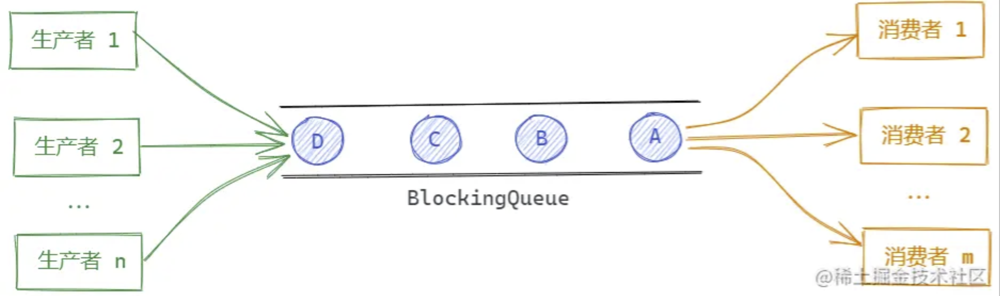

**BlockingQueue**主要提供了四类方法，如下表所示：

| 方法         | 抛出异常    | 返回特定值 | 阻塞     | 阻塞特定时间           |
| ------------ | ----------- | ---------- | -------- | ---------------------- |
| 入队         | `add(e)`    | `offer(e)` | `put(e)` | `offer(e, time, unit)` |
| 出队         | `remove()`  | `poll()`   | `take()` | `poll(time, unit)`     |
| 获取队首元素 | `element()` | `peek()`   | 不支持   | 不支持                 |

除了**抛出异常**和**返回特定值**方法与Queue接口定义相同外，BlockingQueue还提供了两类阻塞方法：一种是当队列没有空间/元素时一直阻塞，直到有空间/有元素；另一种是在特定的时间尝试入队/出队，等待时间可以自定义。

### 主要实现类

`BlockingQueue`接口主要由5个实现类，分别如下表所示。

| 实现类                      | 功能                                                         |
| --------------------------- | ------------------------------------------------------------ |
| **`ArrayBlockingQueue`**    | **基于数组的阻塞队列**，使用数组存储数据，并需要指定其长度，所以是一个**有界队列** |
| **`LinkedBlockingQueue`**   | **基于链表的阻塞队列**，使用链表存储数据，默认是一个**无界队列**；也可以通过构造方法中的`capacity`设置最大元素数量，所以也可以作为**有界队列** |
| **`SynchronousQueue`**      | 一种没有缓冲的队列，生产者产生的数据直接会被消费者获取并且立刻消费。进入一个元素，必须等待这个元素取出后，才可以放入下个元素 |
| **`PriorityBlockingQueue`** | 基于**优先级别的阻塞队列**，底层基于数组实现，是一个**无界队列** |
| **`DelayQueue`**            | **延迟队列**，其中的元素只有到了其指定的延迟时间，才能够从队列中出队 |


### ArrayBlockingQueue

`ArrayBlockingQueue`是基于数组实现的阻塞队列，下面我们看下它的主要用法。

#### 简单示例

```java
public void testArrayBlockingQueue() throws InterruptedException {
  // 创建ArrayBlockingQueue实例，设置队列大小为10
  BlockingQueue<Integer> queue = new ArrayBlockingQueue<>(10);
  boolean r1 = queue.add(1);          // 使用add方法入队元素，如果无空间则抛出异常
  boolean r2 = queue.offer(2);     		// 使用offer方法入队元素
  queue.put(3);                    		// 使用put方法入队元素；如果无空间则会一直阻塞
  boolean r3 = queue.offer(4, 30, TimeUnit.SECONDS); 	// 使用offer方法入队元素；如果无空间则会等待30s

  Integer o1 = queue.remove();        // 使用remove方法出队元素，如果无元素则抛出异常
  Integer o2 = queue.poll();          // 使用poll方法出队元素 
  Integer o3 = queue.take();          // 使用take方法出队元素；如果无元素则一直阻塞
  Integer o4 = queue.poll(10, TimeUnit.SECONDS);       // 使用poll方法出队元素； 如果无空间则等待10s
}
```

### 参考资料

[深入理解Java系列 | Queue用法详解 - 掘金 (juejin.cn)](https://juejin.cn/post/6999090895618310158)

[深入理解Java系列 | BlockingQueue用法详解 - 掘金 (juejin.cn)](https://juejin.cn/post/6999798721269465102)

[深入理解Java系列 | LinkedBlockingQueue用法详解 - 掘金 (juejin.cn)](https://juejin.cn/post/7000515796053000228)


## 线程池

`池化技术`：事先准备好一些资源，有人要用，就来拿。用完之后归还。

### 线程池的机制

可以看到线程池是一种重复利用线程的技术，线程池的主要机制就是保留一定的线程数在没有事情做的时候使之睡眠，当有活干的时候拿一个线程去运行。这些牵扯到线程池实现的具体策略。

线程池的好处：

1. 降低资源的消耗
2. 提高响应速度
3. 方便管理

线程复用，可以控制最大并发数，

### 线程池的实现类

1. ThreadPoolExecutor (1.5)
2. ForkJoinPool (1.7)
3. ScheduledThreadPoolExecutor (1.5)

### Executors提供的工厂方法

- newCachedThreadPool (ThreadPoolExecutor)

> 创建一个可缓存的线程池。如果线程池的大小超过了处理任务所需要的线程,那么就会回收部分空闲（60秒不执行任务）的线程，当任务数增加时，此线程池又可以智能的添加新线程来处理任务。此线程池不会对线程池大小做限制，线程池大小完全依赖于操作系统（或者说JVM）能够创建的最大线程大小。

- newFixedThreadPool (ThreadPoolExecutor)

> 创建固定大小的线程池。每次提交一个任务就创建一个线程，直到线程达到线程池的最大大小。线程池的大小一旦达到最大值就会保持不变，如果某个线程因为执行异常而结束，那么线程池会补充一个新线程。

- newSingleThreadExecutor (ThreadPoolExecutor)

> 创建一个单线程的线程池。这个线程池只有一个线程在工作，也就是相当于单线程串行执行所有任务。如果这个唯一的线程因为异常结束，那么会有一个新的线程来替代它。此线程池保证所有任务的执行顺序按照任务的提交顺序执行。

- newScheduledThreadPool (ScheduledThreadPoolExecutor)

> 创建一个大小无限的线程池。此线程池支持定时以及周期性执行任务的需求。

- newSingleThreadScheduledExecutor (ScheduledThreadPoolExecutor)

> 创建一个单线程用于定时以及周期性执行任务的需求。

- newWorkStealingPool (1.8 ForkJoinPool)

> 创建一个工作窃取


### ThreadPoolExecutor

`ThreadPoolExecutor` 的完全构造函数

```Java
public ThreadPoolExecutor(int corePoolSize,  
                          int maximumPoolSize,
                          long keepAliveTime,
                          TimeUnit unit,
                          BlockingQueue<Runnable> workQueue,
                          ThreadFactory threadFactory,
                          RejectedExecutionHandler handler)
```

1. `corePoolSize`

   > 核心池大小，除非设置了 `allowCoreThreadTimeOut` 否则哪怕线程超过空闲时间，池中也要最少要保留这个数目的线程。
   >
   > 需要注意的是，corePoolSize所需的线程**并不是立即创建**的，需要在提交任务之后进行创建，所以如果有大量的缓存线程数可以先提交一个空任务让线程池将线程先创建出来，从而提升后续的执行效率。

2. `maximumPoolSize`

   > 允许的最大线程数。

3. `keepAliveTime`

   > 空闲线程空闲存活时间，核心线程需要 `allowCoreThreadTimeOut` 为true才会退出。

4. `unit`

   > 与 `keepAliveTime` 配合，设置 `keepAliveTime` 的单位，如：毫秒、秒。

5. `workQueue`

   > 线程池中的任务队列。上面提到线程池的主要作用是复用线程来处理任务，所以我们需要一个队列来存放需要执行的任务，在使用池中的线程来处理这些任务，所以我们需要一个任务队列。

6. `threadFactory`

   > 当线程池判断需要新的线程时通过线程工程创建线程。

7. `handler`

   > 执行被阻止时的处理程序，线程池无法处理。这个与任务队列相关，比如队列中可以指定队列大小，如果超过了这个大小该怎么办呢？JDK已经为我们考虑到了，并提供了4个默认实现。


### 任务队列、核心线程数、最大线程数的逻辑关系

1. 当线程数小于核心线程数时，创建线程。（创建Core线程）
2. 当线程数大于等于核心线程数，且任务队列未满时，将任务放入任务队列。（Core线程达到最大数，线程进入阻塞队列等待）
3. 当线程数大于等于核心线程数，且任务队列已满（Core线程达到最大，阻塞队列已满）
   1. 若线程数小于最大线程数，创建线程  （创建辅助线程，不可以超过最大线程数。辅助线程超过空闲存活时间，将被回收）
   2. 若线程数等于最大线程数，调用拒绝执行处理程序（默认效果为：抛出异常，拒绝任务）

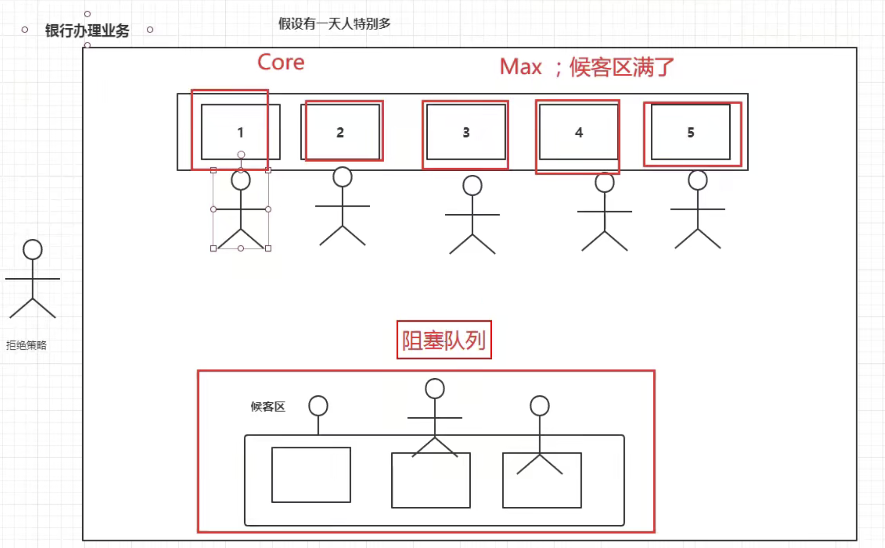


### 为什么不允许Executors快速创建线程池？

可以看到原因很简单

1. newSingleThreadExecutor
2. newFixedThreadPool

在 `workQueue` 参数直接 使用了 `new LinkedBlockingQueue<Runnable>()` 理论上可以无限添加任务到线程池。

```Java
public static ExecutorService newFixedThreadPool(int nThreads) {
    return new ThreadPoolExecutor(nThreads, nThreads,
                                    0L, TimeUnit.MILLISECONDS,
                                    new LinkedBlockingQueue<Runnable>();//无限制等待队列
}

public static ExecutorService newSingleThreadExecutor() {
    return new FinalizableDelegatedExecutorService(new ThreadPoolExecutor(1,
    1,
    0L,
    TimeUnit.MILLISECONDS,
    new LinkedBlockingQueue<Runnable>()));
}

```

如果提交到线程池的任务有问题，比如 sleep 永久，会**造成内存泄漏，最终导致OOM**。

**阿里还推荐自定义 `threadFactory` 设置线程名称便于以后排查问题**。


### ThreadPoolExecutor拒绝策略

在分析`ThreadPoolExecutor`的构造参数时，有一个`RejectedExecutionHandler`参数。

`RejectedExecutionHandler`是一个接口：

```java
public interface RejectedExecutionHandler {
    void rejectedExecution(Runnable r, ThreadPoolExecutor executor);
}
```

ThreadPoolExecutor自己已经提供了四个拒绝策略，分别是`CallerRunsPolicy`,`AbortPolicy`,`DiscardPolicy`,`DiscardOldestPolicy`


#### AbortPolicy

ThreadPoolExecutor中默认的拒绝策略就是AbortPolicy。直接抛出异常。

```java
private static final RejectedExecutionHandler defaultHandler =
    new AbortPolicy();
```

下面是他的实现：

```java
public static class AbortPolicy implements RejectedExecutionHandler {
    public AbortPolicy() { }
    public void rejectedExecution(Runnable r, ThreadPoolExecutor e) {
        throw new RejectedExecutionException("Task " + r.toString() +
                                             " rejected from " +
                                             e.toString());
    }
}
```

很简单粗暴，直接抛出个RejectedExecutionException异常，也不执行这个任务了


#### CallerRunsPolicy

CallerRunsPolicy在任务被拒绝添加后，会调用当前线程池的所在的线程去执行被拒绝的任务。

下面说他的实现：

```java
public static class CallerRunsPolicy implements RejectedExecutionHandler {
    public CallerRunsPolicy() { }
    public void rejectedExecution(Runnable r, ThreadPoolExecutor e) {
        if (!e.isShutdown()) {
            r.run();
        }
    }
}
```

也很简单，直接run。这个策略的缺点就是可能会阻塞主线程。

#### DiscardPolicy

这个策略的处理就更简单了，看一下实现就明白了：

```java
public static class DiscardPolicy implements RejectedExecutionHandler {
    public DiscardPolicy() { }
    public void rejectedExecution(Runnable r, ThreadPoolExecutor e) {
    }
}
```

这个东西什么都没干。

因此采用这个拒绝策略，会让被线程池拒绝的任务直接抛弃，不会抛异常也不会执行。


#### DiscardOldestPolicy

DiscardOldestPolicy策略的作用是，当任务被拒绝添加时，会抛弃任务队列中最旧的任务也就是最先加入队列的，再把这个新任务添加进去。

```java
public static class DiscardOldestPolicy implements RejectedExecutionHandler {
    public DiscardOldestPolicy() { }
    public void rejectedExecution(Runnable r, ThreadPoolExecutor e) {
        if (!e.isShutdown()) {
            e.getQueue().poll();//丢掉最早的等待任务
            e.execute(r);//再次执行，加入队列
        }
    }
}
```

在rejectedExecution先从任务队列总弹出最先加入的任务，空出一个位置，然后再次执行execute方法把任务加入队列。

#### 自定义拒绝策略

通过看前面的系统提供的四种拒绝策略可以看出，拒绝策略的实现都非常简单。自己写亦一样

比如现在想让被拒绝的任务在一个新的线程中执行，可以这样写：

```java
static class MyRejectedExecutionHandler implements RejectedExecutionHandler {
    @Override
    public void rejectedExecution(Runnable r, ThreadPoolExecutor executor) {
        new Thread(r,"新线程"+new Random().nextInt(10)).start();
    }
}
```

然后正常使用：

```java
ThreadPoolExecutor executor = new ThreadPoolExecutor(1, 2, 30,
        TimeUnit.SECONDS,
        new LinkedBlockingDeque<Runnable>(2),
        new MyRejectedExecutionHandler());
```

### 代码示例

[java多线程-ThreadPoolExecutor的拒绝策略 ](https://www.jianshu.com/p/9fec2424de54)

```java
package org.javalearning.peter.juc;

import java.util.Iterator;
import java.util.concurrent.LinkedBlockingDeque;
import java.util.concurrent.ThreadPoolExecutor;
import java.util.concurrent.TimeUnit;

public class ThreadPoolDemo {
    public static void main(String[] args) {
        ThreadPoolExecutor threadPoolExecutor = null;
        try {
            threadPoolExecutor = new ThreadPoolExecutor(
                    2,	// core
                    5,  // max
                    60, // alive time
                    TimeUnit.SECONDS, // alive time unit
                    new LinkedBlockingDeque<Runnable>(3), // block queue
                    //new ThreadPoolExecutor.AbortPolicy()
                    //new ThreadPoolExecutor.CallerRunsPolicy()
                    //new ThreadPoolExecutor.DiscardPolicy()
                    new ThreadPoolExecutor.DiscardOldestPolicy()  // reject policy
                    );
            for (int i = 1; i <= 9; i++) {
                System.out.println("Add " + i + " Thread!");
                /**
                 * core = 2
                 * max = 5
                 * queue = 3
                 * 在前两个thread进来之后，之后的3,4,5线程会进去阻塞队列
                 * 之后6,7,8线程进来之后，会创建辅助线程3,4,5来执行
                 * 当所有线程执行完之后，阻塞队列中的线程会继续执行
                 *
                 * 第9个线程进入之后，以为max和queue都满，将采用拒绝策略
                 *  - AbortPolicy 抛出 RejectedExecutionException
                 *  - CallerRunPolicy 丢回给caller线程去run.这里是main
                 *  - DiscardPolicy 直接丢弃，不执行
                 *  - DiscardOldestPolicy 将阻塞队列中第一个丢弃（最老的）,第9个线程重新执行。
                 */
                threadPoolExecutor.execute(new MyThread("Task" + i));
                Iterator<Runnable> iterator = threadPoolExecutor.getQueue().iterator();
                while (iterator.hasNext()) {
                    MyThread thread = (MyThread) iterator.next();
                    System.out.println("Current Queue:" + thread.name);
                }
            }
        } catch (Exception e) {
            e.printStackTrace();
        } finally {
            threadPoolExecutor.shutdown();  // threadPoolExecutor用完之后要关闭
        }
    }
}

class MyThread implements Runnable {

    String name;

    public MyThread(String name) {
        this.name = name;
    }

    @Override
    public void run() {
        try {
            TimeUnit.SECONDS.sleep(1);
        } catch (InterruptedException e) {
            e.printStackTrace();
        }
        System.out.println(Thread.currentThread().getName() + " run " + name);
    }
}

//-------------------------------------------------------------------------------
//执行结果
Add 1 Thread!
Add 2 Thread!
Add 3 Thread!        
Current Queue:Task3  // core用完后，Task3进入等待队列  
Add 4 Thread!
Current Queue:Task3
Current Queue:Task4  // core用完后，Task4进入等待队列 
Add 5 Thread!
Current Queue:Task3
Current Queue:Task4
Current Queue:Task5  // core用完后，Task5进入等待队列，等待队列已满（capacity 3）
Add 6 Thread!
Current Queue:Task3
Current Queue:Task4
Current Queue:Task5  // task6执行之后，等待队列已满，创建新的辅助线程3
Add 7 Thread!
Current Queue:Task3
Current Queue:Task4
Current Queue:Task5  // task7执行之后，等待队列已满，创建新的辅助线程4
Add 8 Thread!
Current Queue:Task3
Current Queue:Task4
Current Queue:Task5  // task8执行之后，等待队列已满，创建新的辅助线程5
Add 9 Thread!
Current Queue:Task4
Current Queue:Task5
Current Queue:Task9  // task9执行之后，等待队列已满，因为采用DiscardOldestPolicy,等待队列中的Task3被丢弃。Task9进入队列
pool-1-thread-2 run Task2  // core 2 线程 执行 Task2
pool-1-thread-1 run Task1  // core 1 线程 执行 Task1
pool-1-thread-4 run Task7  // 辅助 4 线程 执行 Task7
pool-1-thread-5 run Task8  // 辅助 5 线程 执行 Task8
pool-1-thread-3 run Task6  // 辅助 3 线程 执行 Task6
pool-1-thread-2 run Task4  // core 2 线程 执行 等待队列中的 Task4
pool-1-thread-1 run Task5  // core 1 线程 执行 等待队列中的 Task5
pool-1-thread-4 run Task9  // 辅助 4 线程 执行 等待队列中的 Task9

Process finished with exit code 0

```

## CPU密集型和IO密集型

### CPU密集型（CPU-bound）

CPU密集型也叫计算密集型，指的是系统的硬盘、内存性能相对CPU要好很多，此时，系统运作大部分的状况是CPU Loading 100%，CPU要读/写I/O(硬盘/内存)，I/O在很短的时间就可以完成，而CPU还有许多运算要处理，CPU Loading很高。

在多重程序系统中，大部份时间用来做计算、逻辑判断等CPU动作的程序称之CPU bound。例如一个计算圆周率至小数点一千位以下的程序，在执行的过程当中绝大部份时间用在三角函数和开根号的计算，便是属于CPU bound的程序。

CPU bound的程序一般而言CPU占用率相当高。这可能是因为任务本身不太需要访问I/O设备，也可能是因为程序是多线程实现因此屏蔽掉了等待I/O的时间。

### IO密集型（I/O bound）

IO密集型指的是系统的CPU性能相对硬盘、内存要好很多，此时，系统运作，大部分的状况是CPU在等I/O (硬盘/内存) 的读/写操作，此时CPU Loading并不高。

I/O bound的程序一般在达到性能极限时，CPU占用率仍然较低。这可能是因为任务本身需要大量I/O操作，而pipeline做得不是很好，没有充分利用处理器能力。

### CPU密集型 vs IO密集型

我们可以把任务分为计算密集型和IO密集型。

计算密集型任务的特点是要进行大量的计算，消耗CPU资源，比如计算圆周率、对视频进行高清解码等等，全靠CPU的运算能力。这种计算密集型任务虽然也可以用多任务完成，但是任务越多，花在任务切换的时间就越多，CPU执行任务的效率就越低，所以，要最高效地利用CPU，计算密集型任务同时进行的数量应当等于CPU的核心数。

计算密集型任务由于主要消耗CPU资源，因此，代码运行效率至关重要。Python这样的脚本语言运行效率很低，完全不适合计算密集型任务。对于计算密集型任务，最好用C语言编写。

第二种任务的类型是IO密集型，涉及到网络、磁盘IO的任务都是IO密集型任务，这类任务的特点是CPU消耗很少，任务的大部分时间都在等待IO操作完成（因为IO的速度远远低于CPU和内存的速度）。对于IO密集型任务，任务越多，CPU效率越高，但也有一个限度。常见的大部分任务都是IO密集型任务，比如Web应用。

IO密集型任务执行期间，99%的时间都花在IO上，花在CPU上的时间很少，因此，用运行速度极快的C语言替换用Python这样运行速度极低的脚本语言，完全无法提升运行效率。对于IO密集型任务，最合适的语言就是开发效率最高（代码量最少）的语言，脚本语言是首选，C语言最差。

总之，计算密集型程序适合C语言多线程，I/O密集型适合脚本语言开发的多线程。

### 线程数量设置

> [线程池大小到底该设置多大](https://cloud.tencent.com/developer/article/1832455)
>
> [线程池大小的问题](https://www.debug8.com/java/t_39632.html)

为了更好的理解线程数/程序行为/CPU状态的关系，来简单总结一下：

1. 一个极端的线程（不停执行“计算”型操作时），就可以把单个核心的利用率跑满，多核心CPU最多只能同时执行等于核心数的“极端”线程数
2. 如果每个线程都这么“极端”，且同时执行的线程数超过核心数，会导致不必要的切换，造成负载过高，只会让执行更慢
3. I/O 等暂停类操作时，CPU处于空闲状态，操作系统调度CPU执行其他线程，可以提高CPU利用率，同时执行更多的线程
4. I/O 事件的频率频率越高，或者等待/暂停时间越长，CPU的空闲时间也就更长，利用率越低，操作系统可以调度CPU执行更多的线程

#### **线程数规划的公式**

前面的铺垫，都是为了帮助理解，现在来看看书本上的定义。《Java 并发编程实战》介绍了一个线程数计算的公式：

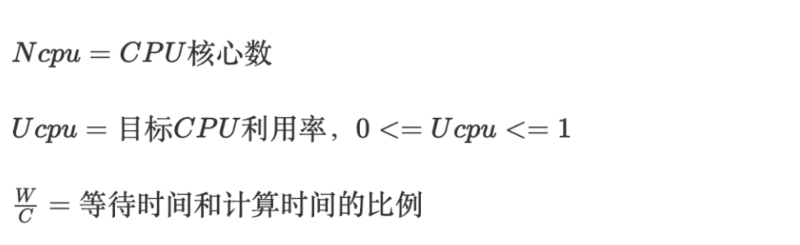

如果希望程序跑到CPU的目标利用率，需要的线程数公式为：


公式很清晰，现在来带入上面的例子试试看：

如果我期望目标利用率为90%（多核90），那么需要的线程数为：


把公式变个形，还可以通过线程数来计算CPU利用率：

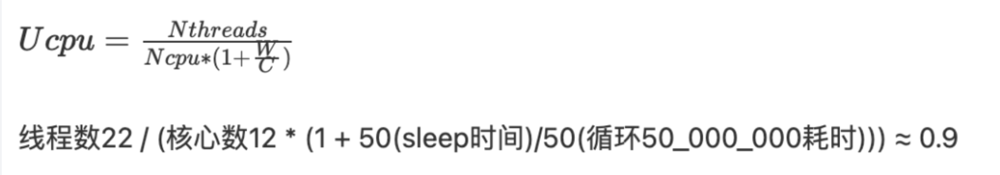

#### 真实程序中的线程数

先说结论：没有固定答案，先设定预期，比如我期望的CPU利用率在多少，负载在多少，GC频率多少之类的指标后，再通过测试不断的调整到一个合理的线程数

比如一个普通的，SpringBoot 为基础的业务系统，默认Tomcat容器+HikariCP连接池+G1回收器，如果此时项目中也需要一个业务场景的多线程（或者线程池）来异步/并行执行业务流程。

此时我按照上面的公式来规划线程数的话，误差一定会很大。因为此时这台主机上，已经有很多运行中的线程了，Tomcat有自己的线程池，HikariCP也有自己的后台线程，JVM也有一些编译的线程，连G1都有自己的后台线程。这些线程也是运行在当前进程、当前主机上的，也会占用CPU的资源。

所以受环境干扰下，单靠公式很难准确的规划线程数，一定要通过测试来验证。

流程一般是这样：

1. 分析当前主机上，有没有其他进程干扰
2. 分析当前JVM进程上，有没有其他运行中或可能运行的线程
3. 设定目标
   1. 目标CPU利用率 - 我最高能容忍我的CPU飙到多少？
   2. 目标GC频率/暂停时间 - 多线程执行后，GC频率会增高，最大能容忍到什么频率，每次暂停时间多少？
   3. 执行效率 - 比如批处理时，我单位时间内要开多少线程才能及时处理完毕
   4. ……
4. 梳理链路关键点，是否有卡脖子的点，因为如果线程数过多，链路上某些节点资源有限可能会导致大量的线程在等待资源（比如三方接口限流，连接池数量有限，中间件压力过大无法支撑等）
5. 不断的增加/减少线程数来测试，按最高的要求去测试，最终获得一个“满足要求”的线程数

所以，不要纠结设置多少线程了。没有标准答案，一定要结合场景，带着目标，通过测试去找到一个最合适的线程数。

可能还有同学可能会有疑问：“我们系统也没啥压力，不需要那么合适的线程数，只是一个简单的异步场景，不影响系统其他功能就可以”

很正常，很多的内部业务系统，并不需要啥性能，稳定好用符合需求就可以了，那么我的推荐的线程数是：**CPU核心数**

#### Java 获取CPU核心数

```java 
Runtime.getRuntime().availableProcessors()//获取逻辑核心数，如6核心12线程，那么返回的是12
```

#### Linux 获取CPU核心数

```shell
# 总核数 = 物理CPU个数 X 每颗物理CPU的核数
# 总逻辑CPU数 = 物理CPU个数 X 每颗物理CPU的核数 X 超线程数

# 查看物理CPU个数
cat /proc/cpuinfo| grep "physical id"| sort| uniq| wc -l

# 查看每个物理CPU中core的个数(即核数)
cat /proc/cpuinfo| grep "cpu cores"| uniq

# 查看逻辑CPU的个数
cat /proc/cpuinfo| grep "processor"| wc -l

# 查看CPU效率
top
```

## 四大函数式接口

### Function接口

> java.util.function
>
> ## Interface Function<T,R>
>
> - - **Type Parameters:**
>
>     `T` - the type of the input to the function
>
>     `R` - the type of the result of the function
>
>   - All Known Subinterfaces:
>
>     [UnaryOperator](https://docs.oracle.com/javase/8/docs/api/java/util/function/UnaryOperator.html)<T>
>
>   - Functional Interface:
>
>     This is a functional interface and can therefore be used as the assignment target for a lambda expression or method reference.
>
>   ------
>
>   ```
>   @FunctionalInterface
>   public interface Function<T,R>
>   ```
>
>   Represents a function that accepts one argument and produces a result.
>
>   This is a [functional interface](https://docs.oracle.com/javase/8/docs/api/java/util/function/package-summary.html) whose functional method is [`apply(Object)`](https://docs.oracle.com/javase/8/docs/api/java/util/function/Function.html#apply-T-).

```java
public class TestFunction {

    public static void main(String[] args) {
        List<Apple> apples = AppleUtils.getApples();
        //map apple to apple.getColor().length()
        List<Integer> mappedList = mapping(apples,apple -> apple.getColor().length());
        mappedList.forEach(System.out::println);

    }

    /**
     * {@link Function}
     * R apply(T t);
     * Mapping T -> R
     * @param list
     * @param function
     * @param <T>
     * @param <R>
     * @return
     */
    public static <T,R> List<R> mapping(List<T> list, Function<T,R> function){
        List<R> result = new ArrayList<R>();
        for(T t : list){
            result.add(function.apply(t));
        }
        return result;
    }

}
```


### Predicate接口

> java.util.function
>
> ## Interface Predicate<T>
>
> - - **Type Parameters:**
>
>     `T` - the type of the input to the predicate
>
>   - Functional Interface:
>
>     This is a functional interface and can therefore be used as the assignment target for a lambda expression or method reference.
>
>   ------
>
>   ```
>   @FunctionalInterface
>   public interface Predicate<T>
>   ```
>
>   Represents a predicate (boolean-valued function) of one argument.
>
>   This is a [functional interface](https://docs.oracle.com/javase/8/docs/api/java/util/function/package-summary.html) whose functional method is [`test(Object)`](https://docs.oracle.com/javase/8/docs/api/java/util/function/Predicate.html#test-T-).

```java
public class TestPredicate {

    public static void main(String[] args) {
        List<Apple> apples = AppleUtils.getApples();
        // filter apple color = red
        List<Apple> redApples = filter(apples,apple -> apple.getColor().equals("red"));
        redApples.stream().forEach(System.out::println);
    }

    /**
     * <T> Generic Method
     * {@link Predicate<T>} Predicate#test(T) return boolean
     * @param list
     * @param predicate
     * @return
     */
    public static <T> List<T> filter(java.util.List<T> list, Predicate<T> predicate){
        List<T> result = new ArrayList<T>();
        for(T t : list){
            if(predicate.test(t)){
                result.add(t);
            }
        }
        return result;
    }
}
```

### Consumer接口

> java.util.function
>
> ## Interface Consumer<T>
>
> - - **Type Parameters:**
>
>     `T` - the type of the input to the operation
>
>   - All Known Subinterfaces:
>
>     [Stream.Builder](https://docs.oracle.com/javase/8/docs/api/java/util/stream/Stream.Builder.html)<T>
>
>   - Functional Interface:
>
>     This is a functional interface and can therefore be used as the assignment target for a lambda expression or method reference.
>
>   ------
>
>   ```
>   @FunctionalInterface
>   public interface Consumer<T>
>   ```
>
>   Represents an operation that accepts a single input argument and returns no result. Unlike most other functional interfaces, `Consumer` is expected to operate via side-effects.
>
>   This is a [functional interface](https://docs.oracle.com/javase/8/docs/api/java/util/function/package-summary.html) whose functional method is [`accept(Object)`](https://docs.oracle.com/javase/8/docs/api/java/util/function/Consumer.html#accept-T-).

```java
public class TestConsumer {


    public static void main(String[] args) {
        List<Apple> apples = AppleUtils.getApples();
        foreach(apples,apple ->{
            apple.setWeight(apple.getWeight() + 10);
        });
        apples.stream().forEach(apple -> System.out.println(apple.getWeight()));


    }

    /**
     * {@link Consumer}
     * void Consumer#accept(T)
     */
     public static <E> void foreach(List<E> list, Consumer<E> consumer){
         for (E e : list){
             consumer.accept(e);
         }
     }
}

```

### Supplier接口

> java.util.function
>
> ## Interface Supplier<T>
>
> - - **Type Parameters:**
>
>     `T` - the type of results supplied by this supplier
>
>   - Functional Interface:
>
>     This is a functional interface and can therefore be used as the assignment target for a lambda expression or method reference.
>
>   ------
>
>   ```
>   @FunctionalInterface
>   public interface Supplier<T>
>   ```
>
>   Represents a supplier of results.
>
>   There is no requirement that a new or distinct result be returned each time the supplier is invoked.
>
>   This is a [functional interface](https://docs.oracle.com/javase/8/docs/api/java/util/function/package-summary.html) whose functional method is [`get()`](https://docs.oracle.com/javase/8/docs/api/java/util/function/Supplier.html#get--).

```java
public class TestSupplier {

    public static void main(String[] args) {
        List<Apple> apples = createObjects(5,()-> {
           return new Apple("red",10);
        });
        apples.forEach(System.out::println);
    }

    /**
     * {@link Supplier}
     * T get();
     * @param size
     * @param supplier
     * @param <T>
     * @return
     */
    public static <T> List<T> createObjects(int size, Supplier<T> supplier){
            List<T> result = new ArrayList<T>();
            int i = 0;
            while (i < size){
                result.add(supplier.get());
                i++;
            }
            return result;
    }
}
```


## [ForkJoin](https://www.cnblogs.com/binghe001/p/12683253.html)

> [ForkJoin框架之ForkJoinTask](https://segmentfault.com/a/1190000019549838)

ForkJoin框架的本质是一个用于并行执行任务的框架， 能够把一个大任务分割成若干个小任务，最终汇总每个小任务结果后得到大任务的计算结果。在Java中，ForkJoin框架与ThreadPool共存，并不是要替换ThreadPool

其实，在Java 8中引入的并行流计算，内部就是采用的ForkJoinPool来实现的。例如，下面使用并行流实现打印数组元组的程序。

```java
public class SumArray {
    public static void main(String[] args){
        List<Integer> numberList = Arrays.asList(1,2,3,4,5,6,7,8,9);
        numberList.parallelStream().forEach(System.out::println);
    }
}
```


### Java并发编程的发展

对于Java语言来说，生来就支持多线程并发编程，在并发编程领域也是在不断发展的。Java在其发展过程中对并发编程的支持越来越完善也正好印证了这一点。

> - Java 1 支持thread，synchronized。
> - Java 5 引入了 thread pools， blocking queues, concurrent collections，locks, condition queues。
> - Java 7 加入了fork-join库。
> - Java 8 加入了 parallel streams。

### ForkJoin框架原理

ForkJoin框架是从jdk1.7中引入的新特性,它同ThreadPoolExecutor一样，也实现了Executor和ExecutorService接口。它使用了一个无限队列来保存需要执行的任务，而线程的数量则是通过构造函数传入，如果没有向构造函数中传入指定的线程数量，那么当前计算机可用的CPU数量会被设置为线程数量作为默认值。

ForkJoinPool主要使用**分治法(Divide-and-Conquer Algorithm)**来解决问题。典型的应用比如快速排序算法。这里的要点在于，ForkJoinPool能够使用相对较少的线程来处理大量的任务。比如要对1000万个数据进行排序，那么会将这个任务分割成两个500万的排序任务和一个针对这两组500万数据的合并任务。以此类推，对于500万的数据也会做出同样的分割处理，到最后会设置一个阈值来规定当数据规模到多少时，停止这样的分割处理。比如，当元素的数量小于10时，会停止分割，转而使用插入排序对它们进行排序。那么到最后，所有的任务加起来会有大概200万+个。问题的关键在于，对于一个任务而言，只有当它所有的子任务完成之后，它才能够被执行。

所以当使用ThreadPoolExecutor时，使用分治法会存在问题，因为ThreadPoolExecutor中的线程无法向任务队列中再添加一个任务并在等待该任务完成之后再继续执行。而使用ForkJoinPool就能够解决这个问题，它就能够让其中的线程创建新的任务，并挂起当前的任务，此时线程就能够从队列中选择子任务执行。

**那么使用ThreadPoolExecutor或者ForkJoinPool，性能上会有什么差异呢？**

首先，使用ForkJoinPool能够使用数量有限的线程来完成非常多的具有父子关系的任务，比如使用4个线程来完成超过200万个任务。但是，使用ThreadPoolExecutor时，是不可能完成的，因为ThreadPoolExecutor中的Thread无法选择优先执行子任务，需要完成200万个具有父子关系的任务时，也需要200万个线程，很显然这是不可行的，也是很不合理的！！

### 工作窃取算法

假如我们需要做一个比较大的任务，我们可以把这个任务分割为若干互不依赖的子任务，为了减少线程间的竞争，于是把这些子任务分别放到不同的队列里，并为每个队列创建一个单独的线程来执行队列里的任务，线程和队列一一对应，比如A线程负责处理A队列里的任务。但是有的线程会先把自己队列里的任务干完，而其他线程对应的队列里还有任务等待处理。干完活的线程与其等着，不如去帮其他线程干活，于是它就去其他线程的队列里窃取一个任务来执行。而在这时它们会访问同一个队列，所以为了减少窃取任务线程和被窃取任务线程之间的竞争，通常会使用双端队列，被窃取任务线程永远从双端队列的头部拿任务执行，而窃取任务的线程永远从双端队列的尾部拿任务执行。

- **工作窃取算法的优点：**
  充分利用线程进行并行计算，并减少了线程间的竞争。

- **工作窃取算法的缺点：**
  在某些情况下还是存在竞争，比如双端队列里只有一个任务时。并且该算法会消耗更多的系统资源，比如创建多个线程和多个双端队列。

- **Fork/Join框架局限性：**

  对于Fork/Join框架而言，当一个任务正在等待它使用Join操作创建的子任务结束时，执行这个任务的工作线程查找其他未被执行的任务，并开始执行这些未被执行的任务，通过这种方式，线程充分利用它们的运行时间来提高应用程序的性能。为了实现这个目标，Fork/Join框架执行的任务有一些局限性。

  （1）任务只能使用Fork和Join操作来进行同步机制，如果使用了其他同步机制，则在同步操作时，工作线程就不能执行其他任务了。比如，在Fork/Join框架中，使任务进行了睡眠，那么，在睡眠期间内，正在执行这个任务的工作线程将不会执行其他任务了。
  （2）在Fork/Join框架中，所拆分的任务不应该去执行IO操作，比如：读写数据文件。
  （3）任务不能抛出检查异常，必须通过必要的代码来出来这些异常。

### ForkJoin框架的实现

**1.ForkJoinPool类**

实现了ForkJoin框架中的线程池，由类图可以看出，ForkJoinPool类实现了线程池的Executor接口。

其中，可以使用Executors.newWorkStealPool()方法创建ForkJoinPool。

ForkJoinPool中提供了如下提交任务的方法。

```java
public void execute(ForkJoinTask<?> task)
public void execute(Runnable task)
public <T> T invoke(ForkJoinTask<T> task)
public <T> List<Future<T>> invokeAll(Collection<? extends Callable<T>> tasks) 
public <T> ForkJoinTask<T> submit(ForkJoinTask<T> task)
public <T> ForkJoinTask<T> submit(Callable<T> task)
public <T> ForkJoinTask<T> submit(Runnable task, T result)
public ForkJoinTask<?> submit(Runnable task)
```

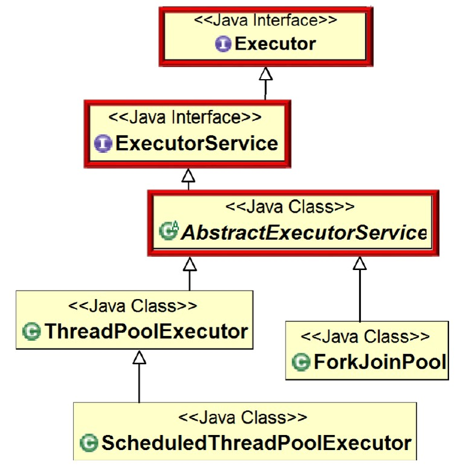

**2.ForkJoinWorkerThread类**

实现ForkJoin框架中的线程。

**3.ForkJoinTask类**

ForkJoinTask封装了数据及其相应的计算，并且支持细粒度的数据并行。ForkJoinTask比线程要轻量，ForkJoinPool中少量工作线程能够运行大量的ForkJoinTask。

ForkJoinTask类中主要包括两个方法fork()和join()，分别实现任务的分拆与合并。

fork()方法类似于Thread.start()，但是它并不立即执行任务，而是将任务放入工作队列中。跟Thread.join()方法不同，ForkJoinTask的join()方法并不简单的阻塞线程，而是利用工作线程运行其他任务，当一个工作线程中调用join()，它将处理其他任务，直到注意到目标子任务已经完成。

我们可以使用下图来表示这个过程。

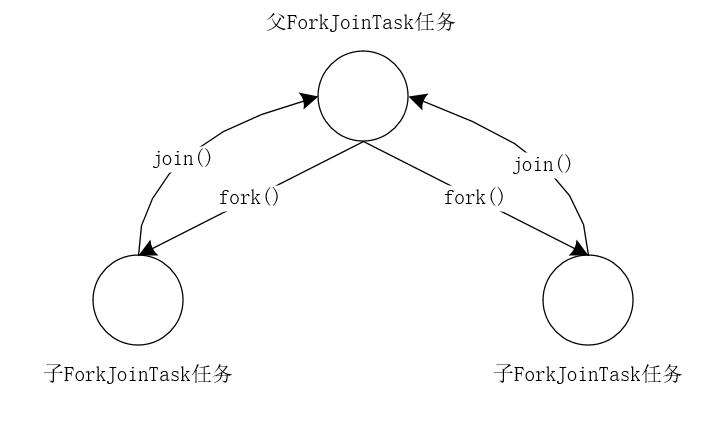

ForkJoinTask有3个子类：

- RecursiveAction：无返回值的任务。
- RecursiveTask：有返回值的任务。
- CountedCompleter：完成任务后将触发其他任务。

### ForkJoin示例程序

```java
package io.binghe.concurrency.example.aqs;
 
import lombok.extern.slf4j.Slf4j;
import java.util.concurrent.ForkJoinPool;
import java.util.concurrent.Future;
import java.util.concurrent.RecursiveTask;
@Slf4j
public class ForkJoinTaskExample extends RecursiveTask<Integer> {
    public static final int threshold = 2;
    private int start;
    private int end;
    public ForkJoinTaskExample(int start, int end) {
        this.start = start;
        this.end = end;
    }
    @Override
    protected Integer compute() {
        int sum = 0;
        //如果任务足够小就计算任务
        boolean canCompute = (end - start) <= threshold;
        if (canCompute) {
            for (int i = start; i <= end; i++) {
                sum += i;
            }
        } else {
            // 如果任务大于阈值，就分裂成两个子任务计算
            int middle = (start + end) / 2;
            ForkJoinTaskExample leftTask = new ForkJoinTaskExample(start, middle);
            ForkJoinTaskExample rightTask = new ForkJoinTaskExample(middle + 1, end);
 
            // 执行子任务
            leftTask.fork();
            rightTask.fork();
 
            // 等待任务执行结束合并其结果
            int leftResult = leftTask.join();
            int rightResult = rightTask.join();
 
            // 合并子任务
            sum = leftResult + rightResult;
        }
        return sum;
    }
    public static void main(String[] args) {
        ForkJoinPool forkjoinPool = new ForkJoinPool();
 
        //生成一个计算任务，计算1+2+3+4
        ForkJoinTaskExample task = new ForkJoinTaskExample(1, 100);
 
        //执行一个任务
        Future<Integer> result = forkjoinPool.submit(task);
 
        try {
            log.info("result:{}", result.get());
        } catch (Exception e) {
            log.error("exception", e);
        }
    }
}
```

## 异步回调

> [java实现异步回调](https://www.cnblogs.com/liujiarui/p/13395424.html)

### **异步回调** 

异步回调的实现依赖于多线程或者多进程。软件模块之间总是存在着一定的接口，从调用方式上，可以把他们分为三类：同步调用、回调和异步调用。同步调用是一种阻塞式调用，调用方要等待对方执行完毕才返回，它是一种单向调用；回调是一种双向调用模式，也就是说，被调用方在接口被调用时也会调用对方的接口；异步调用是一种类似消息或事件的机制，不过它的调用方向刚好相反，接口的服务在收到某种讯息或发生某种事件时，会主动通知客户方（即调用客户方的接口）。回调和异步调用的关系非常紧密，通常我们使用回调来实现异步消息的注册，通过异步调用来实现消息的通知。

### **多线程中的“回调” （JDK8之前）**

Java多线程中可以通过callable和future或futuretask结合来获取线程执行后的返回值。实现方法是通过get方法来调用callable的call方法获取返回值。其实这种方法本质上不是回调，回调要求的是任务完成以后被调用者主动回调调用者的接口，而这里是调用者主动使用get方法阻塞获取返回值。一般情况下，我们会结合Callable和Future一起使用，通过ExecutorService的submit方法执行Callable，并返回Future。

```java
//多线程中的“回调”
public class CallBackMultiThread {
    //这里简单地使用future和callable实现了线程执行完后
    public static void main(String[] args) throws ExecutionException, InterruptedException {
        ExecutorService executor = Executors.newCachedThreadPool();
        Future<String> future = executor.submit(new Callable<String>() {
            @Override
            public String call() throws Exception {
                System.out.println("call");
                TimeUnit.SECONDS.sleep(1);
                return "str";
            }
        });
        //手动阻塞调用get通过call方法获得返回值。
        System.out.println(future.get());
        //需要手动关闭，不然线程池的线程会继续执行。
        executor.shutdown();
   
  //使用futuretask同时作为线程执行单元和数据请求单元。
    FutureTask<Integer> futureTask = new FutureTask(new Callable<Integer>() {
        @Override
        public Integer call() throws Exception {
            System.out.println("dasds");
            return new Random().nextInt();
        }
    });
    new Thread(futureTask).start();
    //阻塞获取返回值
    System.out.println(futureTask.get());
   }
}
```

**注：**比起future.get()，其实更推荐使用get (long timeout, TimeUnit unit)方法，设置了超时时间可以防止程序无限制的等待future的结果。

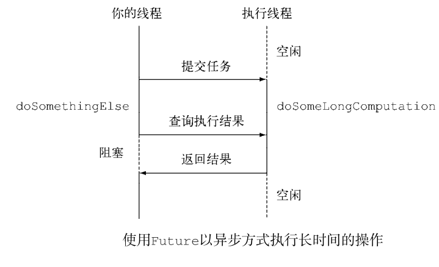

很明显，Future 接口提供了方法来检测异步计算是否已经结束（使用isDone方法），等待异步操作结束，以及获取计算的结果。但是这些特性还不足以编写简洁的并发代码。比如，很难表述 Future 结果之间的依赖性；从文字描述上这很简单，“当长时间计算任务完成时，请将该计算的结果通知到另一个长时间运行的计算任务，这两个计算任务都完成后，将计算的结果与另一个查询操作结果合并”。但是，使用Future中提供的方法完成这样的操作又是另外一回事。

 **Future的主要缺点如下：**

1. 不支持手动完成：这个意思指的是，我提交了一个任务，但是执行太慢了，我通过其他路径已经获取到了任务结果，现在没法把这个任务结果，通知到正在执行的线程，所以必须主动取消或者一直等待它执行完成。
2. 不支持进一步的非阻塞调用：这个指的是我们通过Future的get方法会一直阻塞到任务完成，但是我还想在获取任务之后，执行额外的任务，因为Future不支持回调函数，所以无法实现这个功能。
3. 不支持链式调用：这个指的是对于Future的执行结果，我们想继续传到下一个Future处理使用，从而形成一个链式的pipline调用，这在Future中是没法实现的。
4. 不支持多个Future合并：比如我们有10个Future并行执行，我们想在所有的Future运行完毕之后，执行某些函数，是没法通过Future实现的。
5. 不支持异常处理：Future的API没有任何的异常处理的api，所以在异步运行时，如果出了问题是不好定位的。

### JDK8中新增的CompletableFuture

CompletableFuture在Java里面被用于异步编程，异步通常意味着非阻塞，可以使得我们的任务单独运行在与主线程分离的其他线程中，并且通过回调可以在主线程中得到异步任务的执行状态，是否完成，和是否异常等信息。CompletableFuture实现了Future, CompletionStage接口，实现了Future接口就可以兼容现在有线程池框架，而CompletionStage接口才是异步编程的接口抽象，里面定义多种异步方法，通过这两者集合，从而打造出了强大的CompletableFuture类。

> **Future vs CompletableFuture**
> Futrue在Java里面，通常用来表示一个异步任务的引用，比如我们将任务提交到线程池里面，然后我们会得到一个Futrue，在Future里面有isDone方法来 判断任务是否处理结束，还有get方法可以一直阻塞直到任务结束然后获取结果，但整体来说这种方式，还是同步的，因为需要客户端不断阻塞等待或者不断轮询才能知道任务是否完成。

Java 8新增的CompletableFuture类正是吸收了所有Google Guava中ListenableFuture和SettableFuture的特征，还提供了其它强大的功能，让Java拥有了完整的非阻塞编程模型：Future、Promise 和 Callback(在Java8之前，只有无Callback 的Future)。 

CompletableFuture能够将回调放到与任务不同的线程中执行，也能将回调作为继续执行的同步函数，在与任务相同的线程中执行。它避免了传统回调最大的问题，那就是能够将控制流分离到不同的事件处理器中。

CompletableFuture弥补了Future模式的缺点。在异步的任务完成后，需要用其结果继续操作时，无需等待。可以直接通过thenAccept、thenApply、thenCompose等方式将前面异步处理的结果交给另外一个异步事件处理线程来处理。

### 代码示例

```java
public class Main {
    public static void main(String[] args) throws Exception {
        // 创建异步执行任务:
        CompletableFuture<Double> cf = CompletableFuture.supplyAsync(Main::fetchPrice);
        // 如果执行成功:
        cf.thenAccept((result) -> {
            System.out.println("price: " + result);
        });
        // 如果执行异常:
        cf.exceptionally((e) -> {
            e.printStackTrace();
            return null;
        });
        // 主线程不要立刻结束，否则CompletableFuture默认使用的线程池会立刻关闭:
        Thread.sleep(200);
    }

    static Double fetchPrice() {
        try {
            Thread.sleep(100);
        } catch (InterruptedException e) {
        }
        if (Math.random() < 0.3) {
            throw new RuntimeException("fetch price failed!");
        }
        return 5 + Math.random() * 20;
    }
}
```

创建一个`CompletableFuture`是通过`CompletableFuture.supplyAsync()`实现的，它需要一个实现了`Supplier`接口的对象：

```java
public interface Supplier<T> {
    T get();
}
```

这里我们用lambda语法简化了一下，直接传入`Main::fetchPrice`，因为`Main.fetchPrice()`静态方法的签名符合`Supplier`接口的定义（除了方法名外）。

紧接着，`CompletableFuture`已经被提交给默认的线程池执行了，我们需要定义的是`CompletableFuture`完成时和异常时需要回调的实例。完成时，`CompletableFuture`会调用`Consumer`对象：

```java
public interface Consumer<T> {
    void accept(T t);
}
```

异常时，`CompletableFuture`会调用`Function`对象：

```java
public interface Function<T, R> {
    R apply(T t);
}
```

这里我们都用lambda语法简化了代码。

可见`CompletableFuture`的优点是：

- 异步任务结束时，会自动回调某个对象的方法；
- 异步任务出错时，会自动回调某个对象的方法；
- 主线程设置好回调后，不再关心异步任务的执行。

如果只是实现了异步回调机制，我们还看不出`CompletableFuture`相比`Future`的优势。`CompletableFuture`更强大的功能是，多个`CompletableFuture`可以串行执行，例如，定义两个`CompletableFuture`，第一个`CompletableFuture`根据证券名称查询证券代码，第二个`CompletableFuture`根据证券代码查询证券价格，这两个`CompletableFuture`实现串行操作如下：

````java
public class Main {
    public static void main(String[] args) throws Exception {
        // 第一个任务:
        CompletableFuture<String> cfQuery = CompletableFuture.supplyAsync(() -> {
            return queryCode("中国石油");
        });
        // cfQuery成功后继续执行下一个任务:
        CompletableFuture<Double> cfFetch = cfQuery.thenApplyAsync((code) -> {
            return fetchPrice(code);
        });
        // cfFetch成功后打印结果:
        cfFetch.thenAccept((result) -> {
            System.out.println("price: " + result);
        });
        // 主线程不要立刻结束，否则CompletableFuture默认使用的线程池会立刻关闭:
        Thread.sleep(2000);
    }

    static String queryCode(String name) {
        try {
            Thread.sleep(100);
        } catch (InterruptedException e) {
        }
        return "601857";
    }

    static Double fetchPrice(String code) {
        try {
            Thread.sleep(100);
        } catch (InterruptedException e) {
        }
        return 5 + Math.random() * 20;
    }
}

````

除了串行执行外，多个`CompletableFuture`还可以并行执行。例如，我们考虑这样的场景：

同时从新浪和网易查询证券代码，只要任意一个返回结果，就进行下一步查询价格，查询价格也同时从新浪和网易查询，只要任意一个返回结果，就完成操作：

```java
public class Main {
    public static void main(String[] args) throws Exception {
        // 两个CompletableFuture执行异步查询:
        CompletableFuture<String> cfQueryFromSina = CompletableFuture.supplyAsync(() -> {
            return queryCode("中国石油", "https://finance.sina.com.cn/code/");
        });
        CompletableFuture<String> cfQueryFrom163 = CompletableFuture.supplyAsync(() -> {
            return queryCode("中国石油", "https://money.163.com/code/");
        });

        // 用anyOf合并为一个新的CompletableFuture:
        CompletableFuture<Object> cfQuery = CompletableFuture.anyOf(cfQueryFromSina, cfQueryFrom163);

        // 两个CompletableFuture执行异步查询:
        CompletableFuture<Double> cfFetchFromSina = cfQuery.thenApplyAsync((code) -> {
            return fetchPrice((String) code, "https://finance.sina.com.cn/price/");
        });
        CompletableFuture<Double> cfFetchFrom163 = cfQuery.thenApplyAsync((code) -> {
            return fetchPrice((String) code, "https://money.163.com/price/");
        });

        // 用anyOf合并为一个新的CompletableFuture:
        CompletableFuture<Object> cfFetch = CompletableFuture.anyOf(cfFetchFromSina, cfFetchFrom163);

        // 最终结果:
        cfFetch.thenAccept((result) -> {
            System.out.println("price: " + result);
        });
        // 主线程不要立刻结束，否则CompletableFuture默认使用的线程池会立刻关闭:
        Thread.sleep(200);
    }

    static String queryCode(String name, String url) {
        System.out.println("query code from " + url + "...");
        try {
            Thread.sleep((long) (Math.random() * 100));
        } catch (InterruptedException e) {
        }
        return "601857";
    }

    static Double fetchPrice(String code, String url) {
        System.out.println("query price from " + url + "...");
        try {
            Thread.sleep((long) (Math.random() * 100));
        } catch (InterruptedException e) {
        }
        return 5 + Math.random() * 20;
    }
}
```

除了`anyOf()`可以实现“任意个`CompletableFuture`只要一个成功”，`allOf()`可以实现“所有`CompletableFuture`都必须成功”，这些组合操作可以实现非常复杂的异步流程控制。

最后我们注意`CompletableFuture`的命名规则：

- `xxx()`：表示该方法将继续在已有的线程中执行；
- `xxxAsync()`：表示将异步在线程池中执行。

## JMM

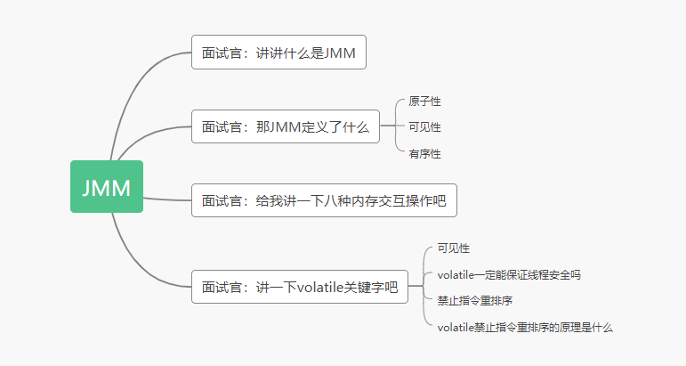


> [面试官问我什么是JMM - 知乎 (zhihu.com)](https://zhuanlan.zhihu.com/p/258393139)

JMM就是Java内存模型(java memory model)。因为在不同的硬件生产商和不同的操作系统下，内存的访问有一定的差异，所以会造成相同的代码运行在不同的系统上会出现各种问题。所以**java内存模型(JMM)屏蔽掉各种硬件和操作系统的内存访问差异，以实现让java程序在各种平台下都能达到一致的并发效果。**

Java内存模型规定**所有的变量都存储在主内存**中，包括**实例变量**，静态变量，但是不包括**局部变量**和方法参数。每个线程都有自己的工作内存，**线程的工作内存保存了该线程用到的变量和主内存的副本拷贝，线程对变量的操作都在工作内存中进行**。**线程不能直接读写主内存中的变量**。

不同的线程之间也无法访问对方工作内存中的变量。线程之间变量值的传递均需要通过主内存来完成。如果听起来抽象的话，我可以画张图给你看看，会直观一点：

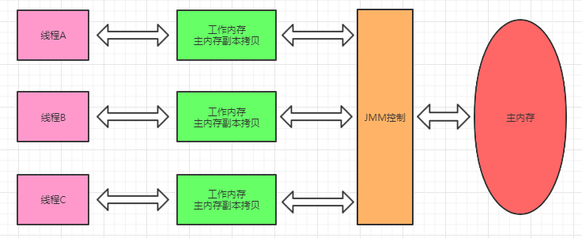

### JMM定义

整个Java内存模型实际上是围绕着三个特征建立起来的。分别是：原子性，可见性，有序性。这三个特征可谓是整个Java并发的基础。

#### 原子性

原子性指的是一个操作是不可分割，不可中断的，一个线程在执行时不会被其他线程干扰。

**面试官拿笔写了段代码，下面这几句代码能保证原子性吗**？

```java
int i = 2; // 是
int j = i; // 不是
i++;       // 不是
i = i + 1; // 不是
```

#### 可见性

可见性指当一个线程修改共享变量的值，其他线程能够立即知道被修改了。Java是利用volatile关键字来提供可见性的。 当变量被volatile修饰时，这个变量被修改后会立刻刷新到主内存，当其它线程需要读取该变量时，会去主内存中读取新值。而普通变量则不能保证这一点。

除了`volatile`关键字之外，`final`和`synchronized`也能实现可见性。

synchronized的原理是，在执行完，进入unlock之前，必须将共享变量同步到主内存中。

final修饰的字段，一旦初始化完成，如果没有对象逸出（指对象为初始化完成就可以被别的线程使用），那么对于其他线程都是可见的。

#### 有序性

在Java中，可以使用`synchronized`或者`volatile`保证多线程之间操作的有序性。实现原理有些区别：

`volatile`关键字是使用内存屏障达到禁止指令重排序，以保证有序性。

`synchronized`的原理是，一个线程lock之后，必须unlock后，其他线程才可以重新lock，使得被synchronized包住的代码块在多线程之间是串行执行的。

### 8种内存操作

- **lock（锁定）**：作用于主内存的变量，把一个变量标识为一条线程独占状态。
- **unlock（解锁）**：作用于主内存变量，把一个处于锁定状态的变量释放出来，释放后的变量才可以被其他线程锁定。
- **read（读取）**：作用于主内存变量，把一个变量值从主内存传输到线程的工作内存中，以便随后的load动作使用
- **load（载入）**：作用于工作内存的变量，它把read操作从主内存中得到的变量值放入工作内存的变量副本中。
- **use（使用）**：作用于工作内存的变量，把工作内存中的一个变量值传递给执行引擎，每当虚拟机遇到一个需要使用变量的值的字节码指令时将会执行这个操作。
- **assign（赋值）**：作用于工作内存的变量，它把一个从执行引擎接收到的值赋值给工作内存的变量，每当虚拟机遇到一个给变量赋值的字节码指令时执行这个操作。
- **store（存储）**：作用于工作内存的变量，把工作内存中的一个变量的值传送到主内存中，以便随后的write的操作。
- **write（写入）**：作用于主内存的变量，它把store操作从工作内存中一个变量的值传送到主内存的变量中。

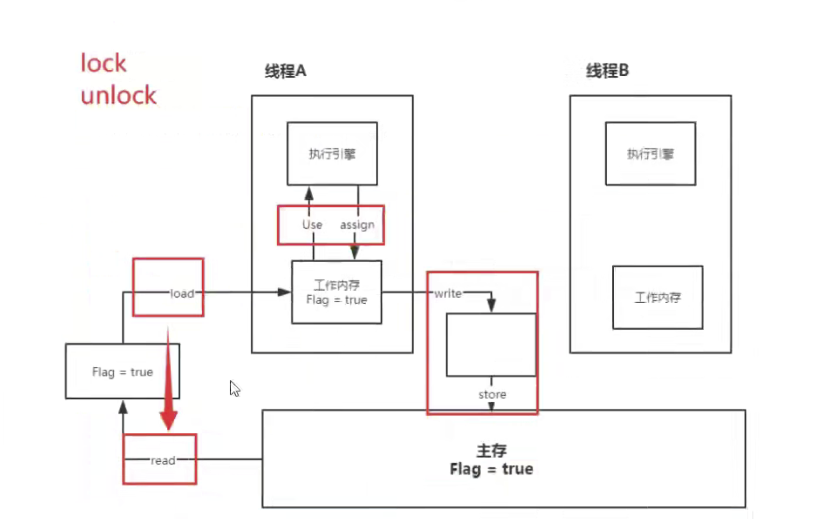

Java内存模型还规定了在执行上述八种基本操作时，必须满足如下规则：

- 如果要把一个变量从主内存中复制到工作内存，就需要按顺寻地执行read和load操作， 如果把变量从工作内存中同步回主内存中，就要按顺序地执行store和write操作。但Java内存模型只要求上述操作必须按顺序执行，而没有保证必须是连续执行。
- 不允许read和load、store和write操作之一单独出现
- 不允许一个线程丢弃它的最近assign的操作，即变量在工作内存中改变了之后必须同步到主内存中。
- 不允许一个线程无原因地（没有发生过任何assign操作）把数据从工作内存同步回主内存中。
- 一个新的变量只能在主内存中诞生，不允许在工作内存中直接使用一个未被初始化（load或assign）的变量。即就是对一个变量实施use和store操作之前，必须先执行过了assign和load操作。
- 一个变量在同一时刻只允许一条线程对其进行lock操作，但lock操作可以被同一条线程重复执行多次，多次执行lock后，只有执行相同次数的unlock操作，变量才会被解锁。lock和unlock必须成对出现
- 如果对一个变量执行lock操作，将会清空工作内存中此变量的值，在执行引擎使用这个变量前需要重新执行load或assign操作初始化变量的值
- 如果一个变量事先没有被lock操作锁定，则不允许对它执行unlock操作；也不允许去unlock一个被其他线程锁定的变量。
- 对一个变量执行unlock操作之前，必须先把此变量同步到主内存中（执行store和write操作）。

### volatile关键字

volatile关键字，主要的作用包括两点（不包括原子性）：

1. **保证线程间变量的可见性。**

   volatile修饰的变量，当一个线程改变了该变量的值，其他线程是立即可见的。普通变量则需要重新读取才能获得最新值。

   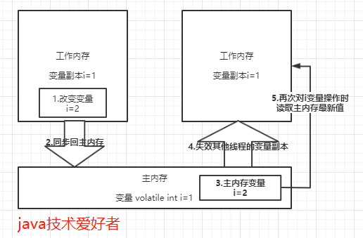

   

2. **禁止CPU进行指令重排序。**

   首先要讲一下as-if-serial语义，不管怎么重排序，（单线程）程序的执行结果不能被改变。

   为了使指令更加符合CPU的执行特性，最大限度的发挥机器的性能，提高程序的执行效率，只要程序的最终结果与它顺序化情况的结果相等，那么指令的执行顺序可以与代码逻辑顺序不一致，这个过程就叫做**指令的重排序**。

   重排序的种类分为三种，分别是：编译器重排序，指令级并行的重排序，内存系统重排序。整个过程如下所示：

   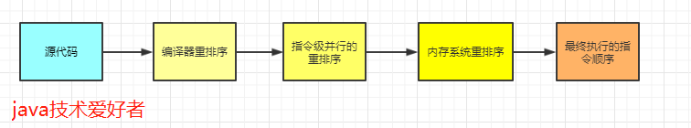

   指令重排序在单线程是没有问题的，不会影响执行结果，而且还提高了性能。但是在多线程的环境下就不能保证一定不会影响执行结果了。

   **所以在多线程环境下，就需要禁止指令重排序**。

   volatile关键字禁止指令重排序有两层意思：

   - 当程序执行到volatile变量的读操作或者写操作时，在其前面的操作的更改肯定全部已经进行，且结果已经对后面的操作可见，在其后面的操作肯定还没有进行。
   - 在进行指令优化时，不能将在对volatile变量访问的语句放在其后面执行，也不能把volatile变量后面的语句放到其前面执行。

## 彻底了解单例模式

单例模式三个主要特点：1、构造方法私有化；2、实例化的变量引用私有化；3、获取实例的方法共有。

### 双重检查加锁方式

 如果不使用枚举，大家采用的一般都是“双重检查加锁”这种方式。

```java
public class Singleton {
 2     private volatile static Singleton uniqueInstance; // volatile防止指令重排
 3     private Singleton() {}
 4     public static Singleton getInstance() {
 5         if (uniqueInstance == null) {
 6             synchronized (Singleton.class){
 7                 if(uniqueInstance == null){//进入区域后，再检查一次，如果仍是null,才创建实例
     				  /*
     				   * new 的三个操作
     				   * 1. 为对象创建内存空间
     				   * 2. init，调用构造方法创建对象
     				   * 3. 把对象引用指向内存空间
     				   * 如果不使用volatile禁止指令重排，可能执行顺序为1,3,2 
     				   * 当执行3之后，2之前
     				   * 这个时候当有另一个线程进入时候，uniqueInstance 并不是null
     				   * 而返回的uniqueInstance却是一个空的内存空间
     				   */
 8                     uniqueInstance = new Singleton(); 
 9                 }
10             }
11         }
12         return uniqueInstance;
13     }
14 }
```

### 为什么要用枚举单例

- 私有化构造器并不保险

  > 《effective java》中只简单的提了几句话：“享有特权的客户端可以借助AccessibleObject.setAccessible方法，通过反射机制调用私有构造器。如果需要低于这种攻击，可以修改构造器，让它在被要求创建第二个实例的时候抛出异常。”

  ```java
  public static void main(String[] args) throws NoSuchMethodException, IllegalAccessException, InvocationTargetException, InstantiationException {
            Singleton s=Singleton.getInstance();
            Singleton sUsual=Singleton.getInstance();
            Constructor<Singleton> constructor=Singleton.class.getDeclaredConstructor();
            constructor.setAccessible(true);
            Singleton sReflection=constructor.newInstance();
            System.out.println(s+"\n"+sUsual+"\n"+sReflection);
            System.out.println("正常情况下，实例化两个实例是否相同："+(s==sUsual));
            System.out.println("通过反射攻击单例模式情况下，实例化两个实例是否相同："+(s==sReflection));
   }
  
  //output
  com.lxp.pattern.singleton.Singleton@1540e19d
  com.lxp.pattern.singleton.Singleton@1540e19d
  com.lxp.pattern.singleton.Singleton@677327b6
  正常情况下，实例化两个实例是否相同：true
  通过反射攻击单例模式情况下，实例化两个实例是否相同：false
  ```

-  序列化问题

   可以看出，序列化前后两个对象并不想等。简单来说“任何一个readObject方法，不管是显式的还是默认的，它都会返回一个新建的实例，这个新建的实例不同于该类初始化时创建的实例。”当然，这个问题也是可以解决的，想详细了解的同学可以翻看《effective java》第77条：对于实例控制，枚举类型优于readResolve。

```java
public class SerSingleton implements Serializable {
      private volatile static SerSingleton uniqueInstance;
      private  String content;
      public String getContent() {
          return content;
      }
  
      public void setContent(String content) {
          this.content = content;
     }
     private SerSingleton() {
     }
 
     public static SerSingleton getInstance() {
         if (uniqueInstance == null) {
             synchronized (SerSingleton.class) {
                 if (uniqueInstance == null) {
                     uniqueInstance = new SerSingleton();
                 }
             }
         }
         return uniqueInstance;
     }
 
     
     public static void main(String[] args) throws IOException, ClassNotFoundException {
         SerSingleton s = SerSingleton.getInstance();
         s.setContent("单例序列化");
         System.out.println("序列化前读取其中的内容："+s.getContent());
         ObjectOutputStream oos = new ObjectOutputStream(new FileOutputStream("SerSingleton.obj"));
         oos.writeObject(s);
         oos.flush();
         oos.close();
 
         FileInputStream fis = new FileInputStream("SerSingleton.obj");
         ObjectInputStream ois = new ObjectInputStream(fis);
         SerSingleton s1 = (SerSingleton)ois.readObject();
         ois.close();
         System.out.println(s+"\n"+s1);
         System.out.println("序列化后读取其中的内容："+s1.getContent());
         System.out.println("序列化前后两个是否同一个："+(s==s1));
     }
     
 }

//output
序列化前读取其中的内容：单例序列化
com.lxp.pattern.singleton.SerSingleton@135fbaa4
com.lxp.pattern.singleton.SerSingleton@58372a00
序列化后读取其中的内容：单例序列化
序列化前后两个是否同一个：false
```

### 枚举类详解

#### 枚举单例定义

```java
public enum  EnumSingleton {
    INSTANCE;
    public EnumSingleton getInstance(){
        return INSTANCE;
    }
}
```

编译后相当于：

```java
public final class  EnumSingleton extends Enum< EnumSingleton> {
         public static final  EnumSingleton  ENUMSINGLETON;
         public static  EnumSingleton[] values();
         public static  EnumSingleton valueOf(String s);
         static {};
 }
```

#### 避免反射攻击

```java
public enum  EnumSingleton {
      INSTANCE;
      public EnumSingleton getInstance(){
          return INSTANCE;
      }
  
      public static void main(String[] args) throws IllegalAccessException, InvocationTargetException, InstantiationException, NoSuchMethodException {
          EnumSingleton singleton1=EnumSingleton.INSTANCE;
          EnumSingleton singleton2=EnumSingleton.INSTANCE;
          System.out.println("正常情况下，实例化两个实例是否相同："+(singleton1==singleton2));
          Constructor<EnumSingleton> constructor= null;
          constructor = EnumSingleton.class.getDeclaredConstructor(); // 无参构造器
          constructor.setAccessible(true);
          EnumSingleton singleton3= null;
          singleton3 = constructor.newInstance();
          System.out.println(singleton1+"\n"+singleton2+"\n"+singleton3);
          System.out.println("通过反射攻击单例模式情况下，实例化两个实例是否相同："+(singleton1==singleton3));
     }
 }

//output
//java.lang.NoSuchMethodException
Exception in thread "main" java.lang.NoSuchMethodException: com.lxp.pattern.singleton.EnumSingleton.<init>()
    at java.lang.Class.getConstructor0(Class.java:3082)
    at java.lang.Class.getDeclaredConstructor(Class.java:2178)
    at com.lxp.pattern.singleton.EnumSingleton.main(EnumSingleton.java:20)
    at sun.reflect.NativeMethodAccessorImpl.invoke0(Native Method)
    at sun.reflect.NativeMethodAccessorImpl.invoke(NativeMethodAccessorImpl.java:62)
    at sun.reflect.DelegatingMethodAccessorImpl.invoke(DelegatingMethodAccessorImpl.java:43)
    at java.lang.reflect.Method.invoke(Method.java:498)
    at com.intellij.rt.execution.application.AppMain.main(AppMain.java:144)
正常情况下，实例化两个实例是否相同：true
```

然后debug模式，可以发现是因为EnumSingleton.class.getDeclaredConstructors()获取所有构造器，会发现并没有我们所设置的无参构造器，只有一个参数为（String.class,int.class）构造器，然后看下Enum源码就明白，这两个参数是name和ordial两个属性：

```java
public abstract class Enum<E extends Enum<E>>
            implements Comparable<E>, Serializable {
        private final String name;
        public final String name() {
            return name;
        }
        private final int ordinal;
        public final int ordinal() {
            return ordinal;
        }
        protected Enum(String name, int ordinal) {   // 默认两个参数的构造函数
            this.name = name;
            this.ordinal = ordinal;
        }
        //余下省略
```

枚举Enum是个抽象类，其实一旦一个类声明为枚举，实际上就是继承了Enum，所以会有（String.class,int.class）的构造器。既然是可以获取到父类Enum的构造器，那你也许会说刚才我的反射是因为自身的类没有无参构造方法才导致的异常，并不能说单例枚举避免了反射攻击。

```java
public enum  EnumSingleton {
    INSTANCE;
    public EnumSingleton getInstance(){
        return INSTANCE;
    }

    public static void main(String[] args) throws IllegalAccessException, InvocationTargetException, InstantiationException, NoSuchMethodException {
        EnumSingleton singleton1=EnumSingleton.INSTANCE;
        EnumSingleton singleton2=EnumSingleton.INSTANCE;
        System.out.println("正常情况下，实例化两个实例是否相同："+(singleton1==singleton2));
        Constructor<EnumSingleton> constructor= null;
//        constructor = EnumSingleton.class.getDeclaredConstructor();
        constructor = EnumSingleton.class.getDeclaredConstructor(String.class,int.class);//其父类的构造器
        constructor.setAccessible(true);
        EnumSingleton singleton3= null;
        //singleton3 = constructor.newInstance();
        singleton3 = constructor.newInstance("testInstance",66);
        System.out.println(singleton1+"\n"+singleton2+"\n"+singleton3);
        System.out.println("通过反射攻击单例模式情况下，实例化两个实例是否相同："+(singleton1==singleton3));
    }
}

//output
正常情况下，实例化两个实例是否相同：true
Exception in thread "main" java.lang.IllegalArgumentException: Cannot reflectively create enum objects 
    at java.lang.reflect.Constructor.newInstance(Constructor.java:417)
    at com.lxp.pattern.singleton.EnumSingleton.main(EnumSingleton.java:25)
    at sun.reflect.NativeMethodAccessorImpl.invoke0(Native Method)
    at sun.reflect.NativeMethodAccessorImpl.invoke(NativeMethodAccessorImpl.java:62)
    at sun.reflect.DelegatingMethodAccessorImpl.invoke(DelegatingMethodAccessorImpl.java:43)
    at java.lang.reflect.Method.invoke(Method.java:498)
    at com.intellij.rt.execution.application.AppMain.main(AppMain.java:144)
```

继续报异常。之前是因为没有无参构造器，这次拿到了父类的构造器了，只是在执行第17行(我没有复制import等包，所以行号少于我自己运行的代码)时候抛出异常，说是不能够反射，我们看下Constructor类的newInstance方法源码：

```java
@CallerSensitive
    public T newInstance(Object ... initargs)
        throws InstantiationException, IllegalAccessException,
               IllegalArgumentException, InvocationTargetException
    {
        if (!override) {
            if (!Reflection.quickCheckMemberAccess(clazz, modifiers)) {
                Class<?> caller = Reflection.getCallerClass();
                checkAccess(caller, clazz, null, modifiers);
            }
        }
        if ((clazz.getModifiers() & Modifier.ENUM) != 0) // 禁止了ENRM的反射
            throw new IllegalArgumentException("Cannot reflectively create enum objects");
        ConstructorAccessor ca = constructorAccessor;   // read volatile
        if (ca == null) {
            ca = acquireConstructorAccessor();
        }
        @SuppressWarnings("unchecked")
        T inst = (T) ca.newInstance(initargs);
        return inst;
    }
```

#### 避免序列化问题

枚举类是JDK1.5才出现的，那之前的程序员面对反射攻击和序列化问题是怎么解决的呢？其实就是像Enum源码那样解决的，只是现在可以用enum可以使我们代码量变的极其简洁了。至此，相信同学们应该能明白了为什么Joshua Bloch说的“单元素的枚举类型已经成为实现Singleton的最佳方法”了吧，也算解决了我自己的困惑。既然能解决这些问题，还能使代码量变的极其简洁，那我们就有理由选枚举单例模式了。对了，解决序列化问题，要先懂transient和readObject，鉴于我的主要目的不在于此，就不在此写这两个原理了。

```java
public enum  SerEnumSingleton implements Serializable {
    INSTANCE;
    private  String content;
    public String getContent() {
        return content;
    }
    public void setContent(String content) {
        this.content = content;
    }
    private SerEnumSingleton() {
    }

    public static void main(String[] args) throws IOException, ClassNotFoundException {
        SerEnumSingleton s = SerEnumSingleton.INSTANCE;
        s.setContent("枚举单例序列化");
        System.out.println("枚举序列化前读取其中的内容："+s.getContent());
        ObjectOutputStream oos = new ObjectOutputStream(new FileOutputStream("SerEnumSingleton.obj"));
        oos.writeObject(s);
        oos.flush();
        oos.close();

        FileInputStream fis = new FileInputStream("SerEnumSingleton.obj");
        ObjectInputStream ois = new ObjectInputStream(fis);
        SerEnumSingleton s1 = (SerEnumSingleton)ois.readObject();
        ois.close();
        System.out.println(s+"\n"+s1);
        System.out.println("枚举序列化后读取其中的内容："+s1.getContent());
        System.out.println("枚举序列化前后两个是否同一个："+(s==s1));
    }
}

// output
枚举序列化前读取其中的内容：枚举单例序列化
INSTANCE
INSTANCE
枚举序列化后读取其中的内容：枚举单例序列化
枚举序列化前后两个是否同一个：true
```

## 排查死锁

### 死锁代码

```java
package org.javalearning.peter.juc.deadlock;

import java.util.concurrent.TimeUnit;

/**
 * To test a dead lock
 */
public class DeadLockDemo {
    public static void main(String[] args) {

        String a = "A";
        String b = "B";
        new Thread(new MyThread(a,b)).start();
        new Thread(new MyThread(b,a)).start();
    }

}

class MyThread implements Runnable{

    Object resA;
    Object resB;

    public MyThread(Object resA, Object resB) {
        this.resA = resA;
        this.resB = resB;
    }

    @Override
    public void run() {
        // lock resA and try to get resB
        Thread current = Thread.currentThread();
        synchronized (resA){
            System.out.println(current.getName() +" lock " + resA.toString() + ",try to get " + resB.toString());
            try {
                TimeUnit.SECONDS.sleep(2);
            } catch (InterruptedException e) {
                e.printStackTrace();
            }

            // lock resB and try to get resA
            synchronized (resB){
                System.out.println(current.getName() +" lock " + resB.toString() + ",try to get " + resA.toString());
                try {
                    TimeUnit.SECONDS.sleep(2);
                } catch (InterruptedException e) {
                    e.printStackTrace();
                }
            }
        }
    }
}

// Output
Thread-0 lock A,try to get B
Thread-1 lock B,try to get A

```

### 排查问题

- `jps -l`查看进程

  ```java
  D:\javalearning\MyJava8LearningProj>jps -l
  48416 org.jetbrains.jps.cmdline.Launcher
  37636 finalshell.jar
  51716 org.jetbrains.idea.maven.server.RemoteMavenServer36
  53780 sun.tools.jps.Jps
  57652 org.jetbrains.jps.cmdline.Launcher
  31772
  45004 org.javalearning.peter.juc.deadlock.DeadLockDemo    // 45004 进程编号
  46124 org.jetbrains.kotlin.daemon.KotlinCompileDaemon
  
  ```

- `jstack`命令

  jstack用于生成java虚拟机当前时刻的线程快照。线程快照是当前java虚拟机内每一条线程正在执行的方法堆栈的集合，生成线程快照的主要目的是定位线程出现长时间停顿的原因，如线程间死锁、死循环、请求外部资源导致的长时间等待等。 线程出现停顿的时候通过jstack来查看各个线程的调用堆栈，就可以知道没有响应的线程到底在后台做什么事情，或者等待什么资源。 如果java程序崩溃生成core文件，jstack工具可以用来获得core文件的java stack和native stack的信息，从而可以轻松地知道java程序是如何崩溃和在程序何处发生问题。另外，jstack工具还可以附属到正在运行的java程序中，看到当时运行的java程序的java stack和native stack的信息, 如果现在运行的java程序呈现hung的状态，jstack是非常有用的。

  ```
  　　So,jstack命令主要用来查看Java线程的调用堆栈的，可以用来分析线程问题（如死锁）。
  ```

> [jstack命令详解](https://www.cnblogs.com/myseries/p/12050083.html)

```java
D:\javalearning\MyJava8LearningProj>jstack 45004
2021-12-03 17:07:09
Full thread dump Java HotSpot(TM) 64-Bit Server VM (25.221-b11 mixed mode):


Found one Java-level deadlock:
=============================
"Thread-1":
  waiting to lock monitor 0x0000000026050e68 (object 0x0000000717ce4800, a java.lang.String),
  which is held by "Thread-0"
"Thread-0":
  waiting to lock monitor 0x0000000026053598 (object 0x0000000717ce4830, a java.lang.String),
  which is held by "Thread-1"

Java stack information for the threads listed above:
===================================================
"Thread-1":
        at org.javalearning.peter.juc.deadlock.MyThread.run(DeadLockDemo.java:43)
        - waiting to lock <0x0000000717ce4800> (a java.lang.String)
        - locked <0x0000000717ce4830> (a java.lang.String)
        at java.lang.Thread.run(Thread.java:748)
"Thread-0":
        at org.javalearning.peter.juc.deadlock.MyThread.run(DeadLockDemo.java:43)
        - waiting to lock <0x0000000717ce4830> (a java.lang.String)
        - locked <0x0000000717ce4800> (a java.lang.String)
        at java.lang.Thread.run(Thread.java:748)

Found 1 deadlock.


```

