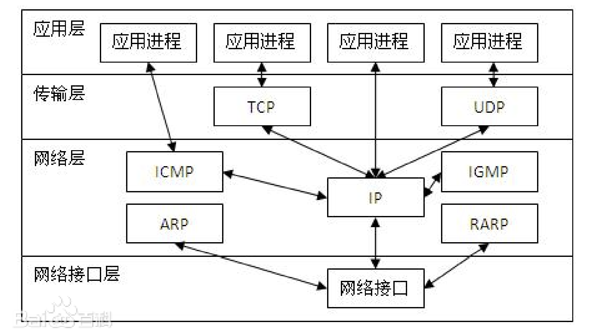
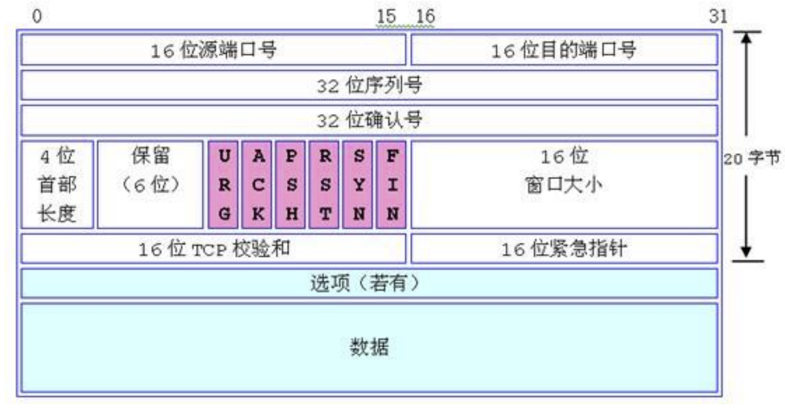
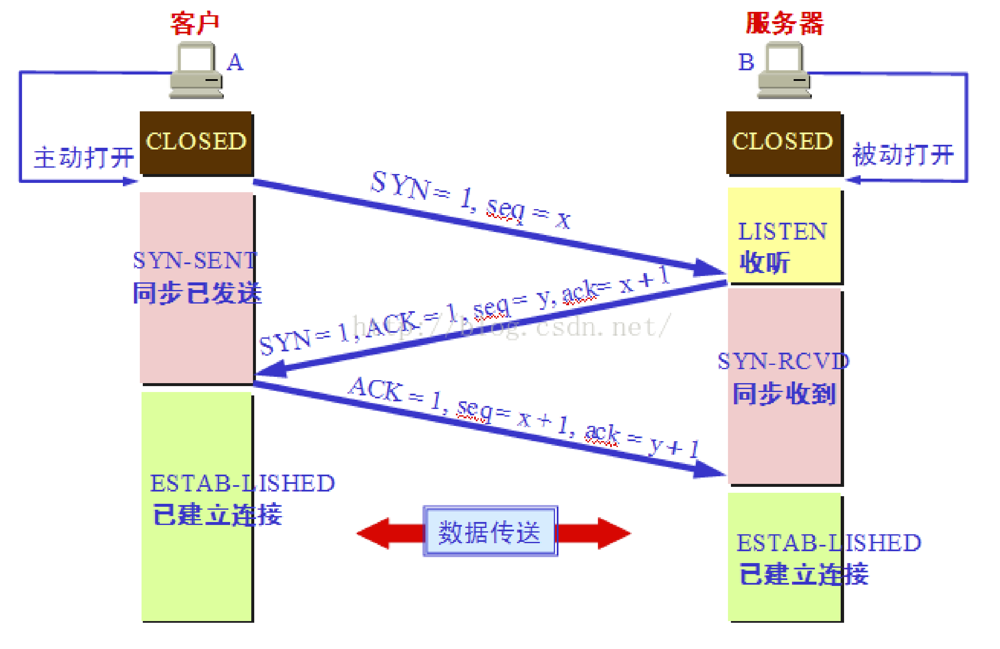
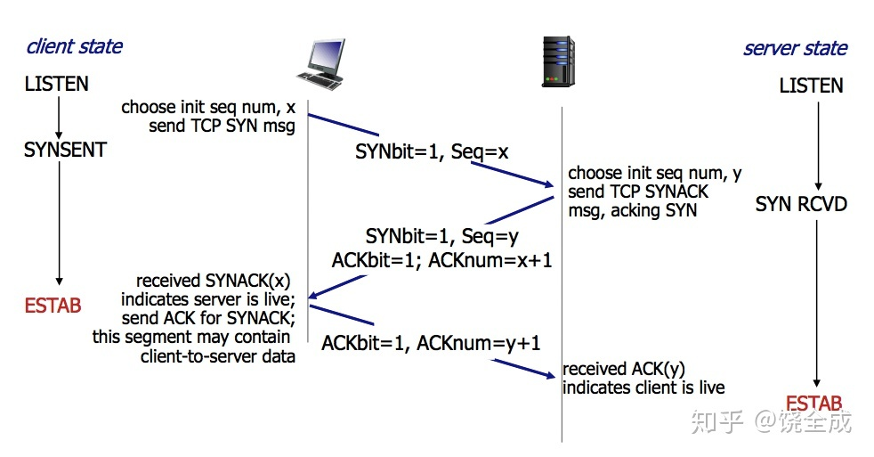
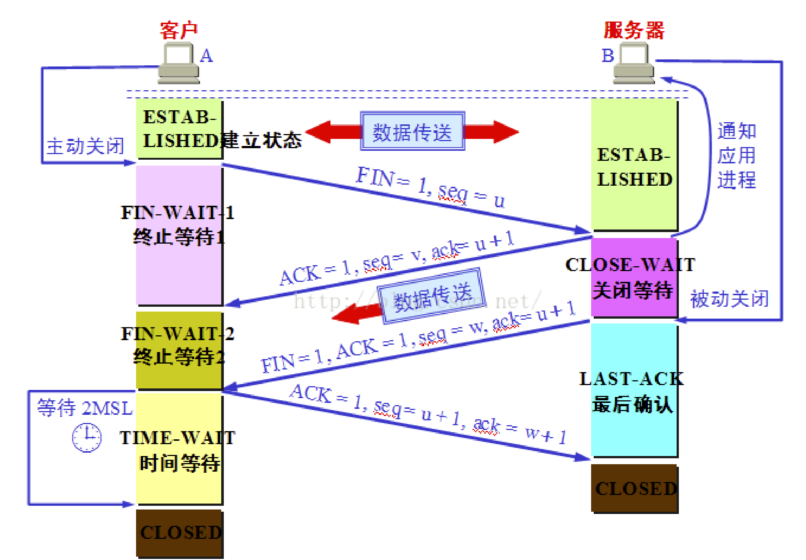
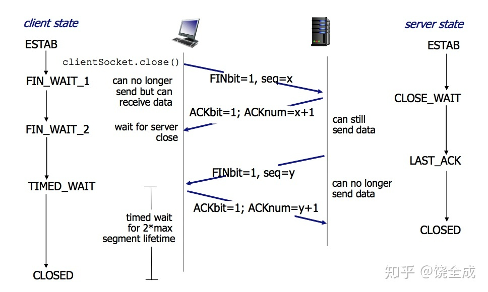
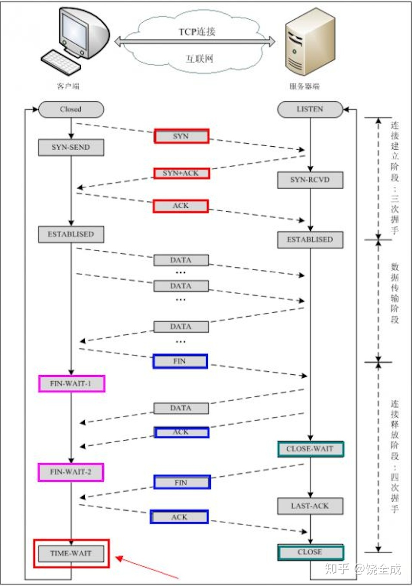

# TCP/IP

Transmission Control Protocol/Internet Protocol.

## Four Layers of TCP/IP model

1. Datalink Layer

   The datalink layer (also called the link layer, network interface layer, or physical layer) is what handles the physical parts of sending and receiving data using the Ethernet cable, wireless network, network interface card, device driver in the computer, and so on.

   

2. Internet Layer

   The internet layer (also called the network layer) controls the movement of packets around the network.

   

3. Transport Layer

   The transport layer is what provides a reliable data connection between two devices. It divides the data in packets, acknowledges the packets that it has received from the other device, and makes sure that the other device acknowledges the packets it receives.

   

4. Application Layer

   The application layer is the group of applications that require network communication. This is what the user typically interacts with, such as email and messaging. Because the lower layers handle the details of communication, the applications don’t need to concern themselves with this.

   


## Three-way Handshake

The TCP level of the TCP/IP transport protocol is <u>**connection-oriented**</u>. Connection-oriented means that, before any data can be transmitted, **<u>a reliable connection must be obtained and acknowledged</u>**. TCP level data transmissions, connection establishment, and connection termination maintain specific control parameters that govern the entire process.

The control bits list below:

URG: Urgent Pointer field significant
**ACK: Acknowledgment field significant** 1表示确认号有效。
PSH: Push Function
RST: Reset the connection
**SYN: Synchronize sequence numbers**  同步序号，1表示连接请求。用于建立连接和使顺序号同步。
**FIN: No more data from sender** 用于释放连接。1表示发送方已经没有数据发送了。

 

```shell
#第一次握手：主机 A 发送位码为 syn＝1,随机产生 seq number=1234567 的数据包到服务器，主机 B 由 SYN=1 知道，A 要求建立联机； #第二次握手：主机 B 收到请求后要确认联机信息，向 A 发 送 ack number=( 主 机 A 的 seq+1),syn=1,ack=1,随机产生 seq=7654321 的包 
#第三次握手：主机 A 收到后检查 ack number 是否正确，即第一次发送的 seq number+1,以及位码 ack 是否为 1，若正确，主机 A 会再发送 ack number=(主机 B 的 seq+1),ack=1，主机 B 收到后确认seq 值与 ack=1 则连接建立成功
```




## Four-way Handshake

TCP 建立连接要进行三次握手，而断开连接要进行四次。这是由于 TCP 的半关闭造成的。因为 TCP 连 接是**<u>全双工Full duplex</u>**的(即数据可在两个方向上同时传递)所以进行关闭时每个方向上都要单独进行关闭。这个单 方向的关闭就叫半关闭。当一方完成它的数据发送任务，就发送一个 FIN 来向另一方通告将要终止这个 方向的连接。

```shell
#关闭客户端到服务器的连接：首先客户端 A 发送一个 FIN，用来关闭客户到服务器的数据传送，然后等待服务器的确认。其中终止标志位 FIN=1，序列号 seq=u
#服务器收到这个 FIN，它发回一个 ACK，确认号 ack 为收到的序号加 1。
#关闭服务器到客户端的连接：也是发送一个 FIN 给客户端。
#客户段收到 FIN 后，并发回一个 ACK 报文确认，并将确认序号 seq 设置为收到序号加 1。
#首先进行关闭的一方将执行主动关闭，而另一方执行被动关闭
```





```shell
#主机 A 发送 FIN 后，进入终止等待状态， 服务器 B 收到主机 A 连接释放报文段后，就立即给主机 A 发送确认，然后服务器 B 就进入 close-wait 状态，此时 TCP 服务器进程就通知高层应用进程，因而从 A 到 B 的连接就释放了。此时是“半关闭”状态。即 A 不可以发送给B，但是 B 可以发送给 A。
#此时，若 B 没有数据报要发送给 A 了，其应用进程就通知 TCP 释放连接，然后发送给 A 连接释放报文段，并等待确认。A 发送确认后，进入 time-wait，注意，此时 TCP 连接还没有释放掉，然后经过时间等待计时器设置的 2MSL 后，A 才进入到close 状态。
```

## Status Change




## Reference

[“三次握手，四次挥手”你真的懂吗？ - 知乎 (zhihu.com)](https://zhuanlan.zhihu.com/p/53374516)

[为什么tcp的TIME_WAIT状态要维持2MSL - 知乎 (zhihu.com)](https://zhuanlan.zhihu.com/p/68040621)

